# Mound I: The Church Complex {#sec-chapter-3}

## The Excavation of the Church Complex

The church complex was first excavated in 2006, and its investigation was completed in 2007 (@plt-3.1). Room A46, a large gathering hall located to the north of the church, had already been excavated in 1994 by the Supreme Council of Antiquities;[^1] however, due to the lack of documentation, the room was once again cleared of the windblown sand and fully recorded in 2007. Room B5 was discovered and identified as a church in 2006. Windblown sand was removed and a roof and wall collapse was revealed. Because of time constraints, it was decided to leave the collapse in place in order to protect the floor level until the following year, when the excavation of the room was completed. Still in 2007, further investigation was carried out to the north of the church and of the gathering hall, leading to the discovery of four other rooms, including a corridor/entrance and a staircase, that belonged to the same complex. A room (B10), built against the northwest corner of room A46, was also excavated; although it was not directly connected with the complex, its vaulted roof was accessible from it via the above-mentioned staircase. In 2008, the area to the south and east of the church complex was excavated. Evidence was collected that shed light on the topographical context in which the church and its adjoining rooms were located. Also, significant information was gathered on their construction and development history.

The church complex is centrally located on mound I, slightly toward the south, and covers an area of approximately 164 m2 (@plt-3.2, @plt-3.3). The church (room B5) is the southernmost space <pb n="82">
 of the complex and, including its apse, is its second largest room (ca. 35.5 m2), surpassed only by the large rectangular room (A46) immediately to the north of the church (ca. 36.5 m2). Room A46, which leads into the church to the south, also opens to the north onto room B6, a smaller rectangular space (ca. 10 m2) built against the west half of the north wall of A46. Room B6 is accessed from a long corridor (B7) running east–west along the outer face of the north wall (east half) of room A46 (Pl. 3.4). Corridor B7 (ca. 7 m2) ends to the east with a doorway that is the only entrance into the church complex from the outside. Room B6 also leads into room B9 to the north, a fairly large space (almost 19 m2) whose outer walls form the northwest boundary of the complex. A doorway located in the northeast corner of room B6 opens onto a staircase (B8, about 3 m2), which leads to the remains of vaulted roofs belonging to rooms B9 and B10.

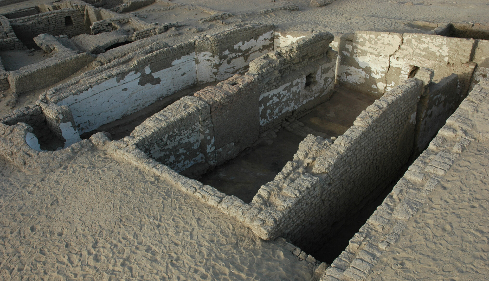{#plt-3.1}

A long street (B12) runs from north to south along the east side of the church complex, joining the north and south halves. A small open-air industrial area (rooms B14–B15) opens onto B12 near the main entrance of the complex. To the southeast of the church, street B12 intersects another passageway (B11) that runs east–west along the south wall of the church, ending in an open courtyard (B13).

All rooms of the church complex, like all other buildings excavated or surveyed at ʿAin el-Gedida, had walls built of sun-dried mud bricks, rich in organic inclusions. Their dimensions (ca. 34 x 17 x 9 cm) fit the standard measures of Roman samples, which were generally adopted in Late Antiquity.[^2] The bricks used to build the vaulted ceilings were of a considerably larger size (ca. 43–45 x 21–23 x 8–10 cm). Stone was rarely used at ʿAin el-Gedida, mostly for the lintels of doorways. No wooden feature was found *in situ* within any of the excavated rooms, but wood was certainly a common building material, employed for the construction of items such as doorways and shelves.

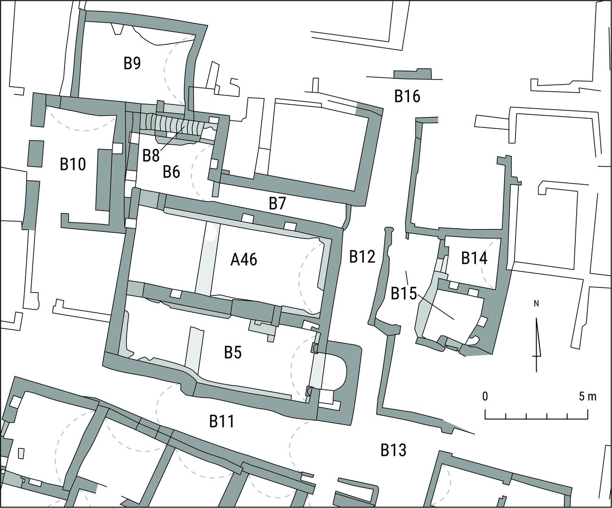{#plt-3.2}

Below is a discussion of the rooms of the church complex, based on the results of the 2006–2008 seasons of archaeological fieldwork and on their subsequent analysis.

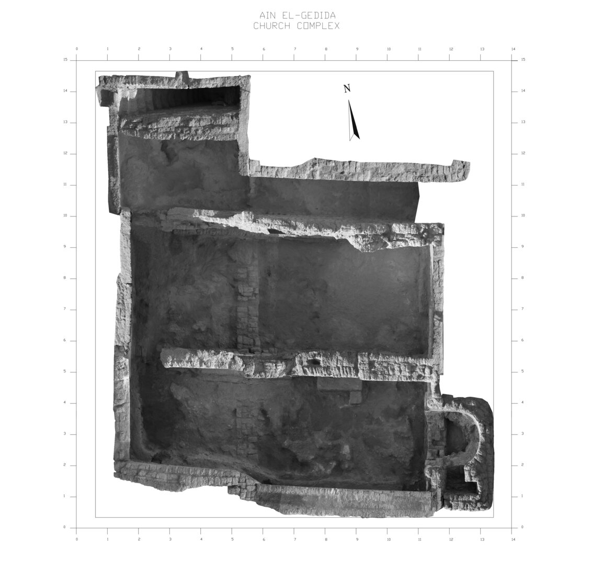{#plt-3.3}

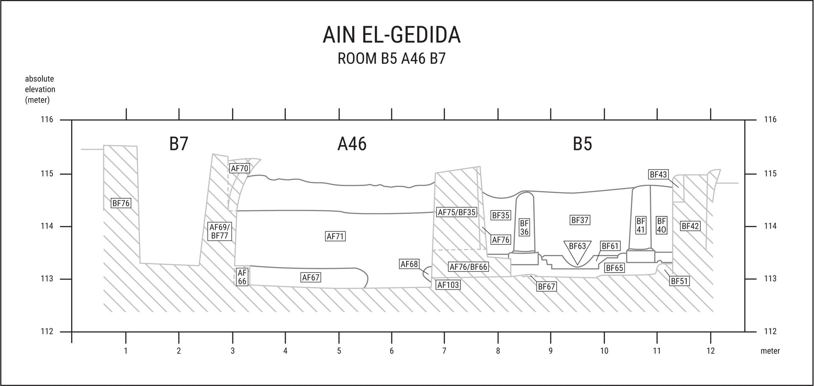{#plt-3.4}

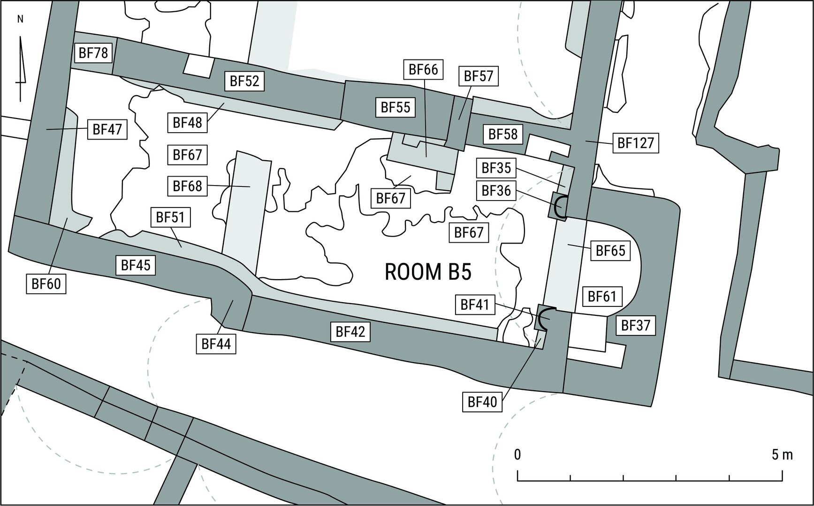{#plt-3.5}

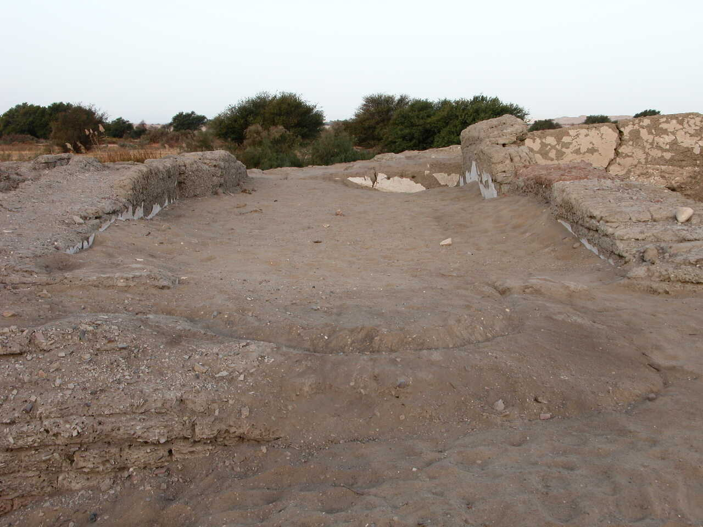{#plt-3.6}

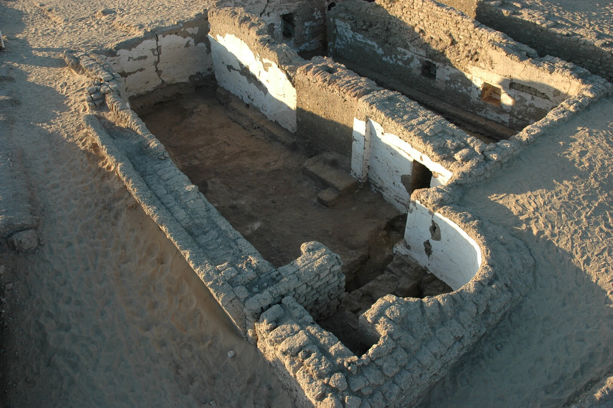{#plt-3.7}

### Room B5

#### Features

Room B5 is a rectangular space oriented to the east (@plt-3.5, @plt-3.7). It measures ca. 3.65 m north–south by 11.35 m east–west. It has walls preserved to a maximum height of 2.64 m (west half of the north wall BF52), and was once barrel-vaulted.[^3]

Room B5 was originally connected, through two doorways, to another large rectangular room to the north (A46). The larger door, about 2 m wide by 0.85 m deep, was located in the middle of the north wall, slightly to the east. Its sides were plastered with mud and whitewashed, but no other details are visible. Indeed, this doorway is now almost completely obscured by an ancient mud-brick plug (BF55), which testifies to the process of architectural (and possibly functional) alterations involving both rooms B5 and A46.

The second doorway (BF78), functioning as the only entrance to the church in its latest phase, is located at the west end of the north wall. It is ca. 80 cm wide and 70 cm deep and is preserved to a maximum height of about 2.20 m. The door has a well-preserved threshold, which is the continuation of the church’s north wall and is also bonded with the west wall of room B5 (BF47). Two holes, visible at about 180 cm above the threshold on each side of the doorway, originally supported a lintel. A small relic of a barrel vault, located on top of the north wall of the doorway, suggests that the passage might have been originally vaulted. Mud plaster and a white gypsum coat cover the sides of the door and a few traces of mud plaster were also identified on the top surface of the threshold.

::: {#plt-3.8a-d layout-ncol=1}

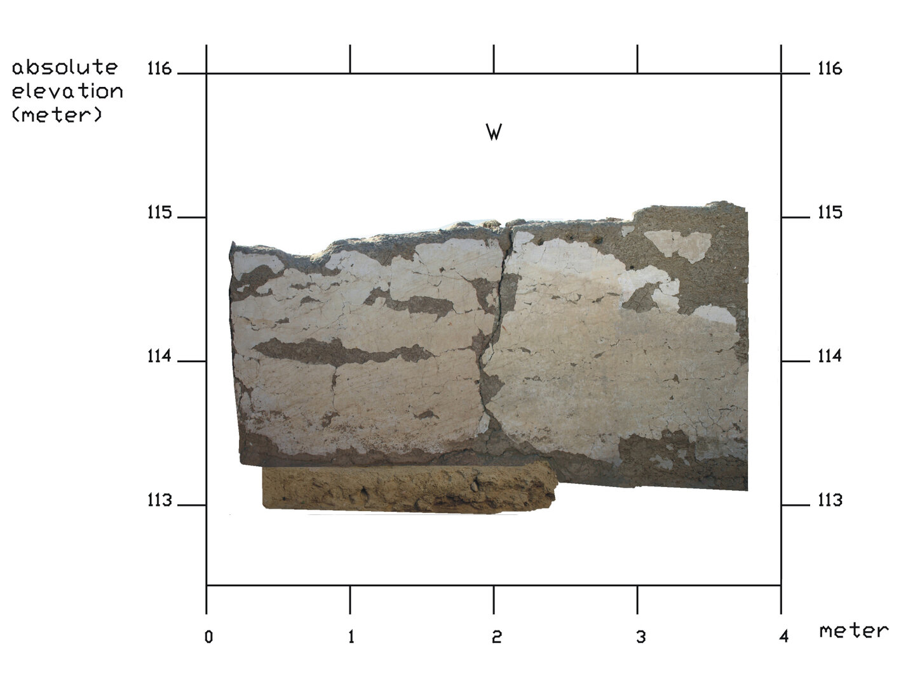{#plt-3.8a height=200}

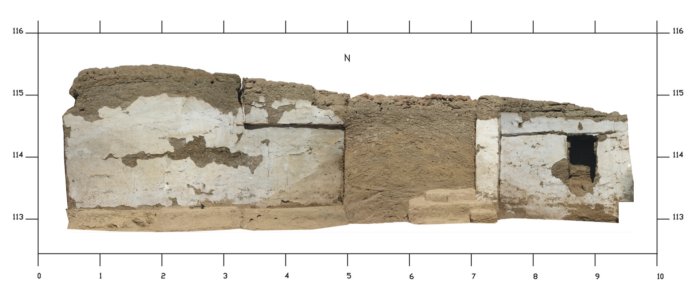{#plt-3.8b height=200}

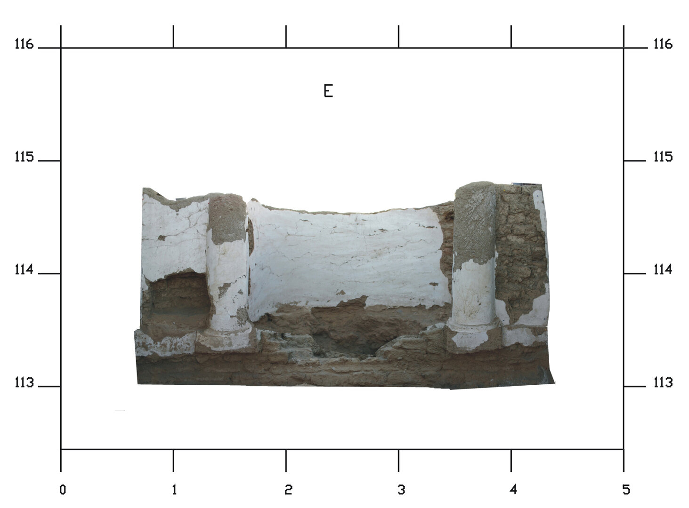{#plt-3.8c height=200}

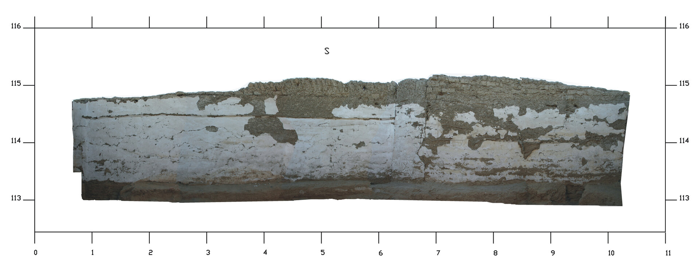{#plt-3.8d height=200}

Photogrammetric images of the walls of room B5.
:::

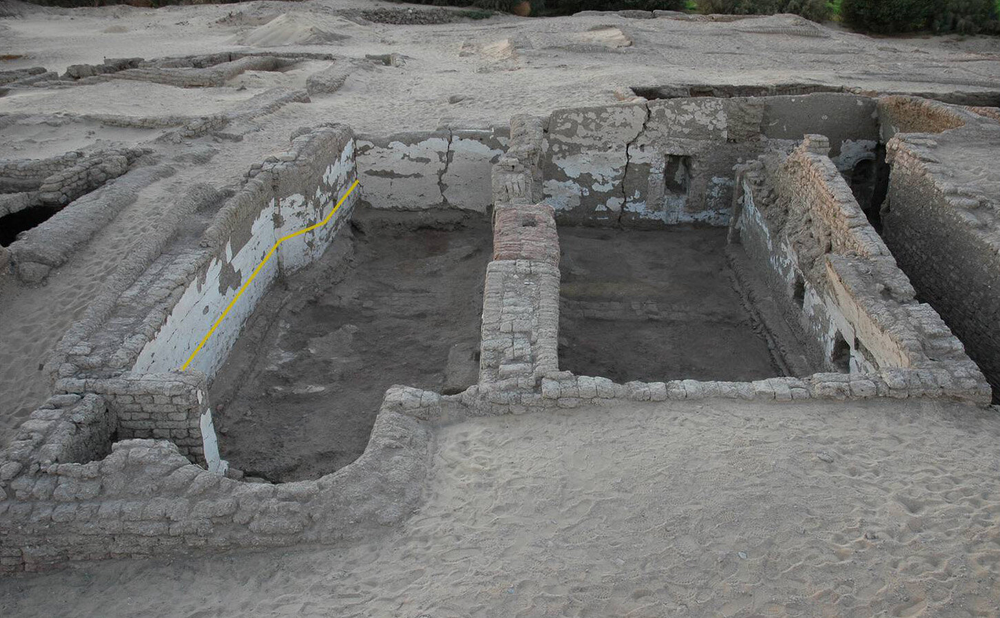{#plt-3.9}

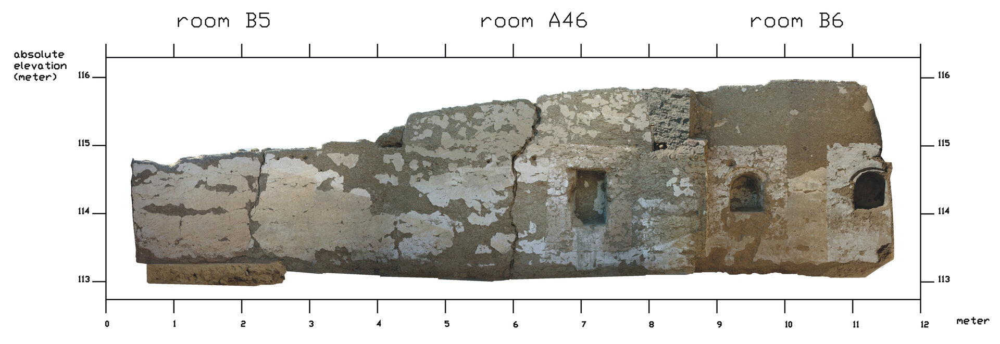{#plt-3.10}

The north and south mud-brick walls of room B5 are uniformly coated with mud plaster and whitewashed (with the exception of the bricked-in doorway in the north wall) (@plt-3.8a-d). Nonetheless, they consist of several sections belonging to features that were built at different stages. This is particularly noticeable within the south wall, made of three partitions that are not perfectly aligned (@plt-3.9).[^4] Their different orientations generate an overall outline that is very irregular but with a specific rationale. Indeed, it seems to address specific needs concerning the use of space to the south of the church complex at the stage of its expansion westwards.

The north wall consists of three sections, including a short north–south wall (BF57) that abuts the northeast wall of the room at its west end, built to provide additional support for the doorway and the vaulted roof.[^5] The remains of two different vaults, supported by the north and south walls of room B5, are further evidence of the multi-phased construction process that involved the church and affected the surrounding area.

The west boundary of room B5 (BF47 mentioned above) seems to be, in fact, a very thin facing that abuts an earlier north–south wall (@plt-3.10).[^6] At a height of about 1.80 m above floor level, it forms a recessed sill 16–17 cm deep, which extends for about 2.60 m from the southwestern corner of the room. The ledge is covered with mud plaster, as is the rest of the wall, and a thin layer of whitewash.[^7] The facing becomes progressively wider toward the north, where it forms also the western boundary of room A46; it was built in order to create a straight and uniform west wall for the church and its gathering hall to the north, as part of the expansion of the church complex to the west.

A semicircular apse (BF37) occupies the middle of the east side of room B5 (@plt-3.11, @plt-3.12). The conch, whose diameter is ca. 1.75 m, is defined by two engaged semi-columns (BF36 to the north and BF41 to the south, @plt-3.13, @plt-3.14), with a diameter of 34 cm and preserved to a height of 138 cm (north) and 148 cm (south). The semi-columns are bonded with screen walls BF35 and BF40, oriented north–south; BF40 seems to abut the south wall of the church (BF42), while BF35 is bonded with the easternmost segment of the nave’s north wall (BF58).

Both semi-columns consist of a shaft resting on a low, moulded base, which is supported by a rectangular stylobate measuring ca. 45 x 25 x 20 cm. The floor of the apse (BF61)[^8] is raised by approximately 40 cm above the original floor of the nave, although a pit (BF63) dug in the sanctuary in antiquity destroyed the platform almost in its entirety (@plt-3.15). No traces of steps leading to the raised sanctuary were found, as the area in front of the apse was the object of heavy disturbance in antiquity. The apse, including its original raised surface, and the semicolumns are covered by a thick layer of mud plaster and a coat of white gypsum.

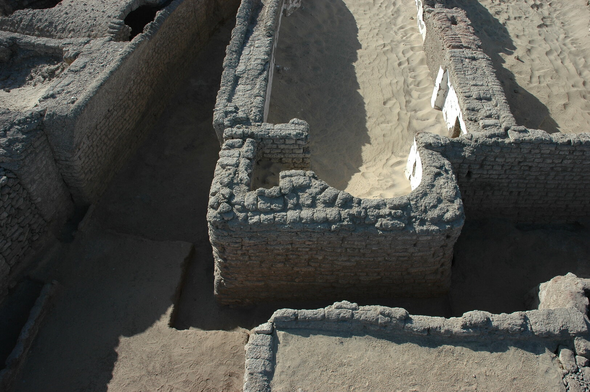{#plt-3.11}

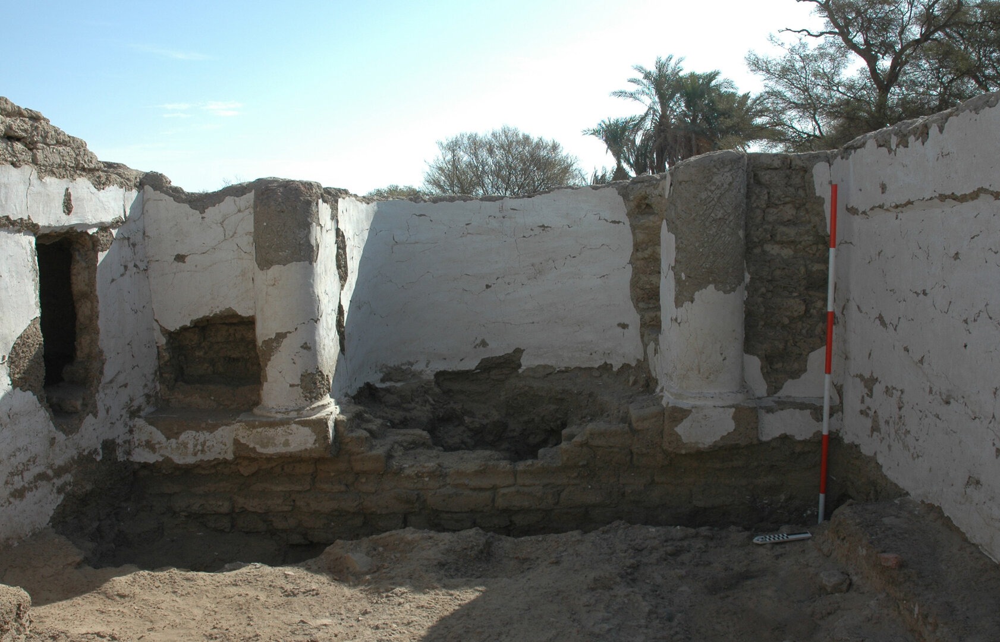{#plt-3.12}

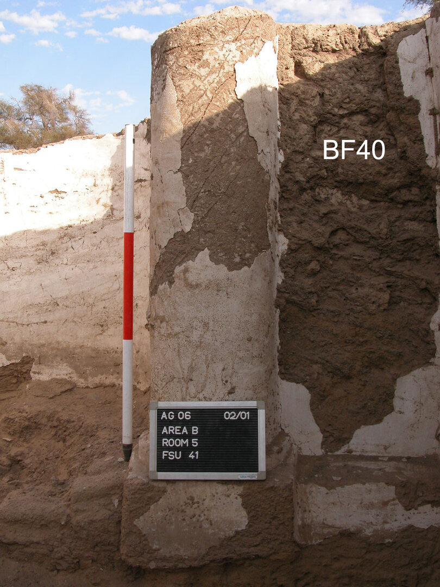{#plt-3.13}

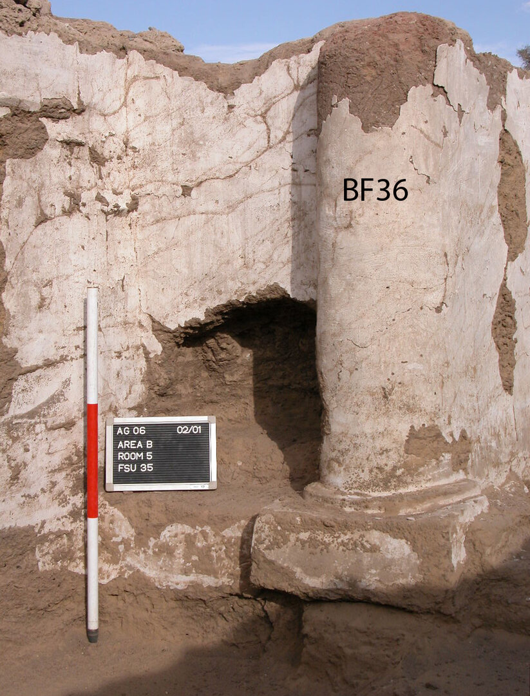{#plt-3.14}

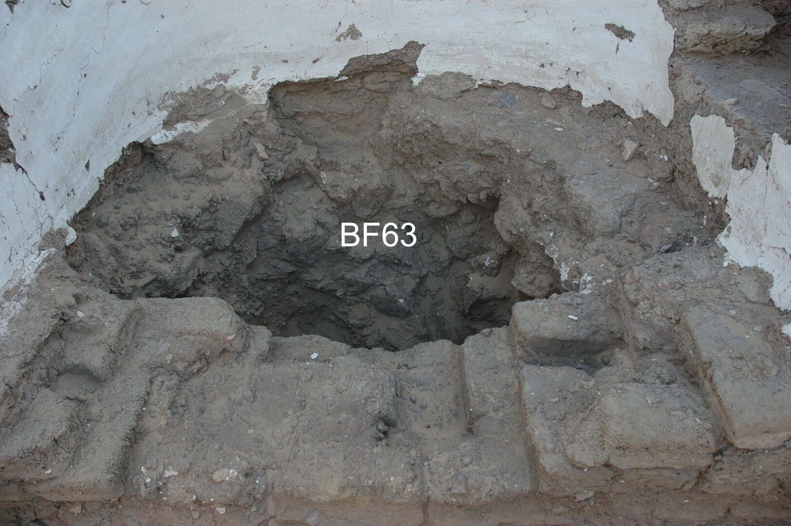{#plt-3.15}

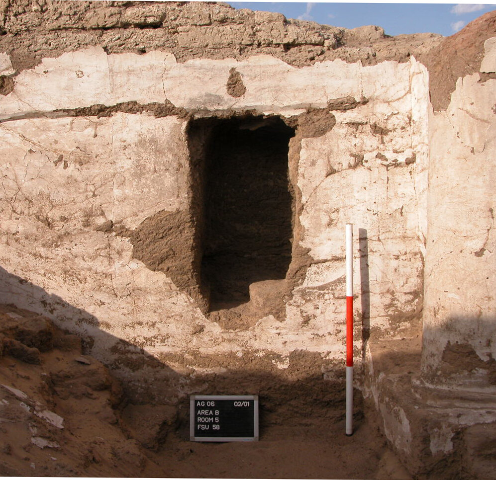{#plt-3.16}

A large hole is carved into the northern sector of the east side (BF35), to the left of the northern semi-column (facing the apse) (@plt-3.14). It is ca. 60 cm wide, 44 cm high, and 30 cm deep; the thickness of the hole corresponds to the full width of the wall. The opening is poorly executed and left unplastered, but it has a roughly arched top and flat bottom. Therefore, it seems to be the result of an intentional effort to create a niche, although its original purpose is unknown. Not far from this hole is another niche, built within the eastern section of the church’s north wall (BF58; @plt-3.16). It seems to have been constructed at the same time as the wall, not carved out of it at a later stage. This niche, of a better craftsmanship than the one in the east wall, is rectangular in shape and stands 40 cm above the preserved floor level. It measures 40 cm (width), 77 cm (depth), and 43 cm (height). A band of white gypsum plaster, about 34 cm thick, seems to have originally framed the niche, although it is not clearly discernible on all sides, as it is obscured by the later whitewashing of the entire section of the wall. The flat bottom of the niche is incomplete, with one brick missing in the western half. The inner space is not rectangular but L-shaped, with a smaller recess beginning 18 cm inside the wall and extending to the east for about 33 cm. The eastern edge consists of a screen of mud bricks set as stretchers on edge and plastered with mud. Traces of painted decoration, possibly two feet of a standing figure, were found above the opening.[^9]

The apse of the church opens to the south onto an L-shaped *pastophorion* (@plt-3.17, @plt-3.18). It consists of a square recess measuring ca. 70 cm on each side and raised above the original floor level of the apse by 40 cm. A hole in the northeast corner of the recess, ca. 50 cm above its floor level, points to the existence of a door sealing off the *pastophorion* from the church in antiquity. A poorly preserved step of mud bricks, about 20 cm high, protrudes from the south wall of the *pastophorion* by ca. 15 cm. The recess opens eastward into a small niche measuring 41 x 39 cm, with walls preserved to a maximum height of 43 cm. All sides and the floor of the *pastophorion* were originally covered with mud plaster, but it was not possible to ascertain whether a white gypsum coat had been laid on top of it. Traces of burnt oil are still visible against the southeast corner of the niche, likely due to a lamp (@plt-3.19).

The apse and the *pastophorion* belong to the same construction episode and are part of a later addition to room B5. Indeed, their walls are not bonded but clearly abut the north and south walls of the church, as a test trench dug outside the apse, down to foundation level, has proved (@plt-3.20). Further evidence comes from the discovery of the remains of a north–south wall (BF65), forming the western boundary of the circular apse and belonging to the original east wall of room B5, which predates the construction of the sanctuary (@plt-3.5).

Built against the east jamb of the central passageway is a stepped rectangular platform, visible also from room A46 but protruding only into room B5 (BF66: @plt-3.21). The podium was partially obscured when the central doorway was bricked in. Within room B5, the feature measures ca. 93 cm north–south by 135 cm east–west and has a height of ca. 60 cm (@plt-3.22). Considering that it originally extended into the central doorway, its maximum length (north–south) is about 1.80 m.

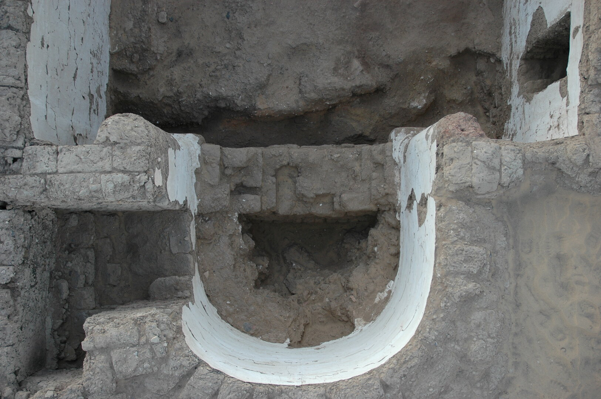{#plt-3.17}

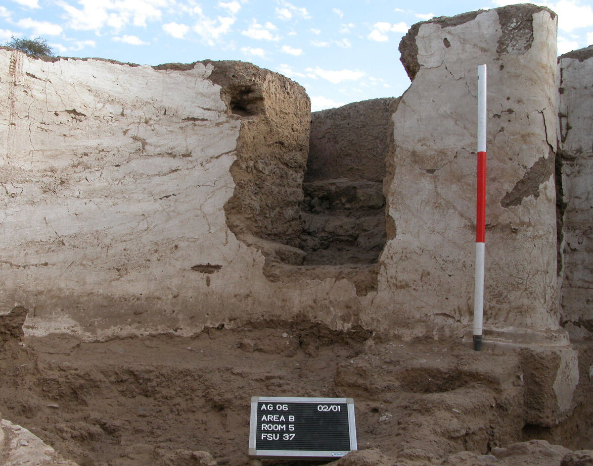{#plt-3.18}

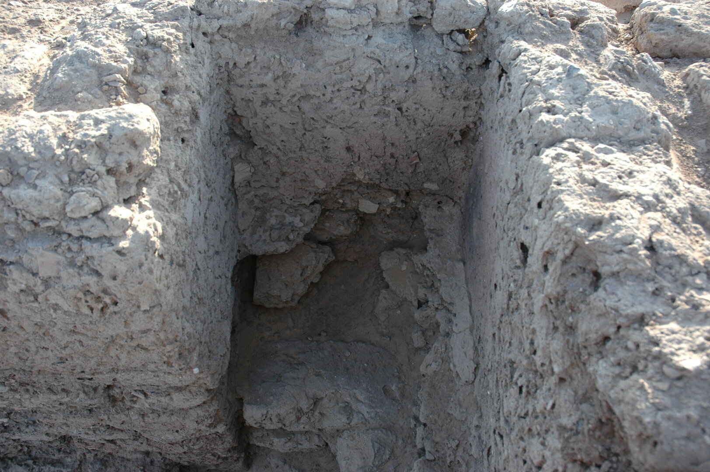{#plt-3.19}

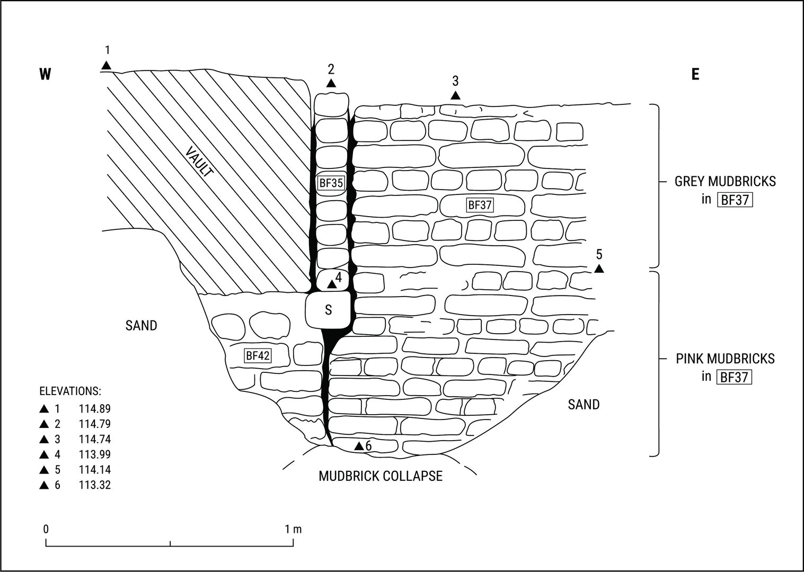{#plt-3.20}

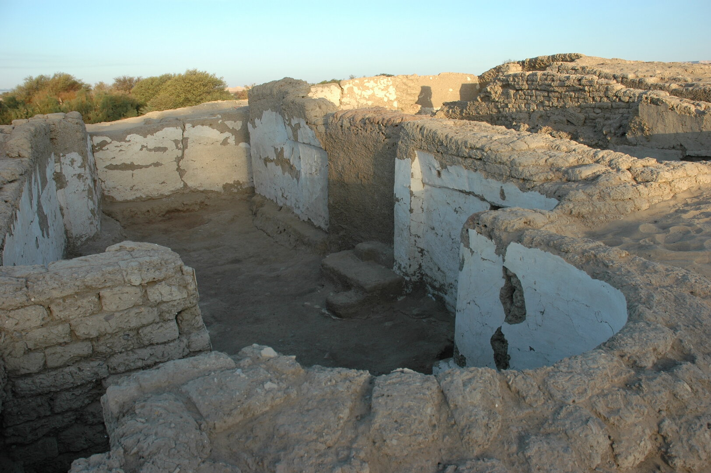{#plt-3.21}

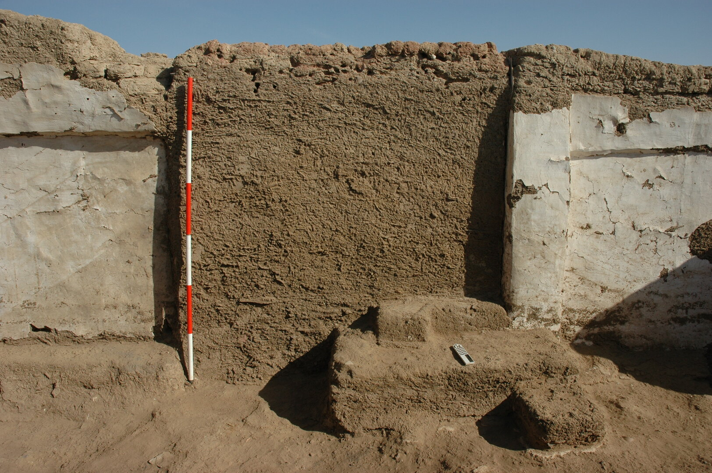{#plt-3.22}

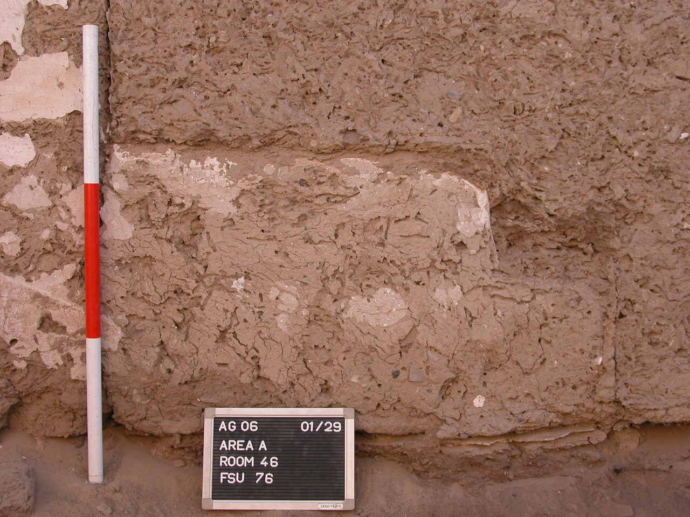{#plt-3.23}

The platform consists of three steps. The bottom one has a roughly square shape and measures ca. 35 x 35 cm and rises by ca. 25 cm above floor level. It is built against the southeast end of the central step, a large, rectangular block measuring ca. 135 cm east–west and protruding into room B5 by 65 cm; its height above floor level is ca. 40 cm. The highest step is built against the southeast stub of the central doorway and rises on top of the middle step by ca. 20 cm. It runs against the north wall of the church for 80 cm and along the above-mentioned stub for 12 cm. A rectangular protrusion is visible at the west end of the south side, increasing the visible width of the step to about 20 cm. The three steps are made of mud bricks and covered by a thick layer of hard mud-plaster, which obscures the architectural relationships among the platform’s components.

It is possible that the stepped platform was used as a podium by a preacher to read the Scripture or deliver a sermon; by standing in a higher position in the large, central passageway, he would have been easily seen and heard by the people sitting both in room B5 and in the adjoining space (A46). The podium surely lost its function when the doorway was sealed off with mud bricks (AF75/BF55), becoming completely obscured within room A46 (@plt-3.23).[^10]

Olaf Kaper suggested the similarity of the stepped podium to a structure uncovered by Gillian Bowen in the Large Eastern Church at Kellis and identified by Peter Grossmann as an *ambo*.[^11] This included two other elements, a semicircular feature and a small platform to the east of the stepped structure, which have not been identified so far at ʿAin el-Gedida. While the identification of the stepped feature at ʿAin el-Gedida seems quite certain, the structure found at Kellis is of more difficult interpretation, especially regarding its components.[^12]

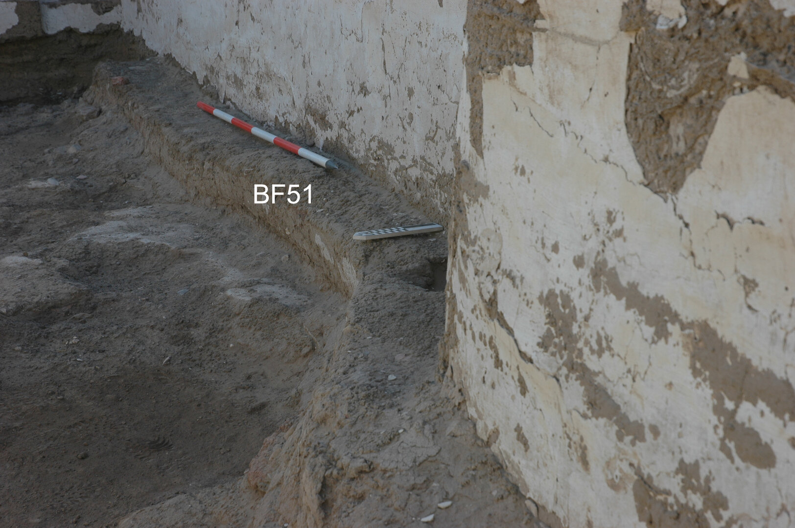{#plt-3.24}

Along the north, south, and west walls of room B5 are low mud-brick *mastabas* (benches) (@plt-3.5). The substantial remains found along the south wall originally formed a single feature with those against the west wall, notwithstanding the break near the southwest corner due to ancient damage. The long bench begins ca. 80 cm south of the west doorway and runs along the west wall for about 2.20 m (BF60); at the southwest corner of the church, it turns east for ca. 8.90 m, ending at approximately 70 cm from the apse (BF51; @plt-3.24).[^13] Along the south wall, the *mastaba* takes a curvilinear shape to follow the very irregular course of the wall itself. Another bench (BF48) lies against the north wall of the church; it begins ca. 14 cm east of the west doorway of the room and runs for 4.30 m, ending at about 1 m from the stepped podium. It is in rather poor condition, especially in its western half; it was probably damaged by the extensive collapse of vaults and walls found along the north side of the church. All *mastabas* are about 30 cm wide and rise by 28–30 cm above floor level. They are made of mud bricks and covered by a thick layer of mud plaster; they were found with several encrustations, probably due to presence of water and moisture. The benches abut the walls of the church and lie on top of the preparation layer of the floor, while the floor itself (BF67)[^14] was laid against the benches themselves. Therefore, the relative chronology for the construction of these features is: walls–floor preparation layer–*mastabas*–floor.

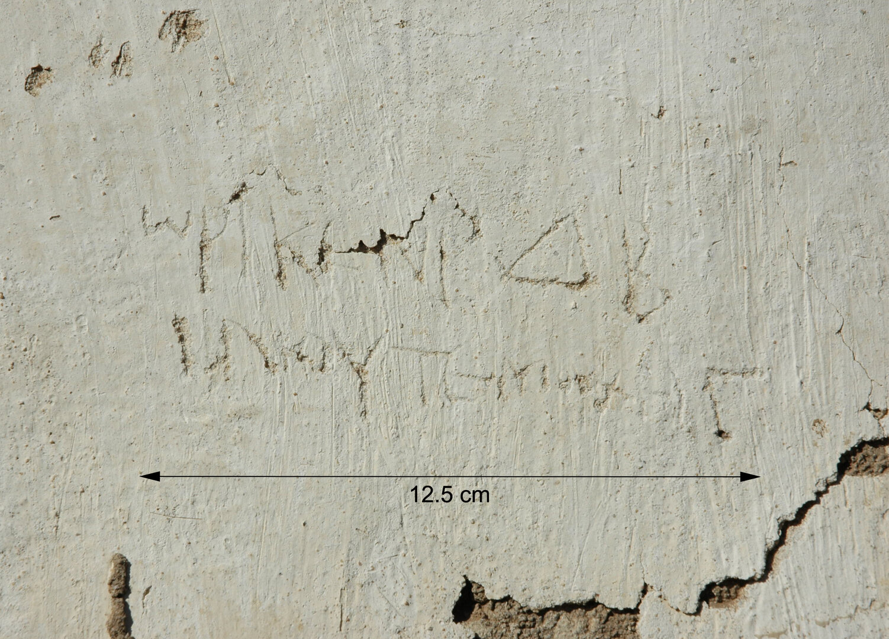{#plt-3.25}

A two-line graffito (max. width: 12.5 cm; max. height: 3.5 cm) was carved on the west half of the north wall (BF52), 220 cm from the west extremity and 126 cm above the top of *mastaba* BF48 (@plt-3.25). According to Bagnall and Dzierzbicka’s reading, the graffito mentions the Greek name Ὠρικενι (Horigenes) and the Egyptian male name Ἰμουτε (with a possible spelling variant).[^15]

Three foundation courses of a north–south oriented wall (BF68) were found below floor level, cutting the nave of the church in two parts. The wall, resting on gebel and a leveling layer of compact soil, seems to be the continuation of the north–south wall identified in room A46, to the north of B5 (@plt-3.26). Parts of this feature are still standing, incorporated in the north and south walls of the church and of the gathering hall. It seems that the wall belongs to an earlier construction phase, before the expansion of rooms B5 and A46 to the west.

#### Stratigraphy (Pl327)

The stratigraphy of the deposits excavated in room B5 is quite complex and includes several deposits of windblown sand, wall- and vault-collapse contexts, and soil from pits dug out in antiquity. The surface layer (DSU19),[^16] which consisted of windblown sand, limited ceramic inclusions (2.83 kg), some pebbles, a moderate quantity of plaster, and a few animal bones, extended throughout the room down to an average depth of 40 cm. Below it, and covering the entire area of the church, was a thick sub-surface layer (DSU20)[^17] of windblown sand and lenses of grayish sand, with potsherds (7.52 kg), a large amount of plaster, some mud-brick fragments, and a few bones. Two joining fragments of a yellow glass beaker (inv. 35), as well as the lower part of a grinding stone (inv. 26) and a bronze coin (inv. 33, broadly assigned to the fourth century), were collected within this unit. After the removal of DSU20, a substantial context of vault and wall collapse (DSU22), with pockets of sand, was found in the center of the room (@plt-3.28, @plt-3.29). The highest elevation of the unit (114.489 m asl) was against the north wall of room B5, from which the collapse sloped to the south.[^18] The layer included whole mud bricks, mud-brick debris, potsherds (1.76 kg), bones, two fragments of glass vessels, and one bronze coin (inv. 32), which was dated to 324. Additional evidence of wall and vault collapse, with a very low density of ceramic inclusions (0.91 kg), bones, and plaster, was detected within the area of the apse (DSU23).[^19] One bronze coin (inv. 29), minted between 351 and 361, was found in this context. It seems that two collapse units were in fact the result of the same episode, but they were kept separated because of the physical boundaries in which they were first identified.

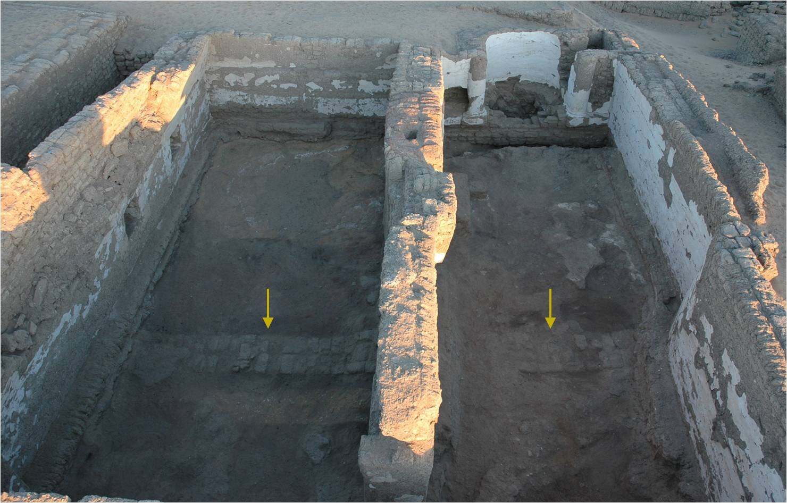{#plt-3.26}

In the west half of the nave, a very small unit of mud-brick debris, lying below both DSU20 and DSU22 at ground level, was identified and removed as DSU25,[^20] revealing fragments of cotton textile (inv. 37), very poorly preserved. These consisted of pieces of two different textures and colours, sewn together with a thick string.

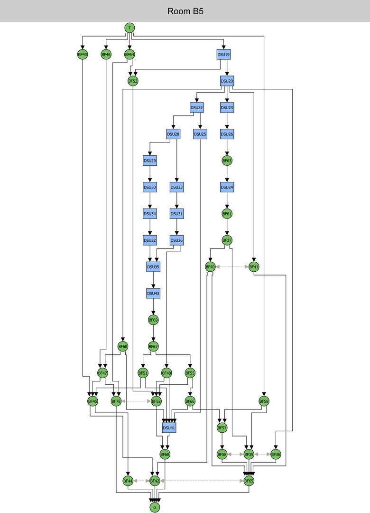{#plt-3.27}

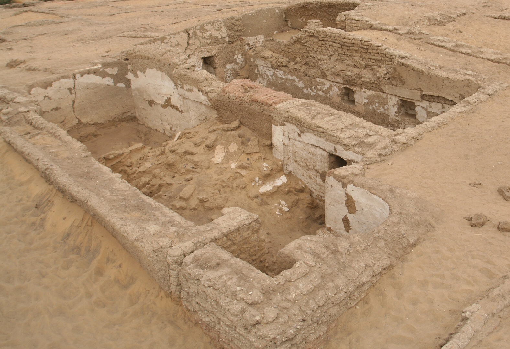{#plt-3.28}

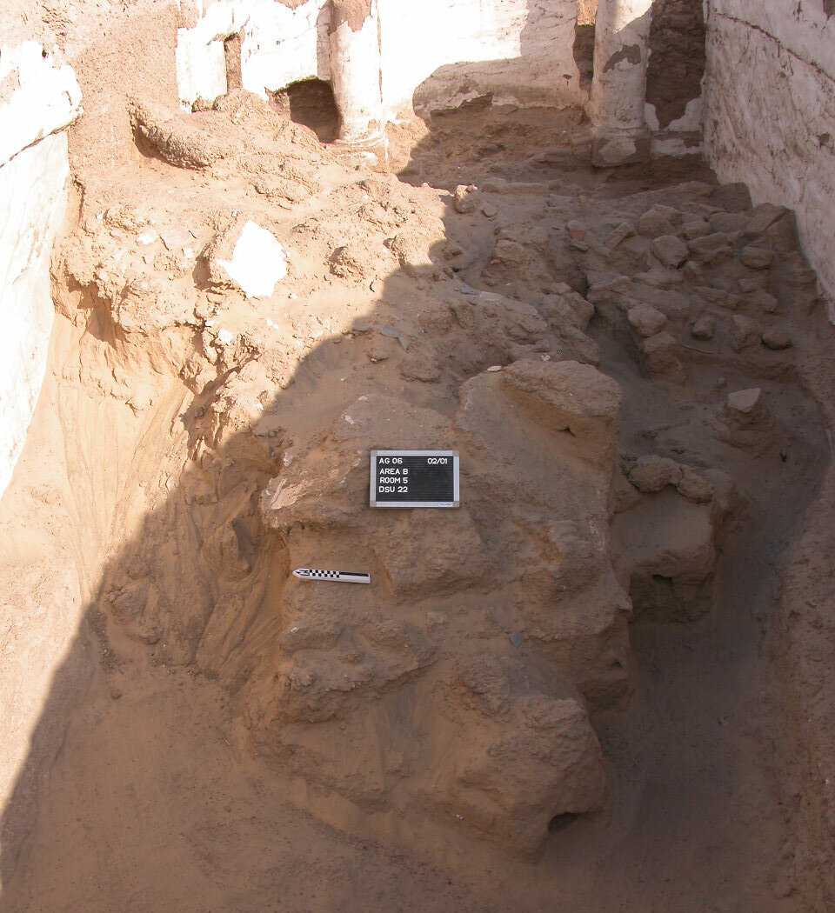{#plt-3.29}

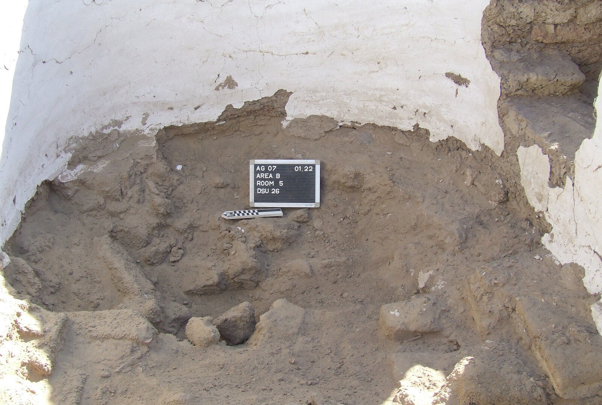{#plt-3.30}

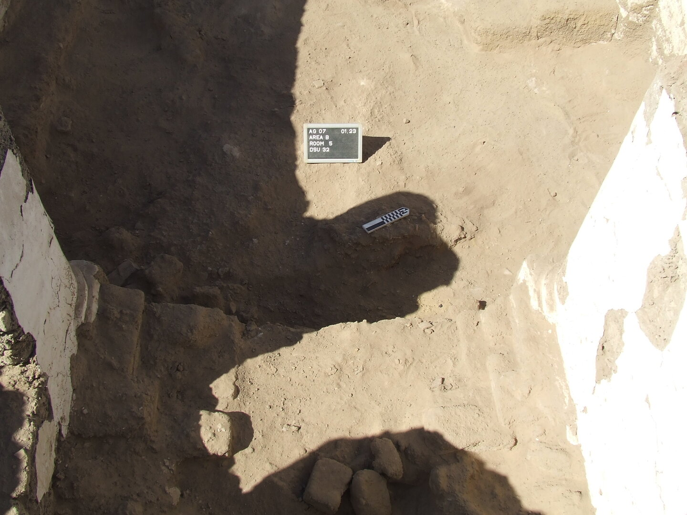{#plt-3.31}

Within the apse, a unit of hardened mud-brick melt (DSU24),[^21] mixed with mud-brick debris, a few potsherds, charcoal, and ash, lay on top of the original raised floor (BF61), now largely destroyed. Four bronze coins were gathered; one (inv. 31) was dated between 341 and 364, while two other specimens (inv. 34 and 522) were broadly dated to the fourth century (on the basis of size and weight); the fourth coin (inv. 30) could not be dated. In the center of the sanctuary, the fill of a pit (BF63), dug in antiquity down through the original floor, was removed as DSU26 (@plt-3.30).[^22] It consisted of mud-brick debris, mixed with sand and mud dust, and contained a few pockets of ash, potsherds (0.41 kg), small pebbles, one fragment of (possibly) a terracotta figurine (inv. 568), and four bronze coins (inv. 520 and 521, dated to 351–361; inv. 523, dated to 335–341; and inv. 562, dated to 347–348). The excavation of the area immediately to the west of the apse revealed the existence of a low mound of debris (DSU32),[^23] which was likely the displaced material from the original pit dug inside the sanctuary (@plt-3.31). The unit consisted of mud-brick debris, mixed with sandy soil, a few fragments of sandstone blocks, potsherds (1.32 kg), three joining fragments of a beaker of white glass (inv. 535), and some organic material (like wood, charcoal, and bones). The removal of this deposit brought to light five bronze coins datable to the fourth century (inv. 511, dated to 351–361; inv. 512, minted in Rome in 318; inv. 516, dated to 333–335; inv. 515, broadly assigned to the late fourth–fifth century; and inv. 517, which could not be dated). Five billon tetradrachms, minted in Alexandria, were also found within the same disturbed context (inv. 509, dated to 270–271 or 285–286; inv. 510 and 514, assigned to 284–285; inv. 513, dated to 286–287; inv. 518, minted between 279 and 280). These third-century coins, which represent a rather small percentage compared to the fourth-century specimens found at ʿAin el-Gedida, are possibly to be associated with the original context of this unit below the floor of the apse.[^24]

Below DSU32 was another pit (BF69, earlier than the one dug in the apse, i.e., BF63), which extended inside the nave along the west side of the apse (@plt-3.32, @plt-3.33). Its fill, excavated as DSU43,[^25] consisted of mud-brick fragments, pebbles, ceramic sherds (4.52 kg), organics (including wood, bones, charcoal), and plaster (presumably from the south engaged semicolumn of the apse and from the ledge adjacent to it). Only one coin (inv. 566), an Alexandrian bronze nummus dated between 335 and 337, was found within DSU43.

The peculiar shape of the pit, running along the western edge of the sanctuary, is suggestive of the existence of some type of barrier or screen (separating the apse from the nave) made of wood, a material that was considered of some value in the oasis and therefore presumably removed for reuse after the church was abandoned.[^26]

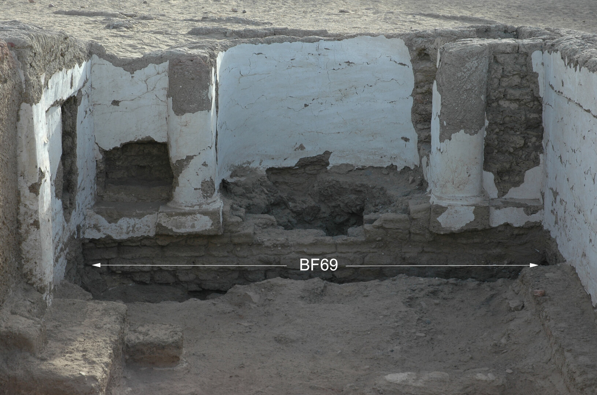{#plt-3.32}

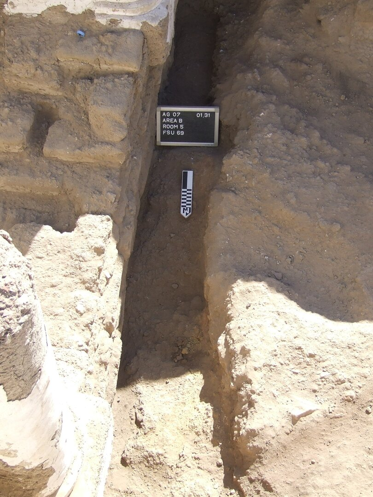{#plt-3.33}

The removal of the large collapse in the central part of the room revealed that the unit rested on a layer of windblown sand mixed with mud dust, particularly in the lower strata (DSU28).[^27] This context, which had accumulated in the middle of the nave, contained fragments of mud bricks, ceramic sherds (38.90 kg), remains of white plaster, ash, charcoal, and other organic material (including wood and bones). The excavation of DSU28 brought to light several complete and fragmentary objects. These include: three fragments of bracelets, all of dull black glass (inv. 530–532); a small piece of a bronze object, possibly a hook (inv. 533); two diagnostic fragments of glass beakers, one light green (inv. 534) and the other light yellow (inv. 582); five fragments of a rope made of dark brown fibers (inv. 540); six pieces of tight-weave textile (inv. 536–539, 541–542); an incomplete iron nail (inv. 574); and three bronze coins (inv. 526, dated to 351–361; inv. 527, fragmentary and undatable; and inv. 528, dated to 351–361).

Below DSU28, two smaller collapses were identified and removed. One (DSU29)[^28] lay against the south wall of the nave and consisted of mud-brick debris mixed with mud dust, sand, fragments of gypsum plaster, organic material (wood, charcoal, bones), and some potsherds (3.25 kg). Four bronze coins were discovered while excavating this context: one specimen (inv. 505) was dated to 351–361 and another (inv. 506) tentatively to 340–347. A third specimen (inv. 507) was minted in London in 322–323, while the fourth coin (inv. 508) could not be dated. DSU29 (possibly resulting from the collapse of the ceiling) rested above a layer of windblown sand (DSU30)[^29] containing ceramic sherds (0.24 kg), fragments of plaster, bones, and a few fragments of tight weave textile (inv. 543–544). It was a later episode than the other small collapse, which was excavated along the north wall of the room (DSU31).[^30] This layer contained complete wall and vault bricks (some of which were still bound together with mud mortar), mud-brick debris, mud dust, plaster, potsherds (1.55 kg), cobbles, and organic inclusions (like vegetal fibers, charcoal, and few bones). DSU31 also lay on top of a deposit of relatively clean windblown sand (DSU36),[^31] mixed with few organic particles (including charcoal) and potsherds (1.44 kg). The removal of this unit revealed a complete Greek ostrakon dated to the second half of the fourth century (inv. 529) and possibly consisting of a tag of one line.[^32]

DSU28, the layer of sand detected below the more extensive collapse (DSU22), continued uninterruptedly in the middle of the room, down to a unit of brown sand mixed with mud dust (DSU33).[^33] This context contained plaster fragments, mud-brick debris, and potsherds (1.51 kg) and was rich in organic inclusions (straw, seeds, charcoal, and bones, some of them charred). Two bronze coins were found in this deposit; one specimen (inv. 525) was undatable, while the other (inv. 524) was broadly assigned to the late fourth–fifth century based on size and weight. DSU33 extended to the south below DSU30, where it was removed as DSU34.[^34] The same range of materials was found in the latter unit, including potsherds (0.86 kg). The excavation of DSU33 and DSU34 revealed, in the east part of the room, a layer of packed dirt and mud dust (DSU35),[^35] mixed with mud-brick debris, pebbles, and potsherds (2.20 kg) (@plt-3.34). A fragment of a bronze ring (inv. 551) and one bronze coin (inv. 550), dated to 317, were also gathered within this unit. DSU35 lay directly on top of the remains of the original clay floor and on DSU41,[^36] a layer of brownish-gray soil, mixed with several small potsherds (1.07 kg), some pebbles, and mud-brick fragments. The unit contained also wood, two small pieces of glass vessels, two ceramic lamps (inv. 577, complete, and inv. 636, with a broken handle), a complete bowl (inv. 637; @plt-3.35), painted with a motif of red waves inside and with red circular dots around the rim, and a bronze coin (inv. 519), poorly preserved and undatable. DSU41, which was also identified in the western half of the room (where it covered part of the north–south razed wall below floor level), seems to have belonged to a preparation layer for the church’s floor.

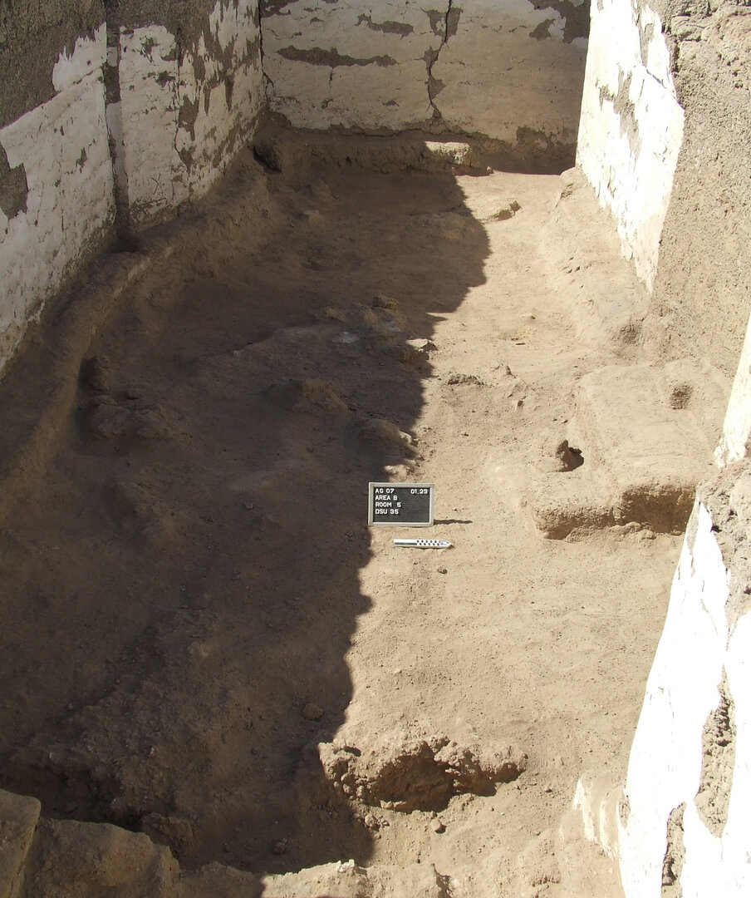{#plt-3.34}

The cleaning of excavated architectural features brought to light three additional bronze coins (inv. 545–547); they were found in poor condition and only one (inv. 545) was dated, to 351–361.

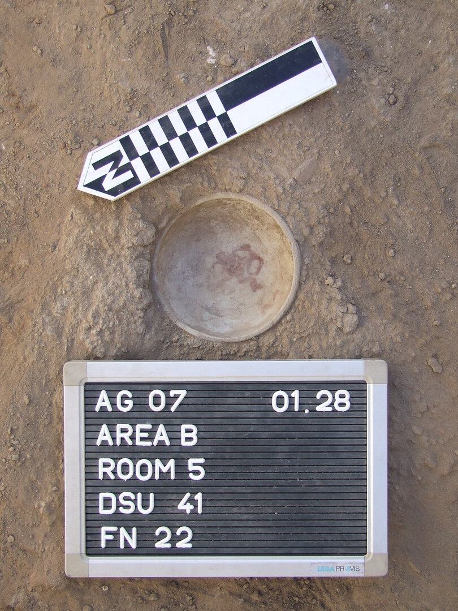{#plt-3.35}

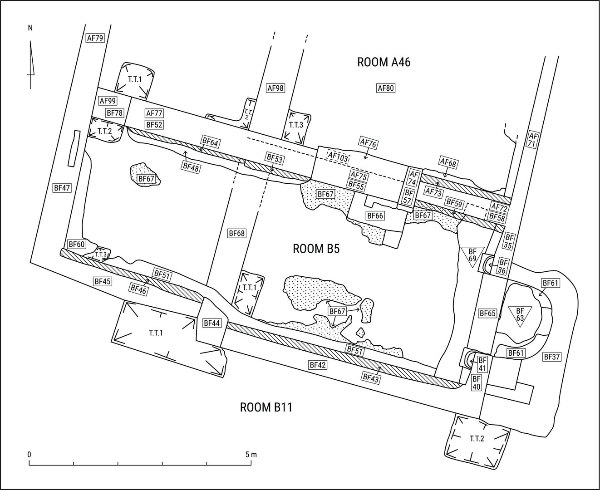{#plt-3.36}

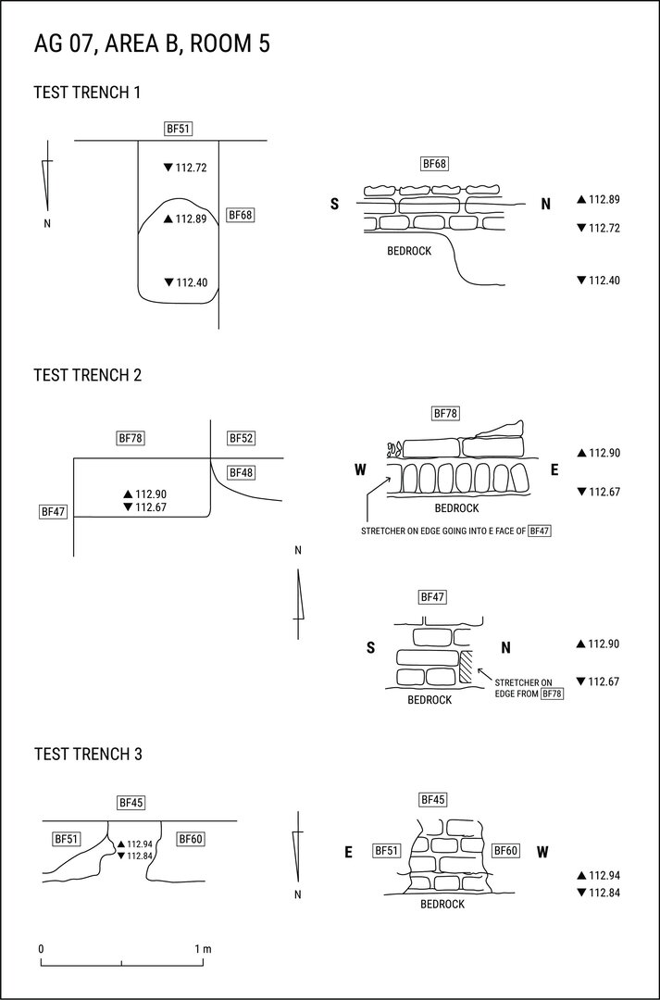{#plt-3.37}

The preparation layer (DSU41) was removed in three test trenches that were excavated inside the church down to gebel (@plt-3.36, @plt-3.37).[^37] One trench, measuring ca. 1 m north–south by 50 cm east–west, was excavated against the south *mastaba* (BF51) of the church and along the east face of the early wall running north–south below floor level (BF68).[^38] A second trench was dug on the south side of the western entrance into the church, extending throughout the entire length of the passageway’s mud-brick threshold (i.e., ca. 80 cm east–west) and ca. 40 cm from north to south.[^39] The third trench occupied the irregular space left between *mastaba* BF60 and *mastaba* BF51, near the southwest corner of the church.[^40] The aim of this test trenching inside room B5 was to look at the foundation courses of some architectural features and identify their relationships, with the ultimate goal of elucidating questions concerning the construction phases of the building.[^41]

### Room A46

#### Features

Room A46, excavated by the SCA in 1994, is a large gathering hall located to the north of the church (@plt-3.38, @plt-3.39).[^42] It is rectangular in shape and measures ca. 4 m north–south by 9.5 m east–west; its walls are preserved to a maximum height of 2.84 m (north end of the west wall AF79).

The room is accessed from the anteroom B6 to the north through a doorway (AF100) located in the northwest corner. The opening is 95 cm wide, 73 cm deep, and has a maximum preserved height of 1.97 m. A mud-brick threshold is still *in situ*. Two holes (diameter: 7 and 10 cm) pierce the east wall, 89 and 111 cm above the threshold and a 6 cm groove is visible on the west wall; these features point to the existence, in antiquity, of a wooden door closing the entrance. The sides of the doorway were originally plastered in mud and then covered with a thin layer of white gypsum plaster, of which only few traces are visible.

As seen above, two doorways open from room A46 into the church; the larger of the two, placed in the middle of the south wall, was sealed off in antiquity, leaving the doorway at the west end of the south wall as the only entrance (AF99)[^43] into the church.

All walls are made of mud bricks laid out in English bond and are plastered with mud, above which is a thin layer of white gypsum plaster (@plt-3.40a-d). The north wall (AF69) supports, at about 1.45 m from ground level, substantial remains (AF70) of a north–south oriented vaulted roof, which form a lipped overhang protruding into the room (@plt-3.40b).[^44] Two square niches are set within the wall; one is located at ca. 3.80 m from the west end, 80 cm above the floor, and measures 51 cm (width) x 51 cm (height) x 38 cm (depth). The second niche is built ca. 1.60 m to the east of the previous one, at the same height above floor level. Its dimensions roughly match those of the western niche: 51 cm (width) x 51 cm (height) x 37 cm (depth). Both niches are completely whitewashed inside; also, they are framed by a square band of white gypsum plaster, 35–36 cm in thickness, which partly extends on top of the vault springs and predates the later whitewash coating that covers the rest of the wall. A graffito with concentric circles is carved in the upper part of the white band framing the east niche. It might have been part of a decorative motif, but the evidence is too scanty to draw any conclusion about its nature.

No niches are set within the short east wall (AF71), which has a pronounced sill, one brick (header) wide,[^45] built at ca. 1.45 m above floor level (@plt-3.40c). Scattered remains of white gypsum plaster are still visible.

As already mentioned with reference to room B5, the south wall consists of partitions (AF77;[^46] AF74;[^47] AF72[^48]) linked to different construction episodes, including the mud-brick plug (AF75)[^49] that seals off the central doorway between rooms A46 and B5 (@plt-3.40d). With the exception of the latter, covered only with mud plaster, the rest of the south wall bears substantial traces of a white gypsum coating above the mud plaster. An arched niche is set within wall AF77 at about 1.35 m east of the open doorway and 85 cm above ground. It measures 51 cm in width, 55 cm in height, and 38 cm in depth. Three holes vertically placed (at equal distances) on both the west and east sides of the niche point to the existence, in antiquity, of a lintel on top and two shelves inside. The bottom is not flat but slightly concave; this seems to be the result of later alterations, which involved the removal of the original floor. Also, a short mud-brick partition was built along the lower-front edge. A rectangular band of white gypsum plaster, 34 cm thick on each side, frames the niche, which is also whitewashed inside.[^50]

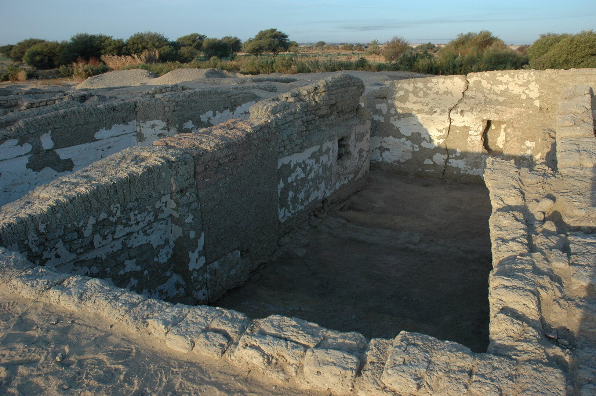{#plt-3.38}

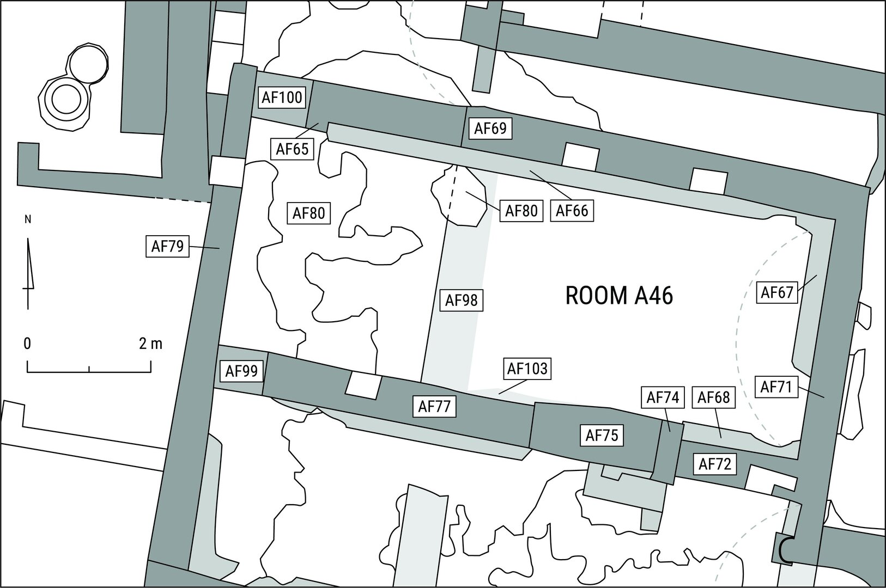{#plt-3.39}

<!-- TODO: Center these images within the ncol=1 block? -->

::: {#plt-3.40a-d layout-ncol=1}

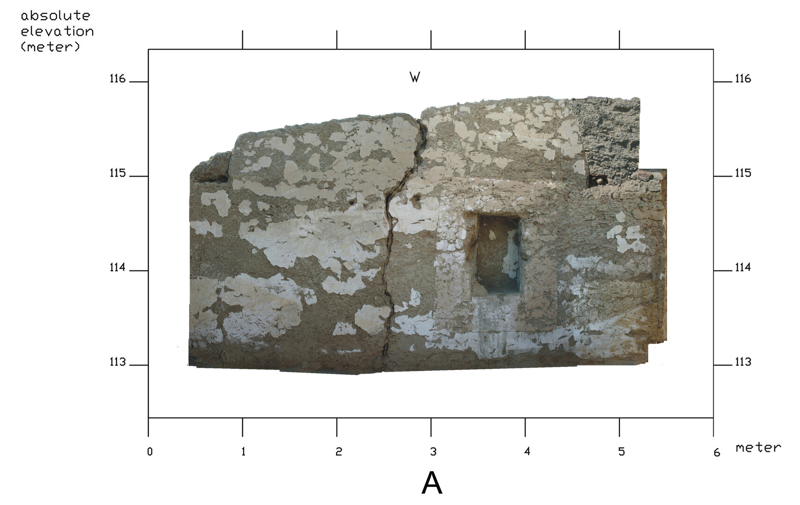{#plt-3.40a height=200}

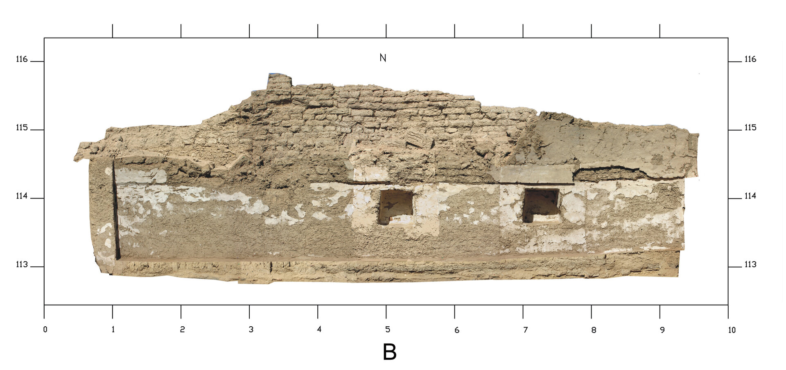{#plt-3.40b height=200}

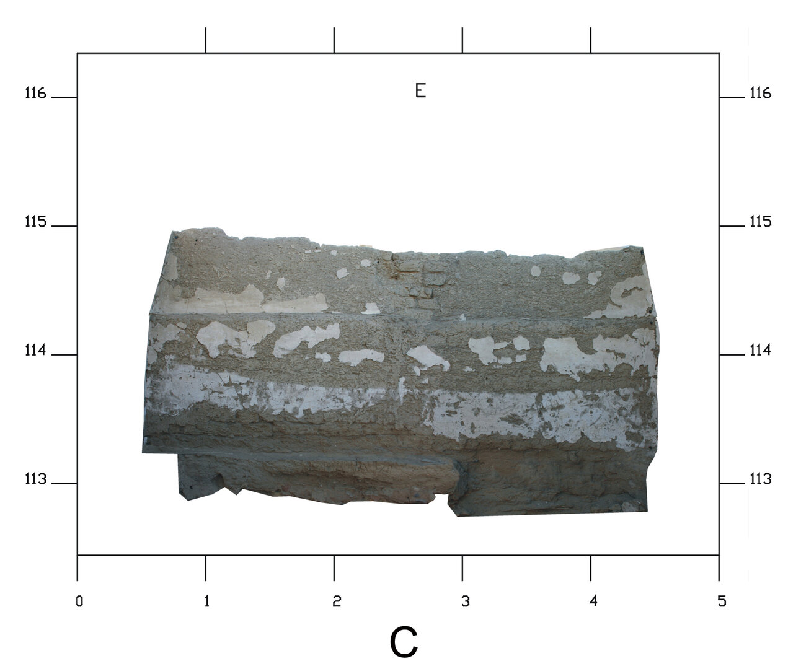{#plt-3.40c height=200}

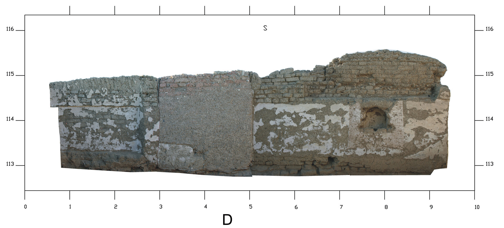{#plt-3.40d height=200}

Photogrammetric images of the walls of room A46.
:::

It has already been mentioned that the west wall (AF79)[^51] consists of a facing common to both rooms B5 and A46 and partially built against an earlier north–south wall.[^52] A large rectangular niche is inserted in the west wall of A46, 153 cm south of the north end of the wall and ca. 80 cm above floor level (@plt-3.40a). It is 53 cm wide, 85 cm high, and 56 cm deep. All inner faces of the niche are covered with mud plaster; traces of a white gypsum coating are also visible. The outer edges of the cupboard are framed by a well-preserved whitewash band (ca. 34 cm thick), which predates the coating of white gypsum plaster that covers the entire wall. Traces of superimposed layers of white gypsum plaster (on top of the mud plaster) were identified also on the north and south walls of room A46 and bring additional evidence testifying to the different construction episodes involving the church and the gathering hall to the north.

Mud-brick *mastabas* are built against the entire north and east walls of room A46, as well as along the south wall, to the east of the central doorway. The bench along the north wall (AF66) is in rather good condition, while the south end of the east *mastaba* (AF67) is missing (@plt-3.41). The sector along the east half of the south wall (AF68) is preserved in its entire length, but is poorly preserved, especially at its east end (@plt-3.42). The mud-brick structure is coated with a thick layer of mud plaster, on which several incrustations, probably due to moisture, can be observed. The height of the *mastabas* is ca. 34 cm and their width ranges, in their best preserved portions, from 26–31 cm. The benches run around the walls of room A46 for more than 13 m and must have accommodated a fairly large number of people.[^53] Therefore, it is possible to argue that room A46 held a public function as a gathering hall, in close association with the church that was originally accessible via two doorways. The bricking-in of the central doorway and of a large part of the podium (AF76),[^54] once visible from both rooms B5 and A46, might be related to a re-functionalization of the gathering hall, which, however, does not seem to have ever lost its essentially public nature.

Large patches of a compacted mud floor (AF80)[^55] are scattered throughout the room, especially in its western half and abutting the *mastabas* along the north, east, and south walls. The foundation trench and the first courses of a wall (AF98), running from north to south, were found below floor level. As already mentioned, they seem to belong to the same wall identified below the floor of the church (room B5) and partly incorporated in the north and south wall of that room and, possibly, also within the north wall of room A46. In room A46, AF98 is bonded with the scanty remains (two courses) of an east–west oriented wall (AF103), which runs below the east half of the wall separating the western and the central doorways opening into room B5. Evidence of the same feature was identified also under the mud-brick plug of the central doorway and the stepped podium, therefore predating its construction. The information about the walls below floor level in room A46 was gathered within three small test trenches, excavated with the aim of studying the architectural relationships among some of the mud-brick features at foundation level (@plt-3.36, @plt-3.43).[^56] One trench, measuring about 70 by 70 cm, was dug along part of the western doorway and the adjacent wall to the east (AF99 + AF77).[^57] Another trench was dug further east along the same east–west wall (for about 1 m), extending north (for ca. 70 cm) along the early wall (AF98) below the original floor of the room.[^58] The third trench, measuring ca. 70 cm north–south by 50 cm east–west, was excavated against the east face of wall AF98, at the intersection between the latter and wall AF77.[^59]

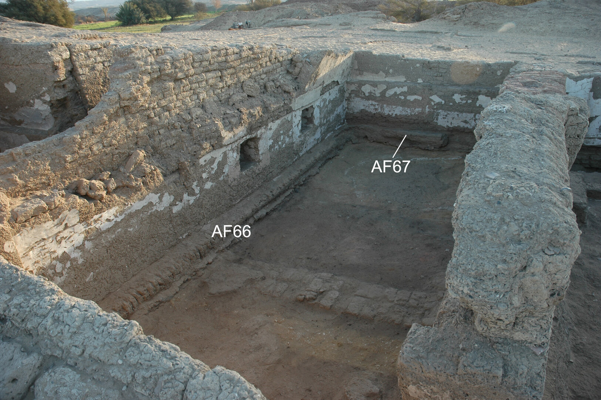{#plt-3.41}

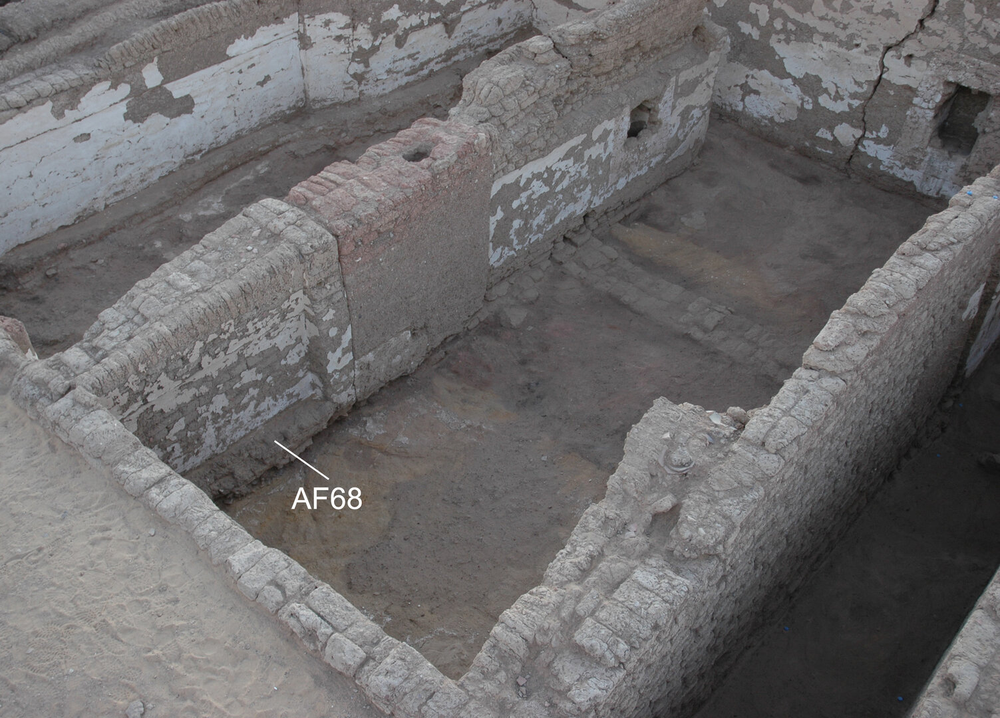{#plt-3.42}

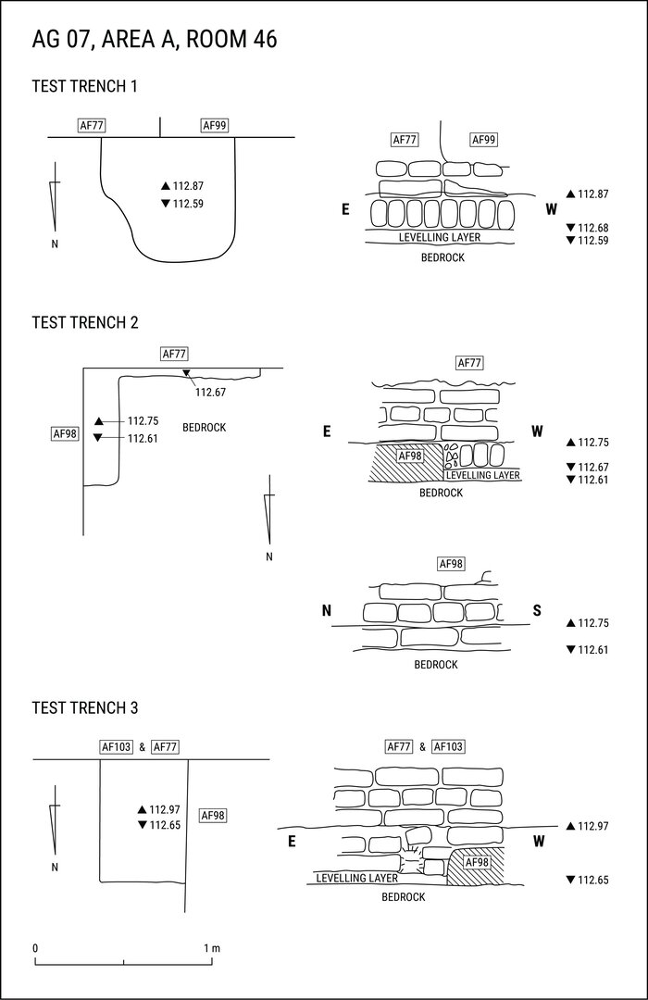{#plt-3.43}

### Room B6 {#sec-3.1.3-room-b6}

#### Features

Room A46 opens to the north, through a doorway (AF100/BF88) by its northwest corner, onto room B6 (@plt-3.2, @plt-3.44, @plt-3.45, @plt-3.46). It is a rectangular space, measuring 2.77 m from north to south and 3.78 m from east to west, and has walls preserved to a maximum height of 3.20 m (north end of the east wall BF75).

The room was once covered by a barrel-vaulted roof (oriented from east to west), of which only parts of the north and south vault springs (BF74 and BF71, respectively) are still *in situ*. Another doorway, placed near the southeastern corner (BF89; width: ca. 90 cm), separates room B6 from a long corridor to the east (B7); unclear evidence for the existence of a door was detected.[^60] A third doorway (BF84), ca. 70 cm wide, 155 cm high, and with a mud-brick threshold 27 cm high above floor level, is built at the eastern end of the north wall (BF73). It opens onto a well-preserved staircase (B8), which originally led up to a roof (@plt-3.47). A fourth opening (BF86; width: ca. 80 cm and height: 178 cm) leads into room B9 to the north through a vaulted passageway (ca. 1 m long) that runs under staircase B8.

The mud-brick walls were first plastered in mud and then covered with a thin layer of white gypsum (@plt-3.48). Two arched niches are set in the west wall (BF72), at a height of ca. 90 cm above floor level (@plt-3.48 A); the southern one measures 49 cm (width) by 50 cm (height) by 60 cm (depth) and the northern one 48 cm (width) by 49 cm (height) by 56 cm (depth). Both niches have a semicircular, recessed band on top and are completely whitewashed inside; traces of a rectangular band of white gypsum are visible around each niche down to floor level.

Another arched niche, with a recessed band on top, is built within the east wall, about 50 cm above the mud-brick platform built against that wall (@plt-3.48 B); it is 49 cm wide, 68 cm high, and 36 cm deep. At the center of its bottom is a depression, but it is unclear if it is the result of ancient damage or if it was intentional and served some unknown function. The niche is painted with white gypsum inside. A fourth rectangular niche, measuring 48 cm (width) by 35 cm (height) by 57 cm (depth), pierces the north wall of room B6, at a height of ca. 66 cm above the platform running along the same wall (@plt-3.48 A). A rectangular band, about 35 cm thick, of white gypsum frames the niche, although now it is hardly distinguishable from the whitewash layer of the entire wall.

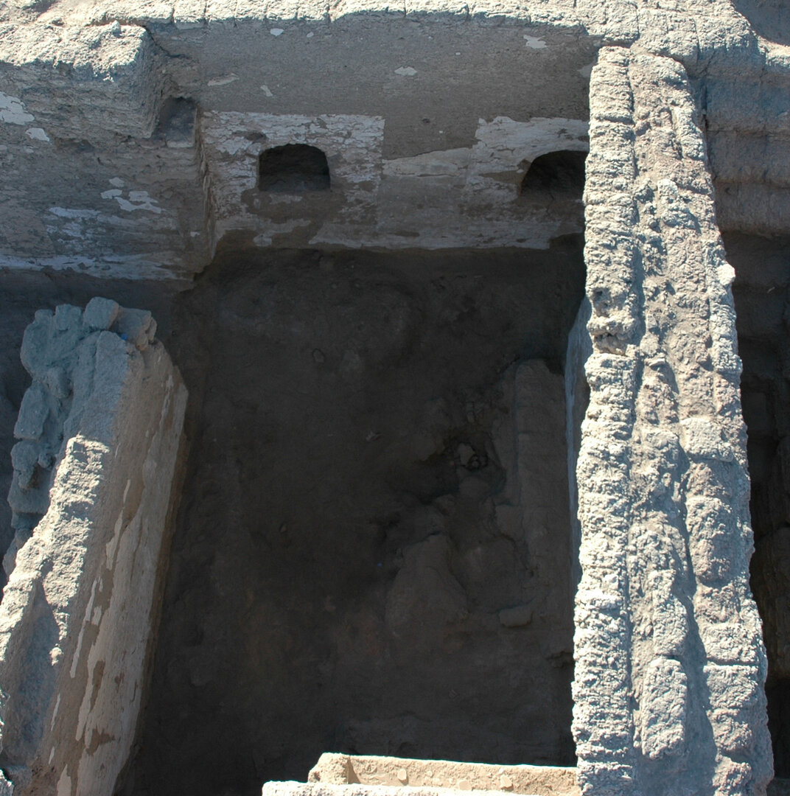{#plt-3.44}

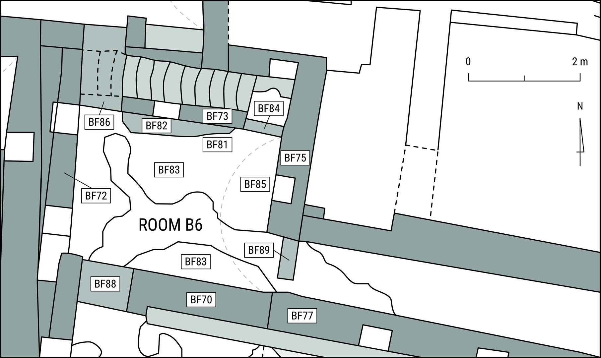{#plt-3.45}

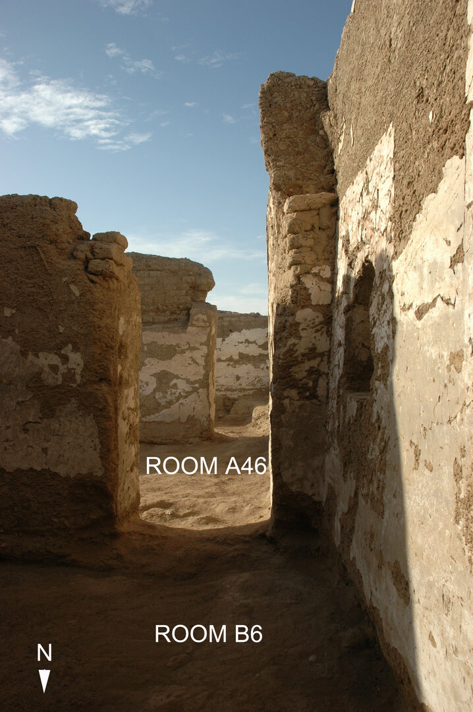{#plt-3.46}

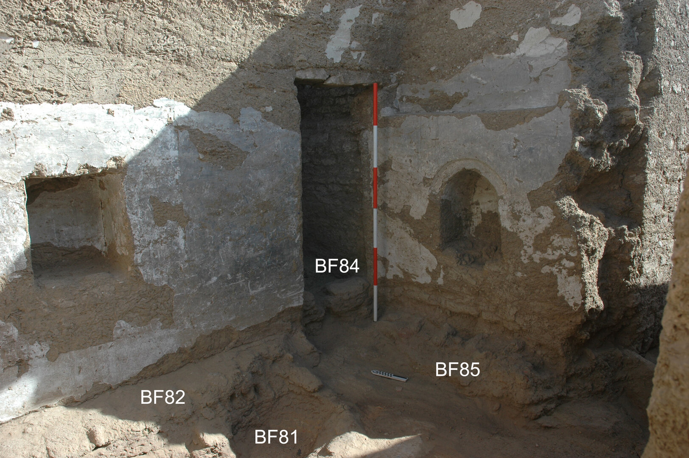{#plt-3.47}

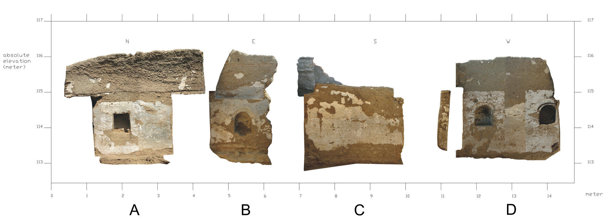{#plt-3.48}

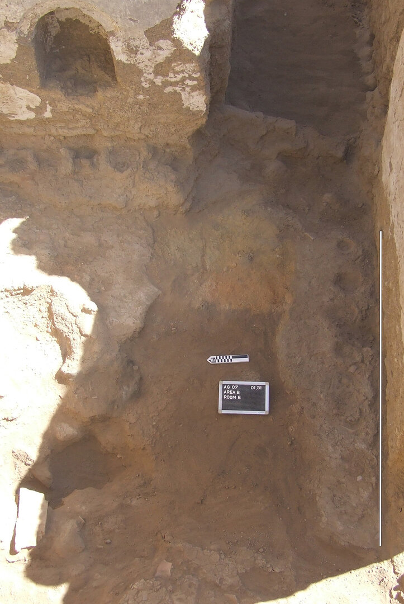{#plt-3.49}

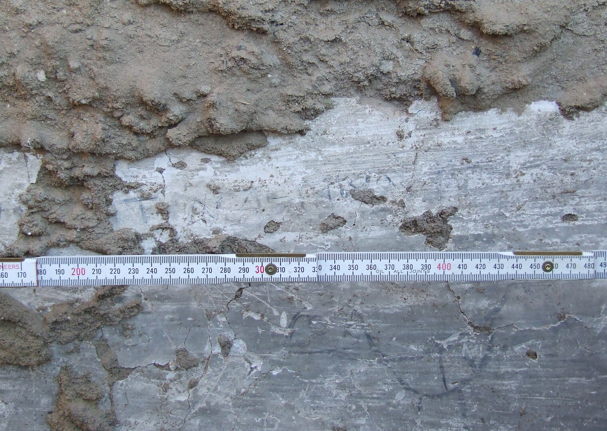{#plt-3.50}

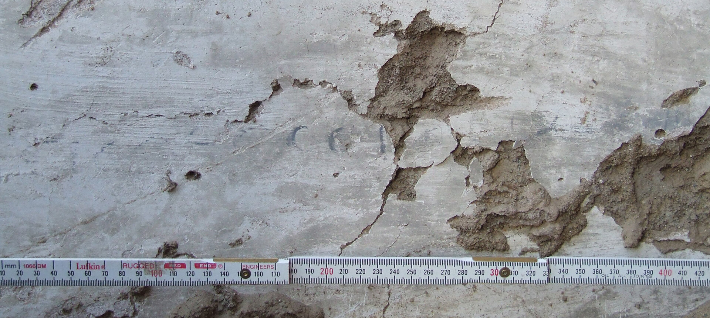{#plt-3.51}

The floor of the room (BF83),[^61] of which only scanty traces remain, is of compacted mud, with several organic and ceramic inclusions. Along the south wall, eight circular impressions, with a diameter varying from 10 to 17 cm, are visible at ground level (@plt-3.49); they testify to the existence of storage vessels lined against the wall, probably when the room was used as a kitchen. Other imprints of cooking and/or storage vessels were found on the poorly preserved mud-brick platform (BF85), measuring 146 cm (length) by 40 cm (width) by 10 cm (height), built against the east wall. Another raised platform or *mastaba* (BF82), measuring 219 cm (length) by 36 cm (width) by 23 cm (height) is located against the north wall; a hearth (BF81; diameter: ca. 85 cm), cutting through the floor, was found in front of it, filled with ash and charcoal.

Graffiti can be seen on three walls of room B6, either drawn with black ink or carved in the plaster (@plt-3.50, @plt-3.51; 10.13–17; 10.19–25). On the north wall are a Coptic inscription (written in black), a sketch of what seems to be a bird (in black), and three boats (two drawn in black and one carved in the plaster); a Greek inscription, consisting of a rather commonly attested invocation to God, is written in black on the west wall, near the northwest niche.[^62] A six-petal rosette, inscribed in a circle, is carved in the south wall (Pl. 10.25).

Room B6 is the anteroom of the church complex, the first place one would cross after entering through corridor B7. The analysis of its architectural features suggests the existence of a multi-phased history for its construction. Originally, the room was much larger and oriented from north to south, including the area later occupied by the staircase (Pl. 5.1). Corridor B7 had not been built, yet, and the eastern wall was originally bonded with the southern one. There is no evidence of the exact location of the original entrance into room B6. At some point in antiquity, the space was heavily modified, with the addition of a staircase in the northern half of the room, abutting the west wall, and the opening of a vaulted passageway into room B9, also a later addition to the complex. The doorway leading from room B6 into this passageway cuts the northern end of the northwest niche, providing additional evidence that the northern side of the room was originally further north. Possibly at the same time, although the evidence is not conclusive on this point, the room was used also as a kitchen, as testified to by the hearth and the imprints of vessels on the floor and on one platform.[^63]

#### Stratigraphy (@plt-3.52)

Several stratigraphical contexts were identified and removed during the excavation of room B6. The surface layer (DSU39)[^64] consisted of windblown sand, mixed with a very few potsherds (0.99 kg) and fragments of mud plaster. A fragment of a leather bracelet or belt (inv. 564) was found within this level, which extended uniformly throughout the room, apart from its southern end where evidence of a vault collapse episode (DSU40)[^65] was found (@plt-3.53). This unit consisted of large vault bricks and chinking sherds (0.66 kg) mixed within the mud mortar. Another deposit of windblown sand (DSU42),[^66] containing very few ceramic sherds (0.38 kg), plaster fragments, and bones, lay underneath the two previous contexts and above two collapse layers. One (DSU46)[^67] was located near the doorway in the southeast corner of the room and probably resulted from the disintegration of part of the room’s east wall. Very few potsherds and some fragments of white gypsum and mud plaster were found within the loose mud bricks and brownish sand. The other unit (DSU54)[^68] consisted of part of a wall collapse that occurred within staircase B8 (excavated there as DSU52) and partly leaked into room B6 through the doorway connecting the two spaces. Whole and fragmentary mud bricks, a stone slab not *in situ*, and some potsherds were found in this unit. A layer of windblown sand (DSU55),[^69] with very few ceramic inclusions (0.06 kg) and containing one fragment of glass, was revealed below the two collapses DSU46 and DSU54, spreading throughout the room above DSU59,[^70] identified as an occupational level. It lay directly above floor level and consisted of mud dust and sand, with a considerable amount of organic inclusions (mostly straw, seeds, charcoal), numerous potsherds (1.84 kg), a few loose stone slabs, once used as stone lintels, and two fragments of glass (one of which is part of the rim and wall of a bowl of light aquamarine glass: inv. 583). The excavation of this unit revealed also a bronze coin of Constantius II (inv. 561), dated to the years 351–361. Another bronze coin (inv. 563), minted between 361 and 363, was found within a patch of the original floor of compacted mud (hence from a more reliable context than the other specimen).

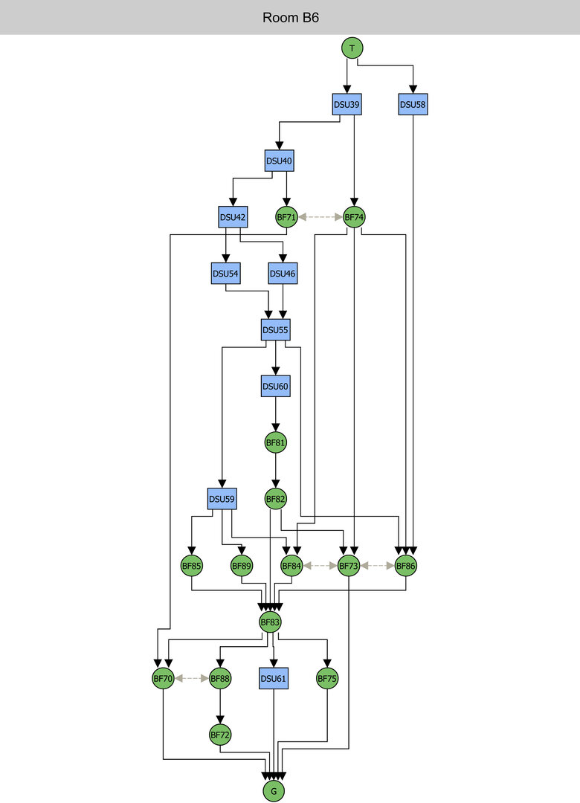{#plt-3.52}

The hearth (BF81) set into the floor near the north wall was filled with charcoal, ash, organic material, and a few small potsherds (0.08 kg); this fill was excavated as a separate unit (DSU60).[^71] Evidence of a preparatory layer below floor level (DSU61)[^72] was also identified and partly excavated to gebel in a small area to the west of the hearth. It consisted of dark brown sand mixed with organic particles (including straw and wood fragments and seeds), lime spots, ash pockets, some mud-brick debris, and a few pottery sherds (0.14 kg). The excavation of this unit revealed also two joining pieces of an incomplete bronze ring (or earring) (inv. 567).

The vaulted passageway located at the northwest corner of room B6, running below staircase B8 and opening into room B9 to the north, was excavated separately from the rest of room B6, due to the particularly delicate condition of its architectural features. A vertical section was removed from the part of the passageway that is closer to room B6. The deposit consisted of windblown sand (DSU58)[^73] mixed with pottery sherds and, in its higher half, some fragmentary mud bricks, possibly resulting from the collapse of walls in room B9. An incomplete wood bolt with a rounded head (inv. 572) was found during the removal of this unit.

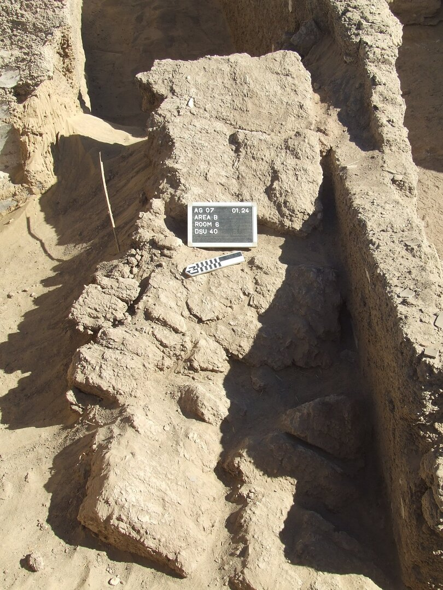{#plt-3.53}

### Room B7

#### Features

B7 is a long corridor located along the outer face of the north wall of room A46 (@plt-3.2, @plt-3.54, @plt-3.55). It measures 1.13 by 5.22 m and is oriented from east to west. Its north and south mud-brick walls, laid out in English bond, are preserved to the considerable height of 2.92 m (west half of north wall BF76) and are in a fairly good state of conservation.

B7 opens onto room B6 through a now badly damaged doorway (BF89) and functioned as the only entrance to the church complex (@plt-3.56). The north wall (BF76) abuts the east wall of room B6 (BF75) and is therefore later. The south wall of the corridor (BF77) is shared with the gathering room (A46) as the latter’s north wall (AF69). The north face of this wall, facing the corridor, shows that the wall was constructed in two phases, although it is not clear how distant in time. The lower sixteen courses consist of gray mud bricks with very few organic inclusions. A large quantity of mortar was used and the pressure caused by the higher courses led to the formation of caps of excess mortar. The upper courses, in contrast, were laid using brownish mud bricks with several inclusions and more limited quantities of mortar. Four holes can be seen piercing the wall toward its west end, between the fourth and fifth course from ground level, blocked from the *mastaba* built against the south face in room A46. The nature of these holes is unknown.

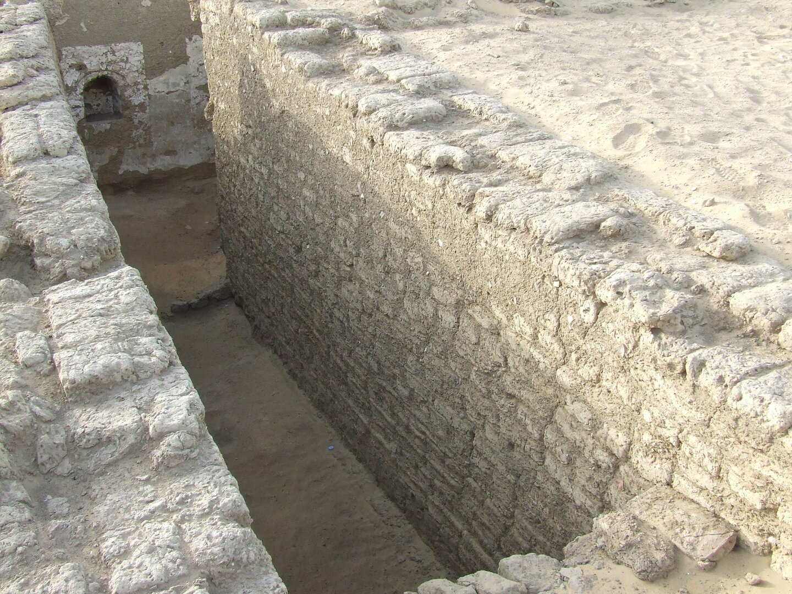{#plt-3.54}

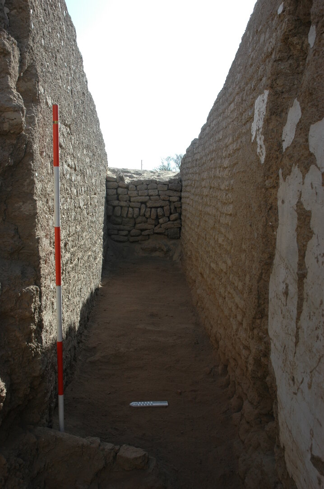{#plt-3.55}

The north and south walls bear no traces of vault springs. No beam holes were detected either, but the walls are not preserved to their original height. Therefore, it is possible that the corridor/entrance either was an open-air space or had a flat roof. The latter seems more plausible, especially in light of the discovery of a thick layer of organic material above floor level, which might be the result of a decayed light roof made of palm ribs and mud. Scattered patches were found of the original floor (BF108),[^74] which consisted of a layer of compacted mud (@plt-3.57). A test trench excavated at the east end, where the corridor opens onto street B12 with a passage ca. 1.2 m wide,[^75] revealed two thresholds: BF132, possibly associated with floor BF108 (not, however, preserved in the area of the threshold), and BF150, in phase with an earlier (and now completely missing) floor (@plt-3.58, @plt-3.59).

The south wall of corridor B7 was originally bonded with the east wall of room B6, before a doorway between the two rooms was created. It is also bonded with the north–south wall (AF98), traces of which are visible in room A46 below floor level.[^76] As previously said, the south wall of the corridor was built in two different phases. The upper mud-brick courses (those above the sixteenth course from the ground) continue to the west and bond with the west wall of room B6. The southern face of the south wall of the corridor, as well as the lower sixteen courses of its north face, seem instead to belong to an earlier phase. The upper courses of the north face were laid out as part of a remodeling episode, during which it is possible that a vault, springing from the north face of the wall, was razed and a partially new south wall built for corridor B7. At that time, the doorway between rooms B7 and B6 was created by tearing down part of an earlier wall; also, the north wall of the corridor was built, abutting the east wall of room B6.

#### Stratigraphy (@plt-3.60)

The stratigraphy of the depositional units in corridor B7 was rather simple, as compared to that of other rooms of the complex (such as the church) and revealed an almost complete lack of evidence of wall collapse. The room was filled with a thick surface layer (DSU37,[^77] ca. 35 cm deep) of windblown sand, mixed with ceramic sherds (3.8 kg), small pebbles, and plaster fragments. After the removal of this unit, another layer (DSU38)[^78] was found consisting of clean windblown sand, including some pottery sherds (0.48 kg) and bones, which filled the entire space down to floor level for over 2.2 m. Only a few mud bricks were discovered at the eastern end of the corridor, but they seem to be associated with collapse episodes occurring in street B12. Above the remains of the floor (and partly directly above bedrock) was a unit (DSU45)[^79] consisting of loamy sand, ceramic sherds (0.24 kg), fragmentary mud bricks, mud plaster, and organic material, often found packed in layers. As mentioned in the previous section, this layer is perhaps to be associated with the decaying of a flat roof that collapsed into the room. Within the same organic-rich unit, consistent traces of burning activity (ash and small pieces of charcoal) were detected toward the west end of room B7, probably linked to the use of the neighboring room B6 as a kitchen. To the east of the corridor, the unit seems to continue and mix with an occupational layer extending throughout large part of street B12. Within the stratigraphy of corridor B7, DSU45 was the only context in which small finds were retrieved. These included a fragmentary iron nail (inv. 581), a small piece of a vessel of white blown glass (inv. 584), and an incomplete oval lamp (inv. 1005). No numismatic evidence was gathered in any of the contexts of room B7; this is quite surprising, since large numbers of coins were found in functionally similar spaces near the church, such as the vaulted passageway to the south (B11) or the street to the east (B12), which were also built to direct movement on mound I.

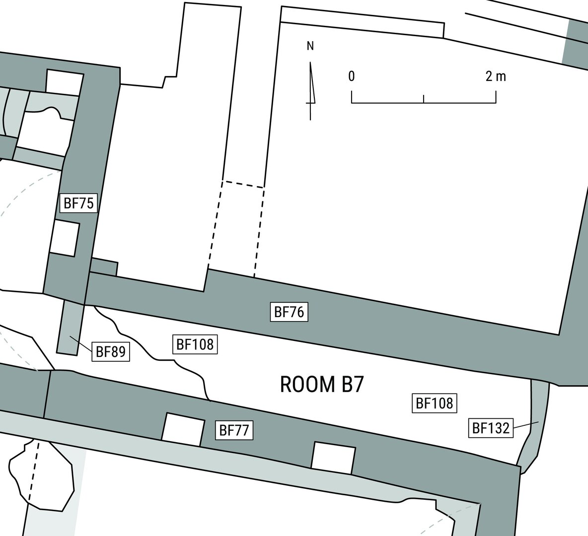{#plt-3.56}

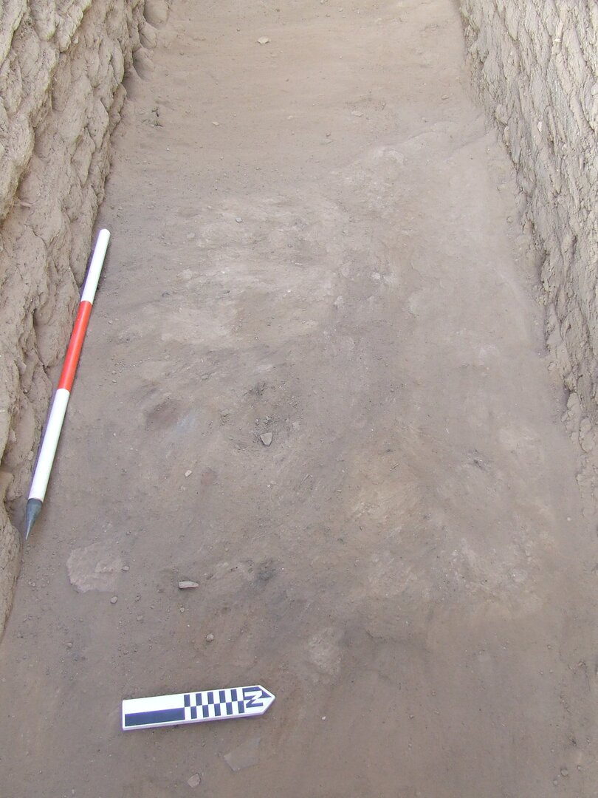{#plt-3.57}

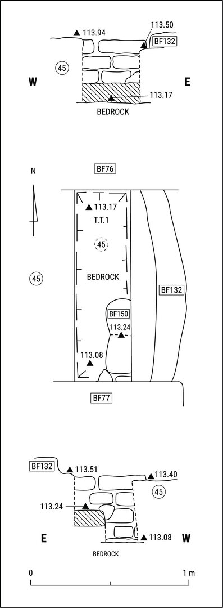{#plt-3.58}

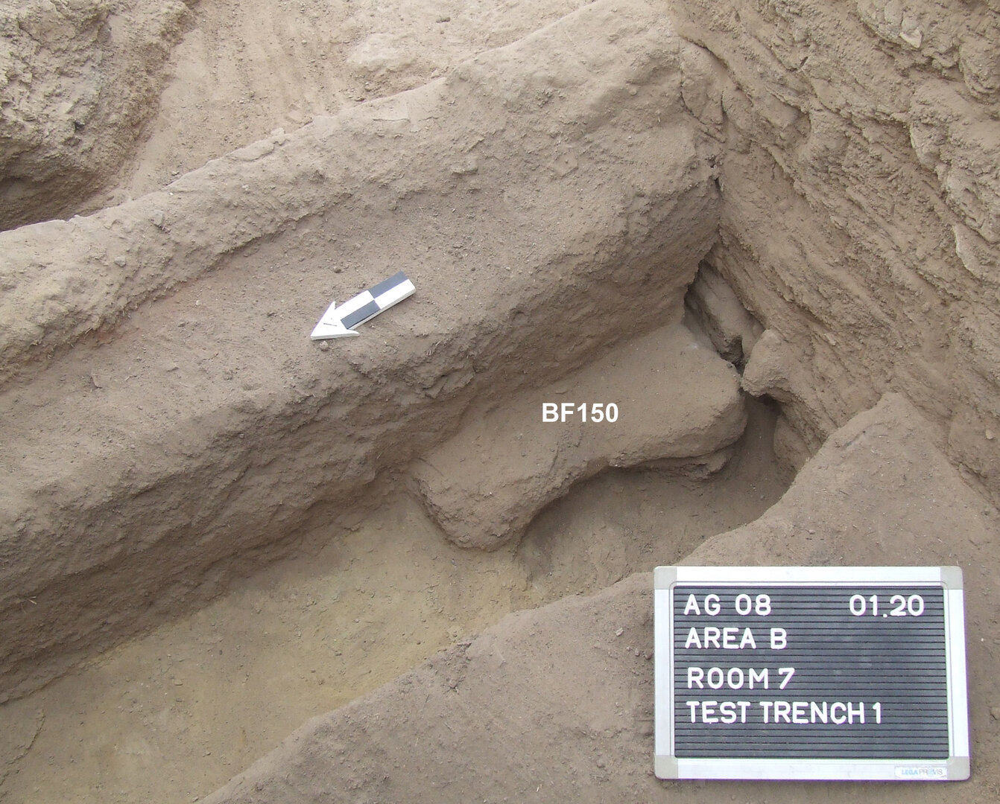{#plt-3.59}

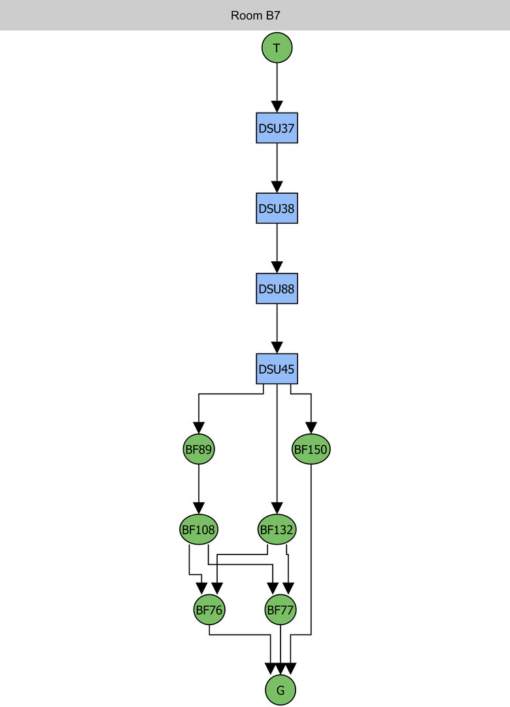{#plt-3.60}

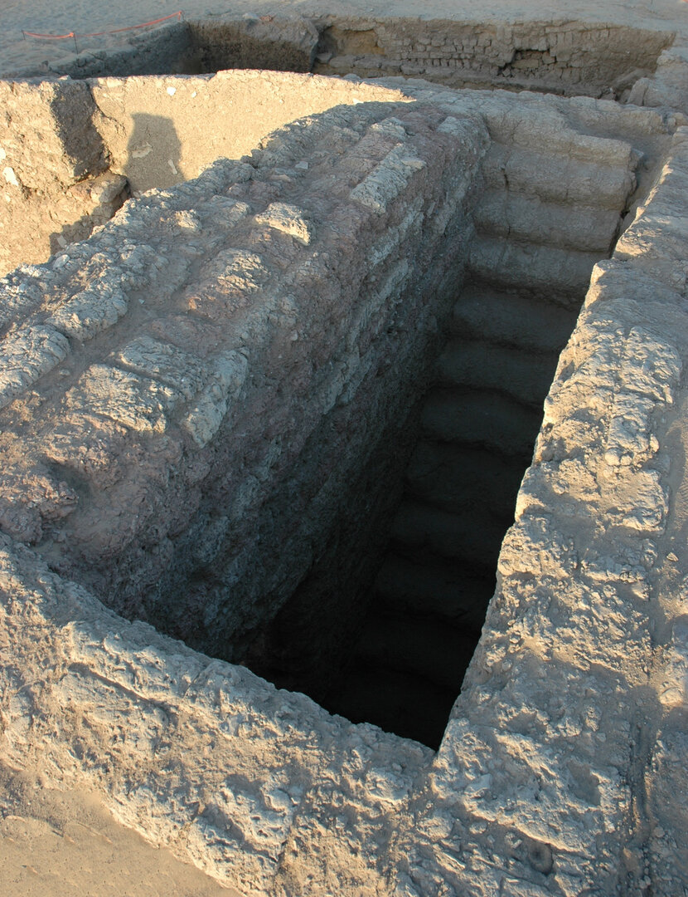{#plt-3.61}

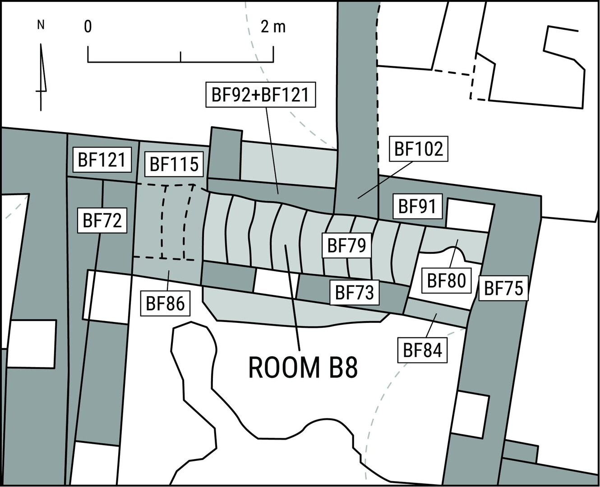{#plt-3.62}

### Room B8

#### Features

B8 is a staircase located along the outer side of the north wall of room B6 (@plt-3.2, @plt-3.61, @plt-3.62). B8 measures 0.72 m from north to south and 3.80 m from east to west. Its walls are preserved to a maximum height of ca. 2.80 m (east wall BF75). As mentioned above, access to the staircase is via space B6 through a doorway (BF84) located near the northeast corner of that room. The stairway is complete and in good condition and appears to have worn down, because of usage, only in its central part.

The staircase ascends from east to west and consists of thirteen mud-brick steps (BF79), each built with a row of four headers[^80] lying on top of a row of stretchers. The visible surface of each step measures approximately 71 cm north–south by 25 cm east–west, and its height corresponds to that of two rows of bricks (with only a few exceptions). The walking surface of the staircase bears evidence of a coating of mud plaster (mixed with straw), which lips down on the lower courses of stretchers.

The lowest step is embedded within a mud-brick platform/floor (BF80),[^81] at a distance of ca. 1.24 m from the east wall. The staircase currently leads to the scanty remains of the roof of room B10, where small industrial installations were found,[^82] and possibly on the south vault spring of room B9 (@plt-3.63).[^83]

The upper part of the stairway, which is almost completely preserved and was not originally roofed, is supported by a narrow vaulted passageway opening from room B6 into B9; its measurements are ca. 1.4 m from north to south by 0.75 m from east to west and its height is 1.78 m. The lower part of the staircase, consisting of the above-mentioned mud-brick floor laid out at the bottom of the staircase, might have had a flat palm-leaf roof, as suggested by a layer of decayed organic material found right above floor level. However, it is not possible to ascertain this possibility beyond doubt. The stairway is supported to the north by sections of different walls: from west to east, a stub belonging to the doorway into room B9, an east–west wall (BF92, built above an earlier feature—BF121—that is visible below it within room B8) (@plt-3.64), the south end of a north–south wall (BF102, the east wall of room B9), and a sector of another wall (BF91) shared with an unexcavated room to the northeast. A ledge, 85 cm long, is visible in the west part of this wall, at about 1.02 m above floor level. To the east of the ledge, an arched niche (100 cm high, 57 cm wide, and 30 cm deep) is built within the same wall, 44 cm above floor level. Traces of hacking in the back of the niche suggest that it was not part of the original plan, but was created at a later stage, possibly using an already existing ledge as its bottom. BF75 (the east wall of the staircase) continues south into room B6. The south wall (BF73) is also shared with room B6 and seems to have been built in one phase.

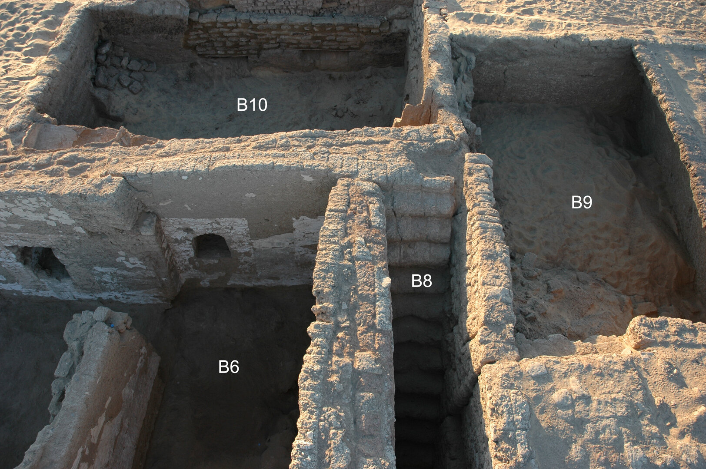{#plt-3.63}

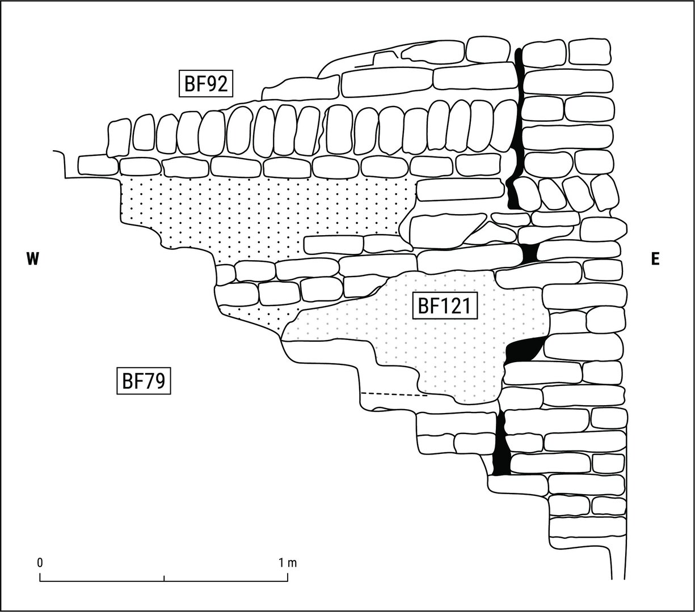{#plt-3.64}

All architectural features forming staircase B8 seem to have been built as the result of one construction episode, which also involved the creation of room B9 in its latest phase.[^84]

#### Stratigraphy (@plt-3.65)

A surface layer (DSU44)[^85] consisting of windblown sand and including mud-brick fragments, pottery sherds (4.54 kg), and small pebbles, extended throughout the room. Only one small find was retrieved during the excavation of staircase B8; it came from this depositional unit. It is a poorly preserved bronze coin (inv. 549) that was minted between 364 and 378. Unfortunately, due to the highly unreliable context in which it was found, the coin is of little diagnostic significance for the dating of the room. The removal of the surface layer revealed a unit of mud bricks (DSU49),[^86] likely collapsed from the north and south walls into the center of room B8. This unit, as well as DSU44, covered a layer of windblown sand (DSU48)[^87] that filled the western half of the staircase. The unit contained only a few bones and ceramic sherds (1.74 kg).

The excavation of the surface layer (DSU44) led to the identification of a second unit (DSU50),[^88] which consisted of another mud-brick collapse and extended eastward from the second upper step (@plt-3.66). It was soon discovered that this unit was, in fact, the uppermost part of a more extensive wall collapse episode (likely originating from the north, south, and east walls of the staircase) that was investigated, and then removed, as DSU52.[^89] The latter covered the entire area of the staircase and continued, through doorway BF84, into room B6 (where it was excavated as DSU54). DSU50 and DSU52 were partly divided by DSU51,[^90] a layer of loose sand, with inclusions of mud-brick debris and small pebbles, which was later identified as a lens within the same collapse episode.[^91] Directly underneath DSU52 was DSU53,[^92] a context of clean sand mixed with mud-brick dust, organic particles, very few pottery sherds, and small pebbles. The unit sloped down, with increasing thickness, from west to east, ending near the west jamb of the doorway opening into room B6.

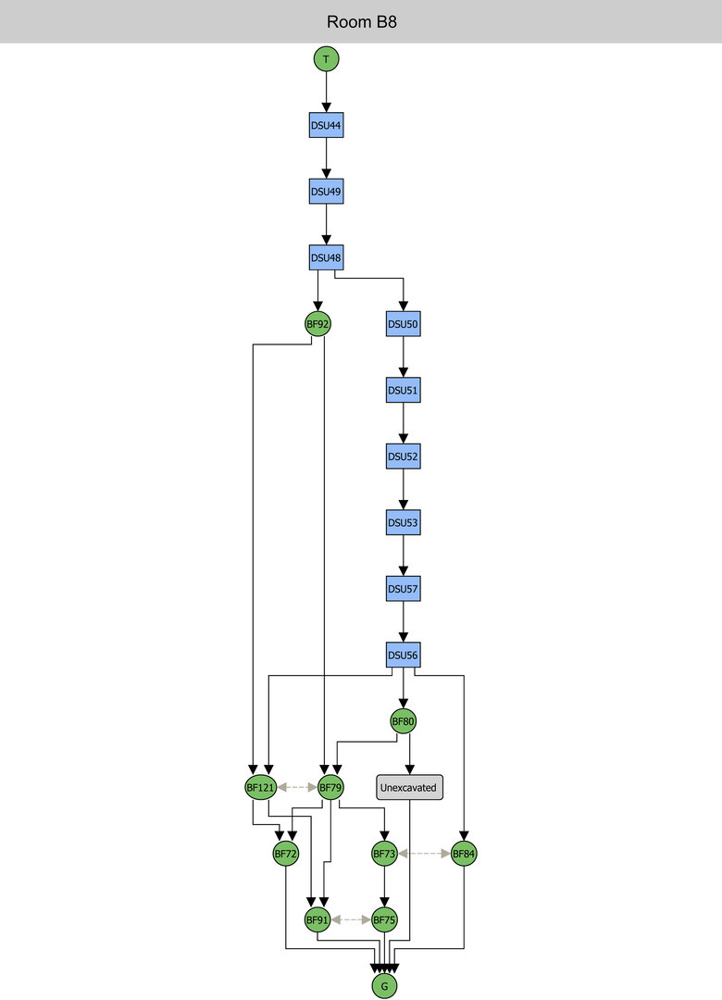{#plt-3.65}

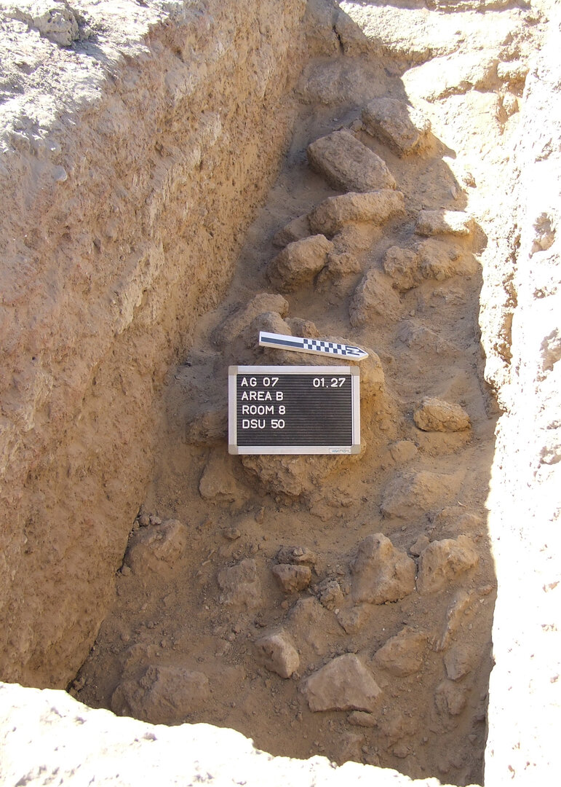{#plt-3.66}

A deposit of mud-brick dust mixed with sand, organic particles, and very few pottery sherds (DSU57)[^93] was excavated below DSU52, at the east end of room B8, and DSU53, in the area above the staircase itself. DSU57 lay above a context of mud-brick debris (DSU56),[^94] sloping down from west to east, that was also found in part under DSU52 and DSU53. Evidence of mud plaster with imprints of palm ribs, as well as an actual fragment of palm rib, were found within DSU56, suggesting the possibility that staircase B8 had a flat roof, at least at its bottom end near the doorway (where most traces were retrieved). The unit also contained a few pottery sherds (1.82 kg).

### Room B9 {#sec-3-b9}

#### Features

B9 is located at the north end of the church complex (@plt-3.2, @plt-3.67, @plt-3.68). It is roughly rectangular in shape and measures ca. 3.70 m from north to south and 5.30 m from east to west, with walls reaching a maximum height of ca. 2.90 m (west half of the south side–BF106).

This space is not accessible from any room other than the anteroom/kitchen of the church complex (B6), through a vaulted passageway below the upper part of staircase B8. The doorway (BF115), preserved to a height of about 1.55 m, has a well-preserved mud-brick threshold, measuring 46 cm north–south by 74 cm east–west, and is defined to the east by a partition wall protruding northward into the room.[^95]

Space B9 was originally covered by an east–west oriented barrel vault, which was found still largely *in situ* except for its central part.[^96] A short, east–west oriented wall (BF92) is partly preserved above the south vault spring, functioning as the upper west end of the north wall of staircase B8 (@plt-3.69). To the west, another short partition wall (BF99), oriented from north to south, divided the space above the same vault spring in two halves.[^97] The original subdivision of space above the southern vault spring of room B9 is not clear, due to its very poor state of conservation.

As excavations carried out in the room showed, the walls were built directly on gebel, and the very uneven ground was leveled with a compact mud floor (BF116).[^98] Scanty remains of mud-brick features, covered with mud plaster, were uncovered along the north and west walls, possibly comparable to those found in room B6 and serving as platforms for the storage and/or preparation of food.

A rectangular mud-brick feature, plastered with mud, is built in the south wall of the room, to the east of the doorway opening into room B6 (@plt-3.70, @plt-3.71). It is ca. 1 m wide and 44 cm deep and is set at 48 cm above floor level.[^99] Its original height cannot be determined, as the upper part of the room in the southeast corner was found heavily damaged.[^100] The recess might have been used as a cupboard for the storage of vessels and/or food.

The features associated with staircase B8 and room B9 seem to be part of the same construction episode. Below the vault supporting the staircase, two thresholds were found, one to the south, near room B6, and another to the north, at the entrance of room B9. In fact, the latter seems to be the soldier course of an earlier east–west oriented wall that was torn down when the staircase and room B9 were built. The razed wall formed part of the original north wall of room B6, which was therefore much larger before the construction of the staircase in its northern half.[^101] The northeast wall of staircase B8 (BF91) seems to be the only preserved section of the north wall of room B6 in its earlier phase; it was in fact a separate wall, not bonded but abutting the razed one.

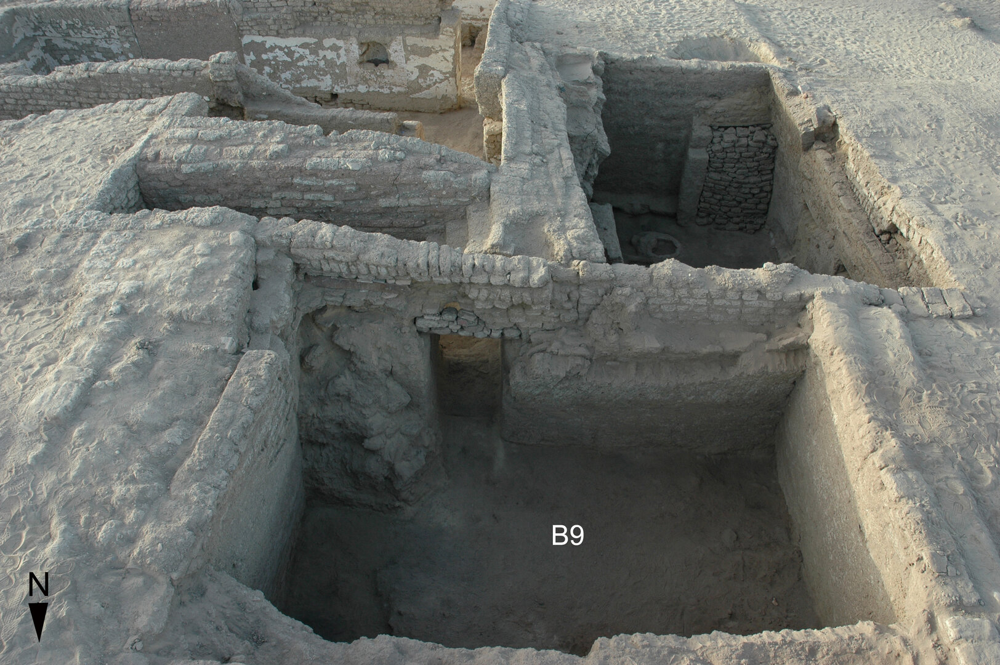{#plt-3.67}

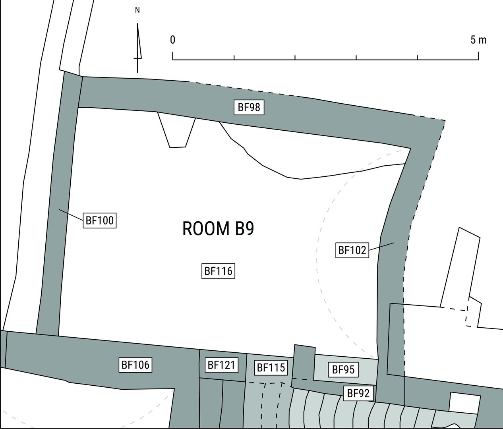{#plt-3.68}

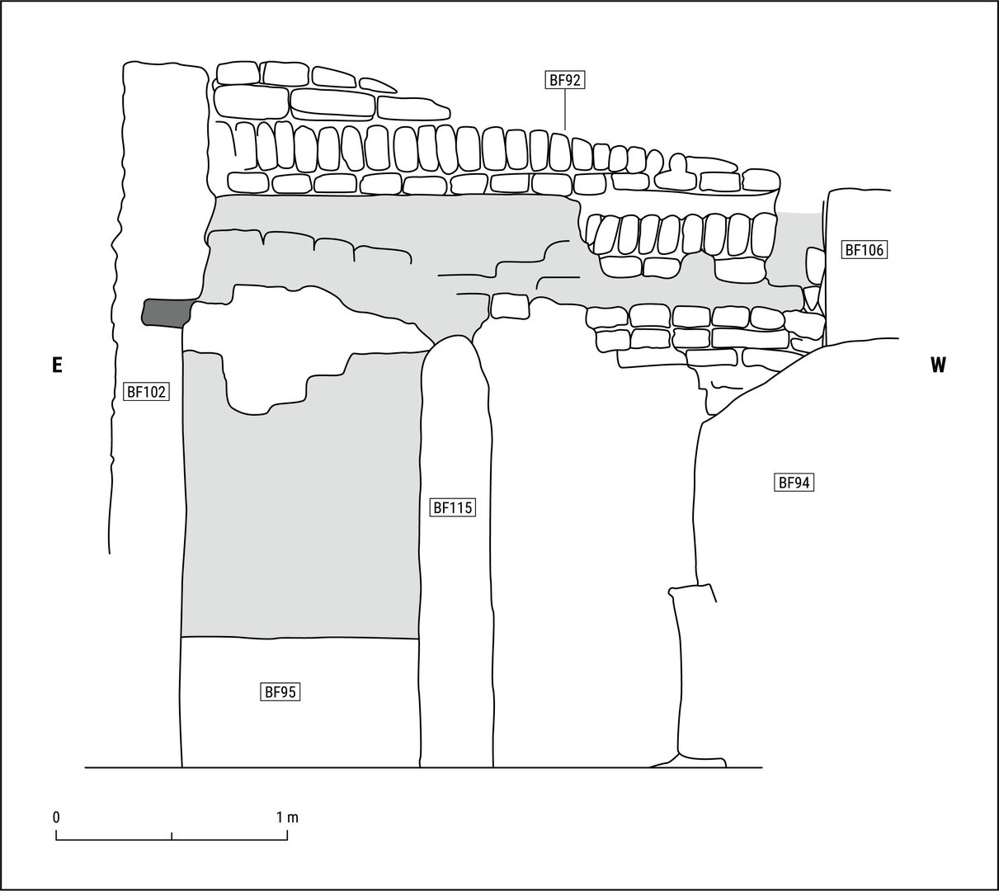{#plt-3.69}

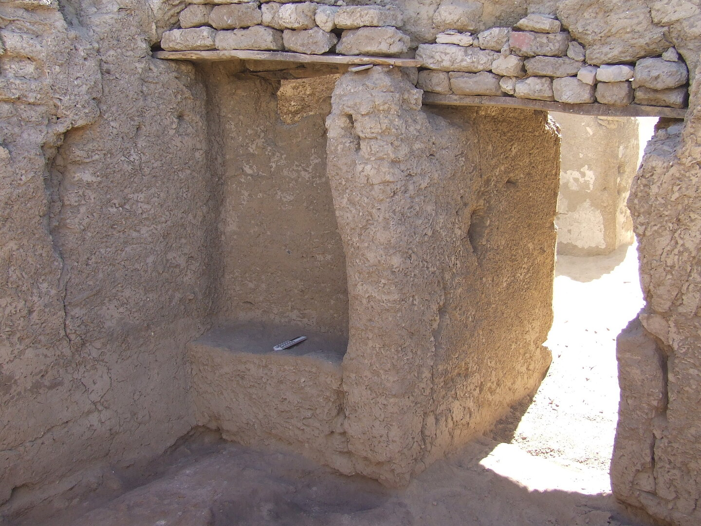{#plt-3.70}

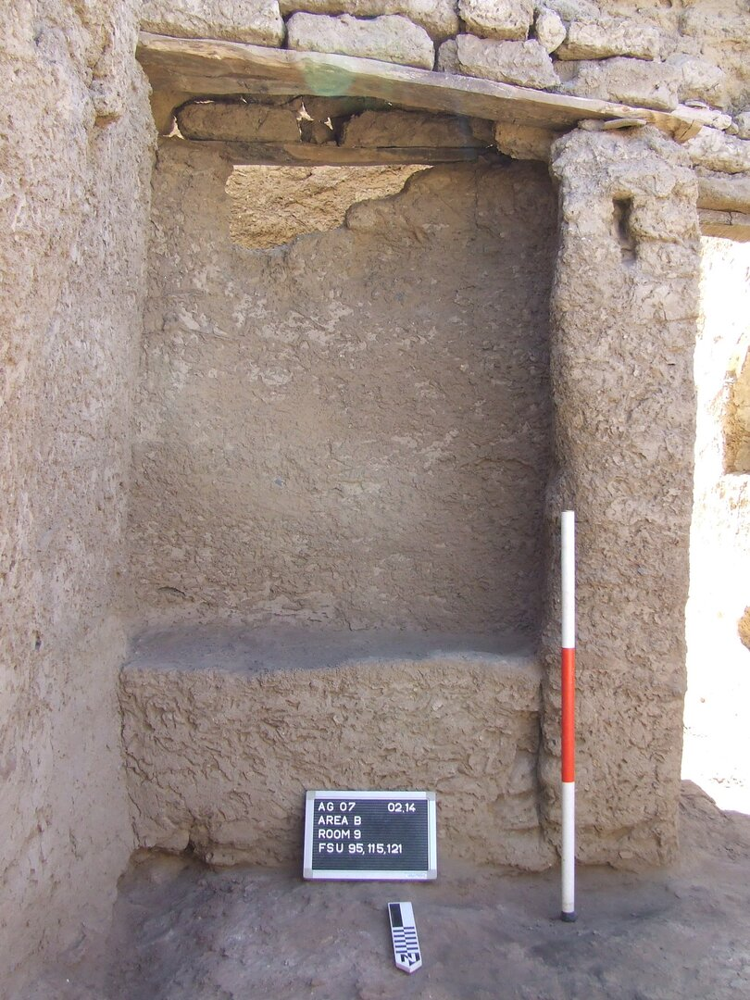{#plt-3.71}

Quite clearly, the data gathered in the field show that room B9 is not contemporary to room B6 in its first phase, but was built after the staircase and the vaulted passageway below it were added within room B6. The latter was, therefore, considerably sized down and its refunctionalization as a kitchen likely occurred when the staircase was built, leading to an upper floor where installations related to food production and storage were found. This process also involved the construction of room B9, accessible only from room B6 and possibly used as a storage room/pantry in association with the latest occupational phase of the kitchen.

#### Stratigraphy (@plt-3.72)

The deposits that filled room B9 consisted of windblown sand and a series of wall and vault collapses, which accumulated, in large part, in the southeast corner and sloped down over the north and central parts of the room (and partly into the vaulted passageway to the south).

Two units were removed as the surface layer: one (DSU63),[^102] consisting of sand mixed with pebbles, pottery sherds (0.71 kg), bones, and traces of ash and charcoal resulting from a modern fire, covered the west half of the room; the second unit (DSU69)[^103] was a mud-brick collapse layer, possibly originating from the eastern and south (east segment) walls and extending through the eastern part of room B9. This context contained a large quantity of pottery sherds (12.53 kg) and was mixed with sand, especially below the uppermost level. A series of vault and wall collapses was then revealed; the uppermost was DSU72,[^104] located in the southeast sector of the room (below DSU69) and consisting of a vault collapse (as testified to by the several vault bricks found in it) mixed with several ceramic inclusions (4.38 kg). Below DSU72 was DSU75 (@plt-3.73),[^105] a vault and wall collapse that sloped from the southeast corner of room B9 northwards and that contained lenses of yellow sand and several inclusions, like pebbles, plaster, glass, bones, bronze fragments, lime spots, and several potsherds (58.91 kg). The excavation of this context revealed also a complete wooden peg (inv. 575) and three fragments of transparent green glass, one of which (inv. 596) belonged to a bowl, while the remaining two (inv. 597–598) were once part of lamps.

DSU75 was partially covered by DSU68,[^106] a context of windblown sand and mud-brick dust, with a few bones and several ceramic inclusions (9.22 kg) filling the entire room. In its lower part, some lenses of ash and charcoal were identified. This layer, excavated under surface (both units DSU63 and DSU69), lay directly on top of the lowermost depositional unit (DSU79)[^107] in the western half of the room. DSU79 was an occupational level of packed mudbrick dust mixed with some pebbles, numerous potsherds (21.51 kg), rare glass slag, and organic inclusions. It covered the remains of the clay floor and was considerably thicker near the walls of the room than at its center. The small finds that were gathered within this unit include a stone weight (inv. 590), two fragments of black dull glass bracelets (inv. 565 and 595), a piece of a gypsum stopper (inv. 593), an incomplete rope (inv. 592), and two fragmentary wooden objects, probably used as pegs (inv. 585–586). One bronze coin (inv. 580) was found associated with this stratigraphical context; it was broadly assigned to the fourth century.

In the eastern half of room B9, DSU79 lay underneath wall and vault collapse (DSU75) and a lens of windblown sand, mixed with a few mud-brick fragments, some cobbles, potsherds (1.53 kg), bones, and traces of ash and charcoal (DSU82).[^108] Two joining fragments of a bowl of green glass (inv. 591) were also retrieved within this unit, which lay in part below DSU75 and possibly included some of its debris.

Three depositional units were excavated in the wedge created by the south wall and the vault springing from it. These were DSU66,[^109] a surface layer of windblown sand, and, below it, DSU67,[^110] consisting of sand mixed with mud-brick dust, a few pebbles (in DSU66), and pottery sherds (0.63 kg in each unit). The lowest level, above the debris that formed the original filling of the wedge, was DSU70,[^111] a layer of mud dust with some sand, mud-brick fragments, and ceramic inclusions (0.1 kg). As for the wedge along the north wall, two units were identified, that is to say, DSU 71,[^112] a unit of windblown sand mixed with pottery sherds (3.84 kg), pebbles, ash and charcoal from a modern fire, and DSU77,[^113] consisting of mud-brick debris, mud-brick dust, a few bones, cobbles, and numerous potsherds (31.02 kg), which was found to be part of the original fill and, therefore, was not excavated further.

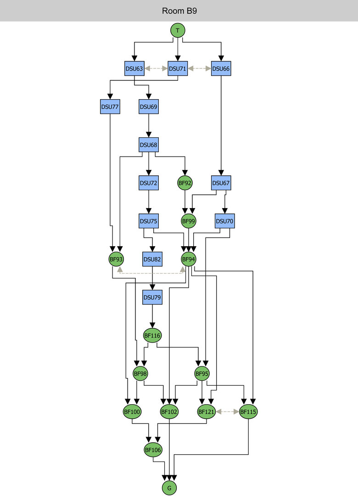{#plt-3.72}

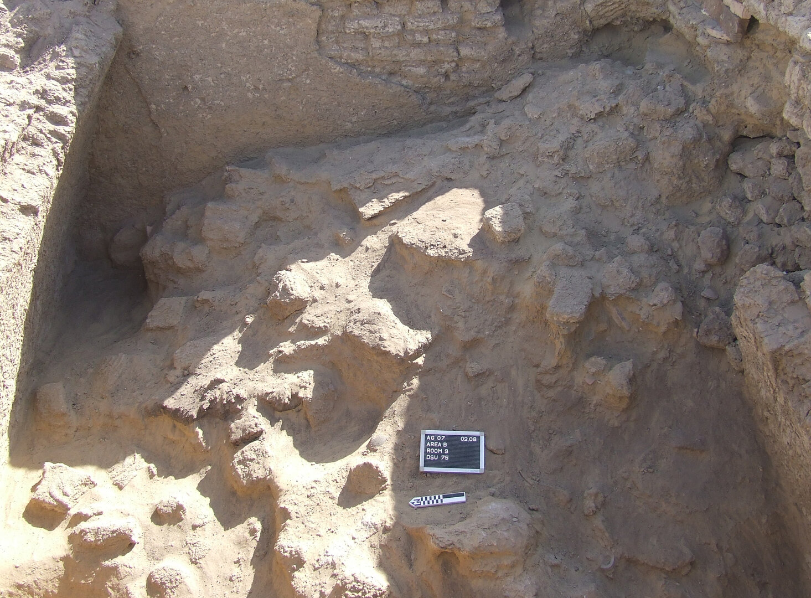{#plt-3.73}

## Notes

[^1]: @bayoumi_1998 [pp. 57].
[^2]: The bricks used at ʿAin el-Gedida are slightly longer (an average of 2 cm) than those given as standard samples by Badawy (on the basis of bricks from Djeme and Tell Edfu): see @badawy_1978 [pp. 109-111]. On mud bricks used in a Roman house at Amheida (also in Dakhla), see chapter 5 in @boozer_2015. General resources on mud bricks and mud-brick architecture in ancient Egypt are @spencer_1979 and, more recently, @emery_2011.
[^3]: Traces of the vault are visible along the north side (from west to east: BF64, BF53, and BF59) and along the south side (from west to east: BF46 and BF43).
[^4]: From east to west, not including the apse: BF42; BF44; BF45.
[^5]: In fact, the sectors of the north wall become four with the construction of the mud-brick plug sealing the central doorway. These features are (from east to west): BF58; BF57; BF55; BF52.
[^6]: In order to clarify the building history of the west wall of both rooms B5 and A46, further investigation is needed to the west of the church complex.
[^7]: A similar ledge is in the east wall of room A46 to the north. High horizontal sills were noticed in several other buildings of area A (mound I). They do not seem to have had a structural function within the wall and they may have been used as shelves, although some of the sills are at a considerable height and not easily accessible. In the Large East Church at Kellis, niches were set into the north wall (possibly also in the south wall, now less well preserved) at the height of 2.7 m above floor level, raising questions on their function considering their difficult accessibility: see @bowen_2002a [pp. 67-70].
[^8]: Upper elevation: 113.434 m.
[^9]: The decoration is almost completely missing, possibly the result of defacing.
[^10]: As podium BF66 is also visible (although partially) in room A46, which was investigated as part of area A, the feature was also assigned a matching number for area A (i.e., AF76, for reasons concerning compatibility with database standards).
<!-- TODO: CHECK GROSSMAN CITATION -->
[^11]: Kaper (personal communication, February 2006). See @grossmann_2002b [pp. 153].
<!-- TODO: CHECK ARAVECCHIA CITATION -->
[^12]: @bowen_2002a [pp. 73]. The foundations of a feature that is suggestive of a podium/pulpit, because of its proximity to the area of the apse and its placement against a column, were found in a recently excavated church at Amheida: see @aravecchia_2015a [pp. 122]. Possible similarities were established between the feature in the Amheida church and the pulpit in the church of Shams ed-Din, located in the Kharga Oasis. For a plan of the latter church, see @bonnet_2004 [pp. 84] (fig. 69).
[^13]: Except for a small missing portion near the southwestern corner of the church.
[^14]: Upper elevation of BF67: 113.110.
<!-- TODO: Added "in print edition" below—how to handle print page references? -->
[^15]: See @sec-10.4-inscriptions of this volume (pp. 532-33 in print edition). 
[^16]: Upper elevation: 114.699 m; lower elevation: 114.289 m; max. thickness: 41 cm.
[^17]: Upper elevation: 114.574 m; lower elevation: 112.964 m; max. thickness: 161 cm.
[^18]: Lower elevation: 113.330 m; max. thickness: ca. 50 cm.
[^19]: Upper elevation: 113.629 m; lower elevation: 113.354 m; max. thickness: 28 cm.
[^20]: Upper elevation: 113.024 m; lower elevation: 112.964 m; average height: 6 cm. DSU25 was originally distinguished as a separate unit, but its removal revealed that it was in fact a lens of material belonging to DSU20.
[^21]: Upper elevation: 113.354 m. Because of the extreme, cement-like hardness of the unit, only the visible objects found within it were carefully detached, but the unit was not fully removed.
[^22]: Upper elevation: 113.380 m; lower elevation: 112.810 m; max. thickness: 57 cm.
[^23]: Upper elevation: 113.330 m; lower elevation: 113.020 m; max. thickness: 31 cm.
[^24]: Based on this, it is not impossible that some of the rooms, whose relics were incorporated into the apsidal church in the fourth century, were originally built in the third century. However, comparative evidence from the churches of Kellis suggests the possibility of an alternative explanation for the presence of third-century coins within the stratigraphy of a fourth-century church: cf. @sec-7.1-issues below.
[^25]: Upper elevation: 113.060 m; lower elevation: 112.700 m; max. thickness: 36 cm.
[^26]: It is true, however, that comparative evidence for wooden screens (*cancelli*) in early fourth-century churches is lacking at the moment. On screens in Egyptian churches and their significance, see @bolman_2006.
[^27]: Upper elevation: 114.280 m; lower elevation: 113.350 m; max. thickness: 50 cm.
[^28]: Upper elevation: 113.740 m; lower elevation: 113.030 m; max. thickness in the middle of the room: 20 cm.
[^29]: Upper elevation: 113.530 m; lower elevation: 113.120 m; max. thickness: 41 cm.
[^30]: Upper elevation: 113.560 m; lower elevation: 113.180 m; max. thickness: 38 cm.
[^31]: Upper elevation: 113.400 m; lower elevation: 113.180 m; max. thickness: 22 cm.
[^32]: See @sec-10.3-ostraka below (cat. no. 11).
[^33]: Upper elevation: 113.540 m; lower elevation: 113.000 m; max. thickness: 10 cm.
[^34]: Upper elevation: 113.120 m; lower elevation: 113.050 m; max. thickness: 10 cm.
[^35]: Upper elevation: 113.200 m; lower elevation: 113.050 m; average thickness: 15 cm.
[^36]: Upper elevation: 113.050 m; lower elevation: 112.400 m; max. thickness: 32 cm.
[^37]: In 2007, surface sand (DSU38) was removed from two small test trenches excavated in passageway B11 against the south wall of the church, in order to clarify the relationship of different architectural features. In 2008, the passageway was fully investigated.
[^38]: Upper elevation: 112.890 m; lower elevation: 112.400 m.
[^39]: Upper elevation: 112.900 m; lower elevation: 112.670 m.
[^40]: Upper elevation: 112.940 m; lower elevation: 112.840 m (width between the benches: ca. 30 cm).
[^41]: This will be the subject of @sec-5.1-development below.
[^42]: No information on the stratigraphy or the finds of the room is available.
[^43]: = BF78 (room B5).
[^44]: Other remains of the original vaulted roof (i.e., AF73 and AF78) were found along the south boundary of the room (walls AF71, AF72, and AF77).
[^45]: 17 cm.
[^46]: = BF52 (room B5).
[^47]: = BF57 (room B5).
[^48]: = BF58 (room B5).
[^49]: = BF55 (room B5).
[^50]: With the exception of its bottom.
<!-- TODO: Crossreference to footnotes? -->
[^51]: = BF47 (room B5). See footnote 5 in this section.
[^52]: The part of the facing corresponding to the west wall of room A46 is preserved to a considerable height, but was found in a poor state of conservation, with a large crack running vertically throughout its height and threatening the stability of the feature. To avoid further damage, the room was completely backfilled with clean sand after full documentation.
[^53]: Up to ca. thirty-five: see @sec-5.2-patterns below.
[^54]: = BF66 (room B5).
[^55]: Upper elevation: 112.869 m.
[^56]: The fill of these three units, consisting of loamy sand with rare inclusions of mud-brick debris, lime spots, ash, and pebbles, was removed as DSU2 (area A).
[^57]: Upper elevation: 112.870 m; lower elevation: 112.590 m.
[^58]: Upper elevation: 112.750 m; lower elevation: 112.610 m.
[^59]: Upper elevation: 112.970 m; lower elevation: 112.650 m.
[^60]: A hole was found (diameter: ca. 25 cm), at ground level, at the west end of BF77 (the south wall of corridor B7), but its exact function and relation to the placement of a wooden doorway is uncertain.
[^61]: Upper elevation: 112.980 m.
[^62]: See @sec-10.4-inscriptions of this volume (pp. 531–32 in print edition).
[^63]: For a more extensive discussion, see @sec-5.1-development below.
[^64]: Upper elevation: 115.150 m; lower elevation: 114.210 m; max. thickness: 94 cm.
[^65]: Upper elevation: 115.410 m; lower elevation: 114.130 m; max. thickness: 128 cm.
[^66]: Upper elevation: 114.830 m; lower elevation: 113.590 m; max. thickness: 124 cm.
[^67]: Upper elevation: 114.110 m; lower elevation: 113.260 m; max. thickness: 85 cm.
[^68]: Upper elevation: 114.300 m; lower elevation: 113.600 m; max. thickness: 70 cm.
[^69]: Upper elevation: 113.600 m; lower elevation: 113.020 m; max. thickness: 58 cm.
[^70]: Upper elevation: 113.020 m; lower elevation: 112.810 m; max. thickness: 21 cm.
[^71]: Upper elevation: 113.130 m; lower elevation: 112.830 m; max. thickness: 30 cm.
[^72]: Upper elevation: 112.900 m; lower elevation: 112.460 m; max. thickness: 44 cm.
[^73]: Upper elevation: 114.740 m; lower elevation: 112.970 m; max. thickness: 177 cm.
[^74]: Upper elevation: 113.170 m.
[^75]: Width of the trench: ca. 40 cm; upper elevation: 113.400 m; lower elevation: 113.080 m.
[^76]: And continuing across room B5, still below floor level, as BF68.
[^77]: Upper elevation: 115.510 m; lower elevation: 114.840 m.
[^78]: Upper elevation: 115.370 m; lower elevation: 113.160 m.
[^79]: Upper elevation: 113.370 m; lower elevation (taken above bedrock in a trench, 50 by 50 cm, excavated in the northwest corner of the corridor): 112.600 m; max. thickness: 40 cm.
[^80]: Except for the two highest steps, which are larger and consist of five headers.
[^81]: Upper elevation: 113.450 m.
[^82]: See section @sec-4-b10.
[^83]: Discussed at length below (@sec-3-b9).
[^84]: See section @sec-3-b9 below.
[^85]: Upper elevation: 116.160 m; lower elevation: 115.470 m; max. thickness: 69 cm.
[^86]: Upper elevation: 115.840 m; lower elevation: 115.720 m; max. thickness: 12 cm.
[^87]: Upper elevation: 115.720 m; lower elevation: 115.410 m; max. thickness: 31 cm.
[^88]: Upper elevation: 115.610 m; lower elevation: 115.010 m; max. thickness: 60 cm.
[^89]: Upper elevation: 115.280 m; lower elevation: 113.480 m; max. thickness: 150 cm (in the east part of the room).
[^90]: Upper elevation: 115.280 m; lower elevation: 114.950 m; max. thickness: 33 cm.
[^91]: DSU51 roughly shares the same composition as DSU44.
[^92]: Upper elevation: 114.730 m; lower elevation: 113.740 m; max. thickness: ca. 100 cm.
[^93]: Upper elevation: 113.710 m; lower elevation: 113.370 m; max. thickness: 20 cm.
[^94]: Upper elevation: 114.840 m; lower elevation: 113.570 m; max. thickness: 55 cm.
[^95]: And seemingly functioning as a thick stub.
[^96]: The remains of the vault are BF93 above north wall BF98 and BF94 above south wall BF106.
[^97]: The feature, which was found partially disconnected from the vault spring on which it rested, was removed for safety reasons.
[^98]: Upper elevation: 113.300 m.
[^99]: The lower part of this feature consists of wall BF95.
[^100]: The lintel of this feature, as visible in @plt-3.70, @plt-3.71, is the result of modern restoration and consolidation of room 9’s south boundary.
[^101]: However, it was not possible to verify the architectural relationship between the razed wall and the west wall of room B6.
[^102]: Upper elevation: 115.690 m; lower elevation: 115.290 m; max. thickness: 20 cm.
[^103]: Upper elevation: 116.010 m; lower elevation: 115.450 m; max. thickness: 50 cm.
[^104]: Upper elevation: 115.450 m; lower elevation: 114.610 m; max. thickness: 35 cm.
[^105]: Upper elevation: 115.060 m; lower elevation: 113.150 m; max. thickness: 165 cm.
[^106]: Upper elevation: 115.600 m; lower elevation: 113.160 m; max. thickness: 213 cm.
[^107]: Upper elevation: 113.860 m; lower elevation: 113.050 m; average thickness: 5 cm.
[^108]: Upper elevation: 113.400 m; lower elevation: 113.170 m; max. thickness: 15 cm.
[^109]: Upper elevation: 115.480 m; lower elevation: 115.360 m; max. thickness: 10 cm.
[^110]: Upper elevation: 115.360 m; lower elevation: 114.910 m; max. thickness: 45 cm.
[^111]: Upper elevation: 115.070 m; lower elevation: 114.840 m; max. thickness: 23 cm.
[^112]: Upper elevation: 115.780 m; lower elevation: 115.390 m; max. thickness: 15 cm.
[^113]: Upper elevation: 115.640 m; lower elevation: 115.090 m; max. thickness (of the excavated part): 35 cm.
