# Excavations Outside the Church Complex {#sec-chapter-4}

In 2007, and especially in 2008, in-depth archaeological investigation was carried out in the area immediately to the west, south, and east of the church complex. The main goal was to ascertain the topographical relationship of the church complex with the surrounding buildings, within the urban fabric of the main mound of ʿAin el-Gedida.

## Room B10 {#sec-4-b10}

#### Features

Room B10 is a rectangular mud-brick room, located to the west of rooms B6 and B8 and to the south of B9 (@plt-3.2, @plt-4.1, @plt-4.2)

It is built against the outer west wall of the church complex, but is not connected to it. Room B10 measures ca. 5.70 m from north to south and 3.80 m from east to west and is preserved to a maximum height of ca. 4.50 m along the east wall (BF103).

A north–south oriented barrel vault originally covered the room; substantial remains of both vault springs (BF101 and BF97) are still visible on the east and west walls. All walls are mud-plastered, as was the vault; their upper part is of a dark gray color, probably caused by cooking activities carried out inside the room. Four doorways originally opened onto room B10. One (BF120; width: 74 cm) was located near the west end of north wall BF106, but was later bricked in and plastered over (BF120). Two other doorways (BF113 and BF114), with an average width of 70 cm, are set along the west wall of the room and once led into spaces that were not objects of investigation. Both openings were found in extremely poor condition and modern wood lintels had to be placed in order to avoid the collapse of features. A fourth and larger (1.2 m wide) doorway (BF112), framed along its east side by a thick mud-brick stub, is located at the west end of south wall BF104 and opens onto an unexcavated area. None of the four doorways has preserved lintels (or clear sockets where these would have once been placed), so that their original height is very difficult to reconstruct.

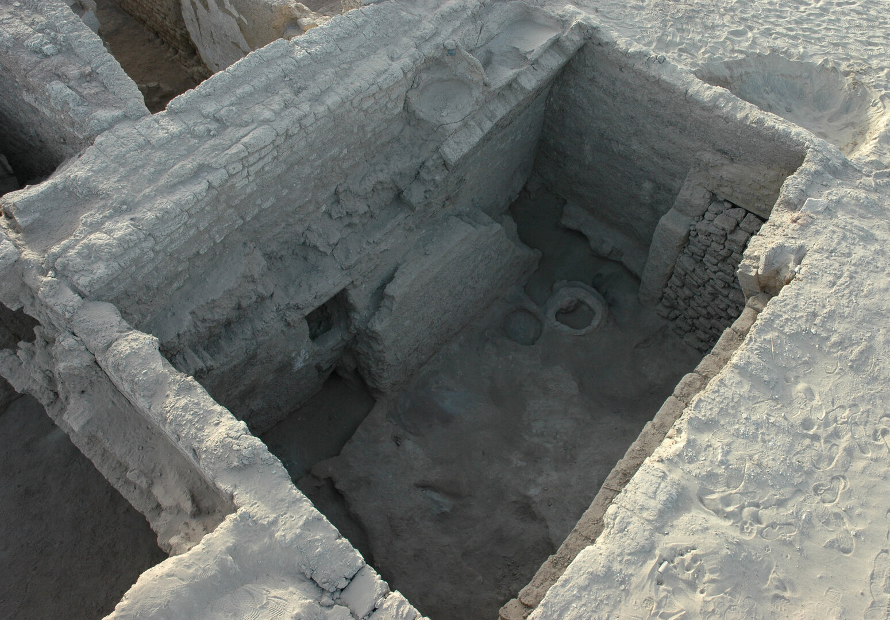{#plt-4.1 fig-alt="Aerial view of room B10 (to SE)."}

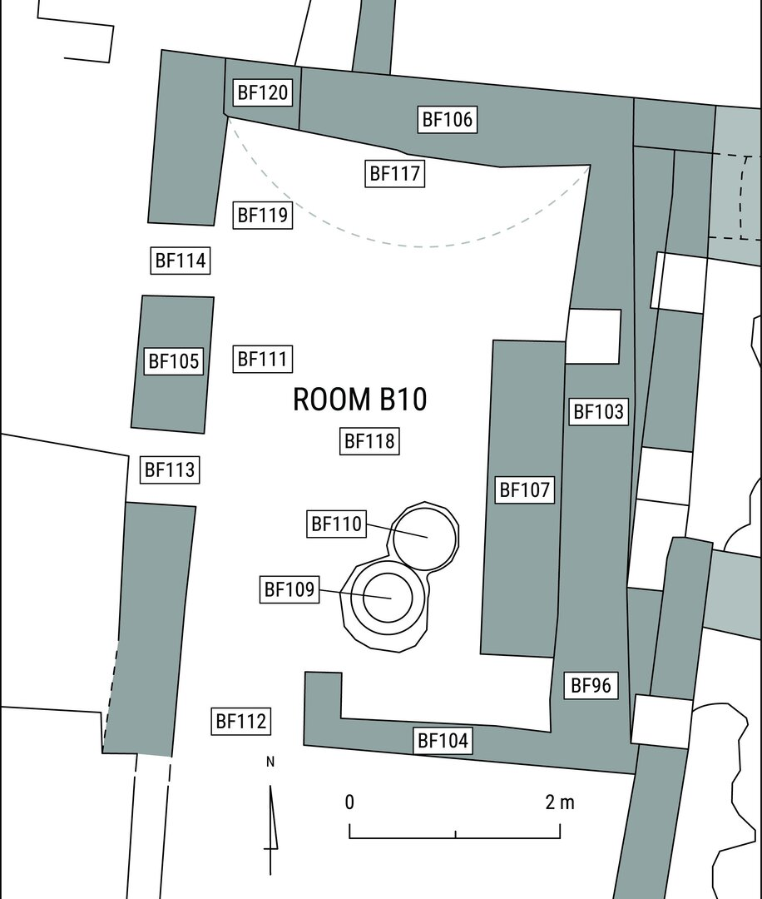{#plt-4.2 fig-alt="Plan of room B10."}

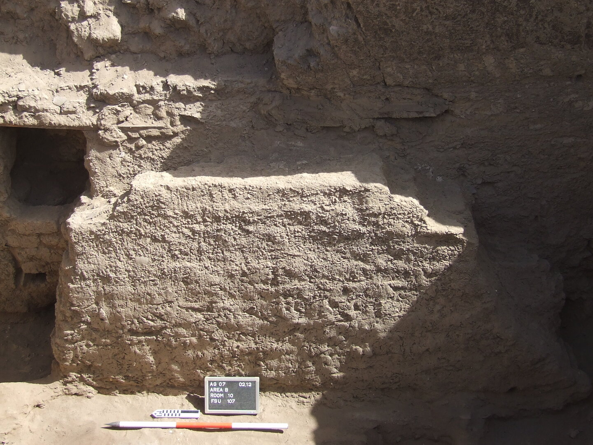{#plt-4.3 fig-alt="View of retaining wall along the east side of room B10."}

Considerable traces of ancient damage are visible especially along the east wall. Indeed, a roughly trapezoidal mud-brick buttress (BF107), measuring 3.03 m north–south by 0.35 m east–west, and standing to a maximum height of 1.40 m, was uncovered against it, likely built to support the wall after a rather poor restoration (@plt-4.3).

Two rectangular niches were originally set into the east wall. The southern one was bricked in at some point and almost completely hidden by the mud-brick buttress, apart from the stone lintel. The northern niche is still visible, at a height of ca. 80 cm above ground level.[^1] It is 52 cm wide, 57 cm high, and its depth is 48 cm; its bottom part was subject to heavy damage in antiquity and later restoration. The niche, as well as the wall, is covered by a thick layer of mud plaster; traces of a white gypsum band, ca. 30 cm thick, can be seen on both sides of the niche, although it is likely that it originally marked the upper and lower edges, too.

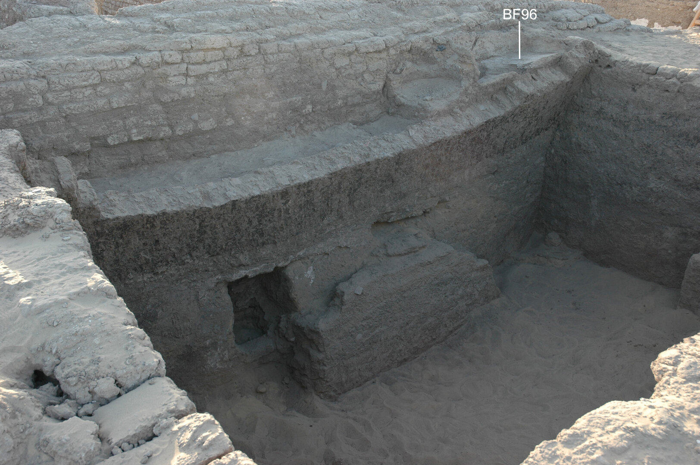{#plt-4.4 fig-alt="View of BF96 (clay basin) and imprint of circular feature on the roof of room B10 (to SE)."}

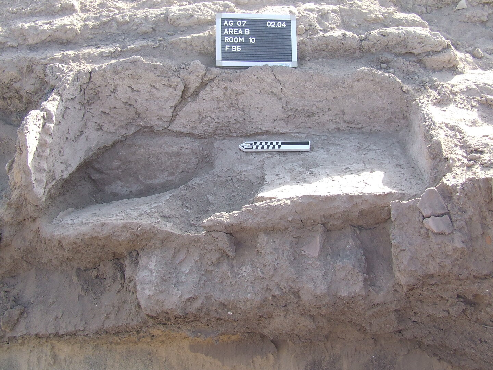{#plt-4.5 fig-alt="Detail of clay basin (*hawasel*) above the east vault spring of room B10."}

Evidence of at least three different floors[^2] of compacted mud was found above gebel, together with remains of a north–south wall at foundation level (BF119) running along the northern end of the west wall. A hearth (BF109; diameter: ca. 45 cm) lies in good condition in the southern half of the room, to the southwest of a circular, shallow pit (BF110) with a diameter of about 60 cm.[^3] The large amount of pottery fragments, the few complete or almost complete vessels collected above floor level throughout the room, and the evidence of the hearth allowed the identification of this room as a kitchen. Above the east vault spring of room B10, but accessible only from room B6 in the church complex via staircase B8, lies a rectangular storage bin (BF96) made of clay (called hawasel in Arabic), measuring 66 by 49 by 126 cm (@plt-4.4, @plt-4.5). Another clay feature, of a circular shape and measuring 55 cm in diameter, was once attached to the north side of the hawasel.[^4] As mentioned above, the function of the rectangular bin, and possibly of the circular feature, is likely related to the storage of food. Therefore, the roof of room B10 is not only architecturally connected to the anteroom/kitchen of the church complex (room B6), but also seems functionally linked to it. The fact that people inside the church complex were allowed to freely access and use the vaulted roof of room B10 suggests that the latter was not owned by a private villager or a family.[^5] Indeed, it seems likely that no private or family property rights were associated with this particular space.

Room B10 went through several construction phases. The razed wall running from north to south was found below the earliest floor level and is therefore to be linked to an earlier building. The middle floor seems to have been used when the northern doorway was still open; after it was blocked, a third floor was laid, in phase with the three other doorways but preceding the damage that occurred to the east wall of the room and its restoration.

#### Stratigraphy (@plt-4.6)

Room B10 was filled with a surface layer of windblown sand that was excavated in two different units, one (DSU62)[^6] above the remains of the vault springing from the east wall, and the other (DSU65)[^7] in the area to the west of these remains. Both units contained mud-brick debris, mud dust, pebbles, cobbles, and potsherds (3.75 kg in DSU62 and 0.47 kg in DSU65), with a decreasing density of inclusions in the lower levels. The clay rectangular bin that was revealed above the east half of the vault by the removal of DSU62 had a fill (DSU64)[^8] of sand mixed with organic inclusions (seeds, charcoal) and including some potsherds (0.6 kg) and a limited amount of mud-brick debris. The wedge between the east wall of the room and the eastern half of the vault, which had collapsed, was filled with a unit (DSU73)[^9] of mud-brick debris, mud-dust, potsherds (5.01 kg), and organic material. The investigation of this layer brought to light a complete bowl (inv. 570), whose surface is completely burnt, suggesting that it was used as a cooking pot.

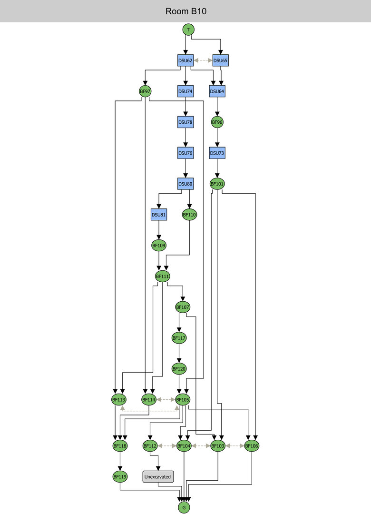{#plt-4.6 fig-alt="Pl. 4.6: Matrix of room B10."}

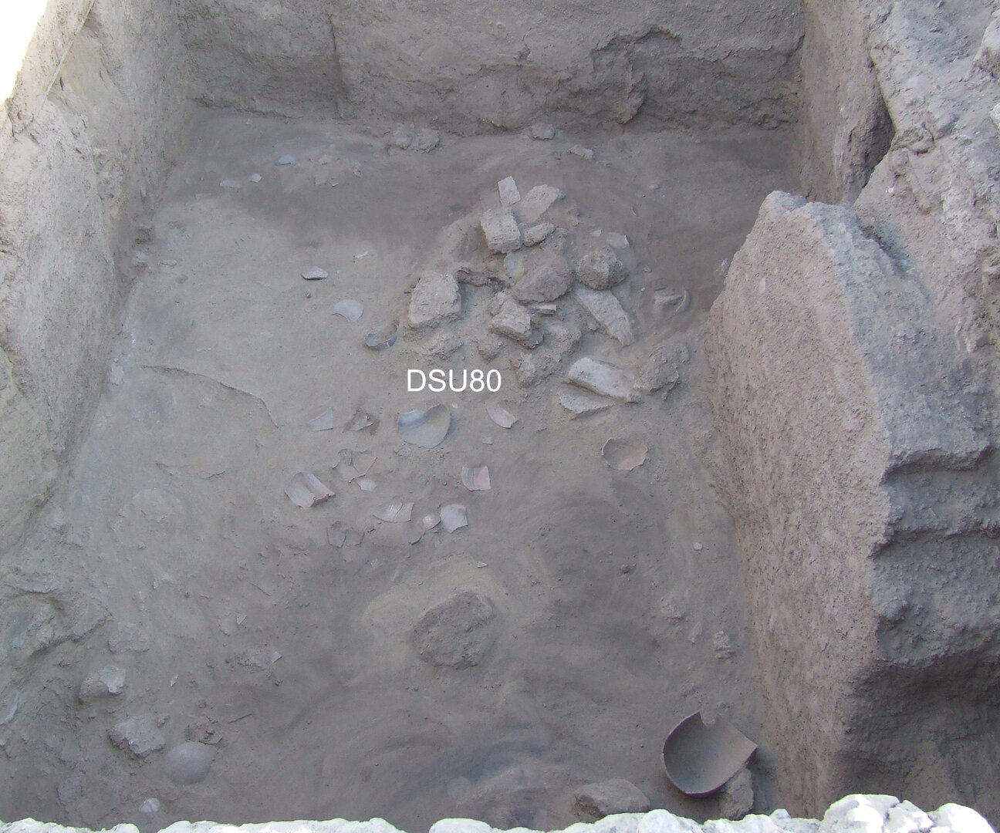{#plt-4.7 fig-alt="Pl. 4.7: View of occupational level (DSU/80) in room B10 (to N)."}

Underneath the surface layer of windblown sand, two isolated collapse episodes were identified. One (DSU74)[^10] was located in the middle of the room and originated from the collapse of the central part of the vault. It consisted for the most part of decayed mud bricks, mud dust, organic particles, and some ceramic fragments (1.18 kg). The second collapse unit (DSU78)[^11] was found against the northwestern corner. It included two large clusters of mud bricks, which rested on a thin layer of compact mud dust, several potsherds (4.74 kg), occasional wood, and some animal bones. The deposit was possibly the result of the collapse of part of the north wall. The removal of these two units and of the surface layer (DSU62), in the areas not covered by wall or vault collapse, revealed a deposit of relatively clean sand (DSU76)[^12] with ceramic inclusions (5.11 kg), especially at its lower end. A bronze coin of Constantius II (inv. 589), dated to the years 351–361, was gathered within this unit. Furthermore, three matching pieces of a globular cooking pot (inv. 569), with traces of burning along the rim and in the lower half of its body, were found in the middle of the room.

Underneath DSU76, the occupational level of the kitchen was identified above the latest floor (and directly above bedrock—cutting through earlier floor levels—along the north and east walls) (DSU80; Pl. 4.7).[^13] This unit consisted of packed soil and sand mixed with organic material (wood and bones), a few mud bricks (especially toward its northern end), rare glass
 and iron slag, a rather large amount of potsherds (10.07 kg), and fragmentary or complete ceramic vessels, including a complete globular flask (inv. 576), three matching fragments of an open-mouth jar (inv. 579), and an incomplete bowl with a flat-foot base, a restricted rim, and a body with scattered burning spots (inv. 571). Among the other objects that were brought to light within this unit were three wooden items, i.e., a complete spindle (inv. 573), a broken knob (inv. 588), and a fragmentary stopper (inv. 587); a complete oval lamp (inv. 578), with decorations molded on the top; a gypsum stopper (inv. 599); and a fragment of a bracelet made of black dull glass (inv. 594).

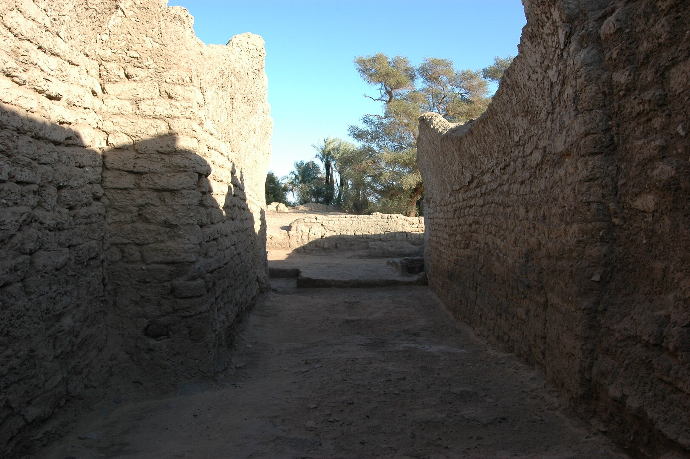{#plt-4.8 fig-alt="Pl. 4.8: View of passageway B11 (to E)."}

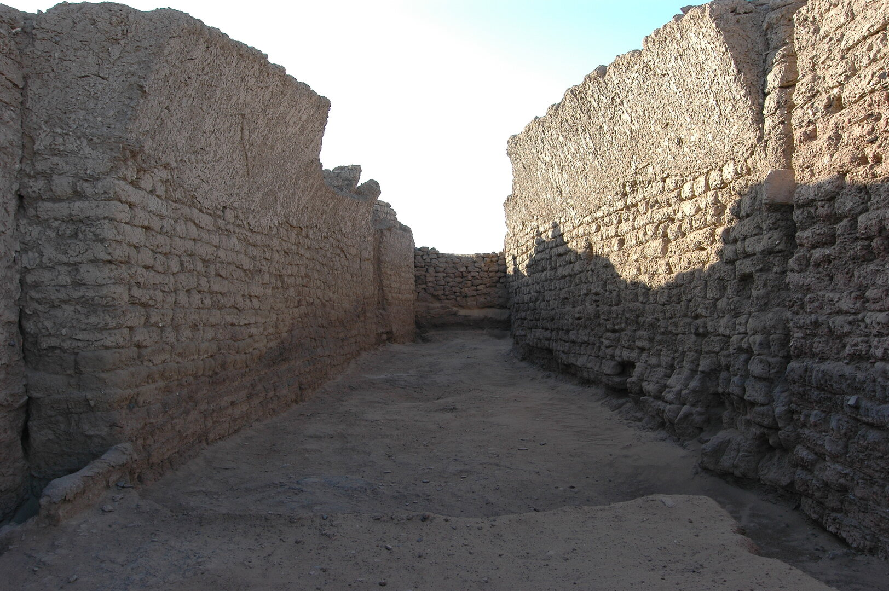{#plt-4.9 fig-alt="Pl. 4.9: View of passageway B11 (to W)."}

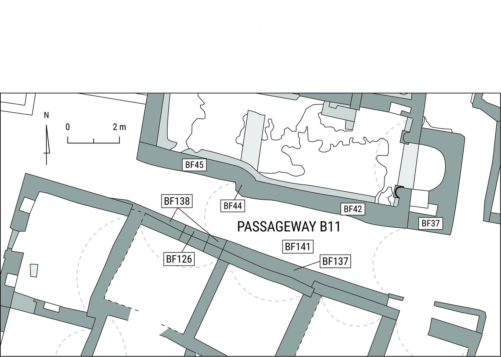{#plt-4.10 fig-alt="Pl. 4.10: Plan of passageway B11."}

Below DSU80 was the fill (DSU81)[^14] of the circular clay hearth (BF109) set near the southeastern corner of the room. It consisted of ash, a few lime spots, and a limited amount of potsherds (0.05 kg).

## Space B11

#### Features

B11 is a long, east–west oriented passageway that runs along the south wall of the church (B5) and the north edge of area A (Pls. 3.2; 4.8–10). It measures approximately 2.15 m north–south by 10.75 m east–west and has walls preserved to a maximum height of 2.09 m (at the western end of the south wall BF138).

The corridor is in a fairly good state of preservation, although bearing traces of damage caused by termites. Mud bricks were used for the construction of the walls, laid out in English bond with just a few anomalies in some courses. Three small holes were noticed along the east sector of the north wall and two along the east sector of the south wall; their origin and/or possible function was not ascertained beyond doubt. Signs of wear are visible along the north <pb n="152">wall, due either to natural erosion or to the friction caused by the passage of small carts. A floor (BF141)[^15] made of compacted mud, with several organic inclusions and small pottery fragments, was found in a fairly good state of conservation below layers of sand, organic deposits, and ash. It gently slopes down from west to east, where it intersects street B12 and courtyard B13. The presence of animal coprolites and signs of wear along corner walls suggest that the passageway was accessible not only to people but also to animals and carts.[^16]

The corridor was originally barrel-vaulted, as remains of vault springs are still extant.[^17] Although the remains of the actual vaults are scanty, the excavation of the corridor did not lead to the discovery of any substantial traces of vault collapse. It is possible that the vaults either collapsed or were removed in antiquity and that, at least in its latest phase, the corridor was used as an open-air passageway. Deposits of ash, broken pottery vessels, animal bones, and also animal coprolites suggest a continuity of usage for this space by men and animals, even after the removal/collapse of the vaulted roof.

The north wall of passageway B11 (BF42 + BF44 + BF45) is shared by the church (room B5) as its south wall. The construction episodes of the corridor are, therefore, closely linked to the architectural development of the church to the north. A deep examination of the walls, their foundations, and their mutual relations allowed the recognition of at least two different phases of construction (Pl. 4.11).

At a first stage, the corridor was of a shorter length, corresponding to the eastern sector of the entire passageway, i.e., it followed the north wall from its eastern end to the point where it suddenly regresses into the church (BF42 + BF44). This first corridor was covered with a barrel vault, which seems to have been built in phase with the vault springing over the eastern half of the church. When the area of the church was expanded to the west, by tearing down the west wall (BF68, which equals BF44) and adding a large section to the original space, the passageway to the south was also the object of extensive alterations. In particular, another section was added to the west (with BF45 as its north wall) and connected to the earlier corridor. It had a barrel-vaulted roof as well, but its orientation was not perfectly on axis with the vault covering the east half. The north wall of unexcavated room A16 (BF138) was incorporated into the passageway at this stage (as the western end of its southern side) and the doorway previously leading into that space was bricked in (BF126), shortly before the construction of the west vault.[^18]

The western addition is considerably wider than the original passageway at its western end and creates a rather irregular layout. This may result from the fact that the north and south walls of the earlier corridor are not parallel to each other, but slightly converging to the west. As a result, the passageway substantially narrows down westwards, so that a later addition would have created, if following the exact orientation of both the north and south walls, an excessively narrow space, not allowing the passage of animals and small carts. Therefore, the discontinuity and irregularity found in the layout of the corridor in its second phase, especially in the western half of the north wall, likely answered specific functional needs.<pb n="153">

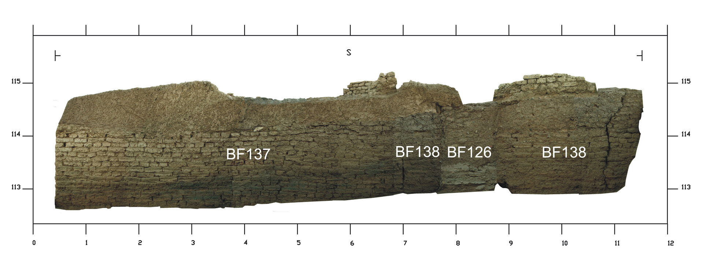{#plt-4.11 fig-alt="Pl. 4.11: Photogrammetric images of the walls of passageway B11."}

#### Stratigraphy (@plt-4.12)

The stratigraphy of room B11 revealed evidence of the collapse of architectural features associated with the passageway, like walls and the vaulted ceiling. Most deposits, however, consisted of refuse layers, rich in ash and organic materials, that were thrown and unevenly piled into the corridor, apparently not flattened prior to the creation of a new surface. It is possible that B11, as well as several other spaces in the area, like B12, B14, and B15, were used as domestic dumps in their latest occupational phases. With regard to room B11, the discovery, within these contexts, of several coins (possibly dropped at least in part by people walking through this space) and also animal coprolites suggests that this space continued to serve also as a passageway for humans and their animals.

The surface layer (DSU83)[^19] consisted of windblown sand, about 40 cm thick, and contained some potsherds (2.78 kg) and pebbles. Underneath, a sub-surface unit of soft brownish sand was revealed (DSU89),[^20] which covered the entire area of the corridor. The sand was mixed with some pottery sherds (2.07 kg), the majority of which were retrieved along the eastern half of the north wall, and contained one fragment of a glass vessel and a few animal bones. A few mud bricks were found in the southeastern corner of the room, right below surface. The removal of this deposit revealed DSU90,[^21] a context of soft brown sand containing a particularly large number of small, medium, and large ceramic fragments (125.87 kg), a few mud bricks (in the central part of the room), ash pockets, fragments of plaster and of glass vessels, glass slag, and a considerable amount and variety of organic inclusions, such as charcoal, wood fragments, animal hair, coprolites, and shells. Among the finds that were retrieved within this context are three dull glass beads, one light blue (inv. 662), one light green (inv. 664), and one turquoise, white, and red (inv. 1090); one piece of a bracelet made of black dull glass (inv. 649); one diagnostic fragment of a glass jug (inv. 1204); two joining fragments of a bent bronze wire (inv. 1089); and one fragment of a circular ceramic lamp (inv. 1006). Ten bronze coins (inv. 667, 674–77, 679, 682, 692, 694–95) were also found, mostly in poor condition; three of them could be dated to a short time range (inv. 667, dated to 383–392, inv. 676, dated to 364–378, and inv. 692, dated to 330–335), while one (inv. 694) was broadly assigned to the fourth century on the basis of size and weight. The remaining specimens could not be dated.

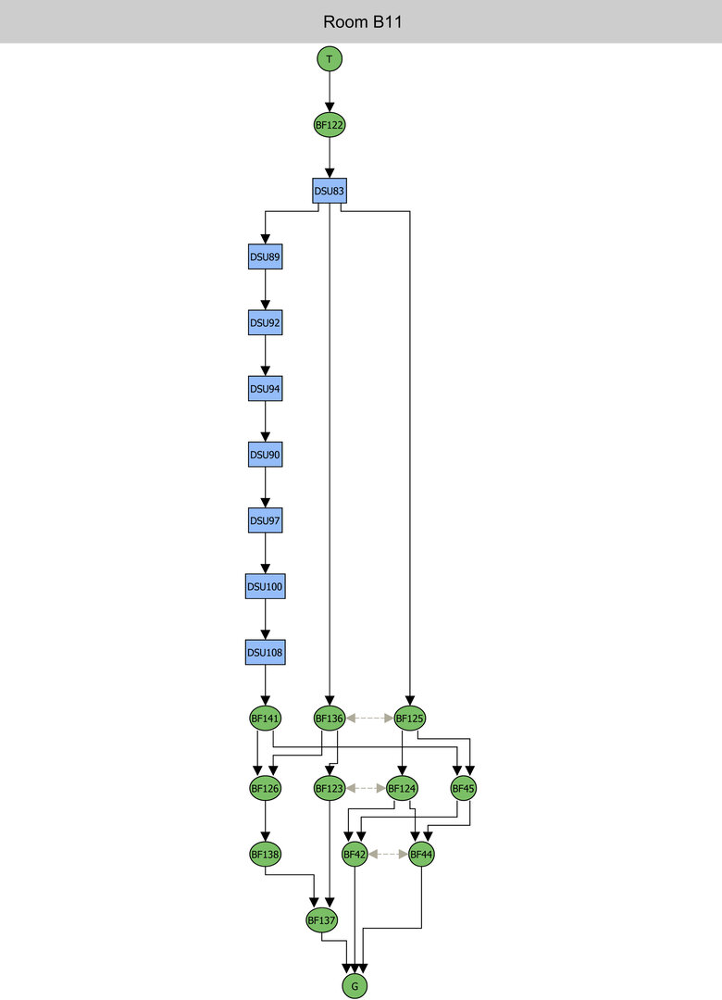{#plt-4.12 fig-alt="Pl. 4.12: Matrix of passageway B11."}

In the area between vaulted passageway B11 and courtyard B13, the removal of the subsurface layer revealed a wall collapse unit (DSU92),[^22] consisting of a larger mound against the eastern end of the north wall and a smaller pile to the south. The collapse included mud-brick debris, mud dust mixed with sand, several potsherds (4.02 kg), rare plaster, glass slag, and bones. DSU92 rested above a layer of ash (DSU94),[^23] which contained several potsherds (26.37 kg), organic inclusions (mostly wood and bones), a few pieces of bronze, glass slag, a lenticular bead of dull blue glass (inv. 661), part of an iron nail (inv. 1088), and fragments of glass vessels (two diagnostic fragments of glass bowls were assigned inventory numbers 663 and 817). The deposit abutted the eastern end of the north wall of the passageway and also extended eastwards into courtyard B13. Within it, the unit was particularly rich in organic material, potsherds, and small finds.

Three superimposed units of ash and soil were removed in the central part of the passageway, against its south wall. The upper layer (DSU97; Pl. 4.13),[^24] found below sub-surface, consisted of soft but compact ash, mixed with soil and containing potsherds (20.99 kg), rare glass slag, three fragments of glass vessels, one small piece of iron, and abundant organic material (charcoal, vegetable fibers, few animal bones, animal hair). The excavation of this unit brought to light also one fragment of a bracelet made of dull black glass (inv. 833), three incomplete ropes of vegetal fibers (inv. 836–838), and two poorly preserved bronze coins; one (inv. 673) was broadly assigned to the fourth century, on the basis of size and weight, while the other (inv. 671) could not be dated. Furthermore, three matching fragments of an almost complete Greek ostrakon (inv. 660) were found, consisting of an order or receipt for wheat and dated to ca. 330–390. The chronology is in line with the tentative dating of the (rather limited) numismatic evidence gathered within this context.

Underneath DSU97 was a layer of brown soil (DSU100)[^25] with pockets of ash, especially in the area along the south wall. This deposit contained fragments of glass vessels (one of which had a diagnostic value and was assigned inventory number 818), several potsherds (12.12 kg), and organic inclusions; among the latter were date pits, vegetable fibers, charcoal, wood, and coprolites.

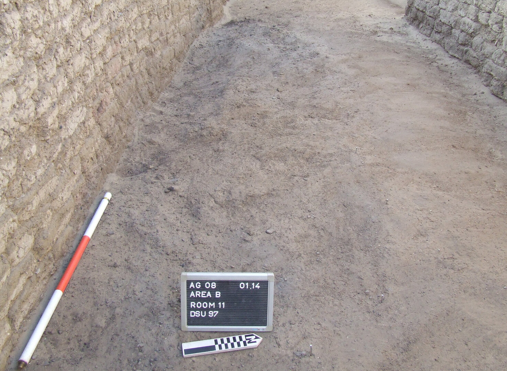{#plt-4.13 fig-alt="Pl. 4.13: Detail of DSU97 in passageway B11 (view to W)."}

The lowest of the three units was DSU108,[^26] a layer of compact brown soil and ash mixed with a very large amount of organic material (such as charcoal, plant fibers, coprolites, wood, seeds, bones), potsherds (19.97 kg), fragments of glass vessels (with one diagnostic piece, inv. 1209), one small piece of iron, two small fragments of bracelets of dull black glass (inv. 842 and 843), and four fragments of sandstone blocks. Two poorly preserved coins (inv. 680 and 803) were also gathered during the excavation of this context but could not be dated. DSU108, as well as DSU90 mentioned above, rested on the scanty remains of a compacted clay floor (BF141) in which a bronze coin, inv. 684, dated to 320–321, was found; where the floor was missing, the two units lay directly on bedrock.

## Space B12 {#sec-4.3}

#### Features

B12 is a long north–south oriented street, running to the east of the church complex (@plt-3.2, @plt-4.14, @plt-4.15, @plt-4.16). It measures approximately 14.75 m north–south by 2.00 m east–west (max. width) and has walls preserved to a maximum height of ca. 1.90 m (west wall of the middle segment).

The street has an irregular layout that results from the different construction phases of the buildings whose walls define its outline. Indeed, three different sectors, all running north–south and joined among them, can be identified. The northernmost measures ca. 4.80 m north–south by 1.80 m east–west and stretches from the eastern end of corridor B7 to another east–west passageway (B16) to the north. The west and east walls, relatively well preserved, separate this sector from unexcavated rooms, so that only their sides facing street B12 are known. The east wall consists in fact of a longer segment to the south (BF129) and a smaller addition (BF160) toward the north end, which rests on two foundation courses running also beneath the longer segment to the south. While the latter does not bear traces of mud plaster, the addition to the north is almost completely obscured by a thick layer. The west wall of the street’s north sector is BF146; it runs north–south and is perpendicular to BF76, the north boundary of room B7 (the corridor leading into the church complex).

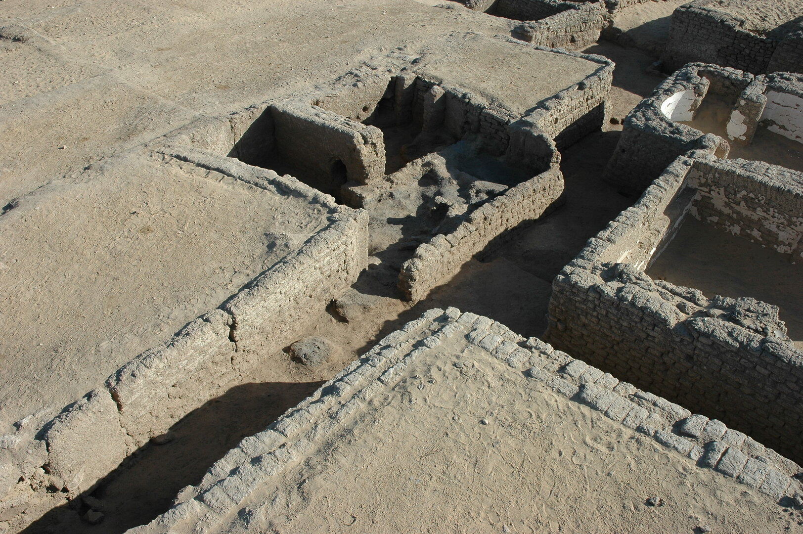{#plt-4.14 fig-alt="Aerial view of street B12 (to SE)."}

<pb n="158">

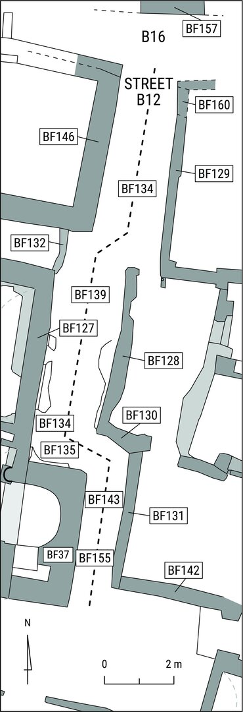{#plt-4.16 fig-alt="Plan of street B12."}

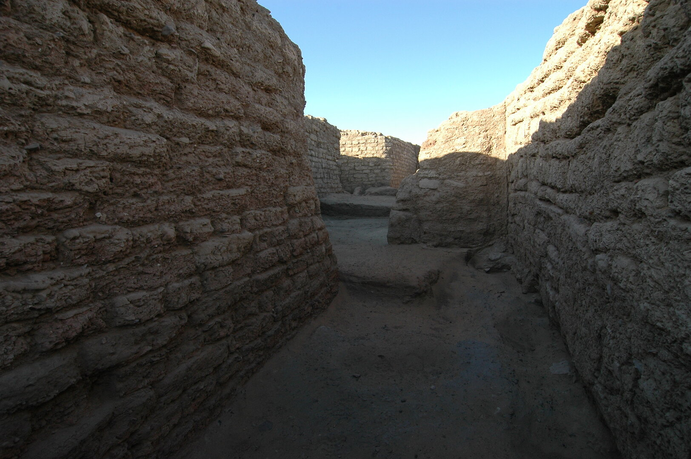{#plt-4.15 fig-alt="View of street B12 (to N)."}

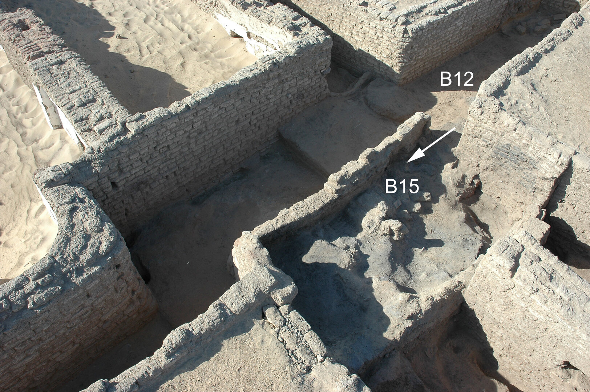{#plt-4.17 fig-alt="Opening between rooms B12 and B15 (aerial view to NW)."}

The central sector of the street measures ca. 6.80 m north–south by 2.00 m east–west; it lies to the east of the entrance to the church complex (corridor B7) and of room A46, extending southward to the north side of the apse of room B5. The west wall is also the east wall of room A46 (BF127 = AF71); to the east, a poorly preserved north–south wall (BF128) is bonded, at its south end, with a much shorter partition (BF130), running from northwest to southeast and roughly following the line of the apse. Both the north and south segments of the east wall were seemingly built at the same time or after the addition of the apse to room B5 and are closely linked to the construction of room B15, of which they form the west side.[^27] A narrow doorway opens from room B15 onto street B12 across from the entrance into the church complex (@plt-4.17). It was originally closed with a door, as testified to by the presence of a socket in room B15. However, at a later stage the door was no longer in place; it is not clear if the opening was still used at that time, although without a door, or if it became inaccessible.

The third sector, whose dimensions are ca. 3.20 m north–south by 1.15 m east–west, runs alpong the east side of the church and ends to the south into room B13 (@plt-4.18). The west wall is shared with the apse of room B5 (BF37), of which it forms the east face; the east wall (BF131), abutted by the north wall of room B13 (BF142), is later than the construction of the apse, as its foundations cut through two floors abutting the apse itself.

The excavation of street B12 revealed substantial traces of different floor levels. Two test trenches were excavated in the central sector of the street, one (ca. 100 cm north–south by 50 cm east–west) against the west wall of room B15 and another (ca. 100 by 100 cm) against the north wall of the apse (@plt-4.19). These trenches exposed the relationships between the different floor levels of street B12 and the surrounding walls. In the north sector of the street (and parts of the central sector), the highest floor level (BF134)[^28] was identified (@plt-4.20). Two other floor levels were identified in the central sector of B12: BF139[^29] and BF135.[^30] Excavations in the southern sector of the street revealed patches of two floor levels: BF143[^31] and BF155.[^32] All these levels consist of packed silty mud rich in organic material and small potsherds. The poor condition of the evidence and its scattered nature make the assignment of each patch to a particular street level very difficult. The use of absolute elevations to correlate them is limited by the fact that the street gently slants down from north to south, following the natural slope of gebel underneath.

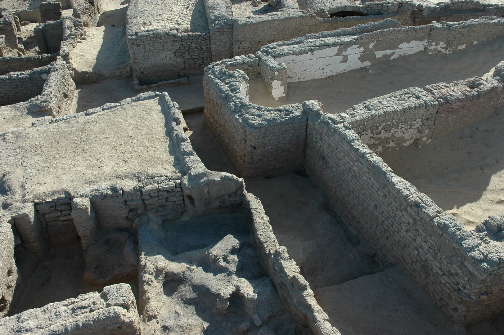{#plt-4.18 fig-alt="Aerial view of street B12 (to SW)."}

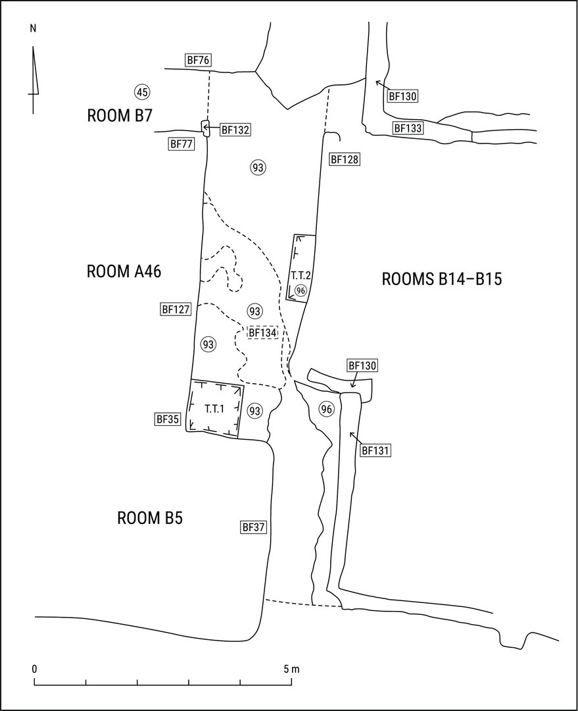{#plt-4.19 fig-alt="Plan of the central and southern sectors of street B12 with the location of test trenches."}

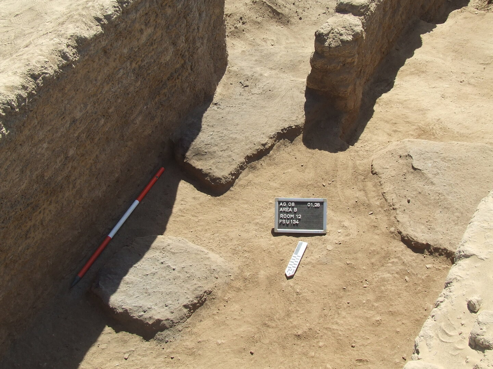{#plt-4.20 fig-alt="Patches of floor BF134 in the central sector of street B12 (aerial view to SE)."}

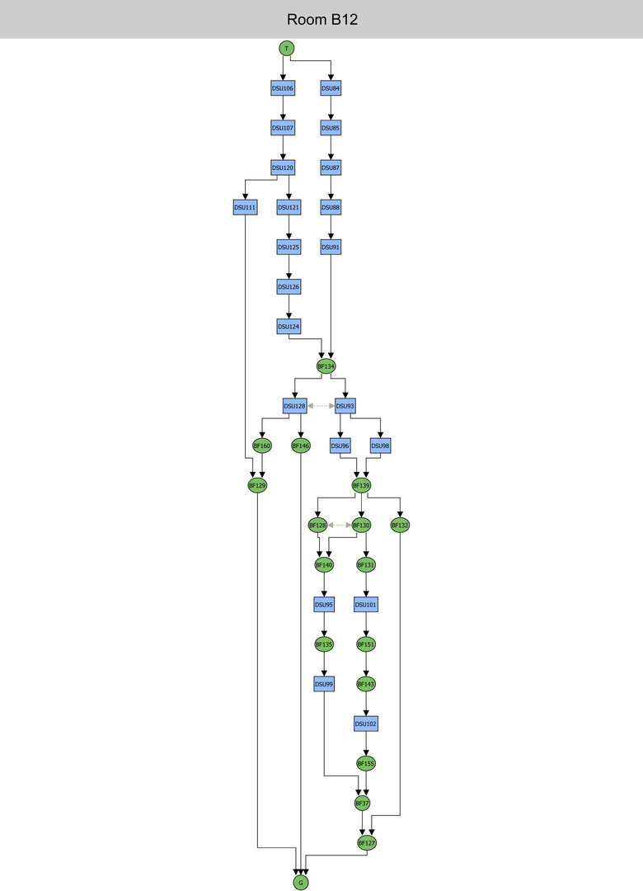{#plt-4.21 fig-alt="Matrix of street B12."}

#### Stratigraphy (@plt-4.21)

The surface of street B12 was covered by a thick layer of windblown sand mixed with mud dust (DSU84),[^33] which was also removed from rooms B14 and B15. This unit contained several pebbles, mud-brick debris, mud dust, lime spots, small potsherds (0.66 kg),[^34] and, within street B12, a diagnostic fragment of a green glass beaker (inv. 814). The excavation of this context revealed the full extent of a wall collapse unit (DSU85),[^35] whose remains were partly visible above ground level in the north part of the street. The mud bricks and mud-brick debris were mixed with some fragments of plaster and potsherds (1.21 kg). Underneath it, a deposit of windblown sand (DSU87)[^36] was identified, covering the entire area occupied by B12.[^37] Among the few inclusions were pebbles, charcoal, lime spots, some mud dust, and potsherds (0.99 kg). In the middle sector of the street, DSU87 rested on top of a collapse (DSU88)[^38] located along the west edge and that probably resulted from the partial crumbling of the east wall of room A46 (Pl. 4.22).[^39] Within this layer, which consisted of whole and fragmentary mud bricks, were pebbles, charcoal, rare glass slag, organic material (bones and date pits), and ceramic fragments (2.27 kg). This collapse lay over a unit (DSU91)[^40] of occupational debris, ash and other disposed organic material (like charcoal, bones, date pits), fragments of glass, glass slag, and numerous potsherds (16.34 kg). The unit extended into room B7, where it was excavated as DSU45. The excavation of DSU91 brought to light two fragments of bracelets of black dull glass (inv. 650 and 651), two glass beads (one white, inv. 811, and the other light green, inv. 1214), one fragment of a vessel made of aquamarine glass (inv. 813), and eight bronze coins minted in the fourth century. Of these, two (inv. 656 and 659) were dated to 364–378, one (inv. 653) to 351–361, and another (inv. 655) was dated to 355–403. A fifth coin (inv. 657) was broadly assigned to the fourth century, on the basis of size and weight. The remaining specimens (inv. 652, 654, and 658) could not be dated due to their poor condition.

As mentioned further above, several street levels, visible only in scattered patches, were identified within B12. They were all made of packed mud, with several potsherds and organic inclusions, and gently sloped from north to south. The highest street level (BF134) was investigated in the middle of the room. Its preparation layer (DSU93),[^41] consisting of packed mud dust, lenses of ash, pebbles, copious organic material (including palm fibers, hair, bones, charcoal), fragments of glass vessels, and potsherds (5.86 kg), was likely a refuse unit, which was leveled before the floor above was laid. Five bronze coins were found in this context, two of which (inv. 670 and 699) were dated to 364–378. The three remaining specimens (inv. 666, 672, and 696) could not be dated. DSU93 rested on the lower street level BF139, which had been laid out on top of a leveled unit (DSU95)[^42] very similar, in its content and inclusions, to DSU93 above. The removal of this context revealed a number of ceramic sherds (9.03 kg) as well as three bronze coins, one of which (inv. 668) was dated to 364–378, while another (inv. 669) was broadly assigned to the fourth century. The third coin (inv. 801) could not be dated. A particularly thick lens of ash (DSU98),[^43] also resting between floors BF134 and BF139, was isolated in the corner between the north wall of room B5’s apse and the north–south wall forming the east boundary of the church complex. The ash was mixed with several small pieces of charcoal and pottery sherds (1.43 kg).

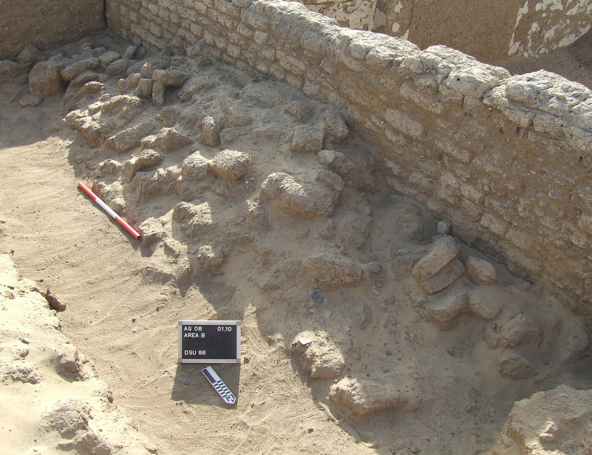{#plt-4.22 fig-alt="Pl. 4.22: View of collapse DSU88 in the central sector of street B12 (to SW)."}

Excavations carried out in the central sector of the street revealed the remains of floor level BF135 (the lowest in this area), which partly covered the foundations of the east wall of room A46. A coin (inv. 678) was found set into this floor, thus in a significant archaeological context; unfortunately, it was in very poor condition and could not be dated. BF135 rested on a thin layer of packed mud dust (DSU99),[^44] with lenses of ash, organic inclusions, and a few ceramic fragments (0.24 kg). The unit lay directly on bedrock.

Two street levels were identified in the southern sector of B12 and assigned different feature numbers, since it was not possible to determine their relationship with the patches of street levels found further north. The upper floor (BF143) and its preparation layer (DSU102),[^45] consisting of mud dust, small pebbles, lime spots, organic particles, one glass fragment, and several potsherds (10.53 kg), were partially excavated outside the eastern face of the apse, to reveal the lower floor (BF155).

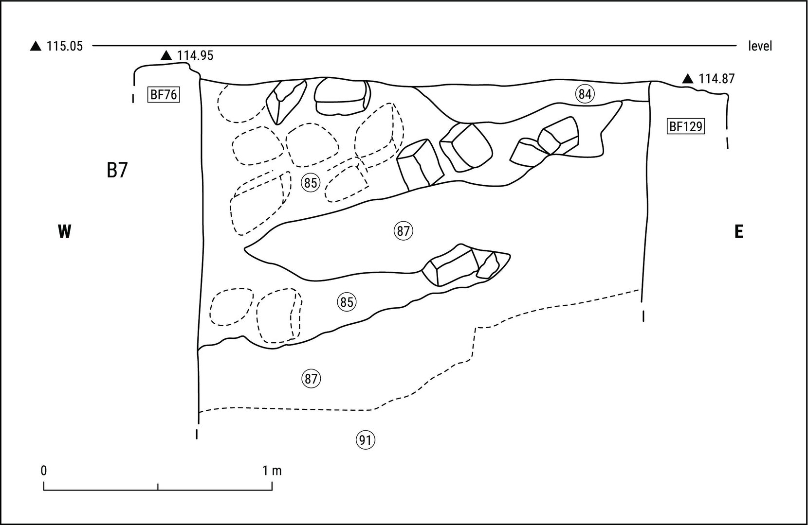{#plt-4.23 fig-alt="Pl. 4.23: Stratigraphical section of street B12 (near the entrance of the church complex)."}

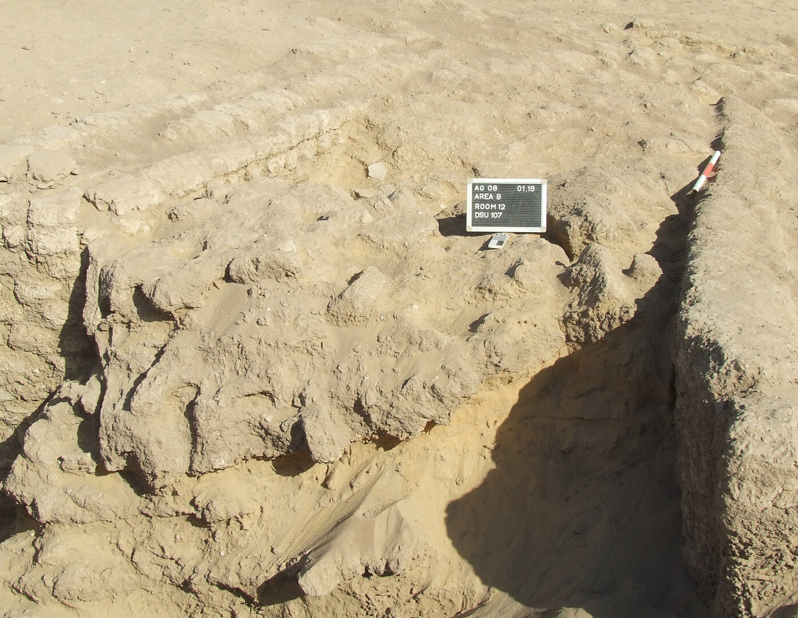{#plt-4.24 fig-alt="Pl. 4.24: View of DSU107 (= DSU85) in the northern sector of street B12."}

A deposit of loose sand and mud dust (DSU96),[^46] with several organic inclusions (such as charcoal, fruit pits, bones, wood), pebbles, three fragments of glass vessels (one of which was diagnostic, inv. 1208), and numerous small fragments of pottery (7.45 kg), filled the foundation trench of the west and southwest walls of room B15. Three bronze coins were found in this unit; one (inv. 665) was dated to 351–361, another (inv. 697) to 361–363, while the third specimen (inv. 698) could not be dated. The foundation trench cut through earlier deposits and was covered by floor BF139. DSU96 was identified and removed also along the southeast wall of the street, where it filled the wall’s foundation trench. The latter had cut, in part, through DSU101,[^47] a layer (seemingly equal to DSU99) of soil and ash with ceramic fragments (1.75 kg) and organic inclusions, on which both the southeastern wall of the street and floor BF155 had been built. A fragmentary wooden object (inv. 1047, possibly part of a round decorative element for furniture) and a bronze coin (inv. 840) dated to 363–364 were found in this context. In the northern sector, which was excavated separately from the central and southern parts, some of the units were assigned different numbers, but relations of equality were established with other units previously excavated further south. The surface layer (DSU106[^48] = DSU84) consisted of windblown sand mixed with mud dust and some mud-brick debris, pebbles, a little organic material, and potsherds (0.12 kg). Partly below and partly abutted by DSU106 was an episode of wall collapse (DSU107[^49] = DSU85; Pls. 4.23–24), which consisted of a thick and compact layer of whole and fragmentary mud bricks, mud dust, pottery sherds (8.75 kg), one small piece of faience, and one glass fragment. Among the finds were also a bead of dark green glass (inv. 819), a fragment of a rope of vegetal fibers (inv. 820), one complete ceramic object—a wine bottle with two handles (inv. 1110)—and three bronze coins: one specimen (inv. 688) was dated to 330–335 and another (inv. 690) to 355–361. The dating of the third coin (inv. 821) could not be established.

The removal of DSU106 and DSU107 revealed several units: a layer of clean windblown sand without inclusions (DSU111)[^50] in the southeast corner of the street’s northern sector; a layer of sand (DSU121)[^51] throughout a large part of the same sector, mixed with fragments of white plaster, a few bones, fragments of glass vessels (including a diagnostic piece that was part of a green glass beaker, inv. 1029), and several ceramic sherds (0.88 kg); a deposit of sand (DSU120,[^52] partly above DSU121) mixed with mud-brick debris and potsherds (0.53 kg), located near the intersection with corridor B7 (leading into the church complex) and possibly associated with collapse DSU107 above. Still in the proximity of room B7 was a small wall collapse (DSU125,[^53] below DSU121), with whole and fragmentary mud-bricks and a few ceramic sherds, which lay above a deposit of windblown sand (DSU126)[^54] with some organic material (including vegetal fibers and coprolites) and a few potsherds (0.20 kg). Underneath it, and extending throughout the northern part of the street, was an occupational level (DSU124)[^55] consisting of mud dust mixed with scattered mud bricks, mud-brick debris, pebbles, cobbles, glass slag, one small piece of bronze, organic material (including animal bones), and a large quantity of potsherds (21.87 kg). Several objects were collected during the excavation of this context. They include three fragments of dull glass bracelets (inv. 845–847), two beads of dark blue glass (inv. 1010 and 1015), diagnostic fragments of glass vessels (inv. 1067, 1069, 1080, 1206, 1207, in addition to non-diagnostic pieces), one fragment of a glass lamp (inv. 1037), and nine bronze coins. Of these, two specimens (inv. 824 and 828) were dated between 364 and 395, one (inv. 822) to 364–378, and two (inv. 827 and 1049) between 351 and 361. One coin (inv. 1099) could only be assigned broadly to the fourth century on the basis of size and weight, while, with regard to three other specimens (inv. 1042, 1046, and 1076), not enough data were available to establish any chronology.

The removal of DSU124 revealed a unit (DSU128)[^56] of packed brown sand, with a few pebbles and rare organic inclusions (mostly charcoal and vegetal fibers), on which street level BF134 had once been laid. The only registered find from this unit was a bead of dark green glass (inv. 1013).

## Space B13 {#sec-4.4-space-b13}

#### Features

To the south, street B12 leads to space B13, which is a courtyard at the intersection of streets B11 and B12 (Pls. 3.2; 4.25–26). B13 is roughly rectangular and measures ca. 3.40 m north–south by 4.45 m east–west, with walls preserved to a maximum height of 2.10 m (southwest wall BF145).

No evidence of a flat or vaulted roof was found, and it seems most plausible that B13 was conceived as an open space. A doorway placed at the northern end of the east wall (BF144; width between the protruding jambs: ca. 90 cm) leads to an unexcavated area to the east of the church complex. Another opening in the southeast corner of the courtyard, about 2.25 m wide, originally allowed passage into a north–south street (A34) partially excavated in the mid-1990s, which seems to have been the continuation of street B12 discussed above. At the opposite end of the south wall, a doorway (width: 1 m) opens onto an unexcavated room (A19) to the south. Two roughly rectangular basins were found at floor level to the sides of this doorway (Pls. 4.27–29). To the east is the largest bin (BF147), measuring 0.93 m north–south by 2.03 m east–west and with an average height of 30 cm. The feature consists of an east–west partition wall of mud bricks and dressed stones, which is bonded, at its eastern end, with a shorter wall of mud bricks that runs north–south and abuts the south wall of B13, leaving the west side of the bin open. Both partition walls lie on top of a foundation layer of compacted mud dust and debris. Inside the bin are scanty traces of a floor of mud plaster, mixed with small potsherds and pebbles. The other bin (BF148), located 1.2 m to the west, is considerably smaller (52 cm north–south by 72 cm east–west). It was built by placing a low east–west partition wall, standing 20 cm above ground level, against the southeast corner of the south wall of corridor B11. The bin was open along its east side, where it faced the other bin.

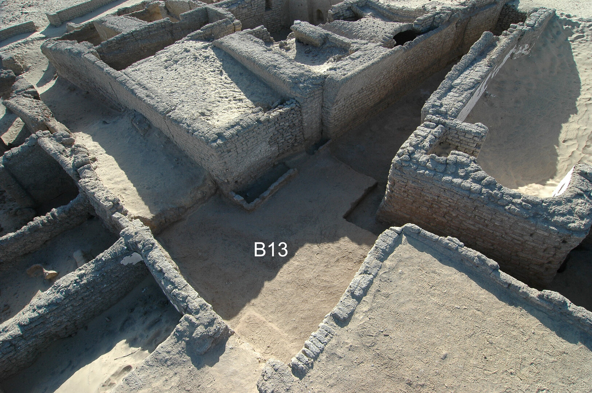{#plt-4.25 fig-alt="Aerial view of courtyard B13 (to SW)."}

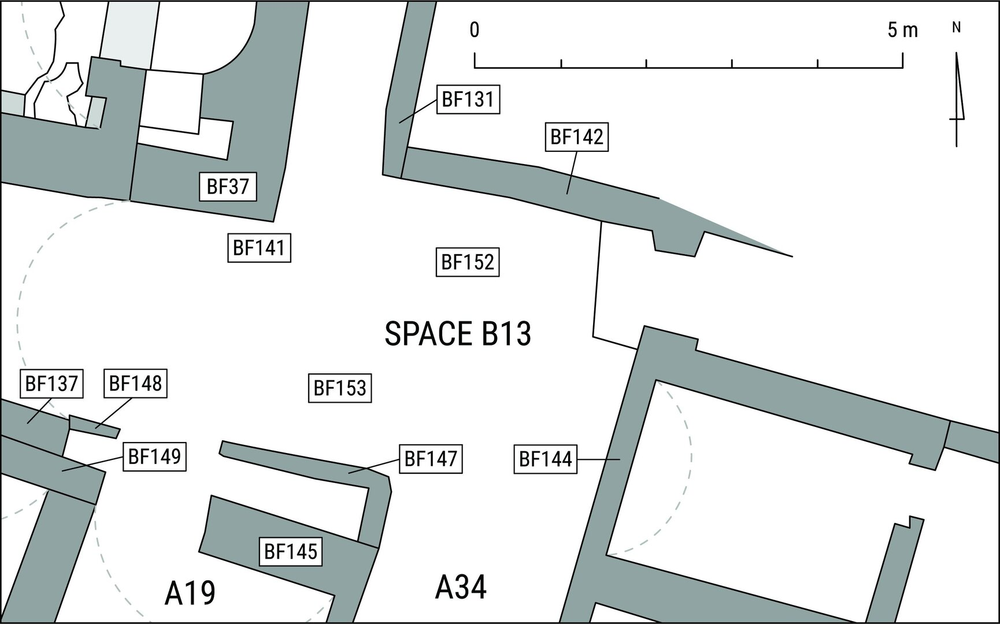{#plt-4.26 fig-alt="Plan of courtyard B13."}

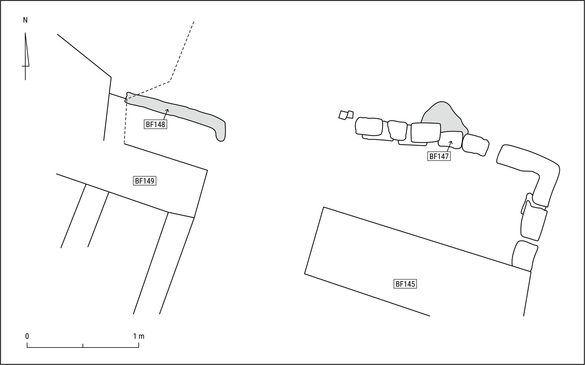{#plt-4.27 fig-alt="Drawing of the mud-brick basins along the south wall of courtyard B13."}

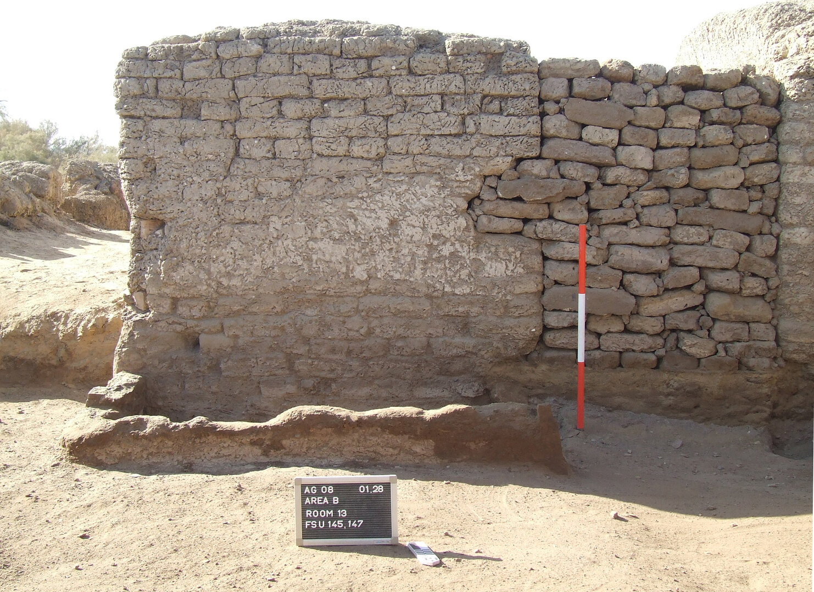{#plt-4.28 fig-alt="Mud-brick basin FSU147 inside courtyard B13 (view to S)."}

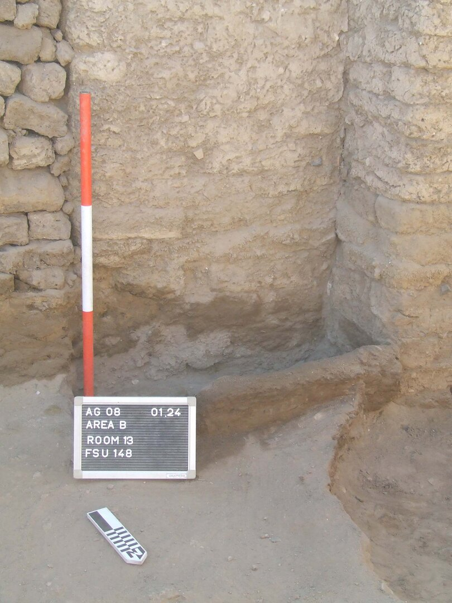{#plt-4.29 fig-alt="Mud-brick basin FSU148 inside courtyard B13 (view to SW)."}

The precise function of the two clay bins has not yet been ascertained beyond doubt. However, several examples of flat rectangular bins, comparable to the two examples from ʿAin el-Gedida, were found at the site of Douch in the Kharga Oasis, excavated by the Institut Français d’Archéologie Orientale.[^57] Also at Douch, the bins were located against the outer walls of buildings along the streets. One of the more likely interpretations that were brought forth by the French team, and which might be applicable to ʿAin el-Gedida as well, is that these features were used for the feeding of animals.[^58]

Patches of floors belonging to at least three different phases were identified throughout the room.[^59] A test trench, excavated along the southeast corner of the apse of the church, allowed us to determine that the earliest of the three levels is the same as the floor of east–west passageway B11 (BF141).

#### Stratigraphy (@plt-4.30)

The fill of courtyard B13 consisted, for the most part, of small collapse episodes and refuse deposits accumulated above the remains of the ancient floors. The surface layer (DSU103,[^60] about 30 cm thick) consisted of windblown sand mixed with some mud-brick debris, pebbles, glass slag, potsherds (2.57 kg), and organic material. Along the doorway set in the northeast corner was a small wall collapse unit (DSU112),[^61] lying below surface. It consisted of a cluster of whole mud bricks, mud-brick debris, mud dust, and sand with organic inclusions and some ceramic sherds (0.41 kg). In the rest of the room, DSU103 rested on a sub-surface layer of soft windblown sand (DSU104)[^62] with very few, and small, inclusions of organic material, fragments of glass vessels, pebbles, numerous potsherds (19.25 kg), and one illegible bronze coin (inv. 681). A sandstone block (38 by 15 by 8 cm) was found, not *in situ*, toward the lower end of the unit.

Underneath the collapse in the northeast corner, and partially under the sub-surface layer, was DSU109,[^63] a thin deposit of sand mixed with mud dust, potsherds (6.55 kg), pebbles, fragments of glass vessels, organic material (including bones and shells), and three bronze coins, of which two (inv. 683 and 804) could not be dated, while a third specimen (inv. 805) was identified as an imitation datable to the late fourth–fifth century. DSU109 extended throughout the courtyard and rested above the lower strata of an extensive collapse (DSU105),[^64] which covered the southeastern sector of B13 and sloped, narrowing down considerably, toward the northwest. The collapse consisted of several mud bricks, fragments of mortar, and mud-brick debris with lime spots, potsherds (1.43 kg), pebbles, and organic inclusions (charcoal, date pits, bones). The small finds that were retrieved in this context are one diagnostic fragment of a glass vessel (inv. 1024) and two illegible (and undatable) bronze coins (inv. 691 and 802). DSU105, seemingly the first collapse episode that occurred within the courtyard after its abandonment, originated, at least in part, from the disintegration of the upper courses of the east wall.

DSU109 covered several other deposits. One of these was DSU110[^65] (possibly a refuse layer), consisting of mud dust and several pockets of ash, mixed with organic material (date pits, charcoal, bones, animal hair), pebbles, fragments of glass vessels (two of which were diagnostic, inv. 1079 and 1213), and a large amount of pottery fragments (15.67 kg), which extended into the northeast part of the room and abutted its north and east walls. The small objects that were gathered within this context include two beads (one rhomboidal and of transparent green glass, inv. 810, and the other globular and made of black and yellow dull glass, inv. 812) and four poorly preserved bronze coins; one specimen (inv. 687) was dated between 355 and 363, while the date of the remaining three (inv. 686, 689 and 826) could not be established.

DSU94 was another refuse unit below DSU109 and covered the southwest part of the room, continuing into corridor B11.[^66] As mentioned in the discussion of the stratigraphy of B11, DSU94 was made of ash mixed with organic material (including vegetal fibers, wood fragments, bones, charcoal, and a few fragments of textile), glass slag, fragments of glass vessels (including three diagnostic pieces, inv. 815, 816, and 1212), very small fragments of bronze, and several potsherds. Among the small objects that were retrieved during the excavation of DSU94 (within room B13) were three beads, two cylindrical and of blue dull glass (inv. 807 and 808) and one globular and made of transparent green glass (inv. 809), one fragment of a bracelet of black dull glass (inv. 806), and two bronze coins (inv. 685, assigned to 341–348, and inv. 700, which could not be dated).

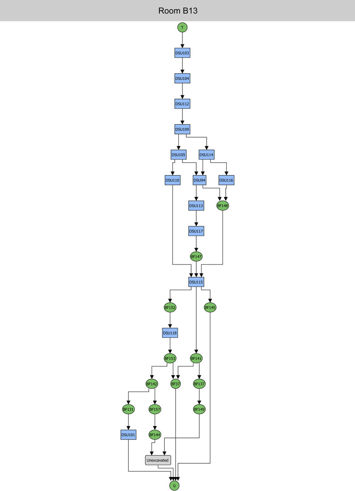{#plt-4.30 fig-alt="Pl. 4.30: Matrix of courtyard B13."}

DSU113[^67] was below DSU109 and consisted of fine sand, pebbles, potsherds (ca. 5 kg), one of which had worn-out edges and was possibly reused as a tool (inv. 1082), one fragment of a glass vessel, and some organic inclusions, which filled the upper part of the large clay bin (BF147) along the south wall.

DSU109 lay also above DSU114,[^68] a small cluster of loose mud bricks, mixed with sand, fragments of white plaster, wood, and several potsherds, which lay above the filling (DSU116)[^69] of the small clay bin (BF148) in the southwest corner of the courtyard. DSU116 consisted of fine sand mixed with abundant organic material (including date pits, bones, and wood fragments), pebbles, and several potsherds (5.77 kg) and was quite similar to the lower fill (DSU117) of the larger bin (BF147),[^70] which contained a higher quantity of ceramic fragments (15.80 kg).

As mentioned above, the removal of the collapse units and ash deposits within the courtyard revealed the scattered patches of three different floor levels. These were covered by an occupational level (DSU115)[^71] consisting of brown sand and soil with ash pockets and mixed with abundant organic material (straw, bones, and charred pits), numerous potsherds (23.37 kg), and other categories of finds, such as glass slag, fragments of glass vessels, small pieces of textile, one bronze collet with a bezel of dark blue dull glass (probably a finger ring, inv. 1050), and three largely illegible bronze coins: one (inv. 839) was dated to the fourth century, while the two remaining specimens (inv. 823 and 825) could not be dated because of their poor condition. A deposit (DSU118)[^72] of brown sand, mixed with potsherds (0.73 kg), fragments of glass vessels, rare glass slag, some organic material (including straw and bones), and containing one fragment of a bracelet of dull black glass (inv. 834), was identified and partially excavated between the uppermost and the middle floor (BF152 and BF153 respectively) and likely served as a leveling layer underneath the former. Two objects were found set in the middle floor, i.e., a lenticular bead, made of gold leaf between two layers of transparent white glass (inv. 1016), and an unfortunately illegible bronze coin (inv. 829).

## Rooms B14-B15 {#sec-4.5-rooms-b14-b15}

#### Features

B14–B15 are a set of two interconnected spaces investigated to the east of street B12, in the vicinity of the entrance to the church complex (Pls. 3.2; 4.31–32). They are identifiable as a small open-air working area, possibly a kitchen/bakery (B15), furnished with a small storage area (B14).

A small opening located at the northwest corner of B15, mentioned above, allowed passage from this room into street B12 and corridor B7. B15 is an L-shaped room, measuring approximately 4.55 m north–south by 4.80 m east–west and has walls preserved to a maximum height of 1.97 m (BF158, south wall of room B14). It consists of a longer rectangular section, oriented from north to south, and a smaller, roughly square area to the south of room B14. The west and the southwest walls (BF128 and BF130 respectively) are poorly constructed and seem to be the result of an enlargement of room B15 protruding into street B12, which possibly happened at the same time or after the apse was added to room B5. The removal of a large collapse in the western part of B15 revealed significant remains of substructures related to the presence of ovens, together with consistent traces of burning on the west and north walls (Pls. 4.33–35).

Possibly, three ovens were once located against the west wall and a fourth (BF176) against the west end of the north wall. The lack of almost any fragments of the pot chambers below the mud-brick rubble suggests that the ovens had already been largely dismantled when the west wall collapsed. The western sector of room B15 is physically separated from the southeast area of the same room by the scanty remains of a long north–south oriented wall (BF212), contemporary with the lowest floor (BF177) identified in this space. In fact, the southeastern sector might have originally been a separate space, but the presence of a floor level at a considerably higher elevation than the lowest floor (and less than 50 cm below the preserved top of BF212) suggests that this was not the case, at least in the latest occupational phase of this area. Toward its northern end, wall BF212 abuts the south wall of room B14 and forms part of the west boundary of that room. Within room B15, it seems to have been utilized, at least at a later stage, to define the eastern edge of the platform where the ovens were located. The wall continues southward into an unexcavated area and is possibly the remainder of an earlier feature that was partially reused when the platform with the ovens was built.

The southeast part of room B15 does not bear any traces of ovens. Only a clay stove was found, not *in situ*, against the south face of the south wall of room B14; this discovery further supports the identification of the room as a kitchen/bakery. Three niches are cut within the east wall of room B15 (BF170), which seems to have been built as a thick facing, covered with a thick layer of mud plaster, against an earlier north–south wall; a small niche, about the size of an oil lamp, is placed in the center, with two larger ones, of very irregular dimensions, to the sides (Pl. 4.36). These two side niches are connected inside and form one storage space. Another niche is located within the south face of the east–west wall (BF158) dividing room B15 from room B14, about 45 cm from its east end. The niche is 44 cm wide, 24 cm high, and 38 cm deep. Originally,

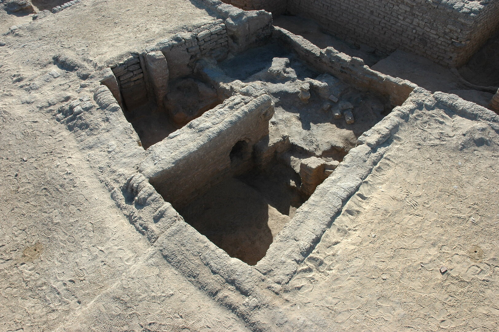{#plt-4.31 fig-alt="Pl. 4.31: Aerial view of rooms B14–B15 (to SW)."}

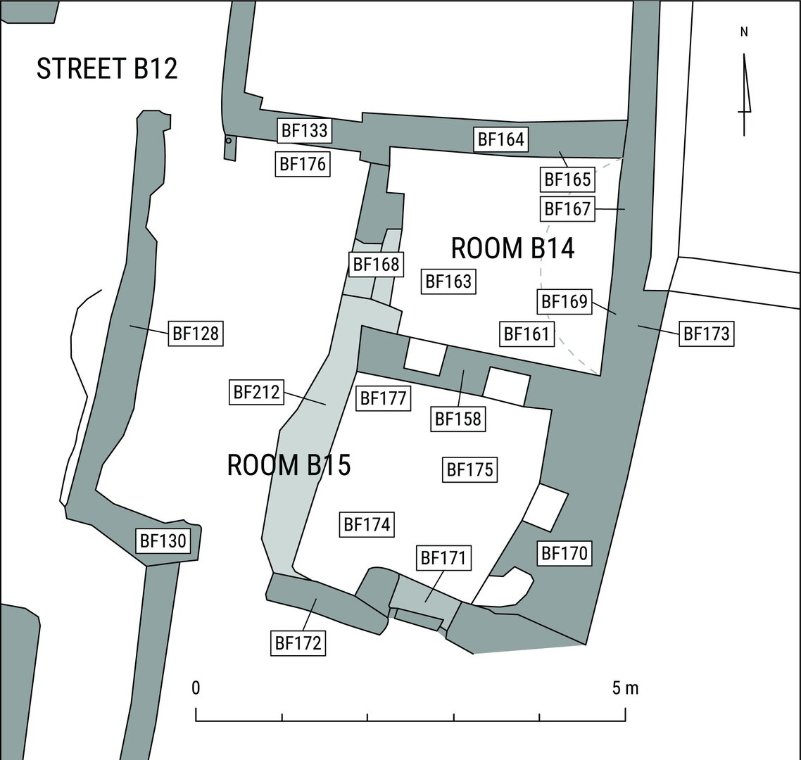{#plt-4.32 fig-alt="Pl. 4.32: Plan of rooms B14–B15."}

it had a curved ceiling and was higher; at some stage, the niche was partially bricked in, in order to raise its floor. The substantial remains of gypsum found in the area suggest that the wall in which the niche was inserted was once whitewashed.

Besides the narrow doorway in the northwest corner of room B15, opening onto street B12, two other doorways once led onto an unexcavated space to the south.[^73] No evidence of any roof was found *in situ* or inside room B15; also, the presence of ovens suggests that it was an open-air space. Three floor levels (the highest, BF174;[^74] the middle, BF175, in phase with the doorway in the southeast corner of the room;[^75] and the lowest floor level, BF177[^76]) are evidence of different occupational phases. The stratigraphical contexts identified within room B15 suggest that at some point the ovens were no longer in use (and for the most part dismantled, as mentioned above) and that this space was used as a domestic midden.

Room B14, located to the northeast of room B15, measures ca. 2.30 m from north to south by 2.70 m from east to west and has walls preserved to a maximum height of 1.97 m (south wall BF158). It was originally plastered in mud, traces of which are still visible. B14 is connected with B15 through a doorway (BF168; width of the opening: about 70 cm) set into the west wall.

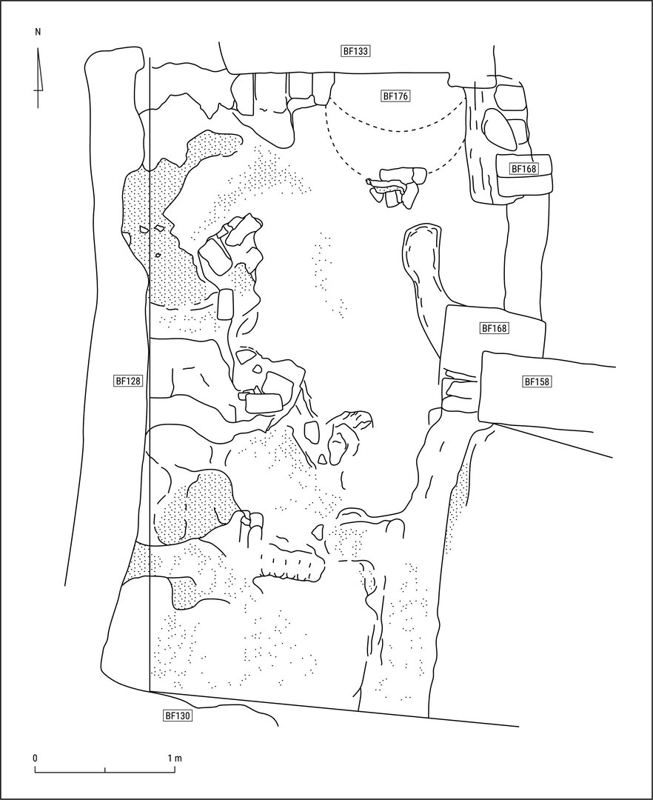{#plt-4.33 fig-alt="Pl. 4.33: Remains of substructures for ceramic ovens (western half of room B15)."}

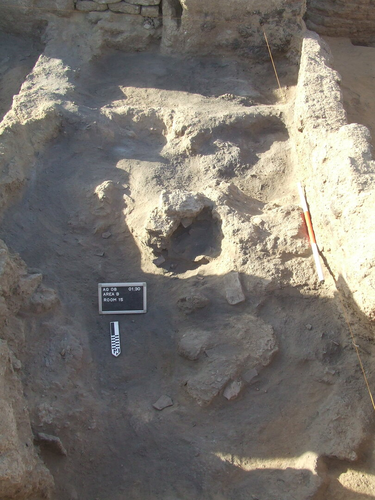{#plt-4.34 fig-alt="Pl. 4.34: View of western half of room B15 (to S)."}

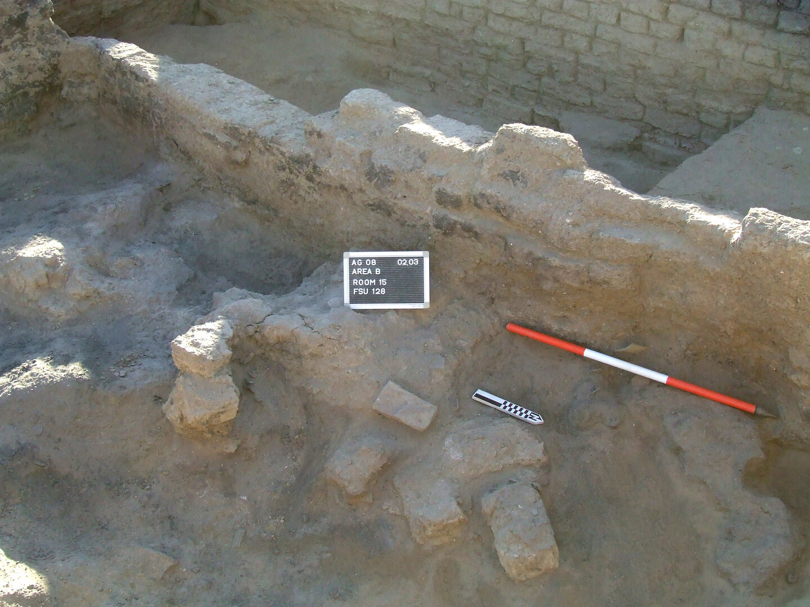{#plt-4.35 fig-alt="Pl. 4.35: Partial view of wall BF128 and substructures of ovens in room B15 (to SW)."}

It consisted of a short north–south screen, abutting a protruding stub, to the north and a stub abutting wall BF158 to the south (located on top of relic wall BF212).[^77] Along the east side of the threshold, a mud-brick step was found below the higher of the two mud floor levels identified during the excavation.[^78] The narrow space between the north end of the doorway and a stub protruding from the west end of the north wall was filled with mud-bricks that were found in highly deteriorated condition. Archaeological investigation revealed that the oven originally located against the north wall of B15 also lay against the outer face of the west side of B14. The east wall is the oldest feature of the room, as the north and south walls, which supported an east–west oriented vault,[^79] abut it. In fact, the east boundary consists of two separate walls (BF167 to the north and BF169 to the south). The latter bears scanty remains of a vault (BF173) that was no longer *in situ* when B14 was built. The vaulted roof of room B14 seems to have collapsed, or to have been intentionally dismantled, soon after the complete abandonment of the room, as no traces of it were found inside.

An arched niche is built within the south wall of the room, about 60 cm from its west end. It is 44 cm wide, 44 cm high, and 40 cm deep and has a semicircular band on top, recessed by ca. 4 cm. No traces of white gypsum plaster were found inside or around the niche, whose bottom part is heavily damaged and was likely the object of alterations already in antiquity. Another rectangular opening, ca. 80 cm wide and 70 cm high, was once set into the north wall of the room toward its eastern end, four courses above the latest floor level. At some point in antiquity, it lost its purpose and was completely bricked up (BF165). Room B14 possibly served, at least when it was roofed, as a storage facility for kitchen B15, before it was used, as mentioned above, as a domestic midden in its latest phase.

#### Stratigraphy (@plt-4.37, @plt-4.38)

The uppermost unit (DSU84)[^80] removed from both rooms B14 and B15[^81] consisted of windblown sand mixed with mud dust, a limited amount of mud-brick debris, lime spots, small pebbles, and potsherds. This layer rested, in the southeastern part of the room, above a deposit (DSU87)[^82] of windblown sand mixed with pebbles, mud dust, charcoal, lime spots, and potsherds (0.99 kg), and, in the western half, on an extensive wall collapse (DSU86; Pl. 4.39).[^83] This context likely resulted from the disintegration of the upper courses of the west and southwest walls of room B15 and also from the collapse of the doorway once opening onto room B14. DSU86 consisted of whole mud bricks, mud-brick debris, and plaster (the latter clustered largely in the northeastern part of the unit) and included organic material (wood and charcoal, bones, and date pits), and a quantity of potsherds (15.65 kg). The excavation of this <pb n="179"> unit revealed also a fragment of a vessel of honey-yellow glass (inv. 1018), a cylindrical bead of dark blue glass (inv. 1017), and three bronze coins, of which two (inv. 1073 and 1075) are illegible and a third (inv. 1095) is dated between 335 and 341.

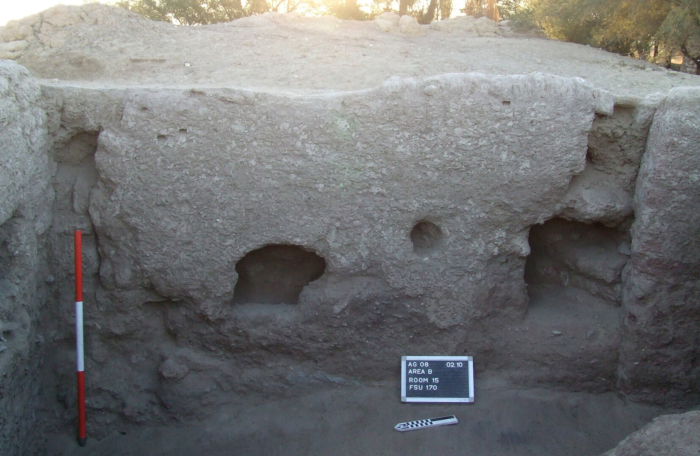{#plt-4.36 fig-alt="Southeast wall of room B15 (view to E)."}

Underneath the collapse, in the southwestern quadrant of the room, was a refuse layer (DSU129)[^84] of brown sand mixed with ash, some pebbles, organic material, glass, and numerous pottery sherds (33.11 kg). The small finds that were retrieved within this unit include a bead of dark blue glass (inv. 1014); a shell (perforated and used as a bead, inv. 1036); the wooden head of a spindle (inv. 1048); two bronze wires (bent and twisted to form two interlocked rings, inv. 1051); a flat elongated object of corroded iron (possibly a small blade, inv. 1084); the globular head of a hair-pin made of bone (inv. 1021); a diagnostic fragment of a vessel of dark violet glass (inv. 1031); and an unusual piece of coroplastic representing a donkey or a horse, possibly used as a toy (inv. 1003).[^85] Six bronze coins were also found: three of them (inv. 1033, 1060, and 1077) were illegible; one specimen (inv. 1061) was broadly dated to the fourth century; another (inv. 1008), although incomplete, could be dated between 364 and 375; the sixth coin (inv. 1041) was tentatively identified as an imitation and dated to the late fourth–fifth century.

DSU129 rested in part above the remains of substructures, visible along the western and northern walls of the room, that once hosted clay ovens. A few traces of the original pot chambers were found scattered throughout this area. Within the remains of an oven placed against the north wall, the removal of a deposit of soft brown sand (DSU134)[^86], with a few pebbles and<pb n="180"> limited organic inclusions, revealed a lower layer of dark brown/grayish ash (DSU135)[^87], which contained pockets of soil of different colors (dark brown soil with organic inclusions; fine, light gray ash; reddish brown clay, likely debris from the oven). DSU129 was identified also in the southeastern part of room B15, beyond the mud-brick platform and thus in an area that seems to have differed, from a functional point of view, from the rest of room B15.

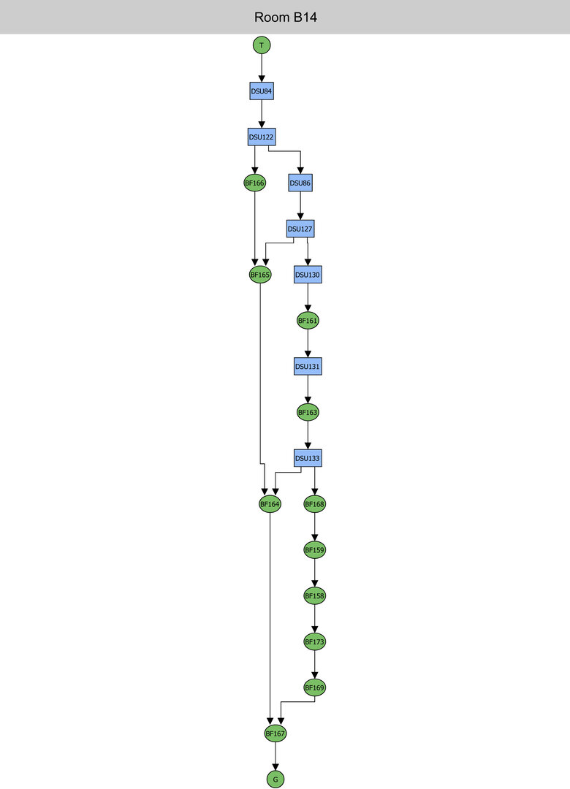{#plt-4.37 fig-alt="Matrix of room B14."}

<pb n="181">

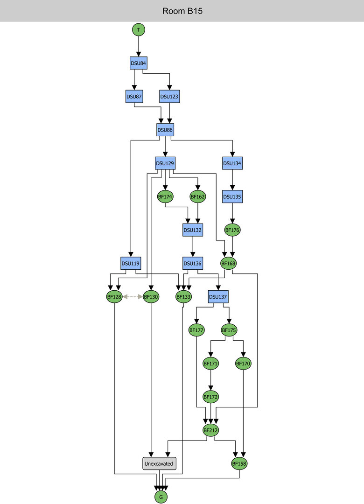{#plt-4.38 fig-alt="Matrix of room B15."}

<pb n="182">

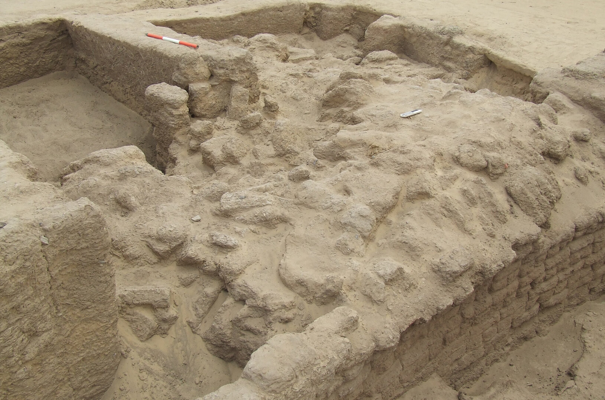{#plt-4.39 fig-alt="View of collapse DSU/. in rooms B14-B15 (to SE)."}

A test trench excavated in the northwest corner, where an opening once gave way into street B12, revealed, below the extensive wall collapse, a thin layer (DSU119)[^88] of brownish sand mixed with ash, charcoal, potsherds (0.043 kg), some of which were burnt, and burnt organic inclusions (Pl. 4.40).[^89]

The removal of the layer of brown sand and ash (DSU129) showed patches of the uppermost clay floor (BF174) in the southeast sector of the room. A broken and overturned bin of clay (BF162) was found, although not in situ.[^90] Floor BF174 lay above thick and heterogeneous deposits. The uppermost was DSU132 (Pl. 4.41)[^91], which consisted of soft brown sand mixed with several inclusions, such as wood fragments, charcoal, bones, date pits, fragments of glass vessels (including two diagnostic pieces, inv. 1027 and 1205), glass slag, fragments of textile, pebbles, and numerous potsherds (51.22 kg). The excavation of this unit brought to light also a complete oval lamp, with a polished slip on its external surface (inv. 848); a segmented bead of dark blue glass (inv. 1011); and two fragmentary iron objects (possibly blades, inv. 1085 and 1087). Four bronze coins were found in DSU132: two of them (inv. 1063 and 1065) were illegible, while one specimen (inv. 1093) could be broadly assigned to the fourth century (on <pb n="183"> the basis of size and weight) and another coin (inv. 1064) was assigned to the late fourth–fifth century.

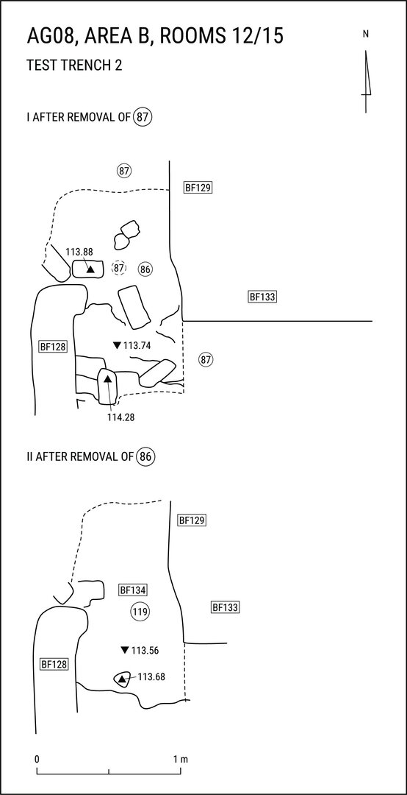{#plt-4.40 fig-alt="Test trench excavated between street B12 and room B15."}

<pb n="184">

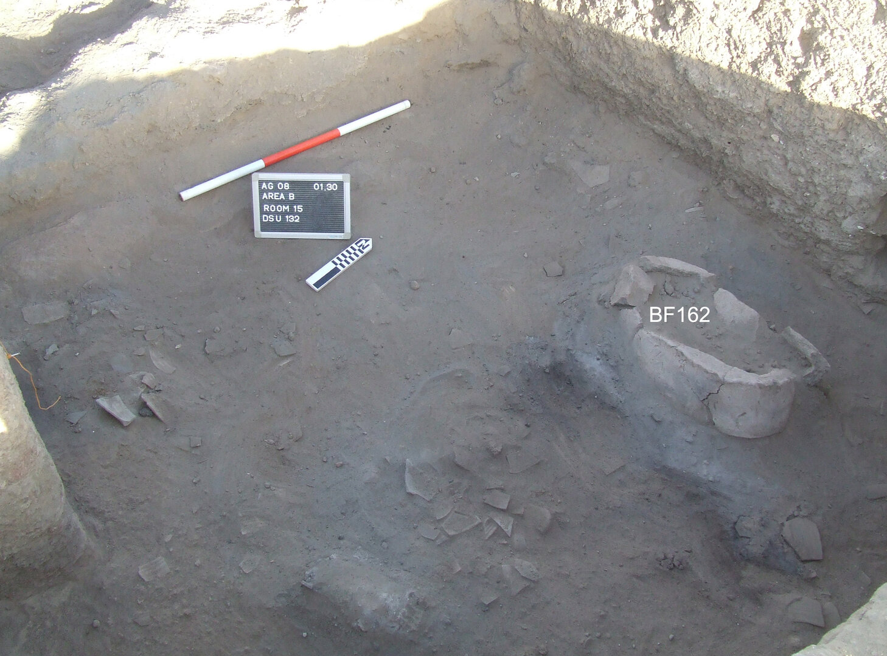{#plt-4.41 fig-alt="View of DSU132 (and clay bin BF162) in room B15 (to NW)."}

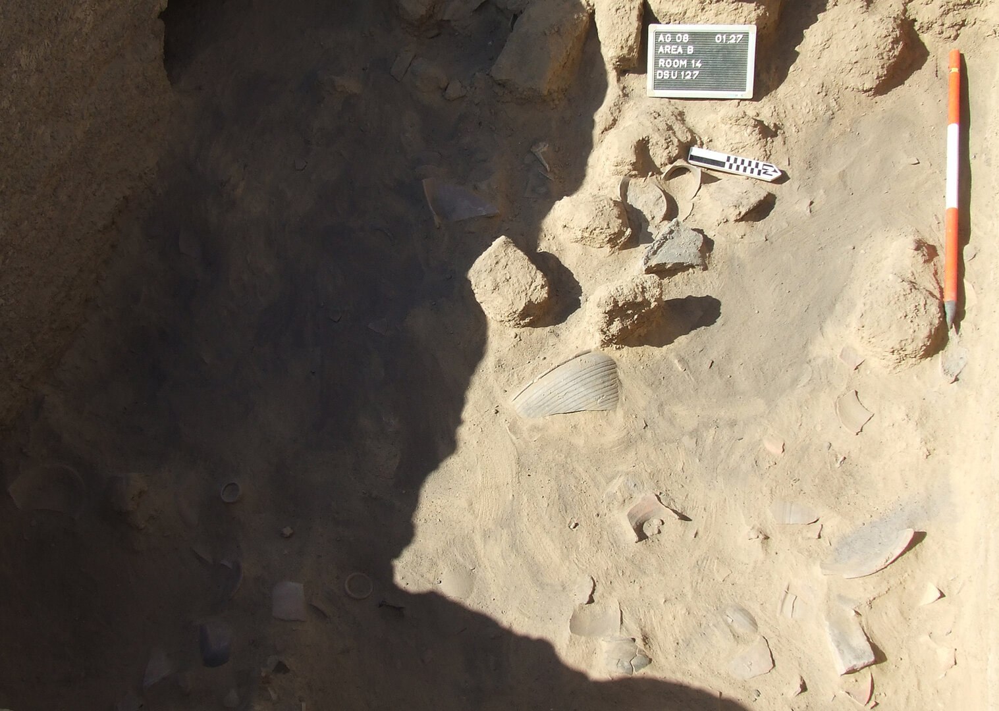{#plt-4.42 fig-alt="Aerial view of DSU127 in room B14 (to WSW)."}

<pb n="185">

Below DSU132 was a compact layer (DSU136)[^92] of brown sand and mud-brick debris that contained pebbles, vegetal fibers, bones, and fragmentary ceramic material (4.2 kg). The lowermost context was DSU137,[^93] consisting of yellowish/brown sand with some lime spots and mixed with pebbles, organic material (mostly wood, vegetal fibers, and bones), fragments of glass vessels (including a diagnostic piece, inv. 1211), glass slag, and potsherds (26.24 kg). The other finds include two tubular beads, one of dark green glass (inv. 831) and the other of dull blue glass (inv. 832), and three bronze coins: one (inv. 1096) was tentatively dated to the late fourth century; another (inv. 1097) to 348–355, and the third (inv. 1066) to 383–403. DSU 137 rested on the remains, visible in the southeastern quadrant of the room, of two earlier floor levels. The mixed nature of DSU132, 136, and 137 suggests that they were refuse layers, deposited into the room and then compacted when the uppermost floor was laid out.

As mentioned above, DSU84 (the thick surface level of windblown sand removed from room B15 and street B12) covered also room B14. Within the latter, one bronze coin (inv. 1009) was found, datable between 317 and 320. This unit lay above a sub-surface deposit (DSU122)[^94] consisting of sand mixed with mud dust and containing organic inclusions (including wood and bones), fragments of white plaster, charcoal, several potsherds (10.08 kg), and a globular bead of green glass (inv. 835). Beneath the sub-surface, a thick refuse layer of brownish sand (DSU127)[^95] extended throughout the room (Pl. 4.42). It contained lenses of ash, mud-brick debris, mud dust, bones, hair, fragments of wood, iron, and bronze, and a remarkably large quantity of potsherds (92.96 kg). The small finds that were retrieved within this context include four pieces of glass vessels (bowls: inv. 1030 and 1032; a jug: inv. 1058; an unidentified closed form: inv. 1059), a complete and well-preserved oval lamp (inv. 1001), the bottom of a lamp of green glass (inv. 1210), and an inscription (ligatured AN) scratched on a body sherd of a juglet (inv. 1216). Five bronze coins were also found: one specimen (inv. 1091) was securely dated between 367 and 375; two others (inv. 1072 and 1200) were tentatively dated to the late fourth–early fifth century. The two remaining specimens (inv. 1035 and 1071) could not be dated because of their poor condition.

DSU127 covered a deposit of compact brown sand and mud dust (DSU130)[^96], rich in organic inclusions (mostly wood and bones), glass slag, and potsherds (38.60 kg), that rested on the later of the two floors identified within the room. The excavation of this unit brought to light also two fragments of dull glass bracelets (inv. 844 and 1020) and a fragment of a lamp of green glass (inv. 1019).

A test trench was dug along the original doorway into room B14[^97] and revealed DSU131,[^98] the preparation layer of the upper floor. DSU131, which consisted of sand and mud dust and included bones, other organic material, and pottery sherds (2.73 kg), rested on top of the earlier <pb n="186"> floor (Pl. 4.43). This lay in turn on preparation layer DSU133[^99], which was made of sand and mud dust and mixed with several inclusions, among which were pebbles, lime spots, organic material, bronze fragments, and potsherds (0.73 kg). DSU133 lay directly above bedrock.

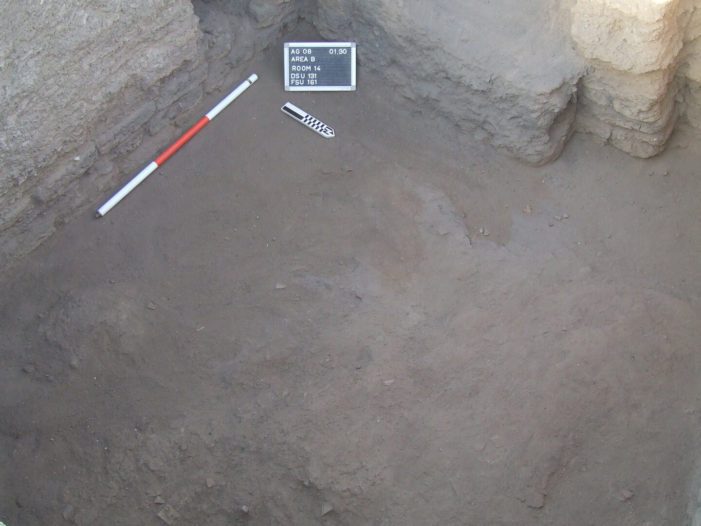{#plt-4.43 fig-alt="Preparation layer DSU131 against the southwestern corner of room B14 (view to SW)."}

## Notes

[^1]: The niche pierces the east wall ca. 1.40 m south of room 10’s north wall.
[^2]: Evidence for the three floors consists of: a large section of an early floor level (BF118—upper elevation: 112.430 m) at the center of the room; scattered patches of a middle level (BF117—upper elevation: 112.500 m); and finally, the latest floor level of room B10 (BF111—upper elevation: 112.550 m), identified in the northern half and in the middle of the room.
[^3]: No incontrovertible evidence was found pointing to its use as a hearth.
[^4]: Only the negative circular imprint remains.
[^5]: Unless the use of the roof had been granted by its owner/s to those in charge of the church complex.
[^6]: Upper elevation: 115.490 m; lower elevation: 113.420 m; max. thickness: 207 cm.
[^7]: Upper elevation: 115.540 m; lower elevation: 115.080 m; max. thickness: 46 cm.
[^8]: Upper elevation: 115.360 m; lower elevation: 114.970 m; max. thickness: 39 cm.
[^9]: Upper elevation: 115.320 m; lower elevation: 114.760 m. DSU73 was not excavated fully once it was established that it was likely part of the original fill of the wedge (max. thickness of the excavated part: 56 cm).
[^10]: Upper elevation: 113.850 m; lower elevation: 113.420 m; max. thickness: 43 cm.
[^11]: Upper elevation: 113.430 m; lower elevation: 112.950 m; max. thickness: 48 cm.
[^12]: Upper elevation: 113.850 m; lower elevation: 112.590 m; max. thickness: 126 cm.
[^13]: Upper elevation: 112.590 m; lower elevation: 112.250 m; max. thickness: 34 cm.
[^14]: Upper elevation: 112.490 m; lower elevation: 112.290 m; max. thickness: 20 cm.
[^15]: Upper elevation: 112.590 m.
[^16]: The discovery, in nearby room B13, of two mud-brick rectangular bins, possibly used for the feeding of animals, further supports the possibility of corridor B11 being used by animals as well as humans; see @sec-4.4-space-b13 below.
[^17]: North side: BF124 (above wall BF42) and BF125 (above wall BF45). South side: BF123 (above wall BF137) and BF136 (above walls BF126 and BF138).
[^18]: BF126 and BF138 were added as a western extension to BF137, the original south wall of the corridor.
[^19]: Upper elevation: 114.750 m; lower elevation: 113.980 m; max. thickness: 44 cm.
[^20]: Upper elevation: 113.890 m; lower elevation: 112.980 m; max. thickness: 91 cm.
[^21]: Upper elevation: 113.540 m; lower elevation: 112.790 m; max. thickness: 65 cm.
[^22]: Upper elevation: 113.350 m; lower elevation: 112.860 m; max. thickness: 49 cm.
[^23]: Upper elevation: 113.120 m; lower elevation: 112.720 m; max. thickness: 30 cm.
[^24]: Upper elevation: 113.260 m; lower elevation: 112.950 m; max. thickness: 31 cm.
[^25]: Upper elevation: 113.060 m; lower elevation: 112.780 m; max. thickness: 28 cm.
[^26]: Upper elevation: 112.870 m; lower elevation: 112.610 m; max. thickness: 26 cm.
[^27]: See the discussion of rooms B14–B15 below.
[^28]: Upper elevation: 113.650 m.
[^29]: Upper elevation: 113.470 m.
[^30]: Upper elevation: 113.130 m.
[^31]: Upper elevation: 113.220 m.
[^32]: Upper elevation: 112.860 m.
[^33]: Upper elevation: 114.790 m; lower elevation: 113.800 m; max. thickness: 32 cm.
[^34]: The amount includes also the fragments collected in all rooms where this DSU was removed.
[^35]: Upper elevation: 114.710 m; lower elevation: 113.940 m; max. thickness: 77 cm.
[^36]: Upper elevation: 114.730 m; lower elevation: 113.820 m; max. thickness: 91 cm.
[^37]: And partially the area occupied by room B15.
[^38]: Upper elevation: 114.470 m; lower elevation: 113.060 m; max. thickness: 81 cm.
[^39]: This DSU slightly extended onto the east end of room B7.
[^40]: Upper elevation: 114.030 m; lower elevation: 113.480 m; max. thickness: 46 cm.
[^41]: Upper elevation: 113.580 m; lower elevation: 113.170 m; max. thickness: 20 cm.
[^42]: Upper elevation: 113.290 m; lower elevation: 113.070 m; max. thickness: 18 cm.
[^43]: Upper elevation: 113.350 m; lower elevation: 113.170 m; max. thickness: 10 cm.
[^44]: Upper elevation: 113.100 m; lower elevation: 112.750 m; max. thickness (excavated part): 6 cm.
[^45]: Upper elevation: 113.190 m; lower elevation: 112.880 m; max. thickness: 16 cm.
[^46]: Upper elevation: 113.450 m; lower elevation: 112.760 m; max. thickness: 53 cm.
[^47]: Upper elevation: 112.970 m; lower elevation: 112.790 m; max. thickness (of the excavated part): 15 cm.
[^48]: Upper elevation: 115.060 m; lower elevation: 114.590 m; max. thickness: 40 cm.
[^49]: Upper elevation: 115.460 m; lower elevation: 113.920 m; max. thickness: 114 cm.
[^50]: Upper elevation: 114.805 m; lower elevation: 113.850 m; max. thickness: 95 cm.
[^51]: Upper elevation: 114.390 m; lower elevation: 113.770 m; max. thickness: 45 cm.
[^52]: Upper elevation: 114.120 m; lower elevation: 113.860 m; max. thickness: 26 cm.
[^53]: Upper elevation: 113.930 m; lower elevation: 113.700 m; max. thickness: 12 cm.
[^54]: Upper elevation: 113.810 m; lower elevation: 113.600 m; max. thickness: 15 cm.
[^55]: Upper elevation: 114.810 m; lower elevation: 113.330 m; max. thickness: 48 cm.
[^56]: Upper elevation: 113.500 m (DSU not removed).
[^57]: @redde_2004 [pp. 25\; 207].
[^58]: However, this explanation raises several questions on the nature and management (public or private?) of the bins: i.e., if the forage were used to feed only the animals belonging to the owners of the nearby houses or if, instead, it were accessible also to any animal passing along those streets. If ʿAin el-Gedida were, in fact, a small agricultural center under wealthy ownership, as suggested in @sec-7.2 below, its situation may have been substantially different from that of the village of Douch, where one would have had to deal with private or family property rights.
[^59]: The uppermost floor (BF152; upper elevation: 112.930 m) was identified only in the northeast corner of the room and sloped from north to south. Below is BF153 (upper elevation: 112.660 m), a compacted mud floor whose remains extend over the entire eastern and central part of room B13.
[^60]: Upper elevation: 113.720 m; lower elevation: 113.140 m.
[^61]: Upper elevation: 113.600 m; lower elevation: 113.170 m; max. thickness: 43 cm.
[^62]: Upper elevation: 113.500 m; lower elevation: 112.820 m; max. thickness: 68 cm.
[^63]: Upper elevation: 113.320 m; lower elevation: 112.870 m; max. thickness: 24 cm.
[^64]: Upper elevation: 113.170 m; lower elevation: 112.710 m; max. thickness: 46 cm.
[^65]: Upper elevation: 113.220 m; lower elevation: 112.780 m; max. thickness: 18 cm.
[^66]: In room B13, the unit extended ca. 220 cm eastwards from the entrance into passageway B11.
[^67]: Upper elevation: 112.840 m; lower elevation: 112.750 m; max. thickness: 9 cm.
[^68]: Upper elevation: 112.910 m; lower elevation: 112.760 m; max. thickness: 15 cm.
[^69]: Upper elevation: 112.760 m; lower elevation: 112.490 m; max. thickness: 27 cm.
[^70]: Upper elevation: 112.760 m; lower elevation: 112.420 m; max. thickness: 34 cm.
[^71]: Upper elevation: 112.960 m; lower elevation: 112.530 m; max. thickness: 18 cm.
[^72]: Upper elevation: 112.880 m; lower elevation: 112.720 m; max. thickness: 11 cm.
[^73]: The two doorways were divided by wall BF172. No architectural features were found associated with the north opening (width: ca. 90 cm), while the southern doorway (BF171; width: ca. 80 cm) had two jambs, east and west stubs, and a threshold.
[^74]: Upper elevation: 113.280 m.
[^75]: Upper elevation: 112.910 m.
[^76]: Upper elevation: 112.680 m.
[^77]: The doorway was found in a very poor condition and partially shifted from its original location.
[^78]: BF161 (upper elevation: 112.920 m) is the higher floor level, slightly sloping down eastwards. BF163 (upper elevation: 112.750 m) was exposed in a test trench dug in the western half of the room, along the east side of the doorway.
[^79]: Of which some remains are still visible on BF164 (north wall) and BF158 (south wall): these are BF166 and BF159 respectively.
[^80]: Upper elevation: 114.790 m; lower elevation: 114.020 m (room B15). Upper elevation: 114.450 m; lower elevation: 113.170 m (room B14).
[^81]: The unit was removed also from street B12: see @sec-4.3 above for upper and lower elevations.
<!-- TODO: Not sure exactly what idem refers to here. -->
[^82]: *Idem*.
[^83]: Upper elevation: 114.530 m; lower elevation: 113.250 m; max. thickness: 128 cm.
[^84]: Upper elevation: 113.420 m; lower elevation: 113.260 m; max. thickness: 16 cm.
[^85]: On the piece of coroplastic, see @sec-11.4.2 below (cat. no. 35).
[^86]: Upper elevation: 113.250 m; lower elevation: 113.150 m; max. thickness: 10 cm.
[^87]: Upper elevation 113.150 m; lower elevation: 112.870 m; max. thickness: 28 cm.
[^88]: Upper elevation: 113.680 m; lower elevation: 113.560 m; max. thickness: 8 cm.
[^89]: The test trench measured ca. 140 cm north–south by 70 cm east–west and was excavated to the north and south of the opening between room B15 and street B12.
[^90]: The bin (see @plt-4.41 below) had an elongated shape with round corners and measured approximately 64 by 44 by 20 cm.
[^91]: Upper elevation: 113.340 m; lower elevation: 113.000 m; max. thickness: 16 cm.
[^92]: Upper elevation: 113.290 m; lower elevation: 113.000 m; max. thickness: 13 cm.
[^93]: Upper elevation: 113.160 m; lower elevation: 112.680 m; max. thickness: 48 cm.
[^94]: Upper elevation: 114.300 m; lower elevation: 113.070 m; max. thickness: 123 cm.
[^95]: Upper elevation: 113.270 m; lower elevation: 112.950 m; max. thickness: 32 cm.
[^96]: Upper elevation: 113.270 m; lower elevation: 112.940 m; max. thickness: 9 cm.
[^97]: The width of the trench was ca. 50 cm against the south wall of the room and extended to ca. 75 cm against the north wall.
[^98]: Upper elevation: 112.940 m; lower elevation: 112.750 m; max. thickness: 9 cm.
[^99]: Upper elevation: 112.730 m; lower elevation: 112.560 m; max. thickness: 12 cm.