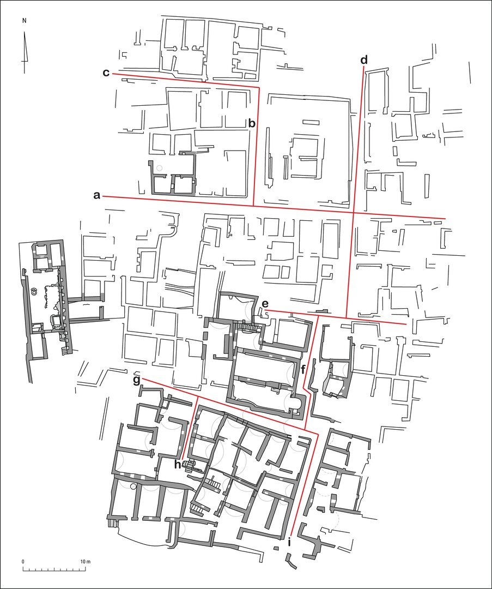

# The Church Complex and Surrounding Structures {#sec-chapter-5}

## The Development of the Church Complex {#sec-5.1-development}

The excavation of the church complex of ʿAin el-Gedida uncovered several features that predate its latest construction phase. Ample evidence was collected about the reuse of earlier walls in the construction and alteration of the church and its adjoining rooms. The most noticeable example, already mentioned in the discussion of the archaeological remains, is the north–south wall (BF68 + AF98) found below floor level in rooms B5 and A46. The wall was partially razed down to foundation level to open space for the expansion of the two rooms to the west. It was also partly incorporated within the north and south walls of room B5 and possibly within the north wall of room A46.

Another feature that clearly testifies to the multi-phased construction process of the church complex is the mud-brick plug (AF76/BF66) built to seal the central doorway between rooms B5 and A46. The reasons for its construction could not be clarified beyond doubt during its archaeological investigation, but they might be related to a re-functionalization of room A46 and to the ensuing need of a higher degree of privacy and separation of room B5 from A46.

These are just two examples of the architectural features that provide incontrovertible evidence for the multifaceted history of the complex and, more in general, of the area on which it developed. The data they offer are significant but cannot be used as the only source of evidence for an in-depth discussion of the complex and its architectural development. Indeed, close attention must be paid to the structural relationships existing between each wall and its neighboring ones, in the attempt to reconstruct their relative chronology. In order to achieve this, the investigation of the complex included the excavation, along the walls of each room, <pb n="187"> of test trenches down to foundation level. These were an invaluable source of information and contributed, together with the more noticeable features mentioned above, to the identification of different construction phases within the area of the church complex. The results were partially presented above, included in the analysis of each room, but will be brought together and further discussed here, in order to gain a complete picture of the overall architectural development of the complex.

<!-- TODO: Plate missing from image repo, find -->
{#plt-5.1}

Evidence was collected that testifies to the existence of buildings pre-dating the church and the set of interconnected rooms to the north. The walls of these structures were, as mentioned above, either razed or incorporated within the walls of the church complex. According to the available data, it was possible to identify at least three rooms in the area later occupied by rooms B5, B6, and A46 (@plt-5.1).[^1]

To the north was room α, whose west wall was also the west wall of room B6 (BF72). The north side is preserved only in the foundations included in the threshold of the doorway leading into room B9 and in the east end of the north wall of staircase B8 (BF91). The latter wall was bonded with the east wall of room α, incorporated as the east side of rooms B8 and B6 (BF75). This wall originally continued south and formed a corner with the north wall (east half) of <pb n="188">
 room A46, which supported two different vaults springing from its north and south faces. The south wall of room α is not preserved.

To the southeast of α, room β occupied the eastern half of later room A46. Its north wall was the eastern half of the north wall of A46 (AF69) and two niches were symmetrically built within its south face. The west wall of β was the north–south razed wall (AF98) identified below floor level in room A46. It was possible to ascertain that its foundation courses are bonded with the remains of an east–west wall (AF103) running below the partition dividing room B5 from A46; therefore, the latter wall originally formed the south boundary of room β. It was not possible to identify the remains of its east wall.[^2]

To the south of room β, and sharing with it the east–west wall found at foundation level, was room γ, extending through the eastern half of the later room B5. Its west side was delimited by the north–south wall (BF68) found at foundation level under the floor of the church. Traces of its east boundary (BF65) were identified below the sanctuary along the east side of the church, supporting the screen walls and the two semi-columns to the north and south of the apse. This foundation wall is bonded with the east–west partition (BF42) forming the south boundary (east half) of room B5; the two walls are, therefore, contemporary and part of an early construction episode, with the east–west wall originally built as the south edge of room γ. The same wall is also bonded, at its west end, with a stub (BF44) that was used, when room B5 was created, to join the east and west halves of the room’s south boundary. As already mentioned above, it is likely that this stub was originally part of the razed north–south wall that formed the west edge of room γ (as well as β).

Both rooms β and γ were covered with barrel-vaulted roofs, in which the vaults had an east–west orientation.

Room B10, excavated to the northwest of the church complex, was built to the west of room α. The east wall of B10 (BF103) abuts the west wall of α (and later room B6) (BF72) and, in its south half, the scanty remains of another wall against which the west wall of the later room A46 was built. On the basis of architectural evidence and of the ceramic findings collected during its excavation, it is possible to argue that room B10 predates the expansion of the church complex to the west.

Rooms α, β, and γ were substantially altered when the church complex was created in its full extent, involving the enlargement of rooms β and γ to the west and the addition of rooms B6–B9 to the north. The east wall of room α, bonded with the north wall of β, was partially demolished and a doorway (BF89) opened onto corridor B7.[^3] The latter was created through the addition of an east–west wall (BF76) parallel to the north wall of room β, which was also subject to substantial alterations in its north face at this stage.

Room α was divided into two spaces, anteroom B6 and staircase B8, separated by an east– west oriented wall (BF73) that abutted both the east and west walls of room α. The south wall of room B6 (BF70) was built at this stage, abutting the north wall (west face) of β. A new barrel roof, with the vault oriented east–west, covered room B6. A doorway (AF100/BF88) was opened along the south wall (leading to later room A46); it was part of the same construction <pb n="189">
 episode, as the threshold was bonded with the rest of the structure. Two additional doorways were set along the north boundary of anteroom B6: one (BF84), located near the east end, led to staircase B8; the other (BF86), placed against the northwest corner of the room, opened into a short vaulted passageway, which ran below the staircase and led into room B9. The construction of B9 belongs to the same phase of B6–B8, as testified to by its access only through room B6 and its southeast wall (BF115 + BF121), which was built as part of staircase B8.

To the southeast of B6, rooms B5 and A46 were created by extending rooms β and γ to the west. To do so, the west wall of both spaces was razed, as well as the wall dividing the two rooms. A new east–west partition (AF72/BF58 + AF74/BF57 + AF75/BF55 + AF77/BF52) was built on top of the foundations of the earlier wall separating β from γ and two doorways were created; as already mentioned above, the larger opening, located in the middle of the wall, was bricked up at some point in antiquity (AF75/BF55). The south wall of room B6 functioned as the west section of the north wall of room A46; the south wall of room B5 was created by extending the original south wall of room γ to the west; in fact, the new section (BF45) was not built in line with the earlier wall, but slightly recessed into the room and the two sections were joined with a short diagonal partition (BF44); the latter might have incorporated a relic of the razed north– south wall that formed the west boundary of rooms β and γ. It has already been mentioned, in the discussion of corridor B11, that the reason for this irregular layout could lie in the complex rearrangement of space to the south of the church. During this process, involving the expansion of passageway B11 to the west, it was necessary to face the challenge of maintaining a sufficient width within the western addition to the corridor, which, due to its non-parallel north and south walls, substantially narrowed westwards. The existence of earlier structures to the south of the corridor’s western extension may have necessitated creating a recess within the southwest part of room B5.

As said above, the west wall of the church was created by building a thin facing against an earlier north–south wall (BF47).[^4] The facing widened to the north, where it formed also the western boundary of the gathering hall. The west wall of rooms B5 and A46 is undoubtedly contemporary with the enlargement of the complex to the west, as the threshold of the western doorway (AF99/BF78) is bonded with it.

New vaults were built on the west sectors of both the church and the gathering hall to the north, paralleling the situation in the eastern half of both rooms. Originally, the vault springing from the south wall (east half) of the church was probably supported to the north by the east–west wall once separating rooms β and γ (and later razed). The later east–west wall between the two doorways had to support not only the new vaults covering the western halves of rooms B5 and A46, but also the northwest part of the (new) vaulted roof covering the eastern half of B5. Indeed, unequivocal traces of two rather different vault springs can be noticed on the south face of that wall.

Substantial alterations were also carried out at the eastern end of room γ/B5, with the razing of the east wall, except for its foundation courses, and the construction of the sanctuary. The north sector of the east wall, built to the north of the apse, continues further north and forms the east boundary of room A46 (AF71/BF127); its construction is therefore contemporary with the addition of the sanctuary to the church. Furthermore, the same north–south wall is bonded with the eastern sector of the wall dividing rooms B5 and A46 and is, consequently, part of the same episode as the creation of the apse.

During the archaeological investigation of the complex, data were collected suggesting that the walls of rooms β and γ were originally covered with a coat of mud plaster, with only the niches framed by rectangular bands of white gypsum.[^5] This decorative pattern was customarily adopted in domestic architecture of Roman and Byzantine times in the Dakhla Oasis, as testified to by the examples found at several sites. After the enlargement of both rooms β and γ to the west (and the creation of B5 and A46), all walls and the vaulted roofs were completely whitewashed. Indeed, the layer of white gypsum plaster covering the walls was found to partially overlap the white frame around the niches in the north wall (south face) of room A46, which was also the north wall of β. Also the west wall of room α (and later room B6) testifies to the existence of a decorative pattern of niches framed with white gypsum bands predating the whitewash coating of the entire room.

It seems likely that the alterations involving the eastern halves of rooms B5 and A46 were carried out at the same time when both spaces were enlarged to the west, as the result of an overall, well-planned project. However, no conclusive archaeological evidence was found proving this hypothesis. Neither was it possible to determine their relative chronology, that is to say, to establish if the expansion of both rooms to the west pre- or post-dates the changes in the eastern half, which involved the construction of new vaulted roofs (as they were partly supported by a wall bonded with a feature that belonged to the sanctuary).

No evidence was found to associate the closing of the central doorway between the church and the gathering hall with any specific rearrangement carried out in the church complex. Unquestionably, however, the enlargement of rooms B5 and A46 to the west, with the overall whitewashing of their walls, represents a <em>terminus post quem</em> for the construction of the mud- brick plug. Indeed, the east and west inner faces of the doorway show partial but unambiguous traces of the same layer of white gypsum plaster, which was only later obscured by the bricked- in wall.

Furthermore, the sealing of the passageway certainly meant that the stepped podium, built against its east face, was no longer in use. The location of the podium itself suggests that its original function was to promote the ability of a single speaker to address people sitting in both rooms. The platform could be accessed only from the church, where the steps were placed, and, as said above, it was likely used by a celebrant to read the Scriptures and/or preach from a vantage point that allowed him to be easily seen and heard by everyone in either room. The fact that the people sitting in the gathering hall could participate, at least to some extent, in the liturgies celebrated in the church suggests the possible identification of room A46 as a hall for catechumens, who were allowed only partial participation to the Eucharist.[^6] When the main opening between the two rooms was bricked in and the podium was sealed off, the need for easy accessibility (apart from the small doorway to the west) and interaction was no longer extant, pointing to a re-functionalization of hall A46. It was mentioned above that a higher degree of separation may have led to the construction of the mud-brick plug. Certainly, the public nature of the room does not seem to have ever been abandoned, as testified to by its unaltered dimensions and by the fact that the long <em>mastabas</em>, built along the north, south, and east walls for a relatively large number of people, were never dismantled. The presence of a kitchen in room B6,[^7] immediately to the north of A46 and accessible from it through a doorway at the north wall’s west end, suggests the possible use of room A46, at least at this stage, as a hall for the eating of common meals. This interpretation is further supported by the discovery, across the street from the entrance into the church complex and fairly close to room A46, of another kitchen (B15) with several ovens, which undoubtedly served not the needs of a single family but rather those of a large group of people. Room A46 could have been used by such a community, whose nature remains unknown, as a refectory, for the consumption of the bread baked in the large kitchen and also the food prepared in room B6 and stored in pantry B9 (and above staircase B8). The use of room A46 as a refectory, rather than or in addition to liturgical purposes, might also explain the higher degree of separation needed from the church.[^8] Even if of a different nature, a close association of the gathering hall with the church was maintained also at this stage through the western doorway. Indeed, there are numerous examples in Egypt, mostly (but not all) coming from monastic contexts,[^9] of large refectories not only built in the proximity of churches, but also functionally related to them.[^10]

An intriguing question concerns the nature of rooms β and γ before their alteration into rooms B5 and A46, i.e., if they functioned as a church before their expansion to the west and the addition of an apsidal sanctuary. In the first centuries of Christianity, the common worship and the liturgies were carried out in buildings of a domestic nature, with the basilica form being adopted in Christian architecture around the time of Constantine.[^11] There is evidence for the existence of such <em>domus ecclesiae</em> in the ancient world, with the best known example coming from Dura Europos.[^12] The possibility that religious ceremonies were carried out in rooms β and γ prior to their enlargement and/or the construction of the apse cannot be ruled out, but there are no available archaeological data to support it.

The architectural changes and additions that led to the creation of the church complex were substantial, deeply affecting the surrounding context. Indeed, the early structures that were incorporated into the complex lay within a densely constructed environment, as pointed to by consistent archaeological evidence. It was noticed, for example, how the irregular layout of the church in its south wall was likely dependent on space limitations to the south, possibly due to the existence of earlier buildings in the area. Therefore, the construction of the church and its adjoining rooms generated profound changes in the topography of the mound, especially around the complex. The archaeological investigation to the south and east of rooms B5 and A46 shed some light on these transformations, which must have involved also the unexcavated area to the north and west of the complex.

The floor identified in vaulted passageway B11 and the lower of the two levels (BF153) found in courtyard B13 (to the southeast of the church) seem to predate the construction of the church complex; indeed, they abut only the east half of room B5’s south wall, which was also the original south wall of room γ. Of the three floor levels found in street B12, running north–south to the east of the complex, the lowest (BF135) seems to be contemporary with the alterations carried out in the eastern halves of rooms B5 and A46. The two higher floors (BF134 and BF143) are to be associated, instead, with the buildings to the east of B12, in particular rooms B14–B15. The south segment (BF131) of B12’s east boundary predates the construction of the central partition (BF130 + BF128) of the same boundary. Indeed, BF130 abuts BF131 at the latter’s north end and is, in turn, abutted by BF128 (@plt-4.16). BF130 + BF128 are clearly shifted westwards compared to the street’s southeast and northeast walls (BF131 and BF129 respectively), which are instead aligned. The central partition was built to enclose the area of the ovens in room B15, which was partly built within the original north–south street B12. When this occurred, the route was modified with the creation of a slight turn eastwards, between the southwest corner of room B15 to the east and the church’s apse to the west. The substantial alterations that affected street B12, inside which both the apse and part of room B15 were built, caused the street to narrow down considerably to the east of the church. Indeed, the visible signs of weathering in the northeast corner of the apse’s outer wall, eight courses above ground level, are likely due to the passage and turning of carts and animals, for which the passage at that point might have been particularly difficult.

The west and south (west end) walls of room B15 (BF128 and BF130 respectively) postdate the addition of the apse to room B5.[^13] Indeed, the foundation trenches of the two walls cut through a floor of street B12 in phase with the apse. When room B15 was built, another smaller space was added to the northeast, i.e., B14; as mentioned above, it once opened onto the former through a small doorway (now collapsed) and possibly served as a small storage room.

As mentioned above, room B15 once hosted ovens in its western half, which protruded into street B12 and gave access to it through a narrow opening set in the northwest corner. An intriguing fact is that the passage is precisely located across the street from the entrance into corridor B7 (and the church complex). One could suppose that room B15 (a bakery serving the needs of a large group of people) was built in relation to the church complex, particularly the anteroom/kitchen (B6) and the large gathering hall (A46). This is a fascinating possibility, supported, among other things, by the established relative chronology, but incontrovertible evidence is lacking.

The two higher floor levels of street B12 postdate the establishment of the small industrial installation in room B15, as they abut its western wall. In fact, the middle floor was laid out against the foundation courses of this wall and seems to be in phase with it. On top of the same level, substantial lenses of ash were found, particularly in the central part of the street and against the corner between the east wall of room A46 and the north wall of the apse; these units are likely to be correlated with the activities carried out in room B15 when the ovens were still in use. The highest floor of street B12 partially extended into room B15 through the narrow passageway located in the northwest corner of this room. Quite significantly, the floor obscured

 and secondary (green) axes of movement within the church complex."){#plt-5.2}

a stone with a socket placed on the ground at the west end of the north wall of B15. The socket likely held one of the hinges of a doorway once closing the passageway and blocked on the opposite side by a mud-brick jamb.[^14] The analysis of the archaeological data suggests that when the latest floor of street B12 was laid out and extended into room B15, the passageway between the two spaces was no longer closed off. Indeed, no evidence for the placement of other doors was found. At a broader level, the changes that occurred in the northwest corner of B15 may be put in relation to the partial abandonment of the room, which took place in its latest phase. Indeed, the oven chambers were almost completely dismantled, leaving only traces of their mud-brick substructures, and room B14 was turned into a refuse dump. Substantial evidence points to the fact that the small industrial area including rooms B14 and B15 went out of use well before it was eclipsed under extensive wall collapses.

## Patterns of Movement Inside the Complex and Access from Outside {#sec-5.2-patterns}

Movement within the church complex seems to have followed two main axes, roughly perpendicular to each other (indicated as red arrows in Pl. 5.2). The first starts at the only entrance, located at the northeast end of the complex and once controlling the entire flow of people entering the building. It runs from east to west and leads from street B12, outside the building, into anteroom B6 via corridor B7, crossing the doorway between the two rooms. B6 is indeed the place with the highest degree of accessibility and where the strongest form of control and selection of access could be carried out. From there, a second axis of movement leads to the church at the south end of the complex. As said above, it is perpendicular to the former and begins at the entrance from anteroom B6 into gathering hall A46. It runs from north to south and crosses the open doorway in the southwest corner of A46, ending in room B5. This spatial arrangement was created to channel the flow of people from outside into the complex, leading them into the church, which was their most likely destination. The two axes cross four out of the seven rooms of the building, covering more than three quarters of the entire area. Furthermore, they once organized the access into the two largest and functionally most significant spaces of the complex, that is to say, rooms B5 and A46.

Access to the rooms at the northwest end of the church complex was, instead, regulated by minor axes, all starting from anteroom B6 and therefore secondary to the main east–west axis crossing corridor B7. One runs perpendicular to the latter, along the east wall of the anteroom, and crosses the doorway into staircase B8. From there, the staircase follows a line perpendicular to the preceding axis, leading to the roof of the complex and, in particular, to the small-scale industrial installations on the vaulted roof of kitchen B10. A third minor axis starts at the southwest corner of room B6, where the two main axes meet near the doorway into the gathering hall. It is oriented north–south and runs below the narrow vaulted passageway below the staircase, ending in pantry B9 at the northwest edge of the complex. This axis is, in fact, in line with the north–south one that leads from anteroom B6 to the church at the south end of the building, via room A46. Indeed, these two axes form one major pathway running from the north to the south end of the church complex, crossing three boundaries and four rooms plus the vaulted passageway below room B8. Therefore, it must have held a key role within the overall spatial configuration of the complex, shaping the movement of anyone entering the building.

A previous study discussed methods of spatial analysis in relation to the church complex atʿAin el-Gedida. The goal was to shed light on the arrangement of particular configurations, by identifying ways in which human interaction can be affected by space.[^15] The analysis provided some useful information on the degree of privacy or permeability of any given space, and on how access could be controlled to increase or limit the chances for encounters among people <pb n="195">
 inside the church and adjacent rooms. However, it could not be used to estimate, to any degree of approximation, how many persons were in the church complex at any given time. The nature of some rooms is not clear beyond doubt, and other spaces, such as room B6, held multiple functions, making the identification of the people once accessing and using these rooms even more complex. Furthermore, the information that is available on the size of the settlement or the density of its population is currently too limited to provide any significant contribution. Nonetheless, the archaeological evidence that is available for some rooms of the complex allows us to gather some data of a quantitative nature. The church and the neighboring hall to the north have walls lined with benches that were built to host a considerable number of people. Room B5 bears well-preserved evidence of a <em>mastaba</em> built along the south wall for a length of ca. 9.8 m, including a small sector near the southeast corner where the bench is now missing. The <em>mastaba</em> continues along the west wall for about 2.2 m and another bench lines part of the north wall, between the northwest entrance and the central passageway, which was later bricked in, for about 4.3 m. The overall length of the <em>mastabas</em> within room B5 is ca. 16.3 m, pointing to a number of about forty people who might have been seated on the benches within the church at any given time.[^16] To the north of B5, the gathering hall has benches built along the north wall for ca. 8.3 m and the east wall for ca. 3.9 m. The east <em>mastaba</em> is joined with another bench that lines the south wall of the hall for a length of about 1.9 m, giving a total length of ca. 14.1 m for the benches of room A46. Therefore, the hall was capable of seating at least thirty- five people at the same time.[^17]

Two features very similar to mud-brick <em>mastabas</em> were uncovered in anteroom B6, against the north and east wall.[^18] Although the circular imprints found on top of them suggest their use as platforms for jars and other ceramic vessels, it is possible that they had been built as benches before the room functioned also as a kitchen. The feature lining the north wall is, at least in its preserved part, about 2 m long, while the remains of the platform along the east wall measure ca. 1.5 m in length. All together, they might have seated, if in fact they had been in use as benches, about eight/nine people.

The seating capacity of the church complex, with regard to the church and the gathering hall, that is to say, those spaces for which there is consistent archaeological evidence, was about seventy-five people, or more than eighty including the anteroom. This amount does not take into consideration those who were in charge of cooking in room B6, who would have also accessed the pantry (B9), the staircase (B8), and the vaulted roof of room B10. On the other hand, there is no substantial evidence on the identity of those who gathered and worshipped in the church complex. Therefore, it is not possible to be sure of a clear-cut distinction between the people who entered the complex just to attend a religious service and those who carried out more practical tasks. At any rate, considering not only the small-to-average size of the church and of the entire complex, but also the seemingly limited extent of the settlement, especially compared to nearby sites such as Kellis, this is a considerable number of people, testifying to the existence of a relatively large and well-established Christian community atʿAin el-Gedida. <pb n="196">
 Once again, it must be emphasized that these numbers give an approximate idea of how many people could have sat inside the church and the gathering hall (and possibly in the anteroom) at any given time, but do not provide an estimate of the maximum capacity of these two rooms. Indeed, it cannot be excluded that people, even a considerable number of them due to the relatively large size of both spaces, gathered for meetings and liturgies standing in the middle of rooms B5 and A46, while others were seated on the <em>mastabas</em>.

Unfortunately, not only is our knowledge about the people living atʿAin el-Gedida extremely limited, but very little is also known about the exact size and ancient topography of the settlement in which they lived. The church complex is centrally located on top of the main hill. It is surrounded by a compact layout of buildings of different shapes, sizes, and functions, and a network of streets and passageways that has been partially surveyed and excavated. The four other mounds that are part of the site, three to the south and one to the northeast of the main hill, bear archaeological evidence that is comparable, in many respects, to that of mound I. Due to its planned central setting, it seems likely that the church complex was meant to be accessed not only by the inhabitants of the main hill, but also those living on the other mounds. The mounds to the south, and possibly the one to the northeast, must have been connected by streets and/ or passageways leading to mound I and to the area of the church complex. Unfortunately, very little is known at present about the topography of mounds II-IV and nothing about the network of streets running on top of each mound and interconnecting them, to allow easy movement from one end to the other of the settlement.[^19] Large sand dumps, from the excavations of the 1990s, lie to the south of mound I, between the main excavated area and mounds II-IV, which were the object of survey but not excavation. Therefore, a considerable effort would be required to clear the area from the sand and properly investigate it; however, such an endeavor would be well rewarded with a deeper knowledge of the overall village layout. Concerning mound V, located a few hundred meters to the northeast of the main hill, the archaeological data are even scantier. While it is reasonable to assume, on the basis of the available evidence, that mounds II-IV belonged in antiquity to the same site as mound I, this can be hypothesized with a much lower degree of certainty with regard to mound V. Indeed, the mud-brick features that are visible above ground are very meager and do not provide any clue about the nature of the buildings of which they were once part. Therefore, it is hard to carry out any sort of comparative analysis with the evidence on the other mounds, besides the establishment of obvious similarities in construction materials and techniques. Moreover, mound V lies at a considerably greater distance from the main hill than mounds II-IV, in an area that was and still is the object of heavy disturbances in modern times.

The study of the topography ofʿAin el-Gedida, and of ancient patterns of movement within it, is further limited by the lack of any data about the surrounding roads and, in general, of how access to the site from outside was shaped in the fourth century CE. No evidence is available to support the identification of the modern unpaved track as the main road leading toʿAin el- Gedida in antiquity. However, it is reasonable to assume that a path must have existed roughly following the same southeast direction, connecting the village ofʿAin el-Gedida with the contemporary, and significantly larger, site of Kellis. The latter had at least three churches, one <pb n="197">

{#plt-5.3}

of which was of considerable size, which were built approximately in the same time frame as the church ofʿAin el-Gedida.[^20] A large Christian community must therefore have existed at that site in the fourth century, with several places available for congregation, prayer, and the celebration of the Eucharist. It thus seems unlikely that Christians from Kellis would have needed to walk the (few) miles separating the two settlements to attend services atʿAin el-Gedida with any regularity. This does not rule out the possibility that some of them could have done so, also due to the limited distance between the two sites; however, there is no evidence on this matter.

<pb n='198'>

Apart from Kellis, no other known Late Antique settlements lie in close proximity toʿAin el-Gedida.[^21] The agricultural exploitation of the region, with the fields encroaching upon the archaeological remains and extending in all directions, makes any investigation of the area surrounding the site a very complex, if not impossible, task. At any rate, it cannot be excluded that the church complex was accessed also by people who did not live atʿAin el-Gedida, but somewhere else in its vicinity.[^22]

More information is available concerning the main hill, where surveys and excavations revealed some of the axes regulating the movement of people, animals, and things in antiquity (@plt-5.3). The data are incomplete, due to the fact that the mound has not yet been the object of full archaeological investigation. However, what is known allows identification, even if partial, of the network of streets and passageways built around the church complex. The study of this arrangement helped shed light on how people moved on mound I and approached the complex strategically located at its center.

In the north part of the hill, a street (a) runs from east to west and connects the two edges of the mound, although the eastern end is less clearly identifiable than the western and central segments. The street lines the south side of the very large rectangular building (unexcavated), which was earlier identified, on the basis of comparative evidence from other sites of the oasis, as a pigeon tower. A shorter lane (b) runs parallel to the west wall of the tower and perpendicular to the east–west oriented street. Its northern edge is connected with another street (c) running westward and perpendicular to the former. To the east of the pigeon-house is a north–south oriented street (d) that in its southern part crosses the east end of another road (e), running from northwest to southeast and partially investigated as space B16. The latter is parallel to the vaulted passageway (g) largely excavated as space B11 and lining the south side of the church (room B5). It is not clear if the passageway once continued further east as an open-air street, connecting the west and the east edges of the hill like street (a), although with a slightly different orientation. B16/e and B11/g are joined through a north–south oriented street (f) that is, in fact, space B12 running to the east of the church complex and leading to its entrance. The east end of vaulted passageway B11/g is connected with a street (i) partially investigated by the SCA in the 1990s. It runs perpendicular to B11/g in a southward direction and joins the area of the church complex with the southern end of the mound. Another narrow passageway (h), also excavated by the Egyptian mission and newly surveyed in 2006 (then named A8), runs north–south in the southwest part of mound I and connects the large kitchen found there (rooms A6–A7) with vaulted passageway B11/g and, through street B12/f, with the church complex.

The available archaeological evidence allows us to identify a major axis crossing mound I from north to south, consisting of streets (d), (f), and (i), which are in fact segments, although slightly shifted from each other, of the same north–south oriented street. This axis is matched by another street running from east to west and crossing the former near the southeast corner of the pigeon-house, located in the north half of the hill. All other paths surveyed or excavated on mound I, that is to say, (b), (c), (e), (g), and (h), are connected, directly or indirectly, with the main north–south or east–west axes. They once channeled the flow of people in and from all edges to the mound and through its dense topographical layout.

The plan of mound I shows a somewhat different orientation of buildings, streets, and passageways in the south area of the hill from that exhibited in the central and northern parts. Indeed, the horizontal (i.e., east–west) axes in the south are shifted more to the southeast than the streets further north, likely testifying to the different phases of architectural development that occurred on the main hill in antiquity. Nonetheless, all streets identified there appear as part of a carefully designed and unified network, whose spatial focus is on the center of mound I and, more specifically, on the area of the church complex. The overall spatial arrangement of mound I and in particular of its streets, passageways, and alleys must have been quite effective, although not necessarily created for that purpose, in bringing people from all corners of the mound—and outside it—toward the center of the hill and, quite significantly, in channeling their flow into the area of the church complex. Once again, the archaeological evidence for mound I is incomplete and does not allow categorical conclusions. However, what is known—and it is not a little—undoubtedly points to the spatial centrality of the ecclesiastical complex, which, although built in a densely constructed environment, was granted a rather high degree of accessibility by an efficient network of streets.

## ʿAin el-Gedida and Early Christian Architecture in Egypt

The current resurgence of interest in the study of Egyptian Christianity has generated a process of intensive investigation of Egyptian churches and monasteries, which offer a significant contribution to the study of Christian architecture in Late Antiquity. No substantial information has been retrieved thus far on pre-Constantinian churches in Egypt. However, early fourth- century Christianity is becoming much better known thanks to the data provided by the growing archaeological evidence. In particular, the investigations carried out in the Dakhla Oasis have brought to light a wealth of data about Early Christian architecture.[^23] Fourth-century churches excavated at Kellis,ʿAin el-Gedida, and other sites witness to the early circulation of architectural forms and types, such as the basilica, not only in the more accessible and populated regions of the Delta and the Nile Valley, but also in the more remote areas of the Western Desert.

### Small East Church at Kellis/Ismant el-Kharab

Within the Dakhla Oasis, the Small East Church at Kellis stands out as the closest typological parallel to the church complex ofʿAin el-Gedida, in particular the set of rooms consisting of the church (B5) and the gathering hall (A46). The Small East Church was partially cleared in 1981-82, with the investigation focusing especially on the area of the sanctuary.[^24] Gillian Bowen conducted extensive excavations of the church in 2000 and published the building in 2003 (@plt-5.4).[^25]

![Plan of the Small East Church at Kellis (after @bowen_2003a [pp. 154]).](assets/images/chapter-5/plt-5.4.jpg "Pl. 5.4: Plan of the Small East Church at Kellis (after @bowen_2003a [pp. 154])."){#plt-5.4}

The Small East Church of Kellis and the church ofʿAin el-Gedida have similar dimensions; they share the same length (ca. 9.5 m) from east to west, but the Small East Church is two meters wider (ca. 10.5 m) than rooms B5 and A46 atʿAin el-Gedida. Almost identical is the layout of the two churches, with a large rectangular space to the north opening to the south into an apsidal room. Both buildings were built using mud bricks, which were the main construction material in the oasis. All walls were plastered in mud and then covered with a coating of white gypsum. Consistent traces of polychrome painted decoration were found inside the apse of the Small East Church, including two columns on the back wall and panels with geometric forms and wavy lines. An engaged semi-column was also built within the wall of the apse, a little off the main axis of the building. The church of ʿAin el-Gedida is empty of any painted ornamentation, with the exception of scanty fragments of a fresco identified above the niche in the north wall.[^26]

AtʿAin el-Gedida, both room B5 and room A46 were once covered by a barrel-vaulted roof. At Kellis, evidence for a barrel-vaulted ceiling was found only for the meeting hall to the north (room 2), while room 1 had, at least before its conversion into a church, a flat roof.[^27] The Small East Church had two windows letting light in, one set in the west wall of the meeting hall, high above floor level, and the other placed at the north end of room 1’s west wall, close to the west doorway into room 2. No traces of windows or small holes, opening onto the exterior of the complex, were found in either the church or the gathering hall atʿAin el-Gedida. The west walls of both rooms are preserved to a considerable height, but do not carry any sign of having been pierced by windows; the same applies to their other walls.[^28]

In the Small East Church, access into the complex was only via a doorway (ca. 1.10 m wide) located at the south end of room 2’s west wall; no door led directly into the church (room 1) from the outside. The church ofʿAin el-Gedida reflects a similar arrangement, with the entrance located at the west end of room A46’s north wall and no direct access from the exterior into room B5. Another significant parallel, in relation to the organization of space, is the existence, in both buildings, of two doorways connecting the northern hall with the nave and the sanctuary to the south, i.e., a smaller one to the west and a wider passage in the middle.[^29] A mud-brick podium was built against the east side of the central doorway atʿAin el-Gedida, visible from both rooms. No such feature was found in the Small East Church. However, atʿAin el-Gedida the central opening was bricked in at a later stage, leaving the west doorway as the only entrance into the church from the gathering hall.

Room A46 atʿAin el-Gedida has <em>mastabas</em> lining the north, east, and part of the south walls, while the comparable meeting hall (room 2) of Kellis does not show evidence of benches. On the other hand, <em>mastabas</em> coated in white gypsum are built in the Kellis church proper (room 1), to the south of room 2, running along the north, west, and, except for a small gap, south walls. Before the construction of the apse and its side rooms against the east wall of the church, the south bench turned north along the east wall for about 2.85 m; however, this sector of the <em>mastaba</em> was concealed following the architectural alterations that were carried out in the room. According to Bowen, room 1 might have been used, before the addition of the sanctuary, as a meeting hall. The presence of benches along the four walls of the room, undoubtedly part of the first construction episode, suggests that this space could host a large group of people gathering in it at the same time. Nevertheless, it is not clear if this room, as well as room 2, belonged, before the more substantial alterations carried on them, to a building with civic or religious functions.[^30] Similarly to the Small East Church, room B5 atʿAin el-Gedida has benches built against the north, west, and south walls. Due to the heavily disturbed context of the area in front of the sanctuary, it is not possible to say if benches once lined the east wall, too. Nonetheless, the overall evidence for the architectural development of the complex suggests that the <em>mastabas</em> in room B5 were in phase with the apse and the overall use of this space as a church.

The absence of <em>mastabas</em> in room 2 at Kellis is remarkable, considering not only its similarities with room A46 atʿAin el-Gedida, but also its large dimensions and the function as a congregational hall associated with it.[^31] Another difference between rooms 2 and A46 is the absence of any niche/cupboard in the former, while several niches pierce the walls of the latter: one is set into the west half of the south wall, two within the north wall, and a fourth niche in the west wall, near the doorway into anteroom B6. Although lacking in room 2, niches are a common feature of buildings at Kellis and throughout the oasis. Indeed, the nave of the Small East Church, to the south of the meeting hall, has four cupboards built into its walls; two are set along the north wall, symmetrically placed to the sides of the central doorway, one at the center of the west wall, and a fourth at the west end of the south wall. Within the same room, two other cupboards pierce the north and south sides of the inner wall of the apse. To the north of the sanctuary, a small side room has a rectangular shelf built within the north wall. The situation atʿAin el-Gedida is almost reversed; unlike room 1 at Kellis (but also the gathering hall, room A46, atʿAin el-Gedida), only one niche is built inside the main nave (room B5), toward the east end of the north wall, in addition to the L-shaped <em>pastophorion</em> associated with the east apse.

Both the church ofʿAin el-Gedida (including rooms B5 and A46) and the Small East Church at Kellis (rooms 1–2) are the result of substantial alterations that were carried out on earlier buildings, in order to convert them into Christian places of cult that conformed to certain specified requirements.[^32] What must be emphasized here is that there are no data allowing us to identify, in a conclusive manner, the function performed by the buildings that were involved in such transformations. With regard to Kellis, the excavator believes, as mentioned above, that both rooms 1 and 2 served as gathering halls for relatively large groups of people.[^33] A large doorway, set in the middle of the north wall of room 2, was completely sealed off with a mud- brick plug, which remained un-plastered. The door once opened onto a passageway oriented east–west and, through another doorway located further north, into the area of the Large East Church. In room 1, the northwest doorway was opened, which made it necessary to remove part of the north bench, and the central doorway was substantially narrowed. Also, the window set in the west wall was sealed off and the <em>mastaba</em> lining the south wall was extended to fill an original gap. Yet the most significant new feature was the tripartite sanctuary constructed against the east wall. A semicircular apse was built in a central location, partially cut into the wall, and its inner wall was, as mentioned above, painted with frescoes. To the north and south of the apse two small side-chambers were built.[^34] The floor of the sanctuary was raised above the level of the main nave and the central apse was made accessible through a set of two steps. In the south-side chamber, the raised floor allowed the preservation of the bench originally set in the southeast corner, with the remaining gap filled with debris and brought to the level of the <em>mastaba</em>. A domed roof covered the central apse, while the two side rooms had barrel-vault ceilings. A tripartite architectural frame, consisting of three arches and two engaged pilasters, one at each side of the apse, outlined the entire sanctuary.

<pb n="203">

Few similarities and substantial differences exist between the apse of the Small East Church and that of the church ofʿAin el-Gedida. Both of them are later additions to pre-existing structures, substantially raised above floor level. Also, the focus is, in both cases, on a semi- circular apse, centrally placed and framed by engaged half-pilasters (half columns in the case ofʿAin el-Gedida). However, the conch of room B5 atʿAin el-Gedida is not flanked by two side chambers accessible from the nave, as in the Small East Church. Instead, it is directly connected with a small L-shaped <em>pastophorion</em> built to the south, which cannot be reached from the main nave. Another significant difference is that, while the sanctuary of the Small East Church was built within the perimeter of the original structure, the apse and the <em>pastophorion</em> of the church ofʿAin el-Gedida were added against the outer face of the nave’s east wall. Thus, the construction of the sanctuary did not entail a reduction of the space occupied by the nave, to the contrary of what occurred at Kellis. In general, there is no substantial evidence to argue that, in Christian architecture, the addition of an external apse represents a later development than the construction of a sanctuary within the original perimeter of an earlier structure.[^35]

Notwithstanding the above-mentioned differences, it is undeniable that the similarities between the Small East Church of Kellis and the church ofʿAin el-Gedida are quite striking. Even the interpretation of rooms 1 and 2, proposed by Bowen in relation to the Small East Church, closely matches the analysis of the available evidence fromʿAin el-Gedida. In particular, both room 2 at Kellis and room A46 atʿAin el-Gedida have been identified as meeting halls, used either for the consumption of meals by the community of the faithful or as rooms for catechumens, who had only partial access to the Eucharist, which was celebrated in the adjoining church.[^36]

The numismatic evidence collected from both churches grants additional parallels. A few third-century specimens were found in the church ofʿAin el-Gedida (five) and in the Small East Church at Kellis (four), but the dating of most coins suggests that the two churches were in use in the first half of the fourth century. The chronological range provided by the numismatic analysis is supported by the ceramic evidence coming from both buildings, with the dating of the pottery from the Small East Church only slightly earlier than the span assigned to the evidence fromʿAin el-Gedida (i.e., third–fourth century vs. fourth–early fifth century). In fact, substantial differences cannot be established, with regard to forms and materials, between the ceramic evidence of the late fourth and that of the early fifth century in Dakhla. Therefore, the chronological ranges proposed for the church ofʿAin el-Gedida and the Small East Church at Kellis cannot be considered as significantly dissimilar.

The Small East Church of Kellis has been interpreted by Bowen as a fitting example of <em>domus ecclesiae</em>, comparable to the earlier Syrian <em>domus</em> of Dura Europos.[^37] The archaeological evidence clearly points to the construction of the church as the result of substantial alterations carried out on an older building, in order to suit the needs of a Christian community. The building in its later phase shared, as emphasized by Bowen, strong similarities with the basilica-type church, such as the existence of a nave oriented to the east and the presence of a raised sanctuary defined by a semi-circular apse and side rooms. The identification of the Small East Church of Kellis as a <em>domus ecclesiae</em> is certainly compelling, as it pertains to the re-use and transformation of an earlier structure into the “house of the church”.[^38] It must be remarked that the conversion of the early building into a basilical-plan church considerably altered the layout of the former, especially in room 1, which, as just mentioned above, came to resemble a standard type of religious architecture. However, it is not known, with regard to the Small East Church, if the original structure had actually been in use as a Christian <em>domus ecclesiae</em>. In fact, nothing prevents the early building from having been a place of cult even before these alterations, nor compels it to have been. The issue related to the use of the term <em>domus ecclesiae</em> also involves the church ofʿAin el-Gedida, due to its construction history and the similarities with the Small East Church of Kellis. The former also developed into a basilica-type church from pre-existing structures, which might well, but need not, have served as a Christian place of cult before their enlargement to the west and the addition of an apse along the east side of room B5. However, as mentioned above, the available archaeological evidence is not conclusive on this issue.

### Kharga

Apart from the Small East Church at Kellis, the archaeological evidence for early fourth-century churches in the Dakhla Oasis does not provide for close parallels with the church ofʿAin el-Gedida or the whole architectural complex. However, it testifies, quite significantly, to the existence of thriving Christian communities in this relatively isolated region of the Western Desert since an early time.

A wealth of information on Early Christian buildings, both from monastic and non-monastic contexts, comes from the nearby Kharga Oasis, which shares several historical ties with Dakhla.[^39] Churches and church complexes, dated to the fourth and fifth century CE, were excavated or recorded at numerous sites in Kharga, although not all of them have been extensively published.[^40]

The extensive remains of the town of Douch (ancient Kysis), located in the south half of the oasis and investigated by a French mission (IFAO), include archaeological evidence of Christian places of cult.[^41] Alterations were carried out in antiquity within the temple of Isis and Serapis, which may have been connected with its possible reuse as a church. To the east of the temple, another church was found, which seems to have been built within an earlier set of buildings (@plt-5.5). The church, whose religious function was lost during its last occupational phase (when it was turned into a series of stables), is dated to the fourth century, a chronological framework shared by the church ofʿAin el-Gedida. The building, which is divided into a nave and two side aisles by two rows of columns, has a return aisle along the northwest side and ends, to the southeast, in a long, rectangular <em>presbyterium</em>.[^42] A small doorway by the northwest corner provided direct access into the church, which was originally connected to a set of additional rooms to the northeast and southwest.[^43] The overall layout of the church of Douch does not share significant similarities with the ecclesiastical complex ofʿAin el-Gedida. It is noteworthy, however, that both churches, which are roughly contemporary, were built not as isolated structures, but as part of larger, multifunctional complexes, although with their rooms differently arranged. Furthermore, there is substantial evidence, in both instances, pointing to the re-use of earlier structures, possibly of a domestic nature, for the construction of the church and the set of interconnected rooms.

![Plan of the church of Douch (after @redde_2004 [pp. 83]).](assets/images/chapter-5/plt-5.5.jpg "Pl. 5.5: Plan of the church of Douch (after @redde_2004 [pp. 83])."){#plt-5.5}

The fourth-century church of Shams ed-Din, located a few kilometers from Douch and considered one of the earliest known examples of Christian architecture in Egypt, is typologically closer to the church of Douch than to the one atʿAin el-Gedida (@plt-5.6).[^44] Indeed, it shows the elongated rectangular sanctuary and the partition into central nave and side aisle, plus the west return aisle that is a typical feature of several Upper Egyptian churches.[^45] Like the ecclesiastical complex from Douch and that ofʿAin el-Gedida, the church of Shams ed-Din opens onto a set of interconnected rooms.[^46] Several features of this complex are also attested to atʿAin el-Gedida, including <em>mastabas</em> along the north, west, and south walls of the church and a nearby staircase leading to an upper floor or a roof. Also, a mud-brick stepped podium can still be noticed in both churches, although the one of Shams ed-Din, located against the northeast column, did not have to satisfy the same needs for visibility from two different rooms as atʿAin el-Gedida.

![Plan of the church of Shams ed-Din (after @bonnet_2004 [pp. 84]).](assets/images/chapter-5/plt-5.6.jpg "Pl. 5.6: Plan of the church of Shams ed-Din (after @bonnet_2004 [pp. 84])."){#plt-5.6}

Further remains of fourth–fifth century churches and ecclesiastical complexes have been identified in the Kharga Oasis. Particularly impressive are the monastic settlements of Deir Mustafa Kashef and ofʿAin Zaaf, located in the proximity of the necropolis of Bagawat.[^47] The complex at Deir Mustafa Kashef, located on the side of a hill, consists of a church and several rooms arranged on different floors and surrounded by high and thick walls. In the plain to the west is another complex of rooms (sometimes referred to as Deir Bagawat), of which one was identified as a chapel, adjacent to which is a large waiting room for visitors. AtʿAin Zaaf, one kilometer to the north of Deir Mustafa Kashef, is another possibly monastic complex, located at the foot of a hill dotted with tombs. The two complexes of Deir Mustafa Kashef and that ofʿAin Zaaf show layouts that are substantially larger and more developed than the church complex ofʿAin el-Gedida, with a host of small and large rooms, some of which are lined with <em>mastabas</em> (partly reminding one of gathering hall A46 atʿAin el-Gedida) and all interconnected. Their construction did not occur as the result of a single episode; indeed, the archaeological evidence testifies to a multi-phased construction history for all of them.[^48] The remains of partition walls built inside the church ofʿAin Zaaf, originally of a basilical, tripartite plan, show that, at least in its latest occupational phase, the building was subdivided into a cluster of smaller rooms and presumably lost its original function.[^49]

### Beyond the *Great Oasis*

The evidence for churches consisting of one nave without side aisles, such as room B5 atʿAin el-Gedida, is not very abundant, but far from nonexistent; it spans the fourth to at least the seventh century CE. Several examples of churches with one nave attest to the fact that the church ofʿAin el-Gedida and the Small East Church at Kellis are not a type restricted to the geographical context of the Dakhla Oasis. It is important to note that most of the evidence for one-nave basilical churches is from a later date than the two examples from Dakhla; nonetheless, they are worthy of consideration, as they attest to the popularity of the type also in later centuries. Churches consisting of one nave and oriented to the east were found at the monastic site of Kellia, in Lower Egypt. One structure, built within hermitage no. 16 in the area of Qusur al-Izayla, has a rectangular sanctuary connected with a side room to the south. The church is dated to the seventh century.[^50] Still at Qusur al-Izayla, the chapel from hermitage no. 31 consists of one nave divided into two bays and oriented to the west.[^51] A semicircular apse is built at the west end, while a side room was once accessible through a doorway set into the east wall.

Two other churches consisting of one nave were found in the area of Antinoopolis. One, dated to the sixth century, is located in the west part of the city’s ruins and shows a more developed type than the church ofʿAin el-Gedida, including a narthex along the west side and a choir near the sanctuary, which consists of a central square apse flanked by two side rooms.[^52] The other one-nave church (or, in fact, its fifth-century construction phase) lies at the center of the village of Deir Abu Hinnis, south of Antinoopolis.[^53] A semi-circular apse is placed at the east end of the building, with two elongated rectangular rooms to the north and south of it. A narthex is at the opposite (western) end of the church.[^54]

Additional evidence comes from the presumably monastic site (earlier a Roman military fortress) of Manqabad, to the northwest of Asyut.[^55] A sixth-century church, located in the western part of the site, consists of one nave, with a choir and a semi-circular apse at the east end.[^56] Like the above-mentioned churches, it bears a basic typological resemblance to the church ofʿAin el-Gedida, although their layout is less simple, including more architectural features such as (in some cases) a narthex and a choir.

The seminal volume by P.Grossmann on Christian architecture in Egypt lists other examples of churches with a simple basilica plan, consisting of one nave and a semi-circular apse placed at the east end, sometimes with side rooms to the north and south of the sanctuary. Some were found in funerary contexts, such as tomb-chapel 42 from the necropolis of Oxyrhynchos and the chapel from a cemetery in Antaeopolis.[^57] Others are located within monastic settlements, such as construction phase I of the Lower Church at Deir Abu Fana.[^58] Church A at Deir el-Naqlun, in the Fayyum, is divided into a nave and two side aisles by two rows of columns, with a return aisle along the west side. However, signs of an early construction phase point to a smaller and simpler layout, with a single, undivided nave and eastern apse.[^59]

The available evidence for one-nave churches, with semi-circular or square sanctuaries, testifies to the adoption of this type since an early stage and its use beyond the fourth century. This is not to suggest that the type with a tripartite body and, especially in Upper Egypt, a western return aisle was chronologically later than the one-nave model. Examples such as the fourth-century Large East Church at Kellis prevent us from making such an assertion. Indeed, the predominant type in Early Christian architecture, in Egypt as well as other regions of the ancient world, was the basilica with a central nave and two (or four) side aisles.[^60]

With regard to the arrangement of large rectangular halls adjoining churches (as shown atʿAin el-Gedida and Kellis), there are several other examples, within Egypt and especially in monastic contexts, that reflect a similar spatial organization, even though they do not share other close similarities with the complex ofʿAin el-Gedida. Two of the best known examples are the church complexes of the White and Red monasteries at Sohag, in Middle Egypt.[^61] Their dimensions are considerably wider and their layouts more elaborate when compared with the church ofʿAin el-Gedida, but they all include a rectangular hall, extending along almost the entire length of each church and interconnected with it.[^62] Other examples of large rectangular halls that are interconnected with churches can be seen at the Monastery of Saint Antony near the Red Sea and in several monastic settlements of the Wadi Natrun, in Lower Egypt: among them are the monasteries of Deir Anba Bishoi, Deir el-Suryani, and Deir el-Baramus.[^63] At these sites, the rectangular halls, identified as refectories, were built much later than the fourth–fifth century, but, according to C. C. Walters, since they are part of the oldest nucleus of each monastery, it is not unreasonable to assume that they are adaptations of earlier structures, similar in shape and function.[^64] If this is true, the gathering hall (room A46) atʿAin el-Gedida, directly opening onto the church (room B5), would represent a significant fourth-century precedent of this church–rectangular hall arrangement. This is, however, far from being indisputable evidence for the identification of the church complex ofʿAin el-Gedida (and of the settlement in which it is nestled) as monastic either in origin or in character.[^65]

A smaller church, whose layout is very similar to that of rooms B5 and A46 atʿAin el-Gedida, was found in recent years at the site of Bakchias, in the Fayyum.[^66] It is built of mud bricks and consists of a one-nave church oriented to the east, ending with an inner apse.[^67] To the north is another rectangular space, possibly of the same length. According to its excavators, it seems to have once opened onto the church, although the available evidence is not conclusive.[^68] Further investigation in the area surrounding the church might reveal if the two spaces formed an isolated building or were part of a larger complex, as atʿAin el-Gedida.

## Notes

[^1]: For the location of FSUs discussed in this section, see @plt-3.45 (α), @plt-3.39 (β), Pl. @plt-3.5 (γ), and Pl. @plt-4.2 (B10).
[^2]: Based on room β’s parallels with room γ to the south, it is likely that room β’s east wall was incorporated within feature AF71 (the east wall of room A46).
[^3]: See @plt-3.56.
[^4]: The facing itself was very difficult to recognize. It could be identified and roughly measured only by looking at the very complex situation on the tops of the walls located along the west end of rooms B5 and A46.
[^5]: And, at least in some cases, with also their inner sides painted in white.
[^6]: For an introduction to the ancient sources and modern scholarship on this topic, cf, among others, @mitchell_1981; Johnson [-@johnson_1999, {pp. 50–60, 116–21 with regard to Egypt}] and @johnson_2006; @baldovin_2006.
[^7]: Possibly not the original function of this space, which served primarily as an anteroom.
[^8]: See @bowen_2003a [pp. 162] for comparative evidence from the similarly laid out Small East Church at Kellis.
[^9]: For example at the Kellia in Lower Egypt: see @grossmann_2002a [plan 108].
[^10]: No traces of tables, which are common features in refectories at ʿAin el-Gedida.
[^11]: @krautheimer_1986 [pp. 43].
[^12]: @macdonald_1986 [pp. 45–68]; @bowen_2003a [pp. 162–64].
[^13]: For a discussion of rooms B14–B15, see @sec-4.5-rooms-b14-b15 above.
[^14]: Whose remains were identified against the north end of the west wall of room B15.
[^15]: See @aravecchia_2009b [particularly chapter 5], which includes relevant bibliography, including, among others, @hillier_hanson_1984. References on space syntax analysis applied to Roman architecture are @laurence_1994 [especially chs. 5–8]; @laurence_wallacehadrill_1997, which includes a relevant essay by M. Grahame; @grahame_2000; @mcintosh_2003, a Ph.D. dissertation on the Roman *domus*. On space syntax analysis and Christian archaeology, see @aravecchia_2001 [with a focus on Egyptian monastic cells] and @clarke_2007. Access analysis was applied to houses from Roman Egypt by Alston [@alston_2002, {see especially chapter 3}].
[^16]: Once again, not counting the people standing. The calculation is based on an average of 40 cm per person.
[^17]: And, undoubtedly, of hosting several more besides those who were seated. The rough parity of the numbers provided by the church (room B5) and the gathering hall (room A46) raises the question of male/female as a possible organizing principle.
[^18]: The latter in very poor condition.
[^19]: Except for part of a street, running northwest–southeast, that was detected on mound II during a 2009 survey.
[^20]: See @sec-1.2-early-christianity-in-dakhla in this volume for a discussion of the evidence for fourth-century Christianity at Kellis.
[^21]: Some uninvestigated ruins were detected to the south ofʿAin el-Gedida, toward the main modern road leading to Mut, the oasis capital (D.O.P. survey number: 31/405-N3-2).
[^22]: However, as mentioned above, there is no evidence pointing to the existence and precise location of ancient roads or tracks that once led to mound I from outside the settlement.
[^23]: On early Christianity in Dakhla, see @sec-1.2-early-christianity-in-dakhla of this volume.
[^24]: @mills_1982 [pp. 99–100]; @knudstad_frey_1999 [pp. 205].
[^25]: See @bowen_2003a.
[^26]: Some graffiti were identified in both churches but do not seem to have been part of any original decorative program.
[^27]: @bowen_2003a [pp. 158].
[^28]: It is not to be excluded, however, that openings for light and air might have been set at a very high level.
[^29]: Although at Kellis the west doorway was built only at a later stage, when the building was converted into a church.
[^30]: @bowen_2003a [pp. 158] suggests that the hall was part of a complex that did not belong to a domestic context, but rather might have held a civic function. C. Hope believes (same essay, footnote 3) that the room was spatially focused on the middle of the south side. Following Hope’s observation, it is worth remarking how the addition of the sanctuary against the east wall entailed the shifting of the focal point of the room by 90°.
[^31]: @bowen_2003a [pp. 162].
[^32]: The archaeological evidence available forʿAin el-Gedida, concerning in particular the development of the church complex, was discussed in the previous chapter.
[^33]: @bowen_2003a [pp. 158].
[^34]: Which were, used, at least in their final stage, as storage rooms: see @bowen_2003a [pp. 161].
[^35]: See @hamilton_1956 [pp. 151], concerning Early Christian churches from Umm el-Jimal, in modern Jordan. The church ofʿAin el-Gedida is a fitting example of an early fourth-century building with an external apsidal sanctuary. On the excavations carried out at Umm el-Jimal, see @butler_1900 and @butler_littmann_1905.
[^36]: @bowen_2003a [pp. 162]. On catechumens, and their physical separation from the rest of the congregation during the liturgy, see @stalley_1999 [pp. 23–24]. Cf. also p. 191, footnote 6 in this volume.
[^37]: @bowen_2003a [pp. 162–64].
[^38]: @bowen_2003a [pp. 158; 161–62].
[^39]: For an introduction to the evidence of Early Christian churches in Kharga, see @bagnall_rathbone_2004 [pp. 251–61].
[^40]: The publication, by Nicholas Warner, of substantial new information on Early Christianity in North Kharga, including previously unpublished churches, is forthcoming.
[^41]: @bonnet_2004 [pp. 75–86]; @redde_2004 [pp. 56–68].
[^42]: @bonnet_2004 [pp. 82–83].
[^43]: A second doorway led into the church via a small anteroom and a larger hall to the southwest.
[^44]: @wagner_1987 [pp. 182–83]; @bonnet_2004 [pp. 84 (fig. 69)].
[^45]: @grossmann_2007 [pp. 107].
[^46]: The rooms line the south wall of the church and follow a less-articulated arrangement than atʿAin el-Gedida.
[^47]: See @muellerwiener_1963; @vivian_2008 [pp. 141]; @bagnall_rathbone_2004 [pp. 253–54].
[^48]: As reflected also atʿAin el-Gedida.
[^49]: A rearrangement of space, involving the loss of its original religious function, occurred also in the church of Douch/Kysis discussed above.
[^50]: Kasser [-@kasser_etal_1983, {pp. 128 ff.\; pl. 16}]; @capuani_2002 [pp. 80].
[^51]: Kasser [-@kasser_etal_1983, {pp. 417\; pl. 29}]. See also Grossman [-@grossmann_2002a, {pp. 265\; 283\; plan 117}].
[^52]: @grossmann_2002a [pp. 101; plan 138]; @capuani_2002 [pp. 177–79].
[^53]: @bagnall_rathbone_2004 [pp. 171–72]; @capuani_2002 [pp. 179].
[^54]: Another example is the church of the Monastery of St. Antony in the Eastern desert (@grossmann_1995).
[^55]: @grossmann_2002a [pp. 270–71].
[^56]: Grossman [-@grossmann_2002a, {plan 145}]. @capuani_2002 [pp. 198] mentions three churches as consisting of one nave only.
[^57]: Grossman [-@grossmann_2002a, {pp. 317\; 338\; plans 61–62}].
[^58]: Grossman [-@grossmann_2002a, {pp. 62\; plan 134}].
[^59]: Grossman [-@grossmann_2002a, {plan 131}]. On the excavations at Deir el-Naqlun, see @godlewski_2005.
[^60]: @grossmann_2007 [pp. 104].
[^61]: See @grossmann_1991d, @grossmann_1991e; @grossmann_1998.
[^62]: The hall is located along the outer face of the south wall in the churches of the White and Red monasteries, while it opens onto the church ofʿAin el-Gedida from the north.
[^63]: See @grossmann_1995 (St. Antony); @grossmann_1991c (Deir Anba Bishoi); @innemee_1999 and @grossmann_1991a (Deir el-Baramus); @monneretdevillard_1928 and @grossmann_1991b (Deir el-Suryani).
[^64]: Although the evidence for this is not conclusive: see @walters_1974 [pp. 39, 99–102].
[^65]: According to Walters, evidence for monastic architecture in general points to a progressive loss of importance, in monastic environments, of the habit of communal eating, leading to less strict arrangements: see @walters_1974 [pp. 102]. On Egypt’s monastic landscape during Late Antiquity, cf. @brookshedstrom_2017.
[^66]: The church was excavated by a team of the University of Bologna directed by Sergio Pernigotti: see @buzi_2007a–b and @tassinari_buzi_2007. On Christian Bakchias, see @buzi_2014.
[^67]: Not built against the outer face of the east wall, as atʿAin el-Gedida.
[^68]: @tassinari_buzi_2007 [pp. 38–39].