# The West Complex on Mound I {#sec-chapter-6}

In 2008, a large complex of eight rooms was uncovered along the western edge of mound I, only a few meters away from the cultivated fields (@plt-6.1, @plt-6.2, @plt-6.3). The complex measures 18.50 m north–south by 7.10 m east–west and has walls preserved to a maximum height of 2.19 m (along the east wall). The north and west parts of the complex were subject to a severe process of erosion and destruction; indeed, all mud-brick features are preserved only to a very low height above gebel or are completely missing, as in the northwest corner.

The rooms of the complex are built along a main axis running north–south and were originally accessed from the south (room [B18](#room-b18)). This space opens onto a side room to the west ([B17](#room-b17)) and onto a large courtyard to the north ([B19](#room-b19)), which hosts several industrial installations. Episodes of extensive vault collapse suggest that at least the area of the courtyard was once barrel-vaulted. A small room ([B24](#room-b24)) is located against the southwestern corner of [B19](#room-b19); the latter opens, through a doorway centrally placed along its northern boundary, onto a set of two interconnected rooms ([B20-B21](#rooms-b20-b21)). These are flanked by two rectangular rooms, symmetrically built in the northwest and northeast corners of the complex ([B22-B23](#rooms-b22-b23)).

Considerable evidence was gathered that proves that the complex went through at least two construction phases. As will be discussed more extensively at the end of this chapter, the alterations that were carried out on the original structure substantially affected its internal layout, revealing the profound functional changes that the complex underwent.

A discussion of the features, stratigraphy, and finds associated with the rooms of the west complex follows below.
<pb n="212">

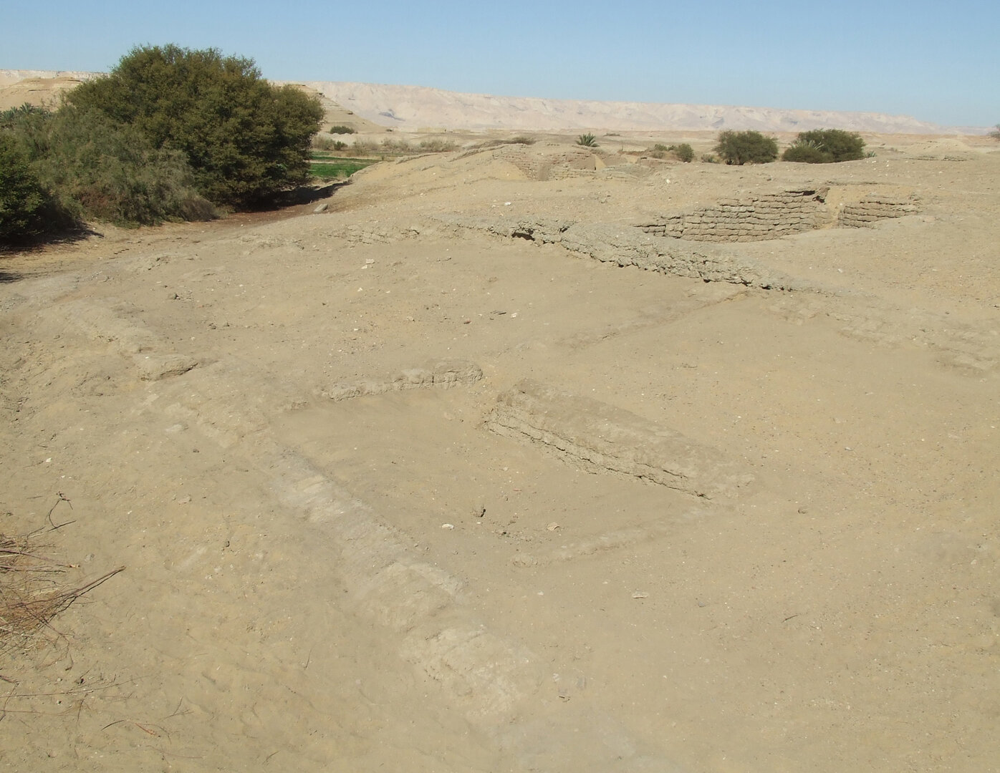{#plt-6.1 fig-alt="Pl. 6.1: Complex of rooms along the west edge of mound I before excavation."}

## Room B17 {#sec-6.1-room-b17}

### Features

B17 is a rectangular room located in the southwestern part of the complex (@plt-6.2; @plt-6.4, @plt-6.5, @plt-6.6). It measures 3.73 m north–south by 1.76 m east–west and has walls preserved to a maximum height of 1.04 m (east wall BF206). The west wall of the room is part of the same wall (BF199) that formed the western boundary of the complex in its oldest stage. The north side of B17 is in common with room B24 and consists of a wall (BF203) built on top of a mud-brick platform (partially exposed in room B24) and of the southern end of wall BF200. The south wall of B17 (BF207) abuts west wall BF199 and is, in turn, abutted by east wall BF206. The latter also abuts the features, mentioned above, forming the north boundary of this space. No evidence was gathered on what kind of roof (if any) covered the room, which was accessible through a doorway (BF205; width: 72 cm) located at the northern end of the east wall. A mud-brick threshold is set between jambs, which are preserved to a height of about 40 cm. The threshold, which stands 19 cm above four foundation courses that are a continuation of the east wall, is in phase with both the floor of room B17 (BF186)[^1] and the uppermost (BF184) of the two floors of room B18 to the east. Thus, it seems that the lower floor level of room B18 (BF216) had been laid out when the east wall of room B17, and the doorway between B17 and B18, had not yet been built.

The archaeological investigation of room B17 revealed that the north and south walls of this space, as well as its stratigraphical deposits, were subject to substantial shifting, as pointed to by large cracks running north–south.
<pb n="213">

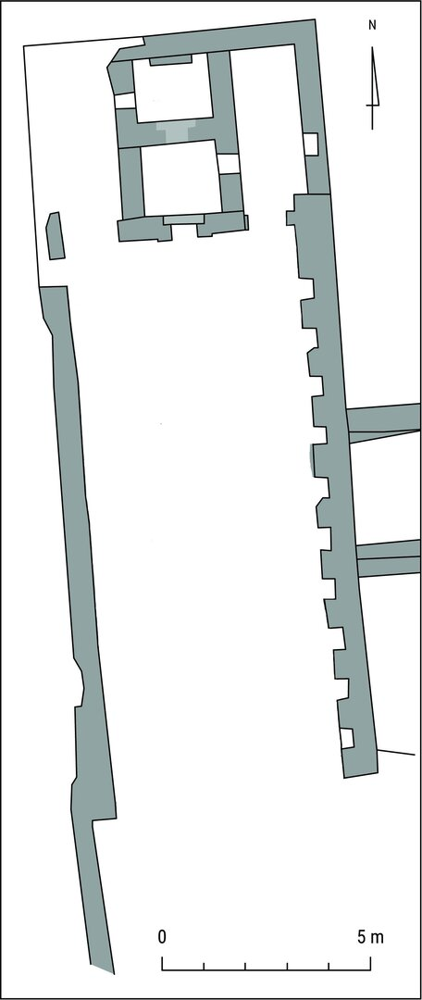{#plt-6.2 fig-alt="Pl. 6.2: Plan of the west complex."}

<pb n="214">

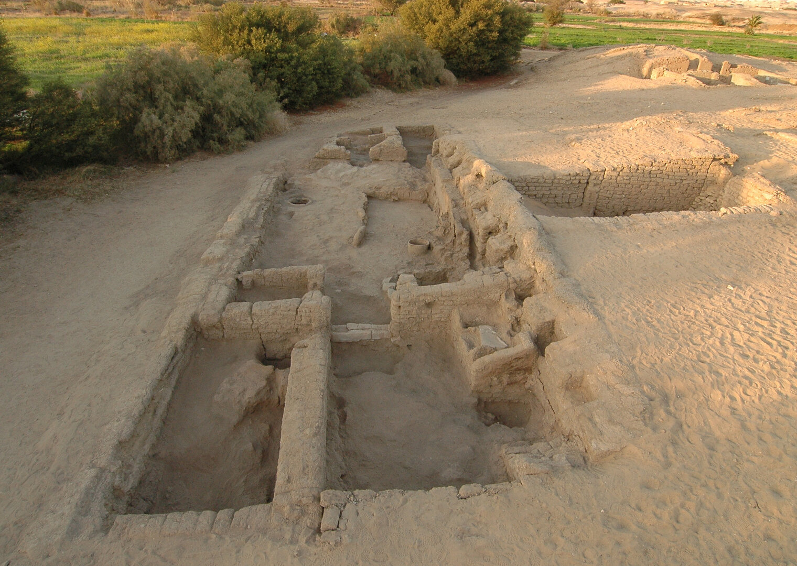{#plt-6.3 fig-alt="Pl. 6.3: Aerial view of rooms B17–B24 (to N)."}

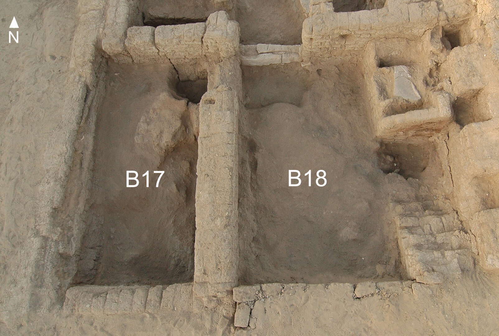{#plt-6.4 fig-alt="Pl. 6.4: Aerial view of rooms B17–B18."}

<pb n="215">

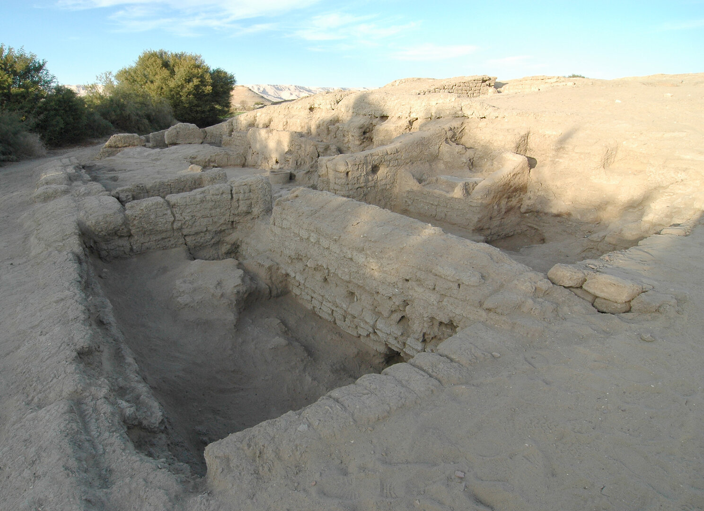{#plt-6.5 fig-alt="Pl. 6.5: View (to NE) of room B17 (in the foreground)."}

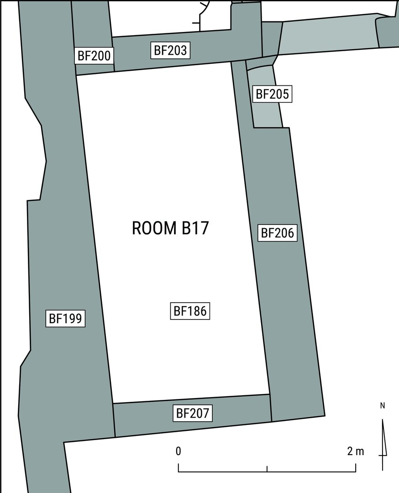{#plt-6.6 fig-alt="Pl. 6.6: Plan of room B17."}

<pb n="216">

### Stratigraphy

[Pl. 6.7](#plt-6.7)

The fill of room B17 consisted of a surface layer of wind-blown sand (DSU138),[^2] which covered also the other rooms of the complex. The inclusions consisted mostly of pebbles and potsherds (10.04 kg from the surface of rooms B17–B24). Underneath DSU138 was a sub-surface level (DSU150)[^3] extending throughout room B17 and consisting of soft yellow sand, mud-brick debris, a few ceramic fragments (1.73 kg), pebbles, and rare organic inclusions (mostly wood). DSU150 rested on top of a thick deposit of soft brown sand (DSU152),[^4] which covered the entire area of room B17. This deposit was mixed with potsherds (1.79 kg), pebbles, mud-brick debris, and rare organic inclusions, and contained a large fragment of limestone. Three bronze coins were found during the excavation of this unit; two (inv. 1034 and 1078) were badly corroded and unreadable, while a third one (inv. 1203) was a votive coin of Constans dated to 347–348.

DSU152 covered another deposit (DSU160)[^5] of yellowish/brown sand with lenses of mud dust, extending along the east wall and in the central and southern parts of room B17. It also filled a cavity below the eastern wall of the room. DSU160 was mixed with potsherds (5.54 kg), mud-brick debris, a small piece of limestone, and organic material, such as vegetal fibers, wood fragments, and animal bones. A globular ribbed bead of blue dull glass (inv. 1023) was also found while excavating this unit, which lay, as well as sub-surface (DSU150) and DSU152, on the scanty remains (visible in the north half of the room) of a floor made of packed silt and mixed with lime spots and small potsherds. DSU160 seems to have filled part of the room shortly after the formation of the north–south oriented cracks that are visible, within the stratigraphy of B17 and in its north and south walls, down to bedrock.

DSU160 lay on top of what appeared to be two structural layers. One was DSU164,[^6] a levelling layer of compacted grayish/brown soil containing a few pottery sherds and pebbles.[^7] It was found in the western half of the room and seems to have been an upper preparation layer for the room’s floor. Underneath DSU164 (and partly under DSU160) was a second leveling layer of packed brown soil, mixed with a large amount of potsherds, pebbles, and rare organic material (DSU162).[^8] This deposit, which had been laid directly above the geological surface, was visible, in relatively good condition, in the central part of the room, while it was completely absent in the southern part of the room (where the geological layer appeared to be at a higher elevation).[^9]

A small hole near the northeast corner of the room was filled with yellowish/brown sand (DSU159),[^10] which contained very few ceramic fragments, pebbles, and rare mud-brick debris. The unit, which was rather similar to DSU152, lay under sub-surface and above bedrock. In proximity to the doorway, a small wall collapse (DSU151)[^11] was found immediately below the surface and resting above DSU150. It consisted of fragmentary mud bricks and mud-brick debris and also included a roughly worked stone.

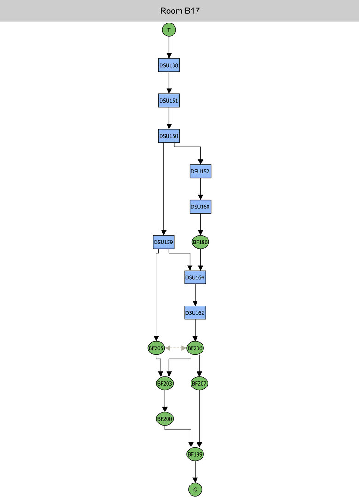{#plt-6.7 fig-alt="Pl. 6.7: Matrix of room B17."}

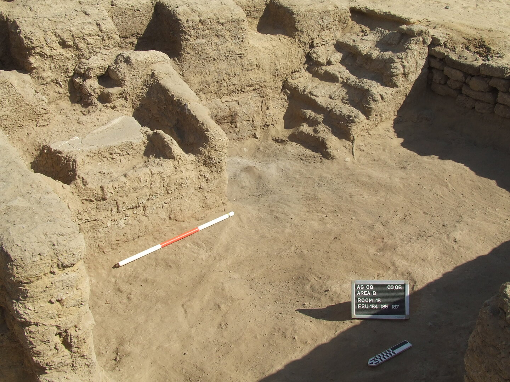{#plt-6.8 fig-alt="Pl. 6.8: View of room B18 (to SE)."}

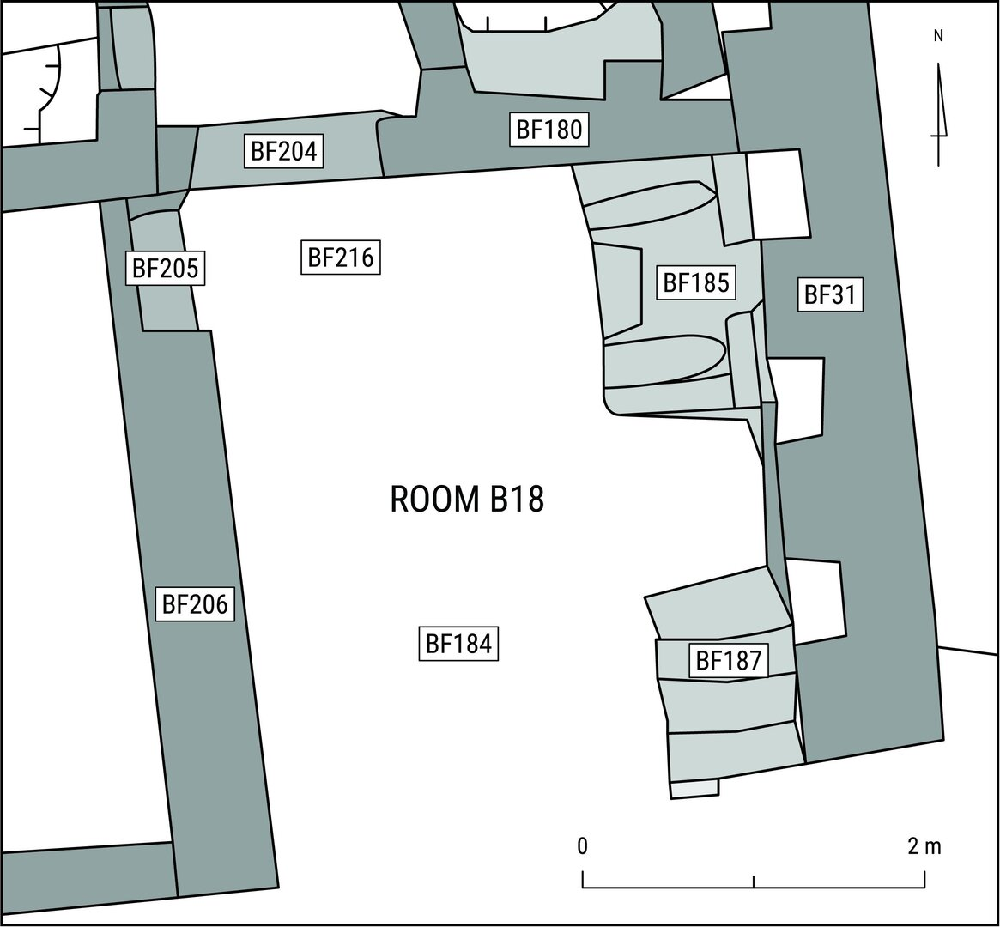{#plt-6.9 fig-alt="Pl. 6.9: Plan of room B18."}

## Room B18 {#room-b18}

### Features

To the east of B17 (and connected with it through doorway BF205) is room B18, a rectangular space measuring 3.65 m north–south by 3.21 m east–west (@plt-6.2, @plt-6.4, @plt-6.8, @plt-6.9). Its walls are preserved to a maximum height of 2.19 m (in the northeast corner). The east boundary of this space is in fact the north–south niched wall (BF31) belonging to the earliest construction phase of the complex, thus predating the creation of room B18.[^12] Indeed, the north wall (BF180) abuts the crenellated feature to the east and the west wall (BF206), which is shared with room B17, was built, as seen above, at a later stage, abutting the mud-brick features forming the south boundary of room B24. The south wall of room B18 is missing.[^13] Patches of two clay floor levels were discovered within the room, with the uppermost (BF184)[^14] in phase with the floor discovered in room B17 to the west (BF186).[^15] As was the case for the latter space, also in room B18 no information is available on the kind of roof that once covered this space, if indeed any did. The vault bricks found near the doorway between rooms B18 and B19 may have belonged to the ceiling of the courtyard, for which there is considerably more evidence.

B18 seems to have provided the only access to the whole complex of rooms B17–B24, either through a doorway set into the now-missing south wall or a staircase (BF187) placed in the southeast corner. Access from room B18 into courtyard B19 was through a large doorway (BF204; width: 1.15 m), whose remains consist of two mud-brick jambs and a limestone threshold (@plt-6.10). The latter, which was not made of a single block but of several pieces, rested on two foundation courses of mud bricks. As seen above, another doorway, set at the north end of the west wall, connected room B18 with room B17 to the west.

The staircase set against the southeast corner of the room abuts the southern end of the east wall and descends from south to north (@plt-6.11, @plt-6.12). It measures ca. 120 cm north–south by 85 cm east–west and its maximum height is 70 cm. The western side of the feature shows ten courses of mud bricks uniformly laid out in English bond and without traces of plastering. Five steps, each made of two courses of mud bricks, form the staircase; they were found in rather poor condition, with only one mud brick remaining of the highest preserved step.

The stairway once gave access to an unexcavated area to the south. As already pointed out, no wall was found against the south side of the staircase, and no traces of a south wall for room B18 were identified. It is not clear if the staircase was used to enter the complex from an area that was at a higher elevation or if it led to an upper floor or a roof; if this was the case, then an upper flight of stairs is missing.
<pb n="220">

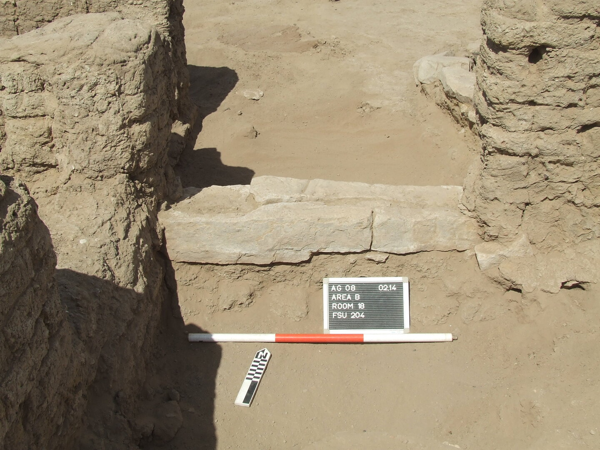{#plt-6.10 fig-alt="Pl. 6.10: Threshold of the doorway between rooms B18 and B19."}

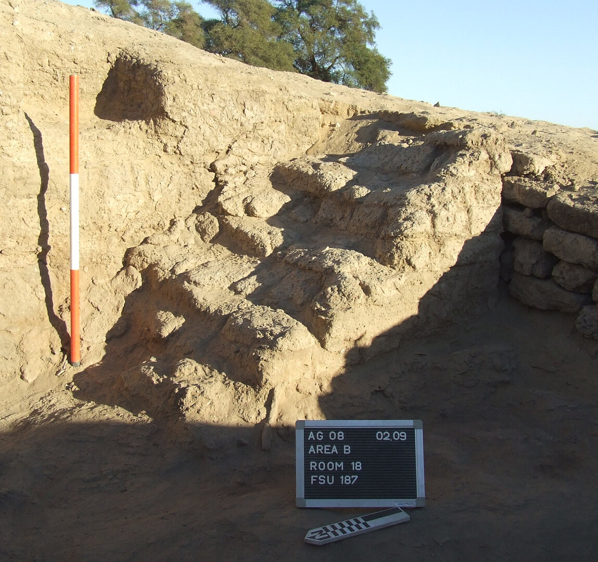{#plt-6.11 fig-alt="Pl. 6.11: Mud-brick staircase in the southeast corner of room B18."}

<pb n="221">

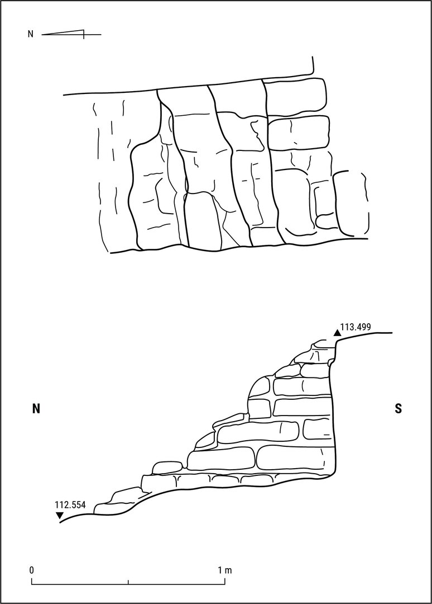{#plt-6.12 fig-alt="Pl. 6.12: N–S profile (and view from above) of mud-brick staircase in room B18."}

To the north of the staircase is a puzzling rectangular feature of mud brick (BF185: @plt-6.13, @plt-6.14). It is located in the northeast corner of the room, abutting both the east and north walls. The structure measures 1.50 m north–south by 1.07 m east–west, and its highest point, set against the east wall, is ca. 1.20 m. It was built in phase with the room’s upper floor, which abuts its west and south sides. The platform is made of mud bricks, whose bond is largely obscured by a thick layer of mud plaster, very rich in organic material and containing lime spots and several potsherds. Part of the plaster bears traces of ash, possibly due to the presence of a thick layer of ash and charcoal deposited against the central part of the east wall (between the platform and the staircase to the south).

The east and south sides of this features are higher than the others and partially enclose, together with the north wall of the room against which the platform is set, an uneven upper surface, which is open only along its west side. Two channels run east–west on top of this surface, along its north and south sides. Both are plastered with several layers of beige and pinkish plaster and seem to end where they meet the west edge of the platform. The north gutter is 80 cm long and 40 cm wide, while the south channel is 72 cm long and 20 cm wide. Between the two gutters, in the western half of the platform, is a rectangular space measuring 45 cm north–south by 22 cm east–west. To the east of it, and 16 cm above its level, is a stone slab laid horizontally and measuring 67 by 38 by 6 cm. The stone has a worked upper surface, which bears traces of circular marks that, because of a lack of space, could hardly have been created above the platform. This suggests that the stone had been reused.
<pb n="222">

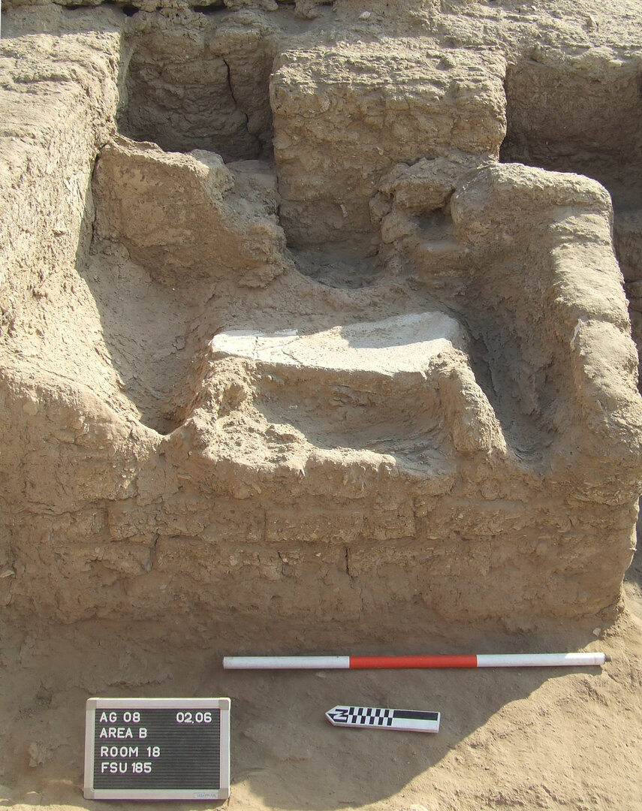{#plt-6.13 fig-alt="Pl. 6.13: Mud-brick platform in the northeast corner of room B18."}

It is possible that the two plastered channels were used to drain ground substances (or liquid?) off from the platform, but the identification of the feature as a press of some sort lacks indisputable evidence.[^16]

### Stratigraphy
@plt-6.15

The fill of room B18 consisted of the same surface layer of windblown sand (DSU138), mixed with a few potsherds and several pebbles, that covered the entire west complex. Within B18, this layer rested on a thick sub-surface deposit of yellow sand (DSU149),[^17] which included a few ceramic fragments (1.38 kg), pebbles, mud-brick debris and, in the northeast part of the room, a cluster of three mud bricks. This unit contained also a limited quantity of bones, glass (one fragment), and glass slag. The only other find consists of ten fragments of leather, some of which joined together (inv. 1083).
<pb n="223">

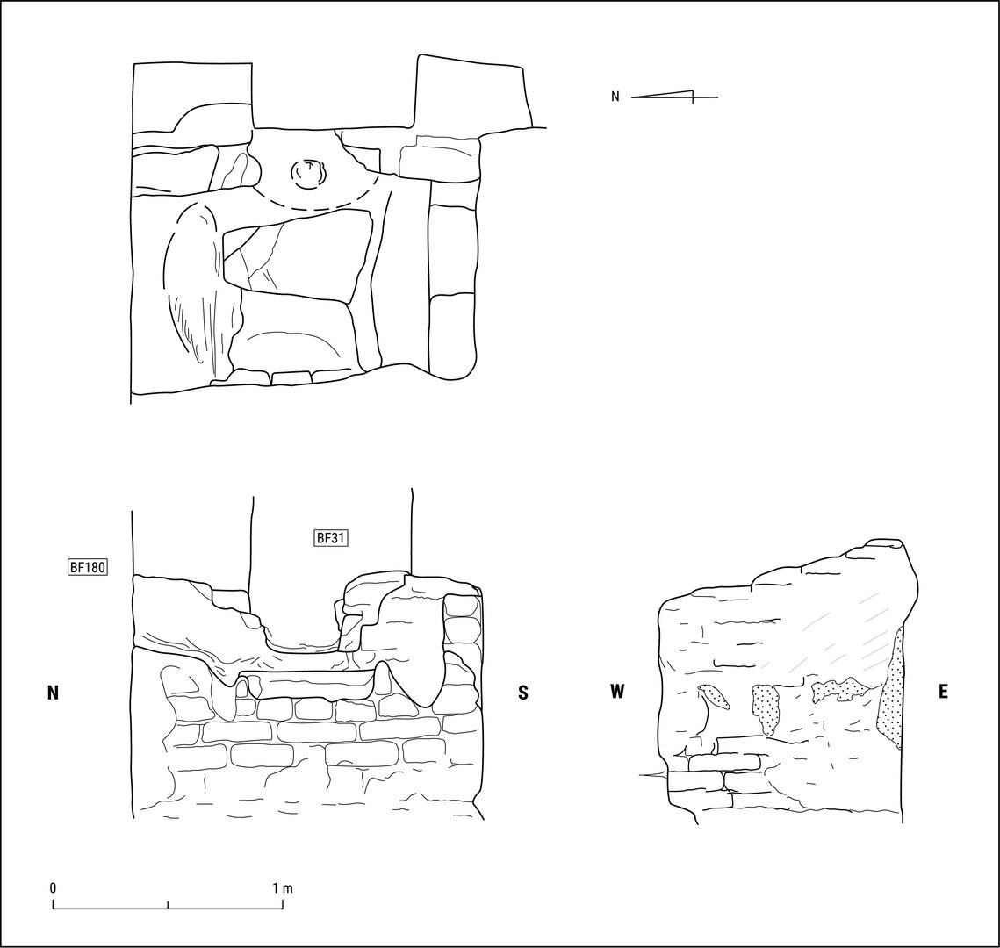{#plt-6.14 fig-alt="Pl. 6.14: N–S and E–W profiles (and view from above) of mud-brick platform in room B18."}

A vault collapse, consisting of fragmentary vault bricks and mud-brick debris mixed with pebbles and some pottery sherds (1.23 kg), likely used as chinking sherds, covered the area in the proximity of the doorway between rooms B18 and B19 (DSU155; @plt-6.16).[^18] It sloped down from northwest to southeast, with its highest point against the doorway opening from courtyard B19 into room B24. The collapse rested on a deposit of yellow soft sand (DSU161),[^19] mixed with mud-brick debris, rare potsherds (0.81 kg) and some pebbles. The unit sloped from northwest, into room B19, to southeast, crossing the doorway into room B18.

The sub-surface layer, the collapse in the doorway between rooms B18 and B19, and the underlying sand deposit rested on an occupational level (DSU156)[^20] consisting of yellowish/brown sand. The unit, which extended throughout the room above the upper floor level, contained potsherds (4.59 kg, including five fragments of faience), pebbles, mud-brick debris, and rare organic inclusions. Two bronze coins (inv. 1074 and 1202) were brought to light during the excavation of this deposit. They could not be read or dated due to their very poor condition.

In the north part of the room, where the upper floor was missing, DSU156 lay on top of a deposit of yellowish/brown sand (DSU179)[^21] with rare potsherds (0.46 kg) and pebbles and rich in organic inclusions. This unit, which rested on the remains of a lower floor, may have been part of a preparation layer for the upper floor.
<pb n="224">

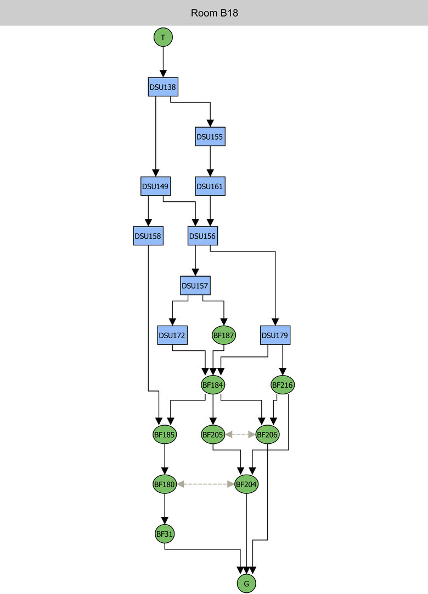{#plt-6.15 fig-alt="Pl. 6.15: Matrix of room B18."}

<pb n="225">

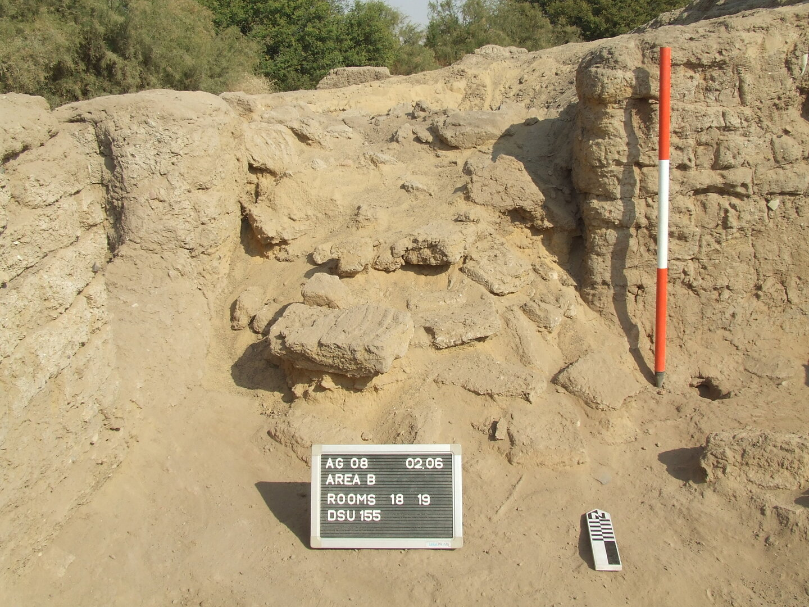{#plt-6.16 fig-alt="Pl. 6.16: View (to N) of vault collapse DSU155 protruding into room B18."}

A deposit of ash (DSU157),[^22] with abundant charcoal, other organic inclusions, ceramic fragments (2.03 kg), and rare pebbles was excavated along the central part of room B18’s east wall, filling the space between the mud-brick platform to the north and the staircase to the south. It lay beneath DSU156 and on top of DSU172,[^23] which was removed in a small test trench excavated against the central part of the east wall, where the floor was missing.[^24] DSU172 was a deposit of soft brown sand resting above bedrock. It was very rich in organic inclusions (such as plant fibers, wood, and animal bones) and contained a few pottery sherds (0.22 kg) and small lenses of ash and charcoal.

Above the mud-brick platform in the northeast corner of the room, a deposit (DSU158)[^25] of mud-brick debris, a few pottery sherds (0.11 kg), three pieces of limestone, and rare organic inclusions was excavated below sub-surface. It possibly originated from the partial disintegration of the upper courses of the platform or of the walls against which the platform itself had been built.
<pb n="226">

## Room B19 {room-b19}

### Features

Room B19 is the largest space of the complex (@plt-6.2, @plt-6.17, @plt-6.18). It is rectangular and measures about 9.10 m north–south by 4.75 m east–west, with walls preserved to a maximum height of 1.91 m (south end of east wall BF31). Square room B24 was built inside this courtyard, against its southwest corner.

Five doorways open onto room B19. The larger one (BF204) is set in the middle of the room’s south side and was once the main access from the outside through room B18. In the southwest corner, a small door (BF202) leads from the courtyard into room B24, while three doors set along the north side of B19 connect the room with a small square space in the middle (B20) and two rectangular rooms (B22–B23) symmetrically built to the sides of the latter.[^26]

The northern boundary of room B19 consists of the two segments forming the south wall of square room B20 (BF195), while the southern edge is defined by the south wall of room B24/ north wall of room B17 (BF203) and the north wall of room B18 (BF180). Both the east and west sides of B19 consist of inner partitions (BF210 to the east and BF200 to the west) built against earlier walls, which are considerably thicker and were once pierced by several niches. The west wall (BF199) is preserved at a lower elevation than the height at which the niches would have been set, but the east wall (BF31) still shows the lower half of seven niches (plus three in room B18), about 50 cm wide and 30 cm deep. These outer walls continue further south to form the boundaries of rooms B17 and B18 and likely belonged to the earliest construction phase of the complex. By contrast, the east and west inner walls of room B19 were built at a later stage, as part of a general partition of the space later occupied by rooms B17–B19.

The discovery of collapses, consisting for the most part of vault bricks, throughout room B19 is evidence for the fact that such a large space was originally covered by a barrel-vaulted roof.

The compacted mud floor (BF211),[^27] quite well preserved above an earlier floor level (BF222, identified in the northwest corner of the room),[^28] slopes down from north to south and shows considerable evidence of restorations. In particular, a large gap between the floor and the inner west wall of the room, possibly caused by the wall’s shifting toward the west, was filled with rubble, mud-brick debris and pebbles and topped by a thin layer of mud rich in organic inclusions (@plt-6.19). Another restoration was carried out in the southern half of the room, where an area of about 75 by 60 cm was filled with rubble and covered with a layer of mud mixed with organic material. Three circular marks were detected on the floor, possibly the imprints of ceramic vessels. In the northwest corner of the room, a hearth (BF213) is set at floor level, cutting through it to bedrock and still bearing traces of firing activity (@plt-6.20). The feature has a circular shape, with a diameter of 58 cm, and its upper edge is defined by special mud bricks with a semi-circular section, of which only two are lacking. A small pot was found set into the wall of the hearth, right below one of the missing bricks. The hearth cuts an earlier circular fireplace (BF226) located slightly to the north, whose remains were partially obscured by the upper floor of the room.

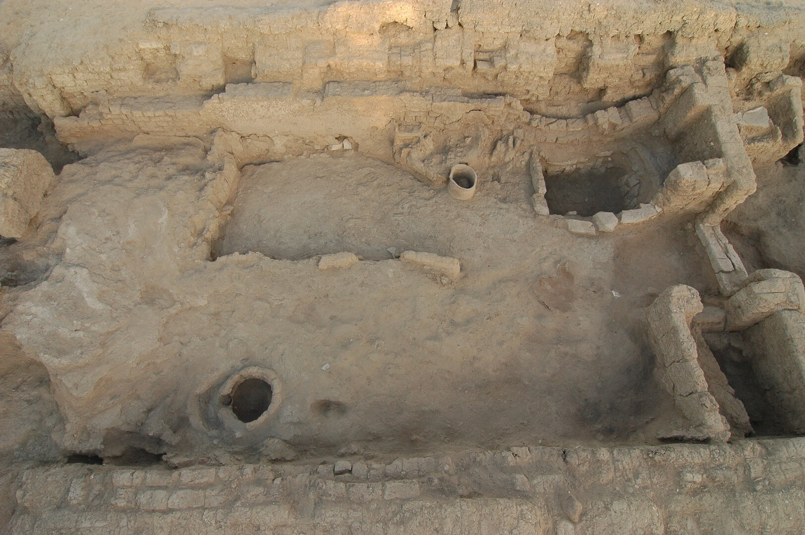{#plt-6.17 fig-alt="Pl. 6.17: Aerial view of room B19 (to E)."}

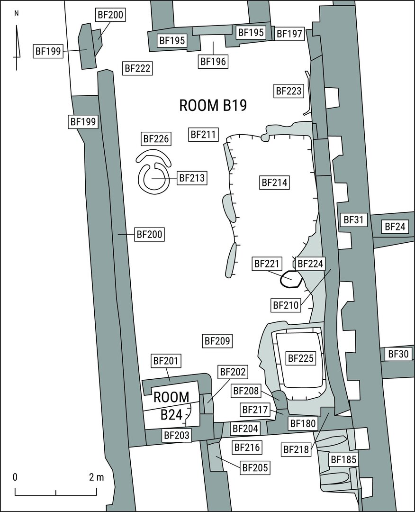{#plt-6.18 fig-alt="Pl. 6.18: Plan of room B19."}

<pb n="228">

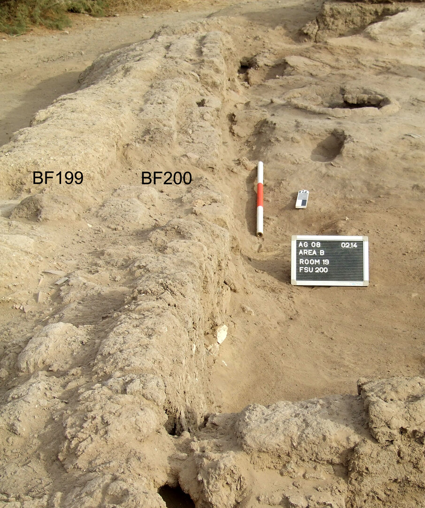{#plt-6.19 fig-alt="Pl. 6.19: View (to N) of west walls of room B19 (the rod lies in the gap between the floor of the room and wall BF200 shifted to the west)."}

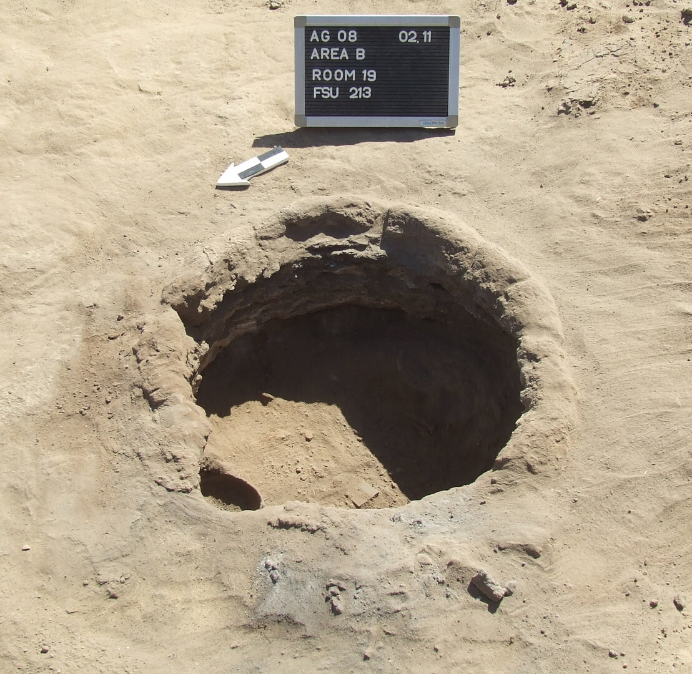{#plt-6.20 fig-alt="Pl. 6.20: Hearth BF213 in the northwest sector of room B19 (view to SE)."}

<pb n="229">

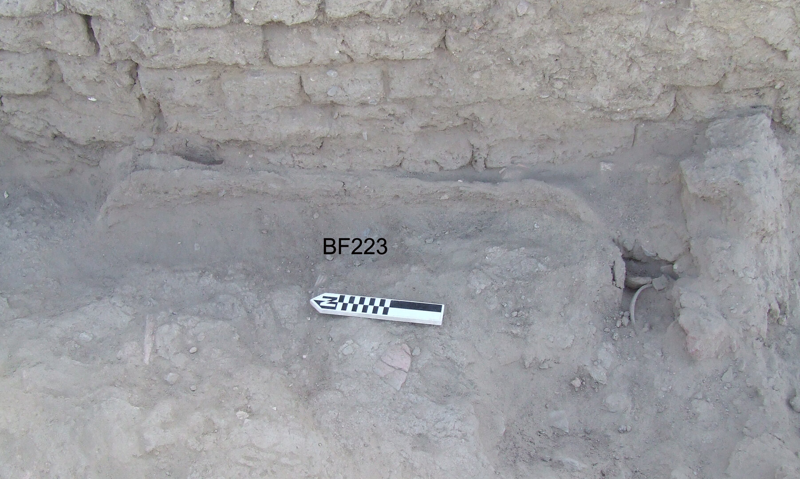{#plt-6.21 fig-alt="Pl. 6.21: Remains of clay bin BF223 embedded in the upper floor or room B19."}

In the northeast corner of room B19, traces of a roughly rectangular clay basin (BF223), built against the east wall, were detected at ground level (Pl. 6.21). The visible remains consist of the upper edge of the east wall (106 cm long) and of a segment (45 cm long) of the south boundary. It seems that the basin was filled with a preparation layer of debris and pottery when the upper floor was laid out, almost completely obliterating the feature.

To the south, a large rectangular basin (BF214) is placed against the east wall of the room, at a lower level than the late floor in its northern half (@plt-6.22, @plt-6.23). The feature consists of two walls, forming its north and west boundaries, and a clay floor laid on bedrock. The north wall, preserved only in its eastern half, stands to a maximum of 66 cm above the bottom of the basin and rises above the room’s floor only by a few centimeters. It is made of iron-rich mud bricks, set on end to form a uniform facing, and small pebbles. The west wall, about 35 cm high above the basin’s floor, was found in poorer condition, with only three remaining fragments. It mostly consists of clay molded on top of roughly hewn sandstone slabs, which are embedded in the floor of the basin. A large piece of a turning-wheel of baked clay,[^29] with an original diameter of 22 cm, was also found embedded in the floor, together with several large potsherds and a few pebbles (@plt-6.24). Traces of thick plaster are visible on the floor and against the east wall of the room, in common with the basin. The latter is open along its southern side, apart from its southeast corner, which is bounded by the irregular mud-brick feature set against the east wall. <pb n="230"> The floor of the basin forms a uniform surface with the floor of room B19 in its southern part, thus allowing easy access into the feature.

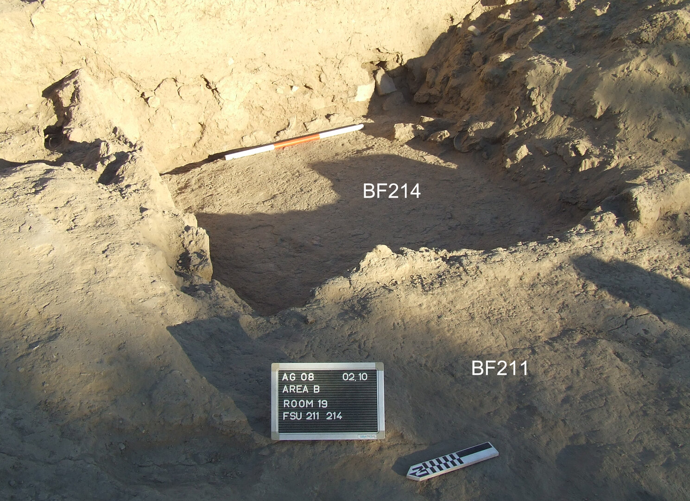{#plt-6.22 fig-alt="Pl. 6.22: Basin BF214 against the east wall of room B19 during excavation (view to SE)."}

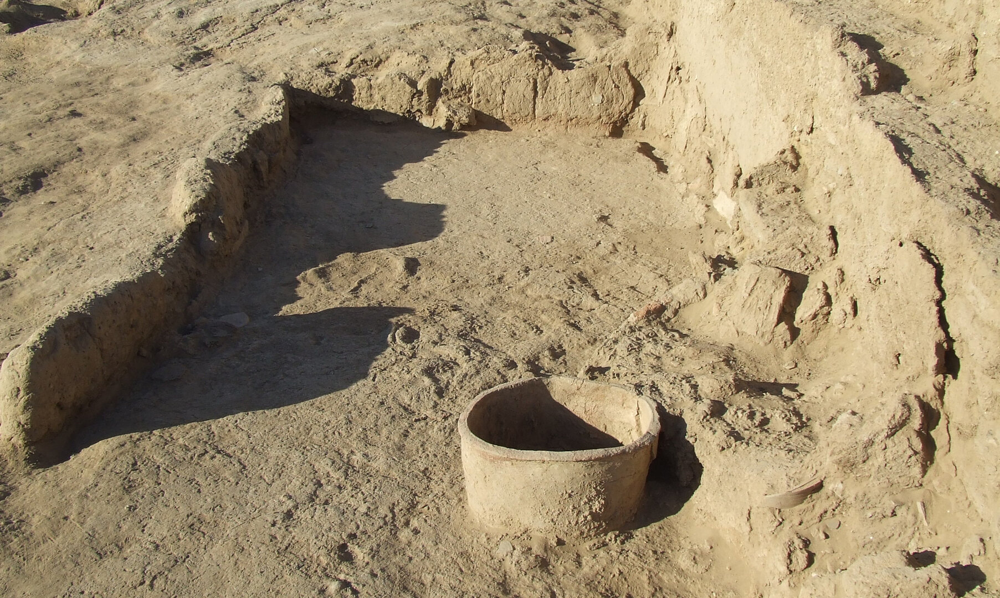{#plt-6.23 fig-alt="Pl. 6.23: View of basin BF214 after excavation (to N)."}

<pb n="231">

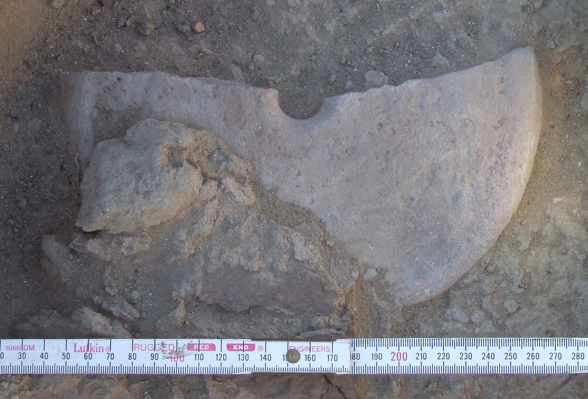{#plt-6.24 fig-alt="Pl. 6.24: Fragment of a turning-wheel embedded in the floor of room B19."}

A smaller but deeper stone and clay basin (BF225), of a roughly rectangular shape, was found in the southeast corner of the room (@plt-6.25, @plt-6.26). It measures 202 cm north–south by 77 cm east–west and is about 70 cm deep. It consists of four walls covered with a facing of stone slabs, large pieces of pottery, and plaster and a floor of packed clay, which was once fully plastered with mud mortar. The four walls abut earlier mud-brick features along the east, south, and west (south end) sides.[^30] To the north, the basin is abutted by a large and irregularly shaped mud-brick structure (BF224) that lies, in very poor condition, against the inner east wall of room B19. To the south of the basin is a rectangular ledge that fills the space between the basin itself and the east segment of room B19’s south wall. The ledge, which rises ca. 65 cm above the top level of the floor’s basin, has a horizontal surface of mud brick fully plastered with mortar, in which a large fragment of a turning wheel of baked clay was embedded. The existence of stone slabs and plaster facing the walls of the basin suggests that this feature was used to store liquids, for instance water that may have been used in the process of clay kneading.

A well-preserved bin of baked clay (BF221) was identified along the east wall of room B19, between the larger and the smaller basins (@plt-6.27). It has an ovoidal shape, with a small diameter of 41 cm (north–south) and a large diameter of 53.5 cm (east–west). The depth of the bin, which is attached to the floor, is 24 cm. The excavation of its fill revealed a lump of partially worked clay, which points to the use of this feature in the context of ceramic production.

Another clay storage bin (BF209), with very thick walls, was found, not *in situ* and in a very poor state of preservation, while excavating the deposits in the southern half of the room (@plt-6.28). It has a roughly oval shape, with a maximum width of 68 cm and a height of 33 cm. It may have fallen from above the vaulted roof when this collapsed into the room.

<pb n="232">

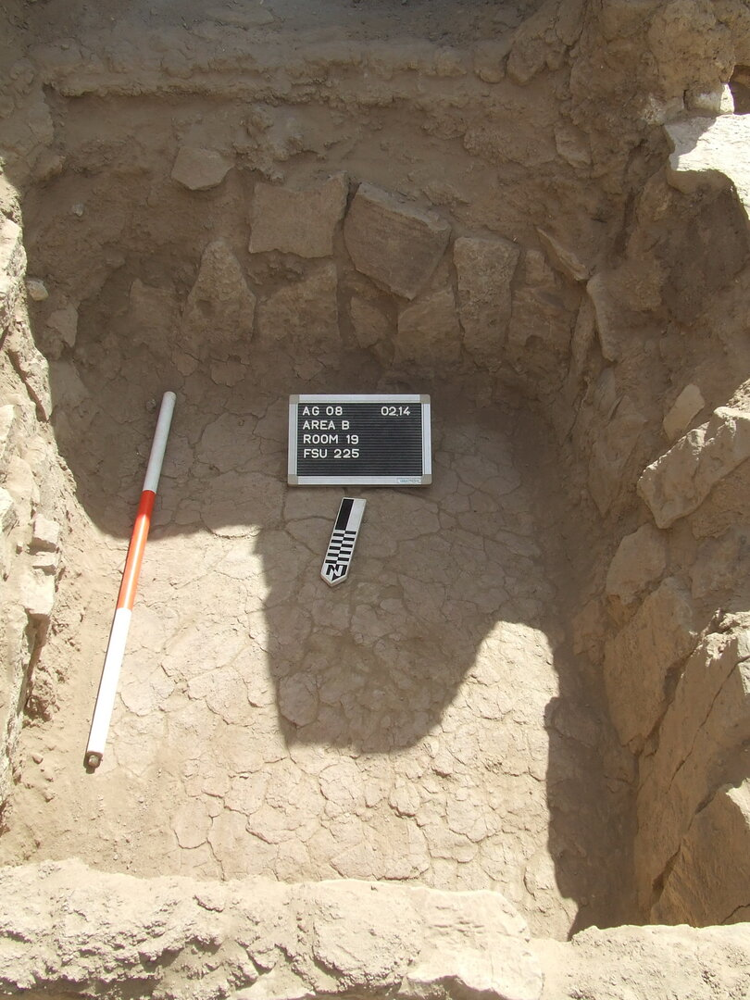{#plt-6.25 fig-alt="Pl. 6.25: View of basin BF225 in the southeast corner of room B19 (to S)."}

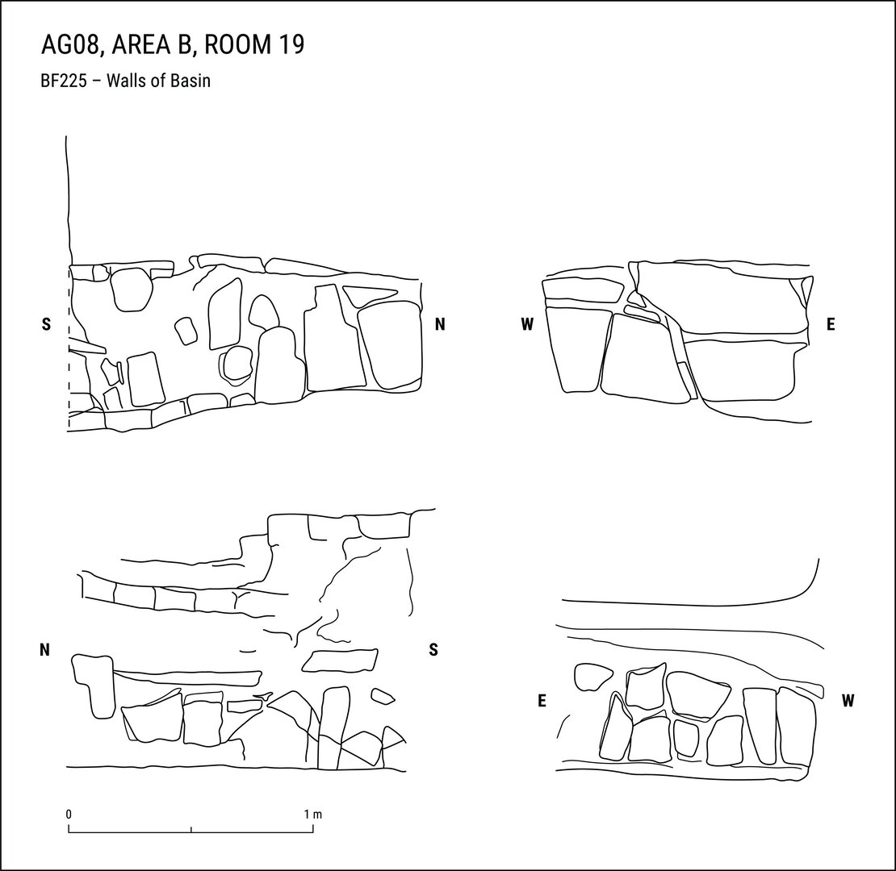{#plt-6.26 fig-alt="Pl. 6.26: Walls of basin BF225."}

<pb n="233">

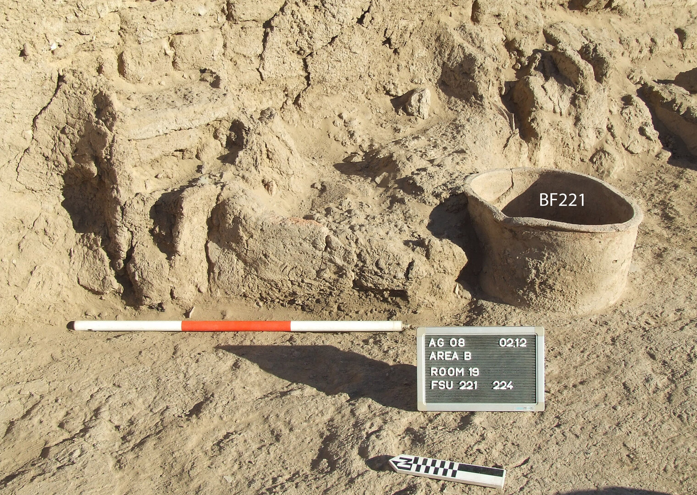{#plt-6.27 fig-alt="Pl. 6.27: Clay bin (BF221) along the east wall of room B19 (view to SE)."}

The presence of bins and large basins, one of which was plastered and fitted to contain liquids, as well as the discovery of partially worked clay and several sherds of unbaked pots, led to the preliminary identification of the complex, at least in its late occupational phase, as a small-scale industrial establishment, more specifically a workshop for the production of ceramic vessels.[^31]

### Stratigraphy
@plt-6.29, @plt-6.30

The stratigraphy of room B19 consisted largely of units of wall and vault collapse alternating with deposits of sand, in addition to the contexts excavated at and beneath floor level and those contained into features such as the clay basins.

A thin surface layer of windblown sand (DSU138) covered the entire area of the courtyard (as well as all other rooms of the western complex). It contained several pebbles and pottery sherds and, within room B19, a few bones and wood fragments. Underneath DSU138, two large collapse units were revealed, although already partially visible above ground. One was a vault collapse (DSU146)[^32] and extended throughout most of room B19 (Pl. 6.31). It consisted of four clusters, joined together, of whole and fragmentary vault mud bricks and mud-brick debris and contained a few bones, rare glass slag, two fragments of glass vessels, and potsherds (34.62 kg). Three piles lay in the eastern half of the room, sloping gently from northwest to
<pb n="234"> southeast, while the fourth cluster was located in the western part of the room. The removal of this context brought to light an incomplete oval lamp (inv. 1002), a bead of dark blue glass, (inv. 1012), and a terracotta figurine of a woman holding a round object, possibly a tambourine (inv. 1004).[^33] The second collapse unit of wall and vault mud bricks (DSU165),[^34] including mud-brick debris, many potsherds (36.76 kg), organic material (bones and textiles), and lenses of sand, was removed from the southeastern corner of B19. One diagnostic fragment of a green glass beaker (inv. 1068) was found in this context, as well as a complete Greek ostrakon (inv. 1007) consisting of a list of names; these recur on ostraka from the West Church of Kellis, which is dated after 350 CE.[^35] The lower reaches of DSU165 were found under DSU154,[^36] a layer of windblown sand mixed with potsherds (17.05 kg), mud-brick debris, a few pebbles, rare wood and bones, and containing a diagnostic fragment of a white glass beaker (inv. 1057). This unit extended throughout most of the courtyard, and also beneath DSU166,[^37] another deposit of sand mixed with mud-brick debris and containing potsherds (5.27 kg), bones, glass slag, and one fragment of a glass vessel. This unit sloped down from northeast to southwest toward the central part of the room. In turn, DSU154 lay under the more extensive collapse (DSU146) and above DSU167,[^38] a cluster of about twenty vault mud bricks and mud-brick debris, containing potsherds (1 kg) and glass slag, located in the southwest part of the courtyard. The latter unit covered the above-mentioned DSU166, therefore providing indisputable evidence for the fact that collapse DSU165 was an earlier episode than the more extensive collapse DSU146.[^39]

<pb n="235">

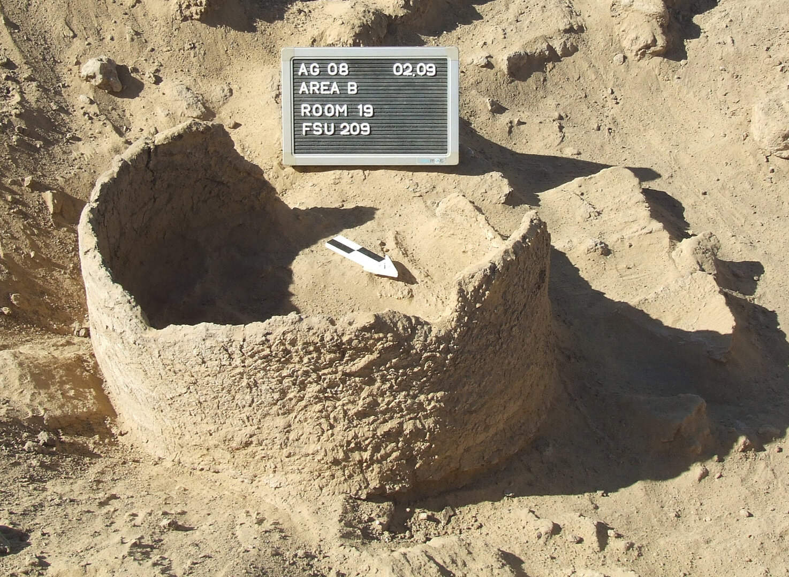{#plt-6.28 fig-alt="Pl. 6.28: Clay bin BF209 found (not *in situ*) in the southern half of room B19."}

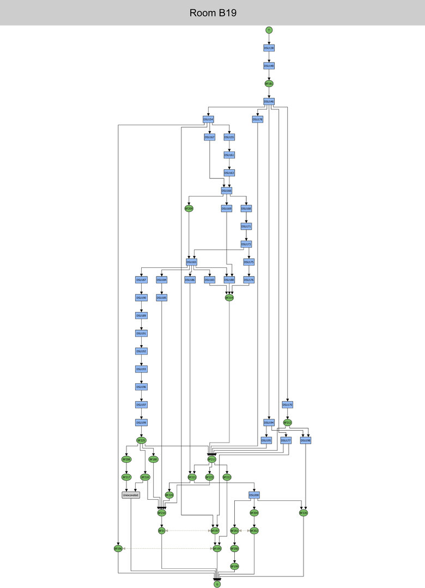{#plt-6.29 fig-alt="Pl. 6.29: Matrix of room B19."}

<pb n="236">

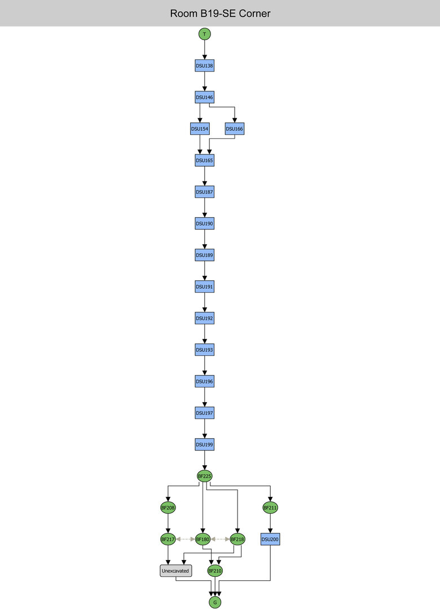{#plt-6.30 fig-alt="Pl. 6.30: Matrix of room B19."}

<pb n="237">

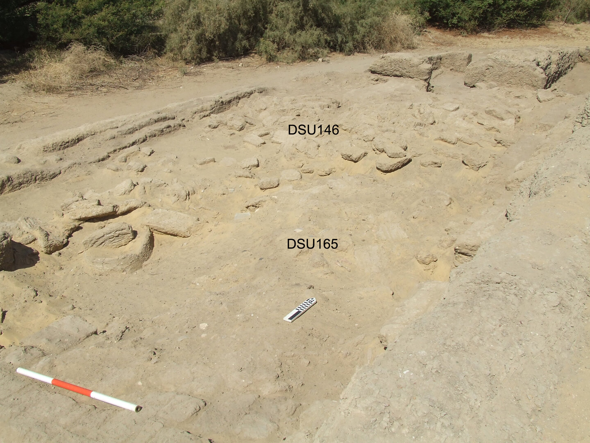{#plt-6.31 fig-alt="Pl. 6.31: View of DSU146 and DSU165 (to NW)."}

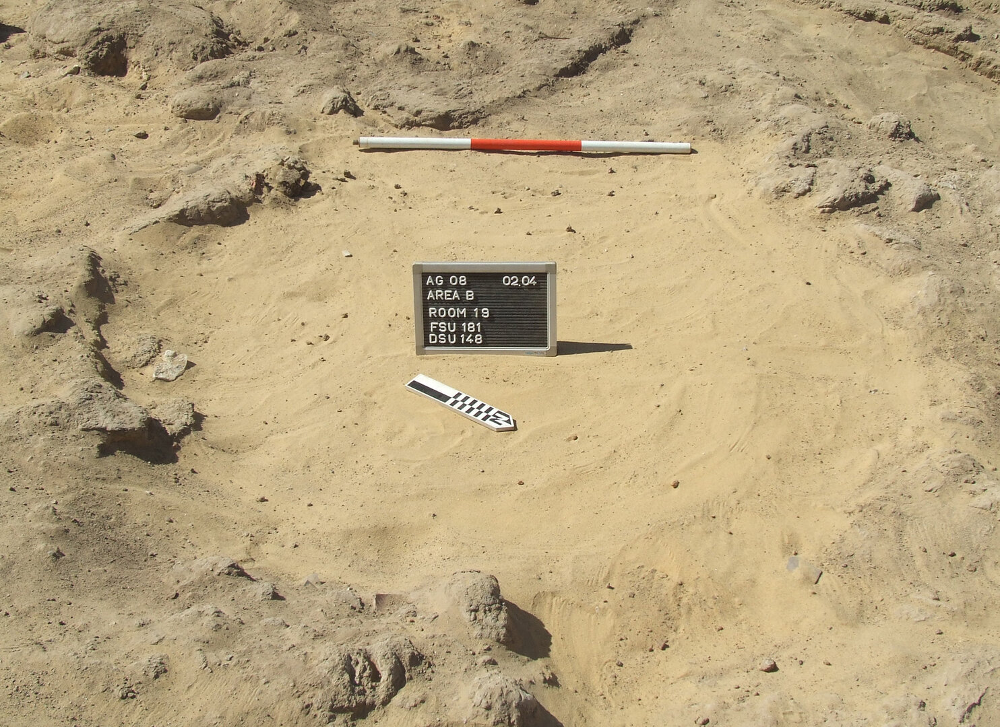{#plt-6.32 fig-alt="Pl. 6.32: View of DSU148 (fill of pit BF181) (to SW)."}

<pb n="238">

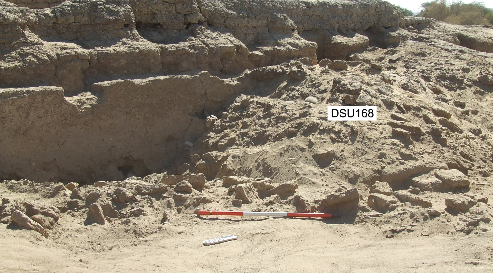{#plt-6.33 fig-alt="Pl. 6.33: View of vault collapse DSU168 in room B19 (to SE)."}

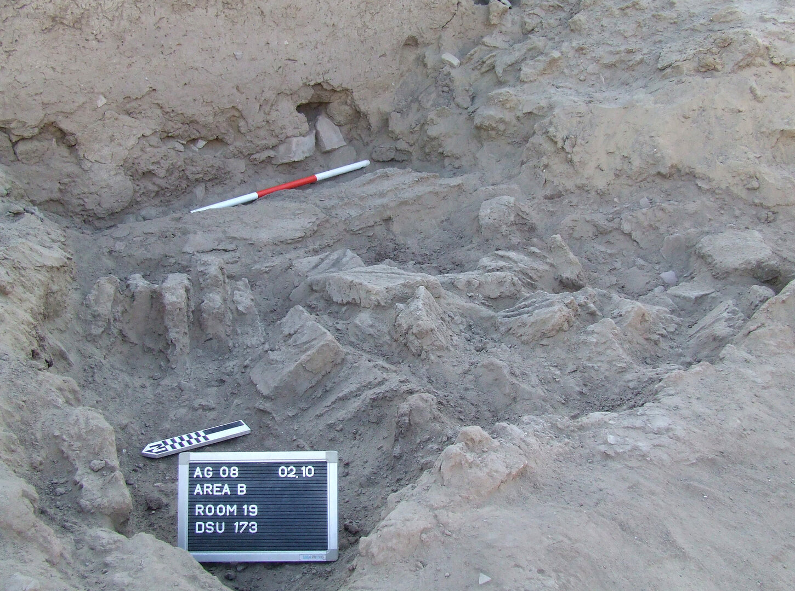{#plt-6.34 fig-alt="Pl. 6.34: View of vault collapse DSU173 inside basin BF214 (to SE)."}

<pb n="239">

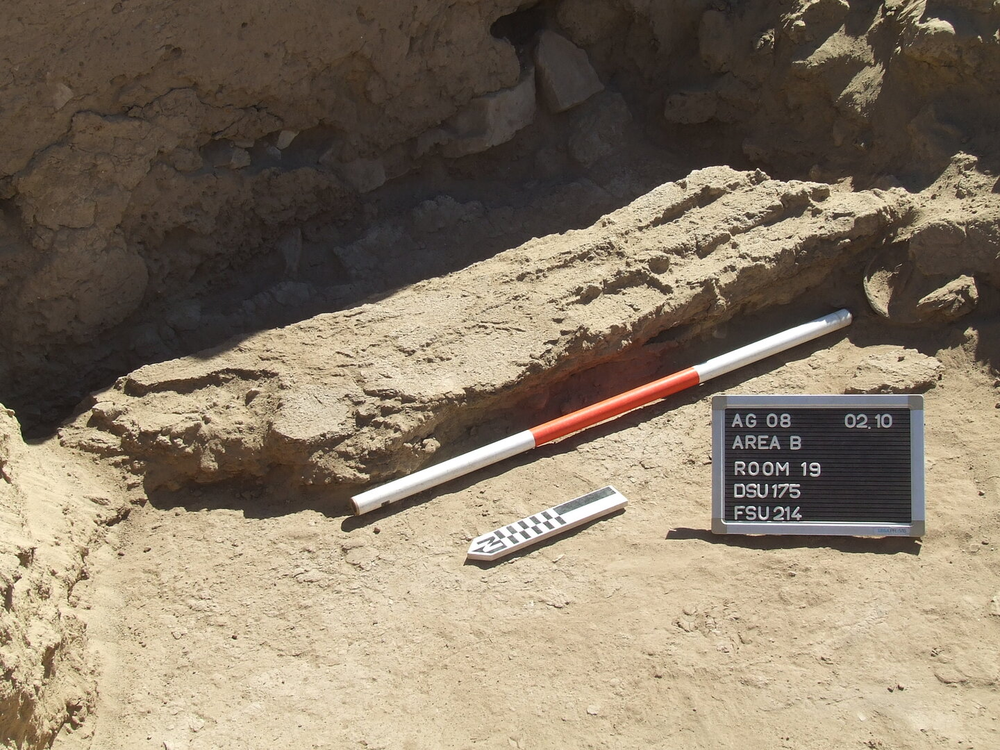{#plt-6.35 fig-alt="Pl. 6.35: View of collapsed wall DSU175 (to SE)."}

A roughly circular pit (BF181) was found below the surface in the southern half of the room. It cut through several units of collapse and sand and was filled by DSU148 (@plt-6.32),[^40] a layer of windblown sand with a few potsherds (1.66 kg), pebbles, and rare mud-brick debris.

A thin section of the large collapse DSU146 covered the area of the doorway into room B24, resting above DSU154 and a sequence of wall and/or vault collapses and sand deposits. Under DSU154 was a vault collapse (DSU155), which sloped down from northwest to southeast to fill also the area of the doorway between rooms B18 and B19 (@plt-6.16).[^41] Underneath DSU155 was a deposit of windblown sand, mixed with mud-brick debris, a few potsherds (0.81 kg), and pebbles (DSU161).[^42] This unit rested on top of a small wall collapse (DSU163),[^43] located immediately to the north of the doorway onto room B18 and sloping down, from northwest to southeast, to end above its threshold. The unit, which consisted of small fragments of mud bricks, burnt bricks, and mud-brick debris and contained rare potsherds (0.57 kg) and pebbles, partially lay above DSU166, mentioned above. Beneath the latter was an episode of wall collapse (DSU169), which filled room B24 entirely and extended through the doorway into room B19.[^44]

The removal of the extensive collapse below the surface (DSU146) revealed, in the central and northeastern parts of the courtyard, the remains of the room’s upper floor and
<pb n="240"> the large rectangular basin (BF214) placed against the east wall. The basin was filled with a dense sequence of vault collapses alternating with units of windblown sand. The uppermost layer, right below DSU146 (and partially under DSU166), was DSU168,[^45] which sloped down westwards and consisted of large fragments of vault mud bricks, mud-brick debris, and a few pottery sherds (1.31 kg) (@plt-6.33). It partly covered a layer of light brown sand (DSU171),[^46] mixed with mud-brick debris, some large fragments of mud bricks, potsherds (1.32 kg), and containing one glass fragment. The removal of this deposit revealed an incomplete circular stopper of light brown clay (inv. 1052), with a pottery sherd embedded on its convex surface (almost certainly for a label), and two bronze coins (inv. 1081, dated to 364–378, and inv. 1201, dated to 383–393). Beneath DSU171 was another collapse episode (DSU173; @plt-6.34),[^47] which contained fragmentary vault mud bricks clustered in small piles, mud-brick debris, numerous fragments of mortar, potsherds (3.45 kg), one glass fragment, rare glass slag, bones, and one iron fragment. The few small objects that were retrieved during the excavation of this unit consist of a bead of dark blue glass (inv. 1054) and four bronze coins. One of them (inv. 1086) was dated to 337–340, while another (inv. 1062) was broadly assigned to the fourth–early fifth century on the basis of size and weight. The third specimen (inv. 1094) was assigned to the fourth century, while the remaining coin (inv. 693) could not be dated due to its poor condition. DSU173 rested on top of a wall facing (DSU175)[^48] consisting of mud plaster with brick impressions, which had collapsed into the basin, possibly from a feature abutting the east wall of the room (and part of the basin itself) (@plt-6.35). The removal of the collapsed facing, which was made of mud plaster <pb n="241"> and still bore the impressions of bricks, revealed a layer of soft brown sand (DSU176),[^49] mixed with mud-brick debris, fragmentary mud bricks, and a few potsherds (0.07 kg), resting directly above the floor of the basin.

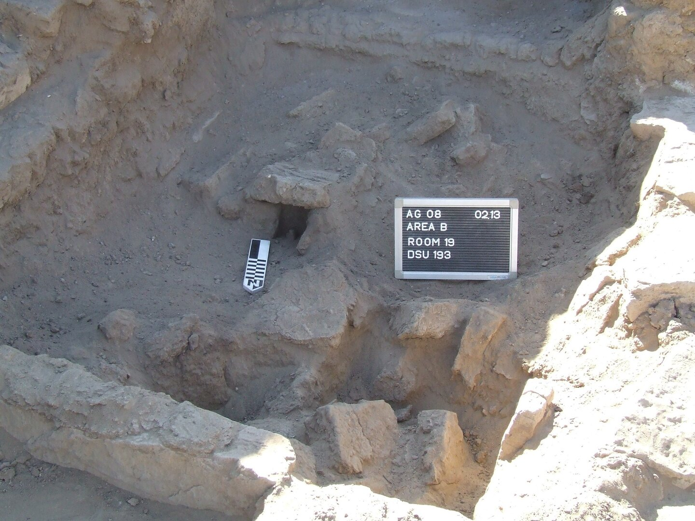{#plt-6.36 fig-alt="Pl. 6.36: View of DSU193 (to SSE)."}

In the southeast corner of the courtyard, a sequence of sand units and wall and vault collapses, possibly associated with the partial destruction of the inner and outer east walls, filled the deep basin dug into the ground (BF225). Right below DSU165 was DSU184,[^50] a wall and vault collapse below the surface, consisting of two clusters of wall mud bricks, mud-brick debris, pottery sherds (1.97 kg), and very few bones. DSU184, which originated from the partial collapse of the outer east wall, partly lay above another collapse (DSU185),[^51] this time from the inner east wall. The unit, which rested also under DSU165, included whole and fragmentary bricks, mud-brick debris, and some pottery sherds of small and medium dimensions (0.6 kg). DSU165 lay also above a unit of light brown sand (DSU187)[^52] mixed with mud-brick debris, potsherds (0.92 kg), a few pebbles, and abundant organic inclusions (such as charcoal, wood, bones, and vegetal fibers). This deposit surrounded a circular patch of ash (DSU190),[^53] mixed with charcoal and pottery sherds (0.96 kg), that was located against the room’s inner east wall. Both units lay on top of a wall collapse (DSU189)[^54] that sloped from south to north and consisted of complete mud bricks, mud-brick debris, and small to medium ceramic sherds (0.82 kg). Underneath it was a deposit of light brown sand (DSU191),[^55] ca. 20 cm thick, that contained mud-brick debris, a few potsherds (0.78 kg), and a limited quantity of charcoal and bones. Its removal brought to light two additional units; one, located in the northwestern corner of the basin, was a context of soft olive brown sand (DSU192),[^56] mixed with mud-brick debris, several pebbles, a few pottery sherds (0.19 kg), and some charcoal. The second layer was a limited wall and vault collapse (DSU193)[^57] made of complete and fragmentary mud bricks and several small-to-medium potsherds (3.27 kg), and rare bones (@plt-6.36). This unit, which was covered also by DSU191, lay on top of DSU196,[^58] a deposit of brown sand with mud-brick debris, a few pebbles, small ceramic fragments (0.93 kg), and some organic material (mostly bones and charcoal). Beneath it was a vault and wall collapse (DSU197),[^59] consisting of whole wall and vault bricks, mud-brick debris, a few bones, and a few pottery sherds (0.42 kg). Finally, the bottom of the basin was covered by a layer of brown sand (DSU199)[^60] mixed with a few ceramic sherds (0.53 kg), pebbles, fragments of mud bricks, and charcoal.

Several holes were revealed and investigated within the upper floor of room B19. In the northwest corner, where the floor was missing, a layer of mud-brick debris (DSU178)[^61]
<pb n="242">
containing potsherds (0.30 kg), pebbles, abundant organic inclusions (mostly vegetal fibers) and two roughly worked fragments of limestone blocks, was removed above the remains of a lower floor. Another unit of mud-brick debris and mud dust (DSU177),[^62] containing several potsherds (1.16 kg) and one complete bowl with white plaster inside and red dots along the rim (inv. 1111), was cleared in the northeast corner of the courtyard below collapse DSU146, to reveal the remains of the clay basin embedded in the upper floor. The preparatory layer of this floor (DSU200),[^63] consisting of packed mud with several potsherds, small pebbles, and numerous fragments of charcoal, was exposed in several parts of the room. Along the northern half of the inner west wall, a unit of yellowish/brown sand was excavated below surface (DSU194).[^64] It contained a few potsherds (0.15 kg), pebbles, some lenses of ash, charcoal, and numerous vegetal fibers. Underneath it was a layer of yellow sand (DSU195)[^65] mixed with several potsherds (0.3 kg, most of which were unfired), a few pebbles, burnt mud bricks, and small quantities of wood and charcoal. It was possibly laid out intentionally, in order to fill the gap caused by the shifting of the inner and outer west walls.

The clay storage bin (BF221), placed along the east side of the room, was filled by a unit (DSU186) [^66] of brown sand containing two potsherds (0.01 kg), pebbles, mud-brick debris, and a lump of clay.

DSU170[^67] was the fill of the circular hearth (BF213) set in the northwest part of room B19. It consisted of grayish/brown sand with pockets of ash, charcoal, date and olive pits, plant fibers, two almost complete vessels, a few potsherds (0.52 kg), pebbles, one small piece of iron, and rare coprolites (possibly for fuel). The remains of the earlier hearth to the north, cut by the later one, were filled by a layer of ash mixed with sand, fragments of charcoal, pebbles, a few ceramic sherds (0.13 kg), and vegetal fibers (DSU198).[^68]

Two other units were removed below collapse DSU165, resulting from the cleaning of the upper floor level. One was DSU183,[^69] a context of mud-brick debris, with some potsherds (2.12 kg) and organic inclusions (such as wood fragments, charcoal, and burnt date pits), that lay in the eastern half of the room. The second unit was DSU188,[^70] located in the southwestern part of the room and consisting of light brown sand, mixed with potsherds (4.04 kg, some of them unfired), fragments of glass vessels, organic material (including rare wood, bones, and plant fibers), a few pebbles, and, to the east of room B24, mud-brick debris. One bead of faience with blue glaze (inv. 1028) was the only registered object found in this context.

In addition to the coins gathered within the stratigraphical deposits of room B19, a bronze specimen (inv. 1045) was found embedded in the wall (F180) that divides rooms B19 from room B18 to the south. Unfortunately, it was badly corroded and could be only broadly assigned to the fourth century.
<pb n="243">

## Rooms B20-B21 {#rooms-b20-b21}

### Features

Rooms B20–B21 are located at the north end of the complex, along its main axis running north–south (@plt-6.2, @plt-6.37, @plt-6.38, @plt-6.39). The two spaces seemingly belong to the earliest construction phase of the building, as no evidence was detected that points to the alteration of older features or addition of new ones, as was the case in the central and southern parts of the complex. Rooms B20–B21 are interconnected and could once be accessed only through courtyard B19. B20 is a very small rectangular room, which measures 1.73 m north–south by 1.85 m east–west. Its walls are poorly preserved to a maximum height of 0.93 m (south end of east wall BF192). The south wall (BF195) abuts the east wall, which is shared with room B21 to the north and, in turn, is bonded with the north wall of room B20 (BF191). In the middle of the east wall are the scanty remains of a gap, which may have been either a niche or a window opening onto room B23 to the east. It is set 34 cm from the room’s north wall and three courses of mud bricks from the bottom of the wall. Its width is ca. 45 cm. The west boundary of room B20 (BF194) abuts the north wall (BF191) and is abutted by the south one (BF195).

Access into room B20 was through a doorway (BF196; width: 62 cm) placed in the middle of the south wall (@plt-6.40). Remains of two jambs, covered with mud plaster, and of a mudbrick threshold are still visible. A floor (BF182)[^71] of compacted mud, with organic inclusions and small pottery sherds, had been laid out directly on gebel. It hid the foundations of the surrounding walls, which consist of soldier courses (two rows of headers on edge) set directly on bedrock and protruding by ca. 10 cm from each face of the walls.

To the north, room B20 opens onto B21, a small space located at the north end of the complex, through a doorway (BF193) placed in the middle of the north wall (@plt-6.41). The opening (width: 54 cm) lies along the same north–south axis of the complex, in line with the doorway opening from the large courtyard into room B20. It consists of two side jambs and a poorly preserved mud-brick threshold. Room B21 measures 1.55 m north–south by 1.83 m east–west and has walls preserved to a maximum height of 0.65 m (east end of south wall BF191).[^72] In the middle of the west wall (BF190) is an opening (30 to 37 cm wide), possibly unintentional, as it is too low above the foundations to be a window or a niche and unusually narrow to be a doorway (@plt-6.42). A narrow facing (BF189), measuring 100 by 20 by 24 cm and fully plastered with mud, was built inside the room, abutting the south face of the north wall (BF188; @plt-6.43); its precise function is unknown. The floor (BF178),[^73] made of compacted mud mixed with pebbles and organic particles, is better preserved than that of room B20, although it is partially missing in the western part of the room and along the east wall. No evidence is available concerning the ceiling of rooms B20–B21, or for that of side rooms B22–B23.
<pb n="244">

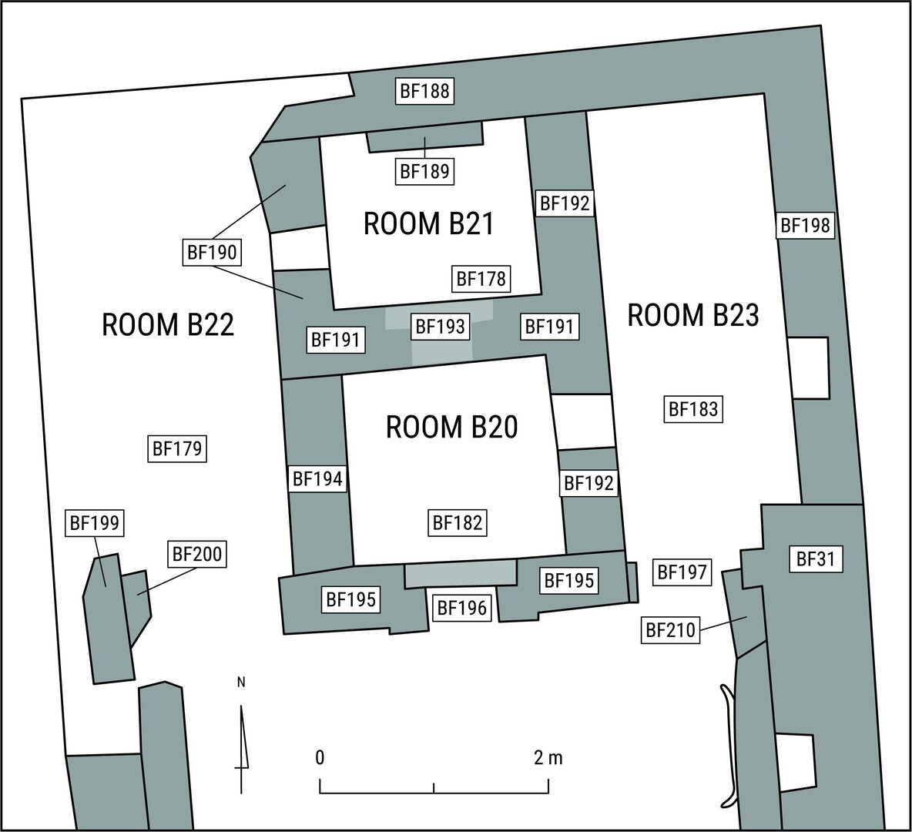{#plt-6.37 fig-alt="Pl. 6.37: Plan of rooms B20–B23."}

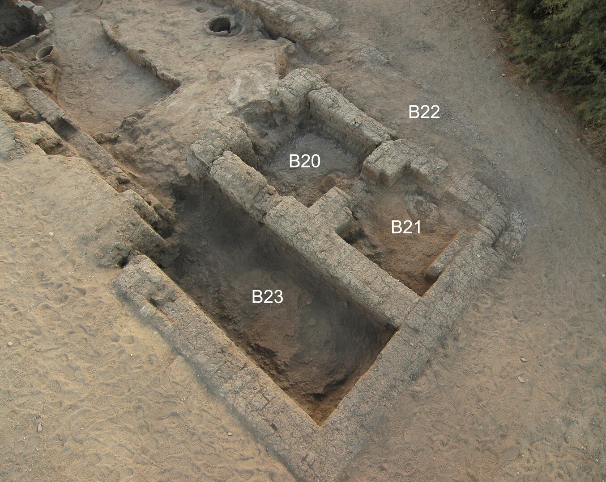{#plt-6.38 fig-alt="Pl. 6.38: Aerial view of rooms B20–B23 (to SW)."}

<pb n="245">

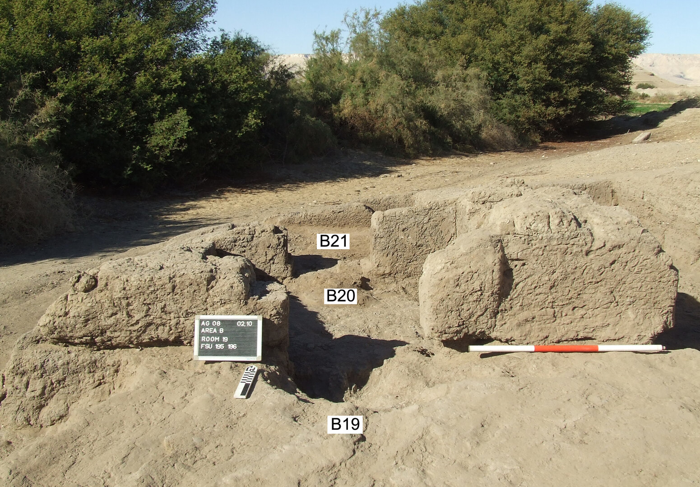{#plt-6.39 fig-alt="Pl. 6.39: View of entrance from courtyard B19 into rooms B20–B21 (to N)."}

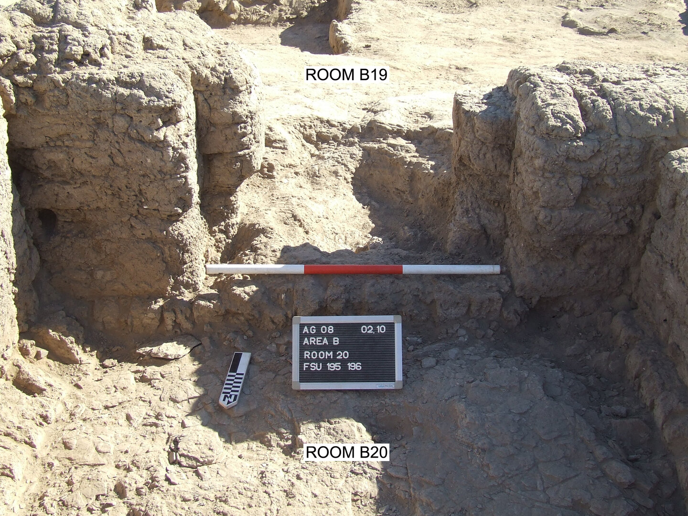{#plt-6.40 fig-alt="Pl. 6.40: View of doorway between rooms B19–B20 (to S)."}

<pb n="246">

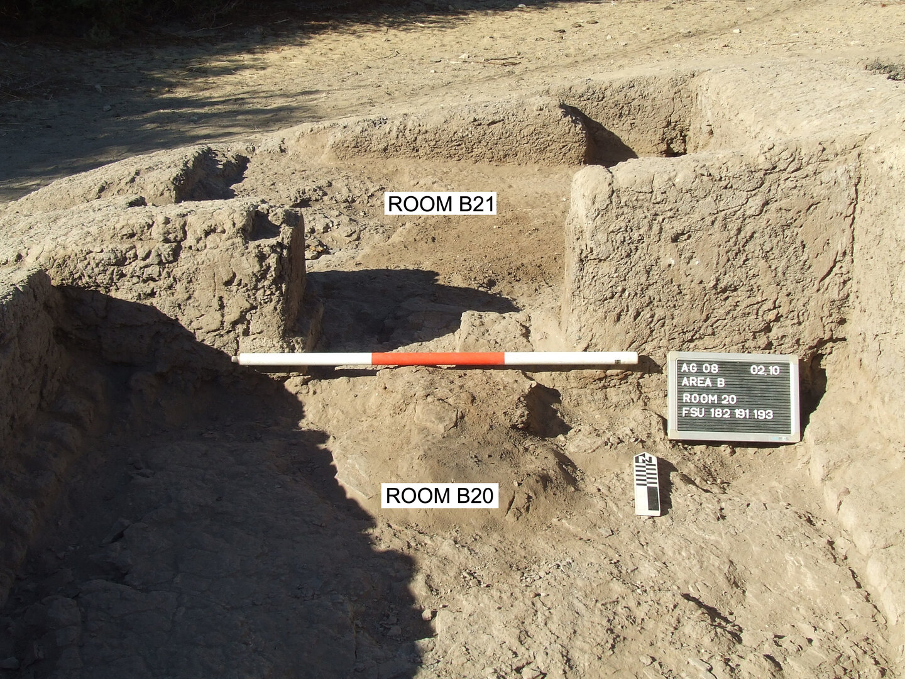{#plt-6.41 fig-alt="Pl. 6.41: View of doorway between rooms B20–B21 (to N)."}

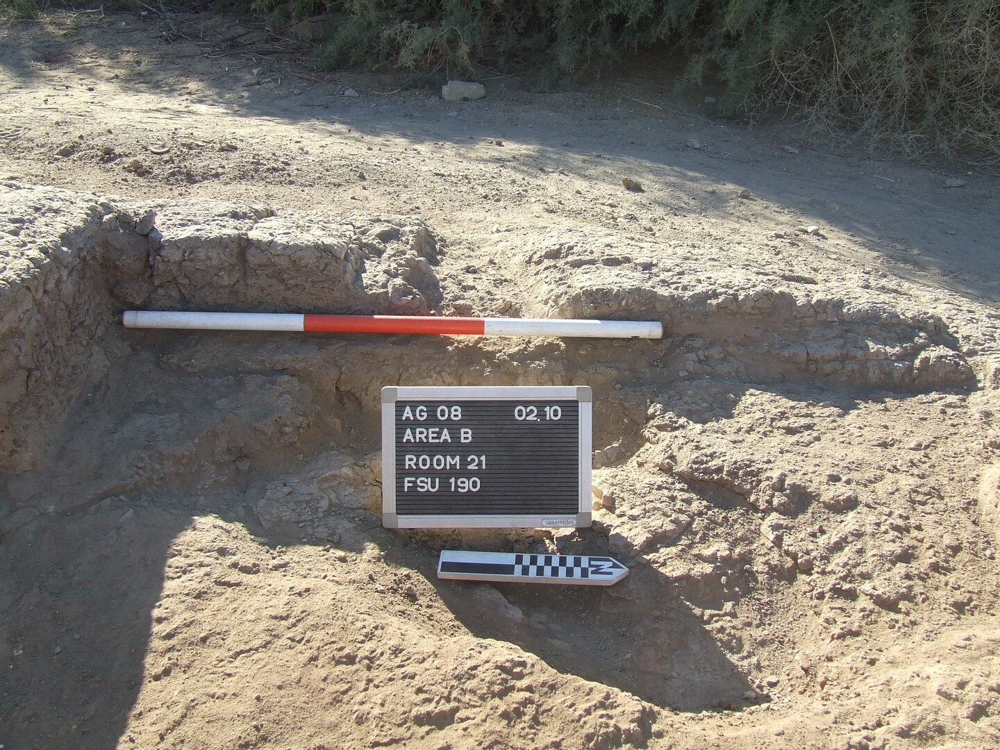{#plt-6.42 fig-alt="Pl. 6.42: Remains of west wall of room B21 (view to W)."}

<pb n="247">

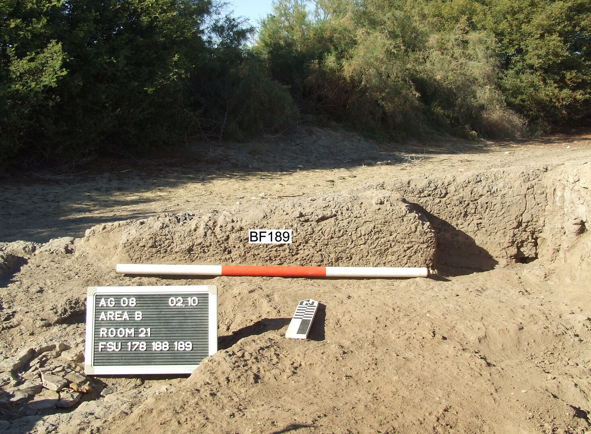{#plt-6.43 fig-alt="Pl. 6.43: Mud-brick feature (BF189) against the north wall of room B21."}

### Stratigraphy
@plt-6.44, @plt-6.45

Rooms B20–B21, like B22–B23, were found in considerably poorer condition than the remaining rooms of the west complex; this was likely due to natural erosion and, in part, human activity. As mentioned above, their walls are either preserved to a rather modest height or fully lacking, as in the northwest corner of the complex. Thus, the archaeological deposits within these spaces are not only limited in their extent, but also of little to no reliability with regard to the information that one could gather from their investigation.

Room B20 was covered by the same surface layer of windblown sand, containing pebbles and a few potsherds, that covered the western complex in its entirety (DSU138). Within B20, this layer rested above a wall collapse (DSU142)[^74] consisting of two clusters of mud bricks and mud-brick debris, one located in the northwest corner and a bigger one against the northeast corner of the room. The removal of both the surface layer and the collapse revealed an occupational level (DSU143)[^75] consisting of brown sand mixed with traces of mud-brick debris, ceramic sherds (6.53 kg), pebbles, and organic material (vegetal fibers, wood, and bones) (@plt-6.46). This unit extended throughout the room on top of a mud floor and, where this was missing, on bedrock. The few objects that were found during the investigation of room B20 came all from DSU143. They consist of a badly corroded (and undatable) bronze coin (inv. 1092); a fragment of a blue glass vessel (inv. 1026); a complete circular lamp (inv. 850); and a small object of plaster representing a bunch of grapes, which was possibly used as a miniaturistic capital (inv. 1043). Several fragments of a funerary mask of painted cartonnage were gathered within the <pb n="248"> same unit, in addition to a few fragments scattered in adjacent rooms B21 and B23 (inv. 1053).[^76] Because of the unreliable nature of the layer, close to the surface, and the fact that a few fragments were retrieved also in other rooms, it is not possible to establish any association between the funerary mask and the architectural context in which its remains were found.

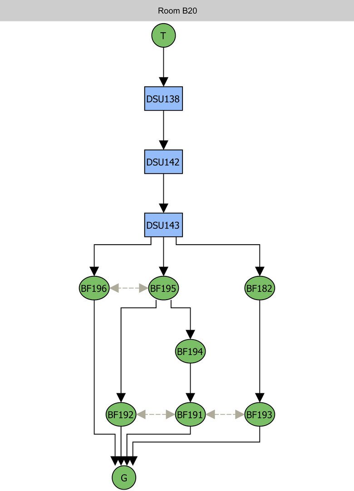{#plt-6.44 fig-alt="Pl. 6.44: Matrix of room B20."}

The fill of room B21 mirrored the stratigraphy recorded within adjacent room B20. The surface was covered by sand layer DSU138, from which two objects were retrieved, i.e., one bronze coin (inv. 1056), dated to 328, and a small bowl (inv. 1623). The removal of DSU138 revealed a wall collapse in the eastern half of the room (DSU139),[^77] sloping from northeast to <pb n="249"> southwest. It consisted of large fragments of mud bricks, mud-brick debris, very few potsherds (0.03 kg), and pebbles. Underneath both the surface layer and the collapse was a unit of soft yellowish/brown sand (DSU141),[^78] containing potsherds (3.96 kg), pebbles, and organic inclusions (mostly vegetal fibers and bones), which covered the remains of the floor and, where this was lacking, gebel (@plt-6.47). The objects that were brought to light while removing this context include one complete oval lamp (inv. 849) of Oasis Red Slip ware, with a polished surface, and a few fragments of molded gypsum: one of the pieces is a hand clenched into a fist (inv. 1039), while four joining fragments belong to the back of a human head (inv. 1040).
<pb n="250">

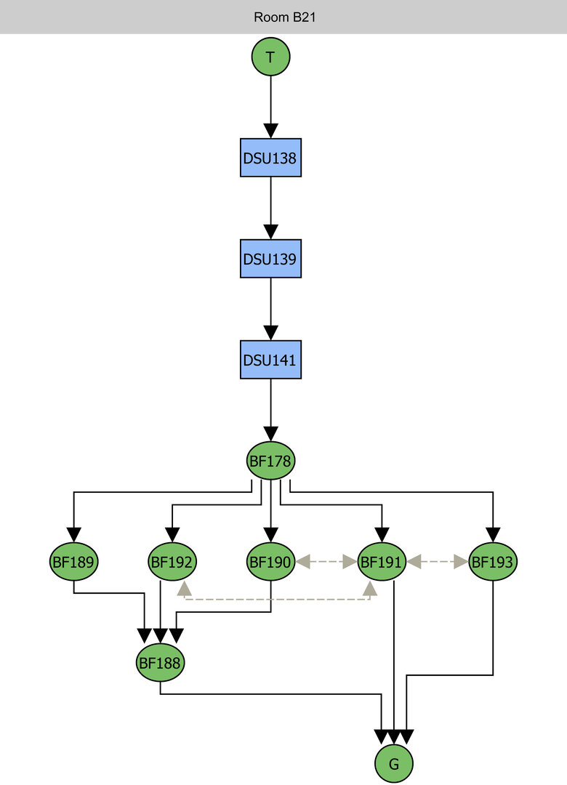{#plt-6.45 fig-alt="Pl. 6.45: Matrix of room B21."}

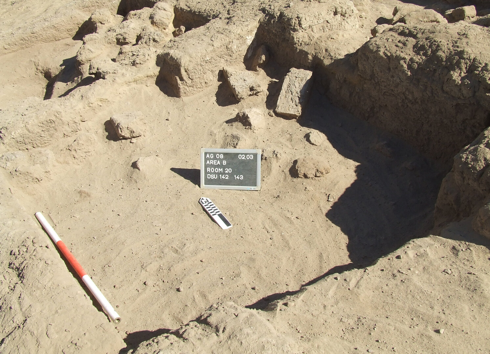{#plt-6.46 fig-alt="Pl. 6.46: View of DSU142 and DSU143 in room B20 (to NE)."}

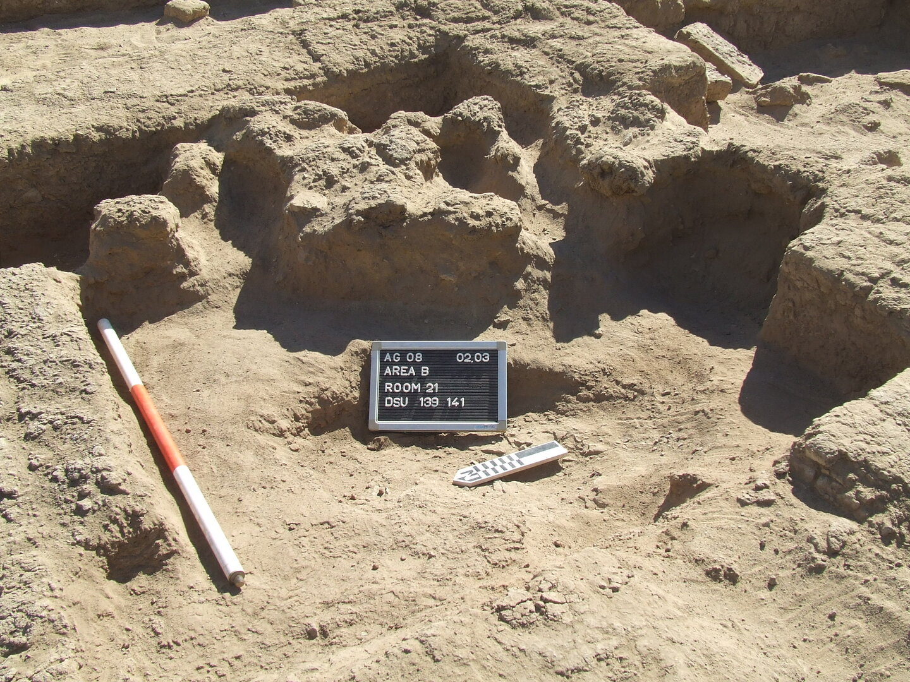{#plt-6.47 fig-alt="Pl. 6.47: View of DSU139 and DSU141 in room B21 (to SE)."}

<pb n="251">

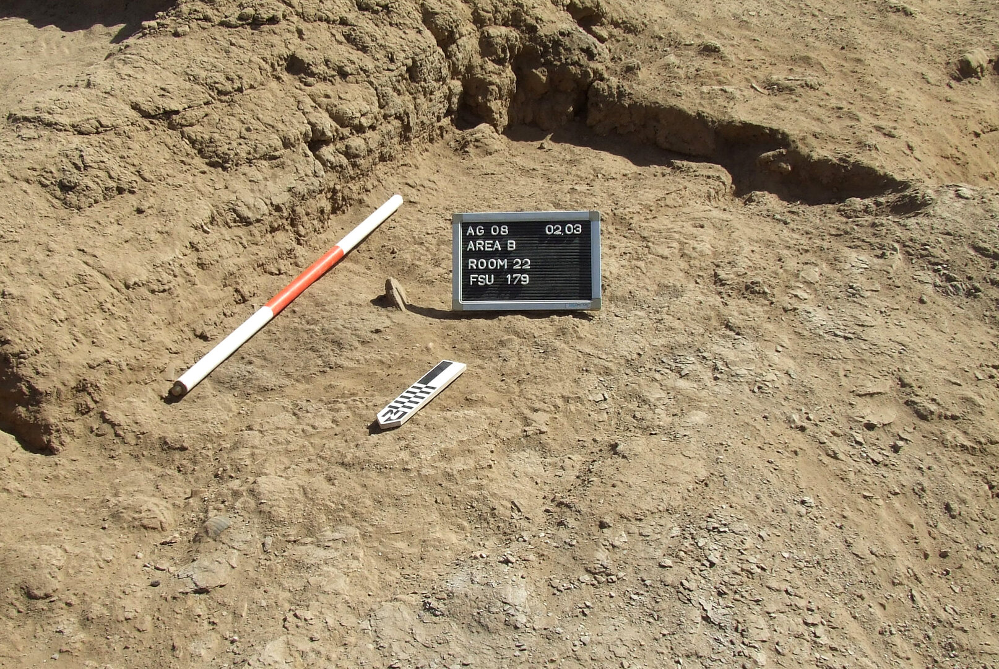{#plt-6.48 fig-alt="Pl. 6.48: Remains of floor BF179 in room B22 (view to SE)."}

## Rooms B22-B23 {#sec-6.5-b22-b23}

### Features

Rooms B22–B23 are two rectangular spaces oriented north–south and symmetrically placed to the west and east of rooms B20–B21 (@plt-6.2, @plt-6.37, @plt-6.38). They were found in poor condition, due to natural erosion and the shifting of the ground. Room B22 measures ca. 4.30 m north–south by 1.65 m east–west. The dimensions are approximate, as the north and west walls, as well as most of the south wall with the doorway into courtyard B19, are almost completely missing. The remaining walls are preserved to a limited degree, with a maximum height of 0.60 m at the south end of the east wall (BF190 + BF194), which is shared with rooms B20–B21. Very limited traces of a floor (BF179)[^79] were uncovered in the southern part of the room (@plt-6.48). It consists of compacted gray mud, with a few organic inclusions, and lies directly above bedrock.

Room B23 measures 3.54 m north–south by 1.57 m east–west; its walls are, by comparison, slightly better preserved than those of room B22, with a maximum height of 1.06 m (south end of east wall BF198). The west wall (BF192) abuts north wall BF188 and separates B23 from rooms B20–B21 (@plt-6.49). B23’s east wall abuts, to the south, the niched east wall of the complex (BF31). A doorway (BF197), set in the middle of the room’s south side, was the only access to B23 from courtyard B19 (@plt-6.50). It consists of two jambs and the scanty remains of what may have been a mud-brick threshold (width between the jambs: 94 cm). The east jamb is 
<pb n="252">
bonded with the long east wall of the complex (BF31),[^80] suggesting that room B23, along with the other spaces to the west of it, were part of the same early construction phase.[^81]

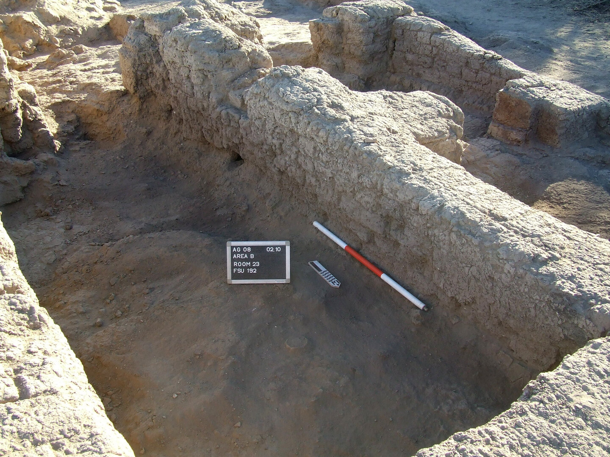{#plt-6.49 fig-alt="Pl. 6.49: View of west wall (BF192) of room B23 (to SW)."}

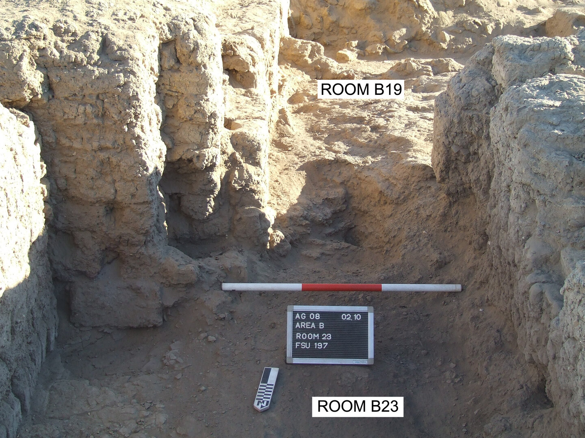{#plt-6.50 fig-alt="Pl. 6.50: View of doorway connecting rooms B23 and B19 (to S)."}

<pb n="253">

Large patches of a floor (BF183)[^82] of compacted mud, with organic inclusions and lime spots, were preserved below the stratigraphical units in the north and central part of the room.

### Stratigraphy
@plt-6.51, @plt-6.52

Due to the extremely poor condition of room B22, partially preserved only in its southeastern part, the stratigraphy of its archaeological contexts was very limited to no reliability. Room B22, like the entire complex, was covered by a surface layer of windblown sand, with potsherds and many pebbles (DSU138). Underneath it, and resting directly above bedrock and the scanty remains of the floor, was DSU145,[^83] a sub-surface deposit of soft yellowish/brown sand, which contained rare pebbles, pottery sherds (0.18 kg), and some pockets of mud-brick debris, particularly near the southeastern corner of the room. No objects were found during the removal of the scanty fill of room B22.

Within room B23, the same surface layer of windblown sand (DSU138) rested on top of a wall collapse (DSU140),[^84] of which three clusters were found: the biggest one was located in the middle of the room, while the other two were removed from the northwest corner and the southern part. The collapse consisted of fragmentary mud bricks, mud-brick debris, pebbles, and ceramic sherds (1.22 kg); also, it contained a large sandstone block (within the southern cluster) that bore traces of a socket hole on one flat side. Both the collapse and the surface layer rested above DSU144,[^85] a sub-surface deposit of soft light brown sand, mixed with some potsherds (2.91 kg), several pebbles, rare mud-brick debris, and organic inclusions (mostly vegetal fibers and bones) (@plt-6.53). It extended throughout the room except for its northeastern corner, where the windblown sand of the surface lay directly above DSU147.[^86] This was an occupational context of soft light brown sand, mixed with several potsherds (18.37 kg), pebbles, abundant mud-brick debris, one limestone fragment, two small pieces of glass, and rare organic inclusions (mostly animal bones, wood fragments, and charcoal). This unit lay on the remains of the compacted mud floor and, where this was missing, on bedrock. All objects found during the excavation of room B23 came from this context above floor level. They include a fragment of black dull glass bracelet (inv. 1055); one complete Greek ostrakon (a receipt for money dated to the third century: inv. 830); and two bronze coins (inv. 1038, dated to 314–315, and inv. 1044, dated to 316). Furthermore, three complete ceramic objects were discovered within this unit, a ceramic lid (inv. 1100), a small bowl (inv. 1102), and a small globular pot (inv. 1103; @plt-6.54), all consistent with a fourth-century dating as pointed to by the numismatic evidence. Interestingly, the three ceramic objects were retrieved within a hole underneath the foundations of the <pb n="254"> room’s west wall, right below the bottom part of the opening that was interpreted as a window or a niche. Unfortunately, the hole was unsealed and filled with the same deposit of sand as the rest of the room at floor level; therefore, it is impossible to prove beyond doubt that the three objects had been intentionally placed in that hollow space.
<pb n="255">

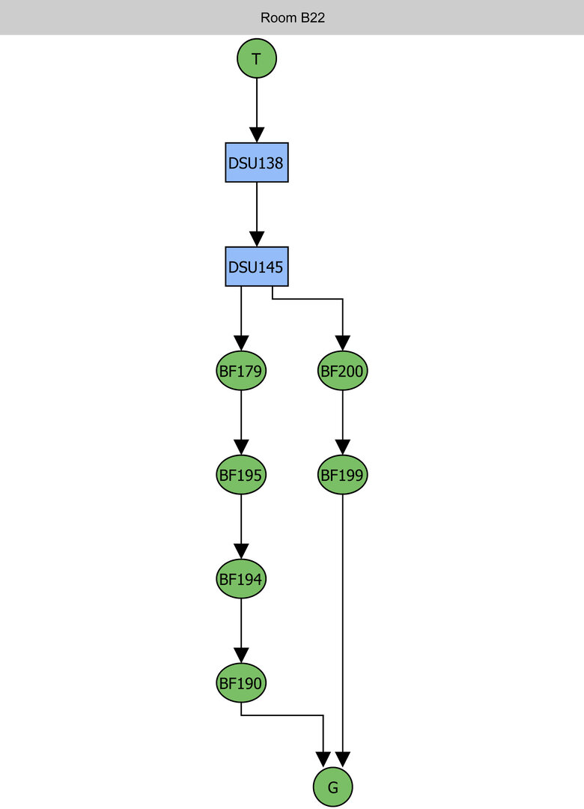{#plt-6.51 fig-alt="Pl. 6.51: Matrix of room B22."}

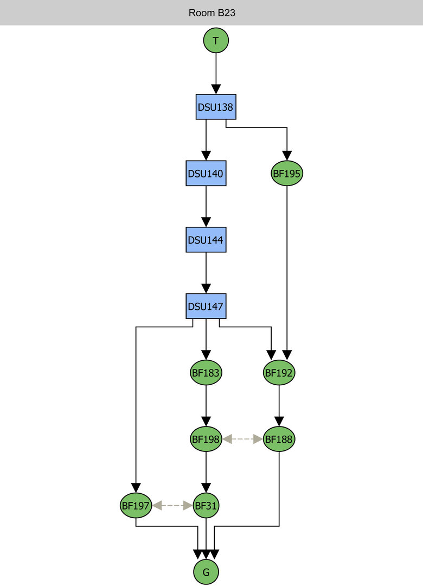{#plt-6.52 fig-alt="Pl. 6.52: Matrix of room B23."}

<pb n="256">

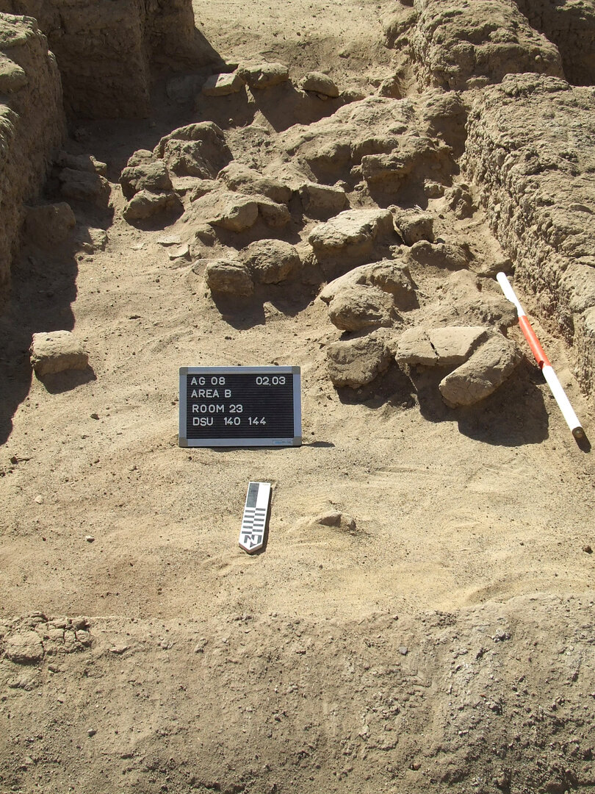{#plt-6.53 fig-alt="Pl. 6.53: View (to S) of wall collapse (DSU140) and sand deposit (DSU144) in room B23."}

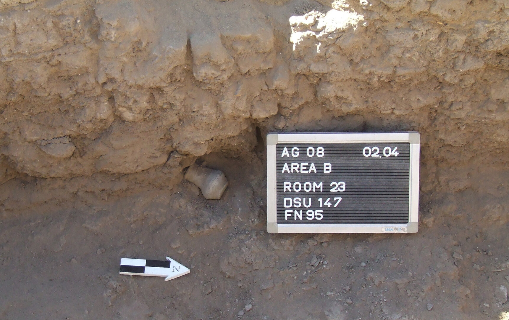{#plt-6.54 fig-alt="Pl. 6.54: Small globular pot found against the west wall of room B23 (inv. 1103)."}

<pb n="257">

## Room B24 {#room-b24}

### Features

Room B24 is a very small space located in the southwest corner of room B19 (@plt-6.2, @plt-6.55). It measures 1.07 m north–south by 1.40 m east–west, with walls preserved to a maximum height of 0.75 m (east end of south wall BF203). No evidence exists to suggest the original height of the walls and what kind of roof (if any) once covered this space. The room was built against the east side of BF200 at its southern end. BF200 is the north–south wall running along the east face of BF199, a considerably longer wall that was the original western boundary of the complex. The north and south walls of room B24 (BF201 and BF203 respectively) abut BF200 to the west; on the east, they end with short stubs oriented north–south that create a doorway (BF202) opening into the room from courtyard B19. Puzzlingly, the north wall ends with a protruding stub also at its west end, which once abutted the west wall of the room (part of BF200).[^87]

Different floor levels were identified inside room B24. The upper floor (BF215; @plt-6.56)[^88] consists of a layer of compacted clay, with several organic inclusions, small potsherds, and pebbles, while the lower one (BF220),[^89] was brought to light in the southern half of the room, where a test trench measuring 23 cm north–south by 53 cm east–west was excavated (@plt-6.57).[^90] The lower floor is in fact a mud-brick platform covered by a layer of mud mortar.

Excavations in the area of the doorway revealed the existence of two superimposed thresholds, an upper one consisting of a large brown/gray mud brick with a rough surface, which may once have been covered with mud plaster, and a lower platform (BF219,[^91] visible only from inside the room against its southeast corner) built of mud bricks and covered by the latest floor level. This feature seems to have been built in phase with the lower mud-brick platform and may have been used as a step to enter the room, before the upper clay floor was laid concealing the features at a lower level.

The function of room B24 is unknown, although the discovery of lumps of unbaked clay on the threshold,[^92] together with the fact that the room is contemporary with the general rearrangement of the complex into a ceramic workshop, suggest that its use was associated with the storage of clay, which was then processed and shaped into vessels in courtyard B19.

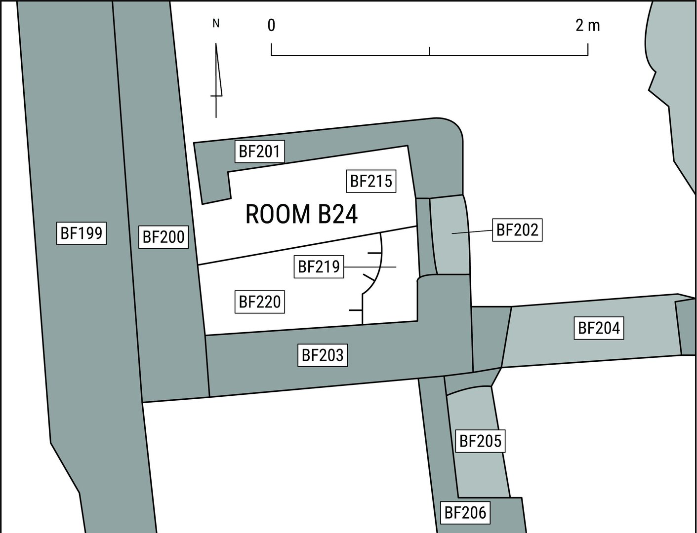{#plt-6.55 fig-alt="Pl. 6.55: Plan of room B24."}

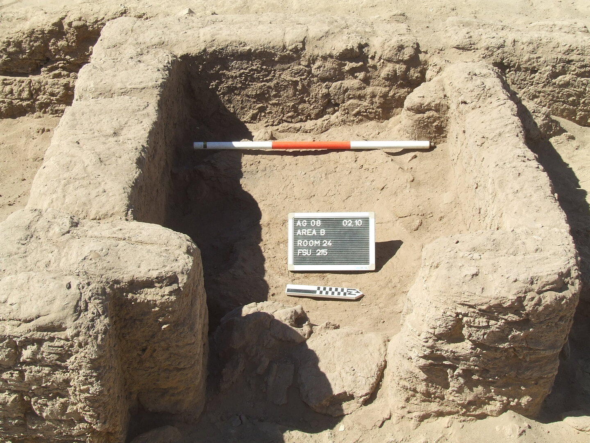{#plt-6.56 fig-alt="Pl. 6.56: View of room B24 (to W)."}

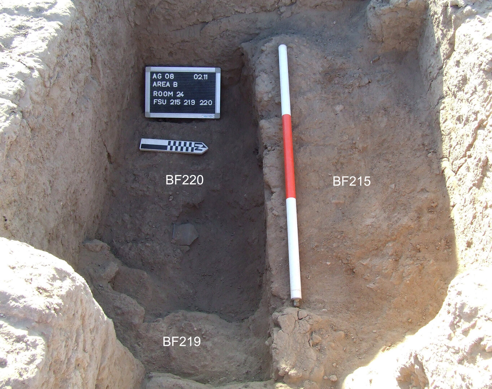{#plt-6.57 fig-alt="Pl. 6.57: Test trench excavated in room B24 (view to W)."}

### Stratigraphy
@plt-6.58

Room B24, like the other rooms of the western complex, was covered by a thin surface layer (DSU138) of windblown sand, which contained a few pebbles and potsherds. The unit rested on a wall collapse (DSU169)[^93] that extended throughout the room (@plt-6.59). It sloped from west to east, blocking the doorway between rooms B24 and B19 and partially covering the area near the opening from room B19 onto room B18. The collapse consisted largely of mud-brick debris, complete or fragmentary mud bricks (some of them burnt), and small-to-medium ceramic sherds (1.86 kg). When the collapse was removed, a layer of soft brown sand, mixed with several organic inclusions, mud-brick debris, potsherds (1.85 kg), pebbles, and rare glass slag, was revealed (DSU174).[^94] This unit contained a badly corroded bronze coin (inv. 1098), dated to 364–378. DSU 174 rested directly on the uppermost of the two floor levels identified in the room or, where the upper floor was missing, on its preparation layer (DSU180).[^95] This consisted of soft light brown sand containing mud-brick debris, a few pebbles, rare glass slag, and a few potsherds (1.1 kg). A lens of dark gray ash, with some charcoal and wood fragments, was identified in proximity to the west wall of the room. A biconical bead of dark blue glass (inv. 1022) was retrieved during the excavation of this unit.

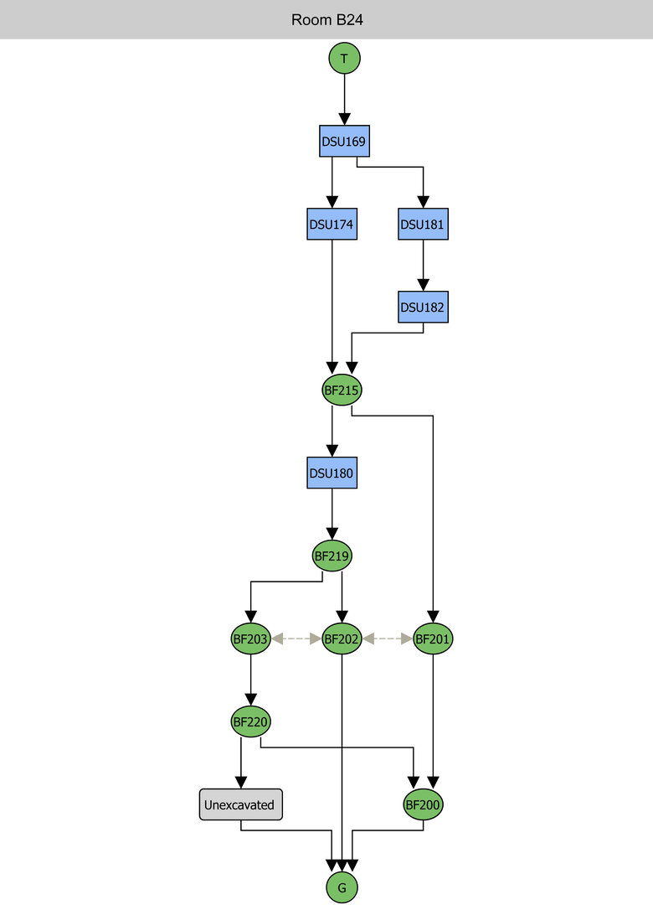{#plt-6.58 fig-alt="Pl. 6.58: Matrix of room B24."}

In the area near the doorway, wall collapse DSU169 covered two lumps of partially worked clay (DSU181; @plt-6.60).[^96] These lay on top of a thin layer of sand (DSU182)[^97] mixed with vegetal fibers and pottery sherds (0.03 kg) that, in turn, rested above the upper floor of the room.

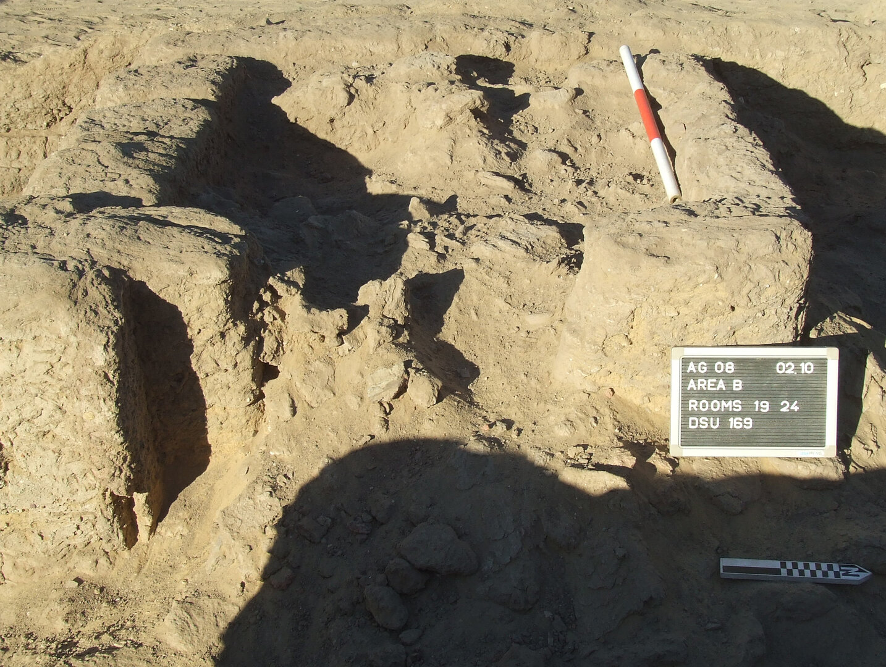{#plt-6.59 fig-alt="Pl. 6.59: View of collapse DSU169 between rooms B19 and B24 (to W)."}

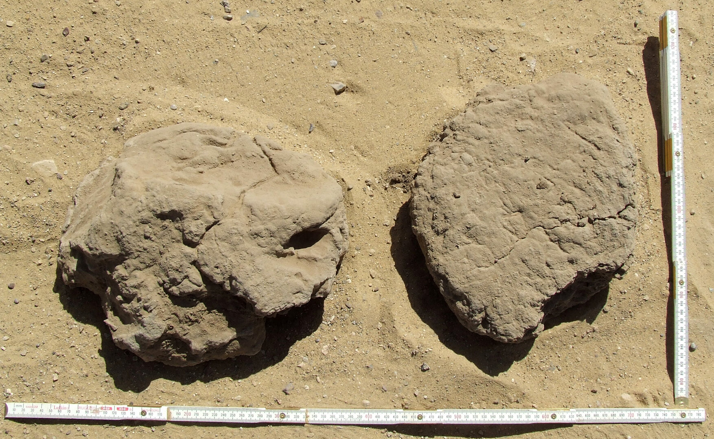{#plt-6.60 fig-alt="Pl. 6.60: Close-up of lumps of partially worked clay found at the entrance of room B24."}

## Discussion {#sec-6.7-discussion}

A preliminary examination of the walls and their relative chronology points to different construction phases for the west complex of ʿAin el-Gedida (@plt-6.61). It is highly likely that the area occupied by rooms B17–B19 and B24 was originally one large, rectangular space, opening to the north into rooms B20–B23, which also seem to belong to the earliest construction phase of the complex (@plt-6.62). The central doorway between rooms B18 and B19 (BF204) does not seem to have been the earliest entrance to the original building. Access was likely through a doorway set into the south wall—now missing—of the later room B18, or through the staircase set against its southeast corner.

The complex was originally enclosed, to the east and to the west, by two long walls (BF199 and BF31) with niches set at regular intervals. At a later stage, two additional walls (BF200 and BF210), thinner than the earlier ones and of poorer manufacture, were built against the inner faces of BF199 and BF31 in the area south of rooms B20–B23 (@plt-6.18). Their function was to reinforce and support the earlier walls, as evidence was found of structural problems and of attempts to restore the complex in antiquity. Possibly at the same time, rooms B17, B18, B19, and B24 were created by adding new partition walls and doorways within the area of the large space. Mud-brick platform BF220 and step BF219 were built in the area occupied by room B24; wall BF203 (the western half of room B19’s southern boundary) was laid partially above them. Abutting BF203 is doorway BF204, which gives access into B19 from room B18 to the south. The threshold of the doorway is bonded, to the east, with BF180, which is the northern wall of B18 and abuts both walls BF210 and BF31.

Room B17, in the southwestern part of the complex, was built by adding south wall BF207, abutting BF199 and in turn abutted by a new mud-brick partition, i.e., BF206, which is room B17’s eastern boundary and ends with a doorway (BF205) set against the northeast corner of the room (@plt-6.6). To the east is space B18, where the rectangular mud-brick installation (BF185) is certainly part of this later construction phase, as it is built against the north wall of the room (BF180 mentioned above) (@plt-6.9). To the north of B17, and against the southwestern corner of courtyard B19, a new small room (B24) was created by adding an east–west oriented wall (BF201, abutting BF200 to the west) as its northern boundary. The space was made accessible through a doorway (BF202) set along the east side and defined by two thick jambs. It was at this stage that industrial installations, such as two large basins for clay kneading, were built within room B19, set against the inner east wall of the complex.

These alterations seem to have been carried out as part of the same episode, responding to a plan of re-functionalization of the complex that entailed a completely new spatial arrangement.

With regard to the function performed by the west complex, substantial evidence was gathered pointing to its use, at least in its latest occupational phase, as a pottery workshop. Basins used for the kneading of clay were found in a relatively good state of preservation in the large courtyard of the complex. Other evidence pointing to this identification includes lumps of partially worked clay found inside a well-preserved clay bin against the east wall of courtyard B19, as well as in front of a small storage space (B24), fragments of turning wheels (one embedded in the floor of the larger basin and another set onto the edge of the southernmost basin), and several fragments of molded but unfired vessels.[^98]
<pb n="263">

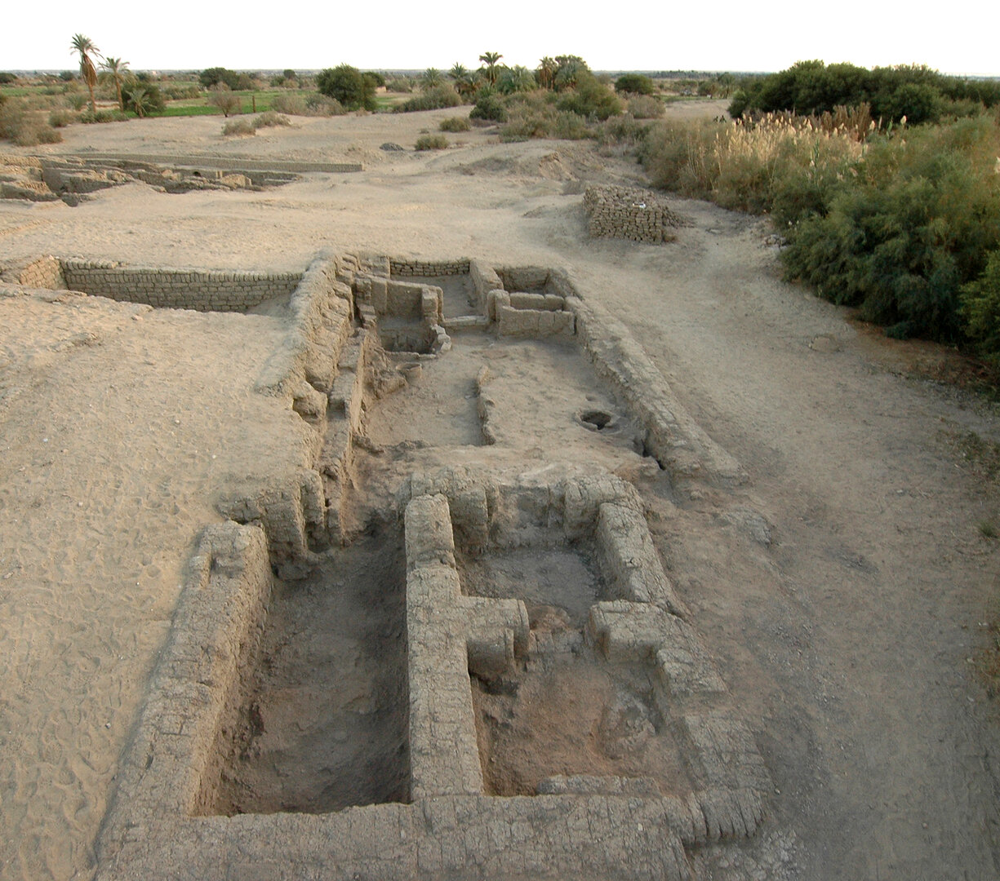{#plt-6.61 fig-alt="Pl. 6.61: Aerial view of the west complex (to S)."}

No remains of kilns, where the vessels would have been fired, were found within the west complex, but they might well have existed in its vicinity. No excavations have yet been carried out to the north, south, or east of the workshop (apart from the test trench in room B4). Furthermore, the area to the west of the complex is now occupied by cultivated fields and thus not available for archaeological investigation. Nonetheless, in 2006 several magnetic anomalies were detected to the northwest and to the south of mound I, which, according to the specialist who recorded them, might be associated with remains of either ovens or kilns.[^99]

The discovery of a building with installations for the production of pottery is undoubtedly significant. Indeed, it offers precious, and relatively rare, evidence on the processes of clay kneading and manufacture of vessels in rural Egypt during the fourth century. Ateliers for the production of pottery have been found and investigated in Egypt, dated from the Old Kingdom to the Islamic period. An increasing body of evidence is available, in particular, for the Graeco-Roman and late antique periods; it is in this context that the data from the workshop at ʿAin <pb n="264"> el-Gedida, with its well-preserved installations, partially worked clay, and unfired pottery, can contribute considerably to the study of ceramic production in late antique Egypt.[^100]

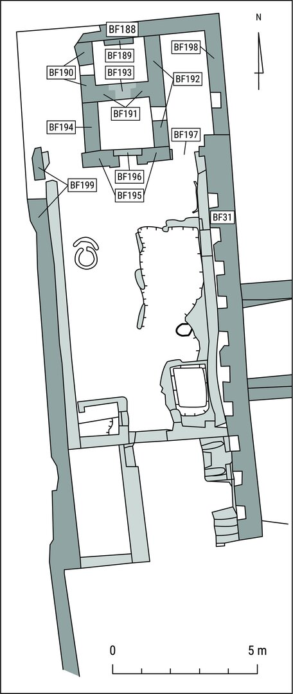{#plt-6.62 fig-alt="Pl. 6.62: Plan of the west complex before its conversion into a ceramic workshop (later features are in lighter gray)."}

<pb n="265">

Nevertheless, the available evidence points toward the identification of the complex in its earlier occupational phase as a public building of considerable relevance. More specifically, the original layout of the building, which did not include the partition walls inside the courtyard (nor most of the installations found in rooms B18–B19), resembles the plan of a small-scale temple. The large rectangular space in the central and southern parts of the building (occupied by rooms B17–B19 and B24) may have been the temple’s main courtyard. In turn, this opened to the north onto a sequence of two square spaces (B20–B21), with two rectangular rooms (B22–B23) symmetrically arranged to the west and east of B20–B21. The rather small size of the square rooms B20–B21, their location at the north end of the main axis of the complex, and the fact that the northernmost of the two was accessible only through the twin space to the south, points to their original identification as a *pronaos* and a *naos*, flanked by service rooms.

The preliminary results of comparative analysis with other similar buildings from Dakhla support the identification of the west complex of ʿAin el-Gedida as a mud-brick temple.[^101] Within the oasis, the temples that seem to resemble more closely the plan of the west complex are those that A. J. Mills grouped as “type 1” (among the temples surveyed by the Dakhleh Oasis Project), which are characterized by an elongated linear plan.[^102] Particularly worthy of mention is the unpublished temple of El-Qusur, located at the east end of Dakhla and visited in 1908 by Herbert Winlock (@plt-6.63, @plt-6.64).[^103] This structure, surveyed in the 1980s by the Dakhleh Oasis Project,[^104] is characterized by a fairly similar layout, with a large courtyard opening, through its short west side, onto a set of three small interconnected rooms (instead of the two at ʿAin el-Gedida, which are flanked by rectangular side rooms that do not exist at El-Qusur). Quite strikingly, the temple of El-Qusur is also characterized by the same series of niches set into the long walls of its courtyard (@plt-6.65).[^105] Another mud-brick temple, identified in the vicinity of El-Qusur and still unpublished, also shares considerable similarities with the temple of ʿAin el-Gedida, although the former lacks the row of niches set into the side walls of the courtyard.[^106]

What is particularly significant in this context is that the possible discovery of a temple at ʿAin el-Gedida, later converted into a small industrial establishment, suggests a longer history of occupation of the site, which must have begun at a time when paganism was a very visible, if not preponderant, component of local society and temples were still being built in the oasis. If in fact there was a temple at ʿAin el-Gedida, it must obviously have been built sometime before its abandonment and then its functional conversion, which seems to be dated to the same time <pb n="266"> as the church complex, that is to say, the first half of the fourth century.[^107] Most such temples in the oasis have been dated to the Roman period, more precisely to the second century CE or at the latest the early third century.[^108] However, recent scholarship, particularly the work by J. Gill, argues in favor of an earlier dating for the construction of some of the temples in Dakhla, namely to the Ptolemaic period.[^109] At any rate, the absolute chronology of ʿAin el-Gedida would appear substantially longer and more complex than the rest of the archaeological evidence that was gathered would indicate at first.[^110]

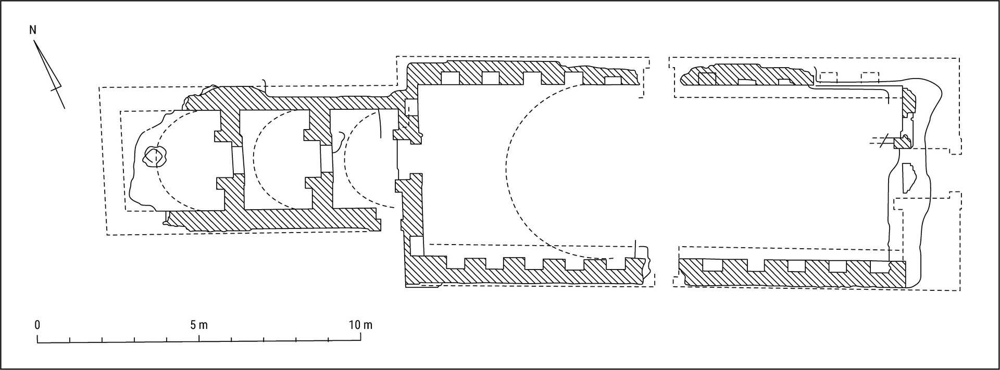{#plt-6.63 fig-alt="Pl. 6.63: Plan of the temple of El-Qusur (after Kaper 1997: 8)."}

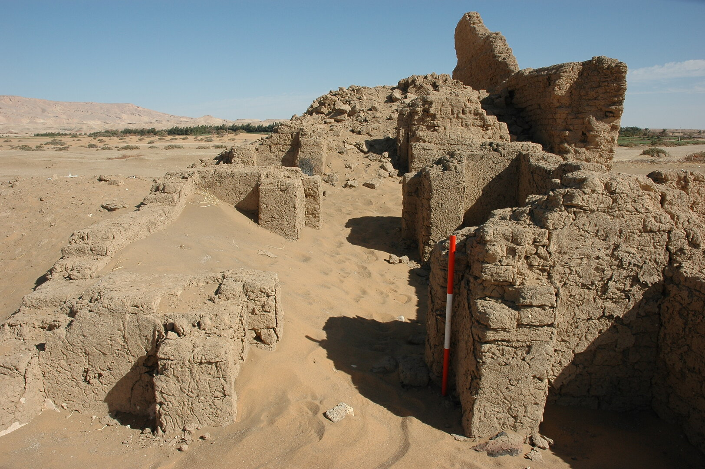{#plt-6.64 fig-alt="Pl. 6.64: View of the temple of El-Qusur (to ESE)."}

<pb n="267">

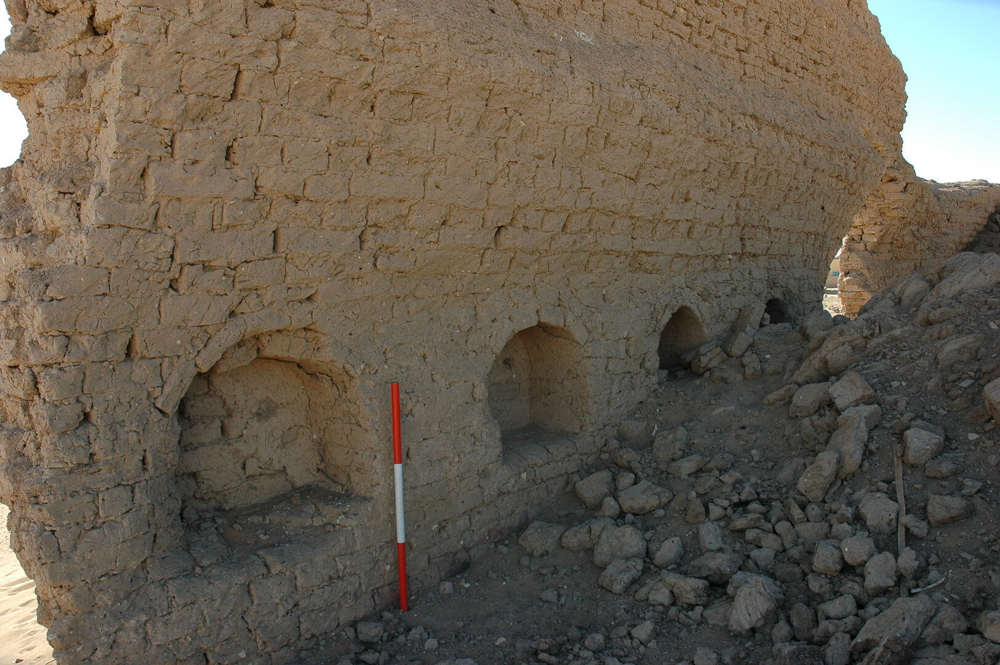{#plt-6.65 fig-alt="Pl. 6.65: Niches along the south wall of the temple of El-Qusur (view to W)."}

The west complex of ʿAin el-Gedida also provides, with its multi-functional history, new insight to the much-heated discourse concerning the transformation of temples in Late Antiquity, particularly with regard to Egypt.[^111] Indeed, the conversion of the mud-brick temple of ʿAin el-Gedida into a ceramic workshop further attests to what has already been proved by evidence gathered throughout Egypt, i.e., that the “sacredness” of a cultic place, such as a temple, was not uniformly a key factor in its re-adaptation and re-use in Late Antiquity. Undoubtedly, considerations of different natures were at stake in this process, which entailed, in some later
<pb n="268">
cases, the conversion of temples into churches but also, when needed, their transformation into buildings characterized by considerably more mundane functions.

## Notes

[^1]: Upper elevation: 112.710 m.
[^2]: Upper elevation: 114.090 m; lower elevation: 112.980 m; max. thickness: 22 cm.
[^3]: Upper elevation: 112.890 m; lower elevation: 112.580 m; max. thickness: 22 cm.
[^4]: Upper elevation: 114.780 m; lower elevation: 112.510 m; max. thickness: 27 cm.
[^5]: Upper elevation: 112.630 m; lower elevation: 112.150 m; max. thickness: 28 cm.
[^6]: Upper elevation: 112.630 m; lower elevation: 112.470 m; max. thickness: 16 cm.
[^7]: The unit was not excavated.
[^8]: Upper elevation: 112.340 m; lower elevation: 112.250 m; max. thickness: 9 cm.
[^9]: DSU164 was left *in situ*.
[^10]: Upper elevation: 112.720 m; lower elevation: 112.240 m; max. thickness: 48 cm.
[^11]: Upper elevation: 113.060 m; lower elevation: 112.690 m; max. thickness: 10 cm.
[^12]: See @sec-6.7-discussion below.
[^13]: During the excavation of room B18, a mud-brick wall was built to prevent the sand in the unexcavated area to the south from falling into the room.
[^14]: Upper elevation: 112.750 m.
[^15]: The lower floor (BF216; upper elevation: 112.410 m) was exposed in the northwest corner of the room, where the upper floor was missing.
[^16]: No similar features could be found for comparative purposes.
[^17]: Upper elevation: 113.300 m; lower elevation: 112.580 m; max. thickness: 59 cm.
[^18]: Upper elevation: 113.390 m (in room B19); lower elevation: 112.590 m (in room B18); max. thickness: 16 cm.
[^19]: Upper elevation: 113.230 m (in room B19); lower elevation: 112.560 m (in room B18); max. thickness: 33 cm.
[^20]: Upper elevation: 112.800 m; lower elevation: 112.550 m; max. thickness: ca. 15 cm.
[^21]: Upper elevation: 112.500 m; lower elevation: 112.400 m; max. thickness: 10 cm.
[^22]: Upper elevation: 112.730 m; lower elevation: 112.580 m; max. thickness: 15 cm.
[^23]: Upper elevation: 112.410 m; lower elevation: 112.250 m; max. thickness: 16 cm.
[^24]: The trench measured ca. 67 cm north–south by 83 cm east–west.
[^25]: Upper elevation: 113.520 m; lower elevation: 112.940 m; max. thickness: 15 cm.
[^26]: The doorway opening onto room B21 is completely missing. Doorway BF196 opened onto room B20 and doorway BF197 onto room B23.
[^27]: Upper elevation: 112.870 m.
[^28]: Upper elevation: 112.850 m.
[^29]: Inv. 1613.
[^30]: BF210, BF180 + BF218, and BF208 + BF217 respectively.
[^31]: For additional evidence, see @sec-6.7-discussion and @sec-8.3.4 below.
[^32]: Upper elevation: 113.330 m; lower elevation: 113.030 m; max. thickness: 30 cm.
[^33]: See @sec-11.4.2 below (cat. no. 36).
[^34]: Upper elevation: 113.840 m; lower elevation: 112.780 m; max. thickness: 58 cm.
[^35]: See [Chapter 10](10_ostraka-and-graffiti.qmd) of this volume, pp. 518–19.
[^36]: Upper elevation: 113.260 m; lower elevation: 113.020 m; max. thickness: 20 cm.
[^37]: Upper elevation: 113.350 m; lower elevation: 112.750 m; max. thickness: 26 cm.
[^38]: Upper elevation: 113.340 m; lower elevation: 113.170 m; max. thickness: 17 cm.
[^39]: At first glance, the two collapse units had seemed to be part of the same episode.
[^40]: Upper elevation: 113.430 m; lower elevation: 112.850 m; max. thickness: 58 cm.
[^41]: See the section on the stratigraphy of room B18 for information about this unit.
[^42]: *Idem*.
[^43]: Upper elevation: 113.230 m; lower elevation: 112.880 m; max. thickness: 16 cm.
[^44]: See the section on the stratigraphy of room B24 for information about this unit.
[^45]: Upper elevation: 113.000 m; lower elevation: 112.710 m; max. thickness: 29 cm.
[^46]: Upper elevation: 112.960 m; lower elevation: 112.720 m; max. thickness: 24 cm.
[^47]: Upper elevation: 112.920 m; lower elevation: 112.620 m; max. thickness: 30 cm.
[^48]: Upper elevation: 112.790 m; lower elevation: 112.670 m; max. thickness: 6 cm.
[^49]: Upper elevation: 112.730 m; lower elevation: 112.620 m; max. thickness: 7 cm.
[^50]: Upper elevation: 113.420 m; lower elevation: 113.070 m; max. thickness: 21 cm.
[^51]: Upper elevation: 113.250 m; lower elevation: 113.010 m; max. thickness: 18 cm.
[^52]: Upper elevation: 112.950 m; lower elevation: 112.630 m; max. thickness: 5 cm.
[^53]: Upper elevation: 112.830 m; lower elevation: 112.580 m; max. thickness: 25 cm.
[^54]: Upper elevation: 112.970 m; lower elevation: 112.520 m; max. thickness: 28 cm.
[^55]: Upper elevation: 112.800 m; lower elevation: 112.550 m; max. thickness: 23 cm.
[^56]: Upper elevation: 112.550 m; lower elevation: 112.360 m; max. thickness: 5 cm.
[^57]: Upper elevation: 112.730 m; lower elevation: 112.400 m; max. thickness: 13 cm.
[^58]: Upper elevation: 112.480 m; lower elevation: 112.210 m; max. thickness: 13 cm.
[^59]: Upper elevation: 112.430 m; lower elevation: 112.210 m; max. thickness: 12 cm.
[^60]: Upper elevation: 112.310 m; lower elevation: 112.120 m; max. thickness: 6 cm.
[^61]: Upper elevation: 113.080 m; lower elevation: 112.770 m; max. thickness: 31 cm.
[^62]: Upper elevation: 113.200 m; lower elevation: 112.800 m; max. thickness: 15 cm.
[^63]: Upper elevation: 112.990 m; lower elevation: 112.510 m; not removed.
[^64]: Upper elevation: 113.020 m; lower elevation: 112.800 m; max. thickness: 11 cm.
[^65]: Upper elevation: 112.800 m; lower elevation: 112.680 m; max. thickness: 12 cm.
[^66]: Upper elevation: 112.970 m; lower elevation: 112.680 m; max. thickness: 29 cm.
[^67]: Upper elevation: 112.950 m; lower elevation: 112.720 m; max. thickness: 23 cm.
[^68]: Upper elevation: 112.910 m; lower elevation: 112.820 m; max. thickness: 9 cm.
[^69]: Upper elevation: 112.950 m; lower elevation: 112.600 m; max. thickness: 30 cm.
[^70]: Upper elevation: 112.930 m; lower elevation: 112.720 m; max. thickness: 5 cm.
[^71]: Upper elevation: 113.070 m.
[^72]: Both the east and west walls (BF192 and BF190 respectively) abut north wall BF188.
[^73]: Upper elevation: 113.060 m.
[^74]: Upper elevation: 113.440 m; lower elevation: 113.180 m; max. thickness: 26 cm.
[^75]: Upper elevation: 113.310 m; lower elevation: 112.860 m; max. thickness: 45 cm.
[^76]: See @sec-11.4.2 below (cat. no. 45). These fragments were the object of conservation by Laurence Blondaux: see @blondaux_2008. A comparison was established with third–fourth century funerary masks found at Kellis: see @schweitzer_2002. On Egyptian funerary practices in Late Antiquity, see @dunand_2007.
[^77]: Upper elevation: 113.470 m; lower elevation: 113.210 m; max. thickness: 26 cm.
[^78]: Upper elevation: 113.390 m; lower elevation: 113.060 m; max. thickness: 33 cm.
[^79]: Upper elevation: 113.070 m.
[^80]: The west jamb of the doorway abuts wall BF195.
[^81]: When BF210 was built alongside BF31, it abutted the south and west sides of the doorway’s east jamb.
[^82]: Upper elevation: 113.030 m.
[^83]: Upper elevation: 113.270 m; lower elevation: 113.070 m; max. thickness: 20 cm.
[^84]: Upper elevation: 113.600 m; lower elevation: 113.280 m; max. thickness: 32 cm.
[^85]: Upper elevation: 113.440 m; lower elevation: 113.130 m; max. thickness: 31 cm.
[^86]: Upper elevation: 113.320 m; lower elevation: 112.830 m; max. thickness: 32 cm.
[^87]: The stub no longer abuts the west wall, likely due to the shifting of the latter westwards.
[^88]: Upper elevation: 112.810 m.
[^89]: Upper elevation: 112.530 m.
[^90]: Upper elevation: 112.760 m; lower elevation: 112.530 m.
[^91]: Upper elevation: 112.670 m.
[^92]: See the section on room B24’s stratigraphy below.
[^93]: Upper elevation: 113.280 m; lower elevation: 112.780 m; max. thickness: 20 cm.
[^94]: Upper elevation: 113.050 m; lower elevation: 112.760 m; max. thickness: 19 cm.
[^95]: Upper elevation: 112.760 m; lower elevation: 112.530 m; max. thickness: 23 cm.
[^96]: Upper elevation: 113.040 m; lower elevation: 112.870 m; max. thickness: 17 cm.
[^97]: Upper elevation: 112.870 m; lower elevation: 112.850 m; max. thickness: 2 cm.
[^98]: See @sec-8.2.10 and @sec-8.3.4 in this volume.
[^99]: Tatyana Smekalova (personal communication, February 2006).
[^100]: For a study of the ceramics from the west complex, as well as other excavated areas of ʿAin el-Gedida, and their significance, see [Chapter 8](8_la-ceramique.qmd) of this volume. See also @dixneuf_2012 and, for a recent catalogue of ancient sites of ceramic production in Egypt, @marchand_2014.
[^101]: Although the best known temples in Dakhla are of stone, originally most pagan cultic buildings in the oasis were of mud brick: see @mills_1981 [pp. 181–82] and @mills_1983 [pp. 129–38]. See also @kaper_1997 [pp. 7–9] and, more recently, @gill_2016 [pp. 101–04]. Mudbrick temples are also known from Kharga: one of them, in rather good condition, is at the site of Douch (@redde_2004 [pp. 179–84]). On the stone temple of Douch, which bears evidence of an earlier phase consisting of a mud-brick temple, see @redde_2004 [pp. 104–20].
[^102]: Eight temples from Dakhla were included in this group: see @mills_1983 [pp. 129–38].
[^103]: Winlock [-@winlock_1936, {p. 17, pls. IX–X}]. J. Gill -@gill_2016 [p. 103] found evidence of a Ptolemaic phase of use in relation to the temple of El-Qusur.
[^104]: Recorded as 31/435-M4-1: see @mills_1983 [pp. 136–38]. El-Qusur is catalogued as site 65 in @gill_2016.
[^105]: @kaper_1997 [pp. 7–8].
[^106]: Winlock [-@winlock_1936, {pp. 17, pls. IX-X}].
[^107]: No information was gathered that might answer the question if any substantial temporal hiatus occurred between the abandonment of the temple and its conversion into a ceramic workshop.
[^108]: @kaper_1998 [p. 151]; @kaper_2012 [pp. 722–23].
[^109]: @gill_2016 [pp. 101–04].
[^110]: For a lengthy discussion of chronological issues pertaining to ʿAin el-Gedida, see @sec-7.1-issues below.
[^111]: See @dijkstra_2011; @hahn_2008 and, in particular, @bagnall_2008.